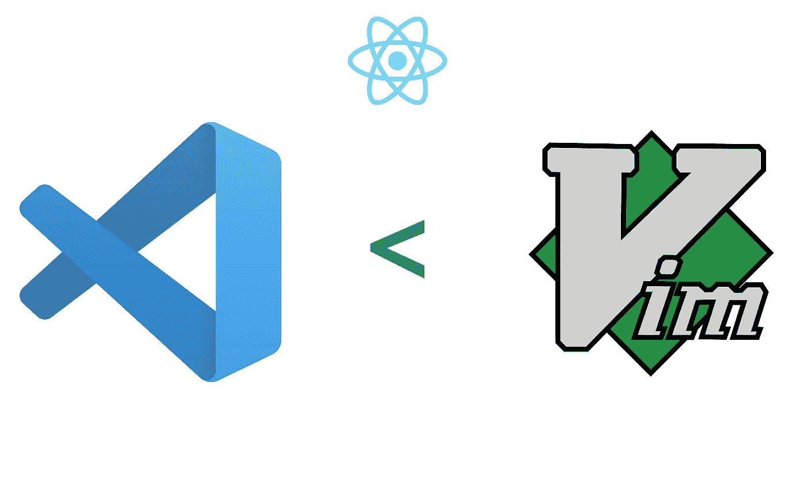
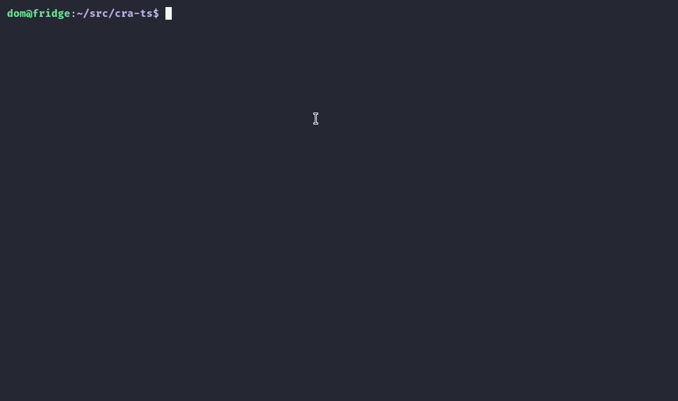
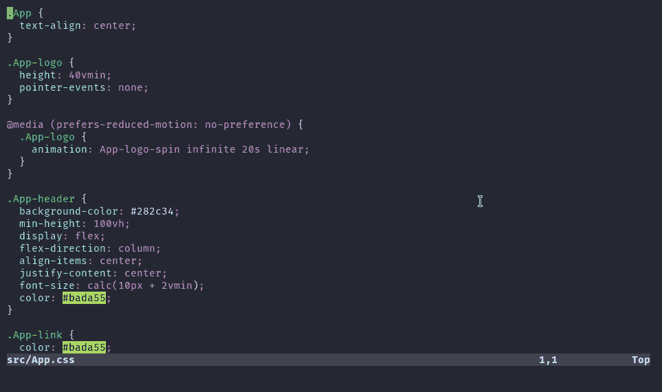
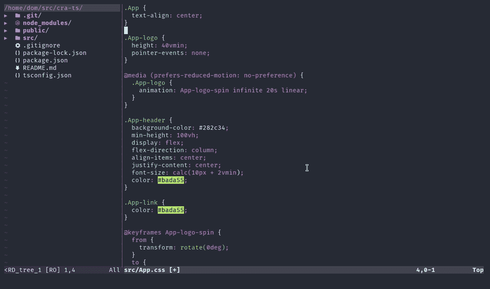
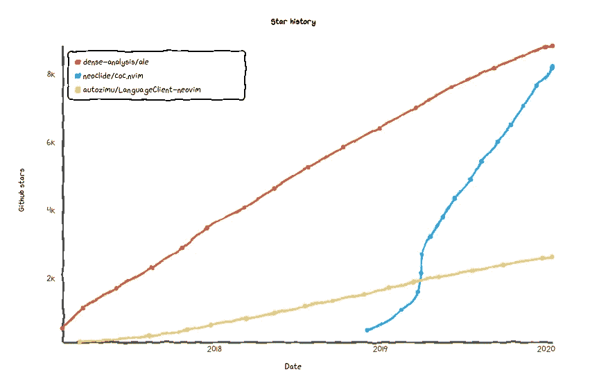
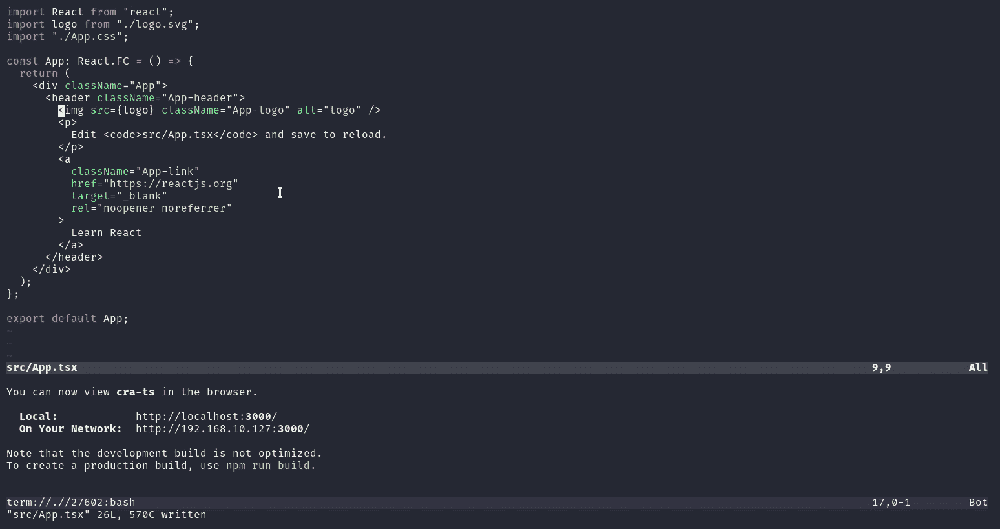
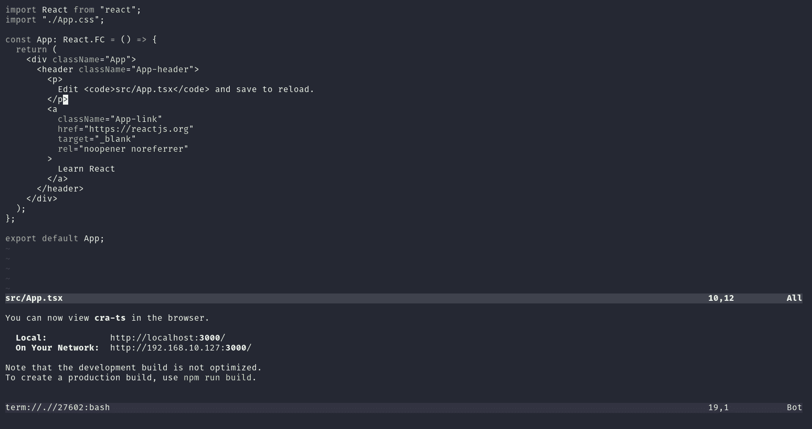
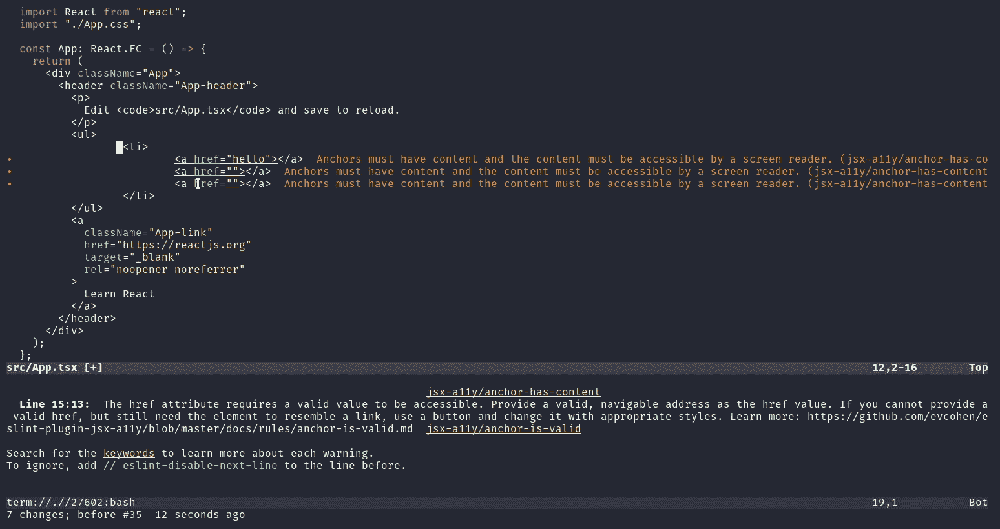

# 为 2020 年的 Web 开发设置 Neovim

> 原文：<https://betterprogramming.pub/setting-up-neovim-for-web-development-in-2020-d800de3efacd>

## 从 VS 代码切换到 Neovim 进行 React 和 TypeScript 开发



# 放弃

如果你以前从未使用过 [Vim](https://www.vim.org/) ，你会很难理解这篇教程。但是，如果您想看看 Vim 能做些什么，我有。GIFS 继续滚动。

# 安装 Neovim

## Linux 操作系统

如果你运行的是 Ubuntu 或其他 Linux 发行版，你可以像这样使用它的软件包管理器:

```
sudo apt install neovim
```

## 马科斯

macOS 的[家酿](https://brew.sh/)也是如此:

```
brew install neovim
```

## Windows 操作系统

在 Windows 上，您可以使用其中一个包管理器，如 [Chocolatey](https://chocolatey.org/) :

```
choco install neovim
```

或者[勺](https://scoop.sh/)。

```
scoop install neovim
```

如果您在安装过程中遇到问题，请访问[安装维基](https://github.com/neovim/neovim/wiki/Installing-Neovim)。

# 设置 Neovim

虽然你可以在任何平台上安装 Neovim，但我强烈推荐运行 Linux/macOS。

就像 Vim 一样，Neovim 非常简单，不包括任何开箱即用的花哨插件，所以我们必须安装它们。首先，让我们安装一个插件管理器:

## Unix (Linux/macOS)

```
curl -fLo ~/.local/share/nvim/site/autoload/plug.vim - create-dirs \
 [https://raw.githubusercontent.com/junegunn/vim-plug/master/plug.vim](https://raw.githubusercontent.com/junegunn/vim-plug/master/plug.vim)
```

## Windows (PowerShell)

```
md ~\vimfiles\autoload
$uri = '[https://raw.githubusercontent.com/junegunn/vim-plug/master/plug.vim'](https://raw.githubusercontent.com/junegunn/vim-plug/master/plug.vim')
(New-Object Net.WebClient).DownloadFile(
  $uri,
  $ExecutionContext.SessionState.Path.GetUnresolvedProviderPathFromPSPath(
    "~\vimfiles\autoload\plug.vim"
  )
)
```

## 编辑配置文件

对于 macOS 和 Linux，Neovim 配置文件位于`~/.config/nvim/init.vim`中。

```
mkdir ~/.config/nvim
```

对于 Windows:

```
mkdir ~/AppData/Local/nvim
```

并将下面的代码粘贴到位于上面指定的目录中的名为`init.vim`的配置文件中。这允许您通过添加对 GitHub 库的引用来配置插件，如下所示:

```
call plug#begin("~/.vim/plugged")
  " Plugin Section
call plug#end()"Config Section
```

# 主题

Neovim 的默认主题将使用您终端的主题。让我们改变这一点。在插件部分，添加:

```
Plug 'dracula/vim'
```

现在，在 plugin 部分下面的 config 部分中，添加以下行:

```
if (has("termguicolors"))
 set termguicolors
endif
syntax enable
colorscheme dracula
```

为了使更改生效，您需要首先安装插件并重新加载编辑器，如下所示:

```
nvim +PlugInstall
```

然后，退出编辑器并打开任何文件:

```
nvim App.css
```



维姆的吸血鬼主题演示

# 文件浏览器

如果我们想要一个全功能的 IDE，我们需要一个带有图标的文件浏览器。只需添加以下插件:

```
Plug 'scrooloose/nerdtree'
Plug 'ryanoasis/vim-devicons'
```

以及配置:



现在您可以简单地使用 Ctrl+B 来切换文件浏览器。

# 集成终端

Neovim 带有一个集成的终端，但是，它不是开箱即用的配置，所以我们需要添加一些键绑定来打开它，并将其留在配置部分:

现在，您应该能够使用 CTRL-N 打开终端了，要退出终端中的插入模式，请按 Esc。

现在，要切换到代码编辑器窗格，使用 CTRL+w w。一旦打开了两个以上的面板，这个快捷键就会变得很烦人，所以我也添加了下面的快捷键。

## 在面板之间切换

将以下内容添加到您的配置部分:

这允许您使用 Alt+H、Alt+J、Alt+K 和 Alt+L 在终端和其他面板之间移动。



集成终端

# 文件搜索

在 VS 代码中，在当前工作区中搜索文件可以像按 Ctrl+P 并键入文件名一样简单。

使用 fuzzy finder 可以做得更好，fuzzy finder 也有指定新打开的文件应该放在哪里的快捷方式。

将以下内容添加到您的插件部分:

```
Plug 'junegunn/fzf', { 'dir': '~/.fzf', 'do': './install --all' }
Plug 'junegunn/fzf.vim'
```

以及配置:

```
nnoremap <C-p> :FZF<CR>
let g:fzf_action = {
  \ 'ctrl-t': 'tab split',
  \ 'ctrl-s': 'split',
  \ 'ctrl-v': 'vsplit'
  \}
```

现在，要搜索文件，请按 Ctrl+P，搜索您要查找的文件，然后按:

*   CTRL+T 在新标签页中打开它。
*   CTRL+S 在下面打开(拆分视图)。
*   CTRL+T 向侧面打开(垂直拆分)。
*   回车在当前选择的面板中打开它。


CTRL+P，键入文件名，CTRL+V

## 忽略节点模块

使用 npm 时，`node_modules`文件夹往往会填写大部分搜索结果。要忽略这一点，以及包含在`.gitignore`文件中的所有文件，您需要告诉 [fzf](https://github.com/junegunn/fzf) 使用`silversearcher-ag`:

```
let $FZF_DEFAULT_COMMAND = 'ag -g ""'
```

它可以从这里[安装，](https://github.com/ggreer/the_silver_searcher)使用任何软件包管理器。

# 智能感知和语法突出显示

为了突出语法，我们将使用 [coc.nvim](https://github.com/neoclide/coc.nvim) ，它基本上使用 VS Code 的代码完成。

还有其他替代方案，如 [ALE](https://github.com/dense-analysis/ale) 或**[language client-neo vim](https://github.com/autozimu/LanguageClient-neovim)**但是从我的经验来看，它们很难配置，并且不如 TypeScript 和 React 好用。自 2019 年初发布以来，它也迅速被社区采用。****

********

****[https://star-history . t9t . io](https://star-history.t9t.io)****

****首先，安装 Node.js (Linux / macOS):****

```
**curl -sL install-node.now.sh/release | bash**
```

****在 Windows 上:****

```
**choco install nodejs
or
scoop install nodejs**
```

****只是为了验证，通过键入`node --version`确保 Node.js 工作。请注意，您的版本可能与下面显示的版本不同，这没关系。****

********

****现在，只需将下面几行添加到插件部分:****

```
**Plug 'neoclide/coc.nvim', {'branch': 'release'}
let g:coc_global_extensions = ['coc-emmet', 'coc-css', 'coc-html', 'coc-json', 'coc-prettier', 'coc-tsserver']**
```

****如果您还需要打字稿和 TSX 支持:****

```
**Plug 'leafgarland/typescript-vim'
Plug 'peitalin/vim-jsx-typescript'**
```

# ****保存时格式化****

****在你的`nvim`文件夹(很可能是`~/.config/nvim`)中，粘贴以下配置，它将在保存时格式化所选文件，并在同一行显示警告文本:****

# ****最终演示****

## ****智能感知、错误和警告****

********

****错误可以被配置为出现在同一行，在底线，或者只是保持隐藏****

## ****蚂蚁****

********

****添加 coc-emmet 允许我们使用 emmet 快捷方式****

## ****保存时格式化****

********

# ****配置文件****

## ****初始化. vim****

## ****coc-settings.json****

# ****最后的想法****

****请让我知道您对这个基本配置的看法，以及您是否对更多与 Vim 相关的文章感兴趣。我计划发布关于以下内容的文章:****

*   ****使用带有 [Go](https://golang.org/) 、 [Rust](https://www.rust-lang.org/) 和 c 的 Vim****
*   ****向 Vim 添加 Git 集成。****

****如果你想在你的订阅中看到更多像这样的文章，记得关注我。****

****非常感谢。如果你对新文章有任何反馈或建议，请在评论中留下。****