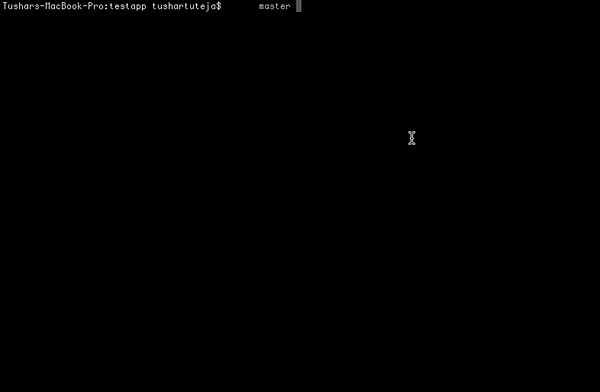
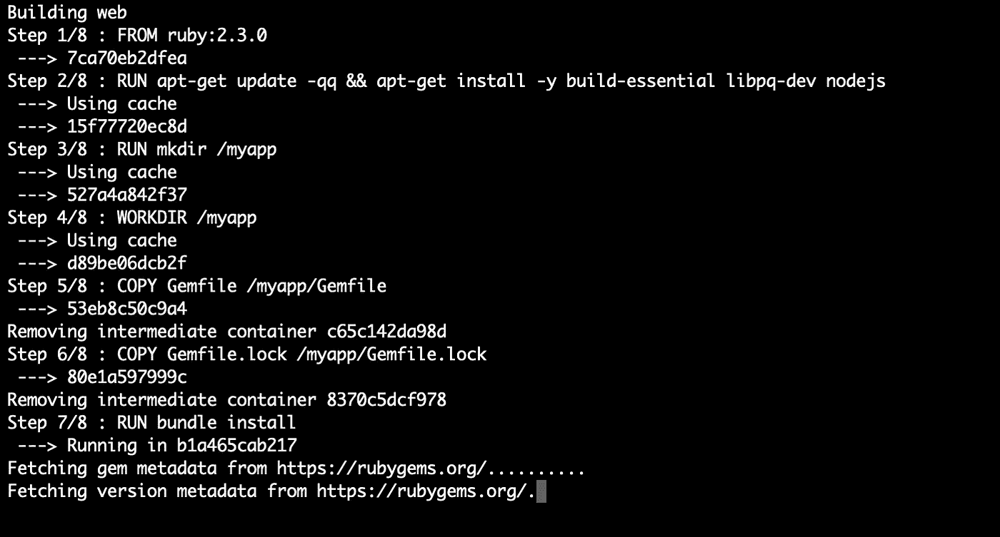
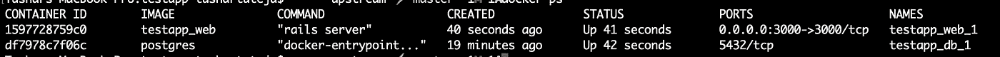
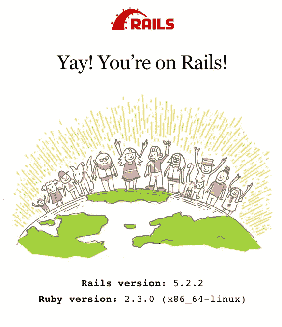

# 使用 Docker 通过 Postgres 设置 Ruby on Rails

> 原文：<https://betterprogramming.pub/setting-up-rails-with-postgres-using-docker-426c853e8590>

## 不再为安装而烦恼。这使得启动和运行变得简单


照片由 [Denys Nevozhai](https://unsplash.com/@dnevozhai?utm_source=unsplash&utm_medium=referral&utm_content=creditCopyText) 在 [Unsplash](https://unsplash.com/s/photos/red?utm_source=unsplash&utm_medium=referral&utm_content=creditCopyText) 上拍摄

我曾经在一个技术训练营中用 Ruby on Rails 教授 web 开发。几乎每个人都在努力安装 Ruby、Rails 和 Postgres，并让它们运行起来。

过去这需要相当长的时间，所以我写了一个 Docker Compose 文件，用一个命令就可以启动一切。这是文件和它的魔力。在你看完下面的视频后，我将解释 Docker Compose 文件和 Docker 文件中的所有内容。这表明运行您的开发环境是多么容易。



对于不知道 Docker 或者 Docker Compose 的人，可以[在这里](https://www.docker.com/)了解一下。不知道它们也没关系——您仍然可以使用演示代码启动一个 Rails 项目，并运行 Postgres。我在文章的最后附上了一个类似的 Docker Compose 文件和 Docker 文件，用于与 Express 一起工作。

让我们首先在您的系统上运行它。

克隆这个 repo—[https://github . com/tushartuteja/rails-docker-compose-example](https://github.com/tushartuteja/rails-docker-compose-example)

转到根文件夹并运行`docker-compose up`。如果是第一次运行，这可能需要一段时间。它应该如下所示:

```
docker-compose up
```



这将运行两个容器。一个是运行 Rails 的 web 服务，另一个是附加到 web 服务的 Postgres 数据库。

众所周知，我们需要运行`rake db:create`、`rails db:migrate`和许多其他神奇的 Rails 命令。应该有一种方法可以连接到 web 容器。我们可以非常容易地做到这一点，只需两步。

首先，运行`docker ps`命令列出所有当前正在运行的容器。参考下面的图片。

```
docker ps
```



正如我们所看到的，有两个容器在运行。为了连接到一个特定的容器，我们将运行`docker exec -it 1597728759c0 sh`。该字符串是容器 id。这将把我们连接到容器，就像我们 SSH 到另一台机器一样。

```
docker exec -it 1597728759c0 sh
```

现在，我们将运行`rake db:create`和`rake db:migrate`在我们的数据库服务器上运行数据库迁移。

```
rake db:createrake db:migrate
```

去 [http://localhost:3000/](http://localhost:3000/) 看看是否一切正常。



我已经在当前的回购中创建了一个博客脚手架。访问[http://localhost:3000/blogs](http://localhost:3000/blogs)看看它是否能在你的系统上工作。

# 让我们看看它是如何工作的

我们通过三个文件来了解一切是如何工作的。第一个是 Rails 项目的`Dockerfile`，第二个是`docker-compose.yml`文件，第三个是配置数据库连接的`database.yml`文件。

```
FROM ruby:2.3.0
RUN apt-get update -qq && apt-get install -y build-essential libpq-dev nodejs
RUN mkdir /myapp
WORKDIR /myapp
COPY Gemfile /myapp/Gemfile
COPY Gemfile.lock /myapp/Gemfile.lock
RUN bundle install
CMD ["rails", "server"] 
```

这个文件的作用是在运行 Ruby 的映像(即`Dockerfile`)之外制作容器，并安装运行项目所需的所有依赖项。当一个容器被创建时，我们运行服务器。

其次，我们会调查`docker-compose`的档案。

第一行指定 Docker Compose 的版本。

从第二行开始，我们描述了我们想要运行的两个服务(容器)。第一个是我们的数据库，服务名是 *db* 。这是由 Docker Hub[上公开的 Postgres 图片运行的。它是自动为我们下载的。](https://hub.docker.com/)

第二个是我们的网络服务。为此，我们需要建立一个形象。那将由上面提到的`Dockerfile`建造。

我们希望我们的应用程序重新启动，并反映代码的变化。这就是为什么我们将应用程序的根文件夹作为一个卷连接到 Docker 容器中的工作目录。一旦您在系统上更改了代码，容器就会读取这些更改并重启服务器。你可以继续做你的发展，而不用担心你的环境。

我们应该可以从我们的机器上打开集装箱。因此，我们通过将系统的端口 3000 绑定到 Docker 容器的端口 3000 来指定端口。

最后，运行 Rails 的容器应该能够访问我们的数据库。因此，我们的服务依赖于数据库服务。我的 web 服务容器的 db 主机将只是 *db* 。

让我给你看一下`database.yml`文件:

正如您所看到的，提到的主机只是字符串 *db* ，db 容器的所有端口都可以直接被我们的 web 容器访问，尽管它们不能被我们的本地机器访问。

db 容器中映射的卷确保了即使我们停止 db 容器，数据也是持久的。

# 摘要

如果想尽快上手，只需将`Dockerfile`和`docker-compose.yml`复制到自己的项目中，将`database.yml`中的`db host`更改即可。您将很快在任何支持 Docker 的机器上启动并运行。

Node.js 和 Golang 的类似示例 repos 即将推出。我也会给你更新的。