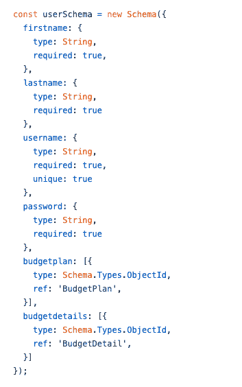
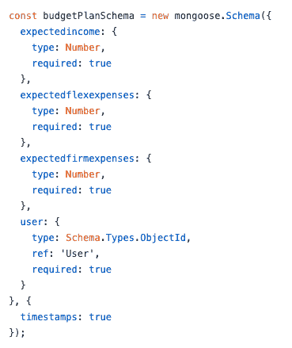
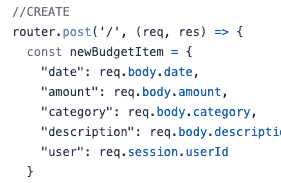
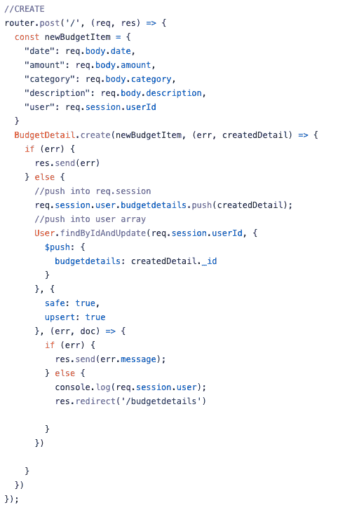
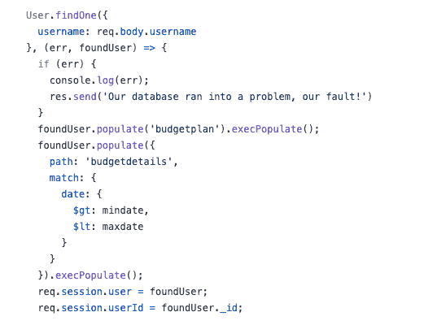

# 在 CRUD 应用程序中为 Mongoose Populate 设置集合

> 原文：<https://betterprogramming.pub/setting-up-your-collections-for-mongoose-populate-in-a-crud-app-3df9bba3fe7a>

## 填写您的 Mongo 收藏

Julián Amé 在 [Unsplash](/@imperioame?utm_source=unsplash&utm_medium=referral&utm_content=creditCopyText) 上拍摄的照片

我是一名初级程序员，我一直在参加大会的软件工程沉浸式项目。本月我们已经深入 JavaScript 后端编码，探索了 Express、EJS、 [Node.js](http://node.js/) 和 MongoDB。

我最近展示了我的 Unit 2 项目:一个使用 MEEN 堆栈开发的 CRUD 预算应用程序。在开发这个应用程序时，我花了几个小时阅读文章和文档，以了解后端框架和 MongoDB 集合之间令人困惑的关系。

彻底难倒我好几天的功能是 mongose`populate`。在`populate`上有一些有用的文章，但是有一些关于如何实际使用它的初级细节没有得到解答。

在这篇文章中，我想分享一些我如何设置猫鼬`populate`的小细节。我假设你已经用 Mongoose 安装了一个 CRUD 应用程序和数据库。如果你想知道我如何设置的例子，看看我的项目回购。另外，由于这是我第一次使用`populate`(也是我第一篇关于 Medium 的文章)，我希望听到任何反馈！

`populate`是一个有用的函数，用于将 MongoDB 数据库中其他集合的文档填充到一个集合中。在我的项目中，我有三个集合——用户、预算计划和预算细节。当一个用户登录到我的站点时，我希望他们当月独特的预算计划和预算细节填充到他们的用户文档中，并且可以在我呈现的每个页面上使用。

您需要做的第一件事是设置您的模式来接受来自其他集合的文档 id，这样您就可以在运行`populate()`时将这些 id 转换成实际的对象。很多例子的特点是模式包含在同一个文件中，但是当模式在不同的文件中时(通常应该是这样)，这种方法仍然有效。

我的用户模式引用了我在`budgetplan`和`budgetdetails`属性下的另外两个集合。为了让模式准备好进行填充，您需要将`type`设置为`Schema.Types.ObjectId`。这意味着您稍后将推入的文档的 ID。您还需要定义一个`ref`，或者您在填充时将引用的集合的名称。

我的“用户模式”的屏幕截图，为人口设置了“预算计划”和“预算详细信息”

在我的另外两个模式中，我对`user`属性做了同样的事情。

为填充设置了属性“user”的“budgetplanSchema”

在做这个 app 的时候，我上到这个点，然后卡了两天。我不明白为什么其他步骤不起作用。模式设置好了，我就像文档告诉我的那样调用了`populate`……然后，我终于发现我做错了什么。

仅仅因为我将类型声明为`Schema.Types.ObjectId`，来自链接集合的对象 id 不会在您创建新文档时神奇地出现！你必须把它们放进去。(我知道忽略一些愚蠢的细节，但令人惊讶的是，我们这些初级程序员可能会忽略我们正在努力掌握的概念的深度和广度。因此，原谅你自己，在这个旅程中，你会有数百个大脑冻结的时刻。)

意识到这一重要细节后，我回到我的`create`路线，确保每次创建新的预算细节或预算计划时，对象 id 都被添加到用户文档和`budgetdetail`或`budgetplan`文档中。

在我的`budgetdetail`控制器文件中，我首先为我的`user`属性添加 ID。我使用 express-session 在登录时创建一个惟一的会话，所以我通过引用我在`sessions`控制器文件中设置的`req.session.userId`变量来添加用户 ID。

我的发布路线的起点—声明一个准备创建的“newBudgetItem”

现在我已经为`user`属性存储了一个实际的 ID，我使用`.create()`将新的细节添加到我的`BudgetDetail`集合中。

在`BudgetDetail` post 路径中，我使用`.findByIdAndUpdate()`和`$push`找到我的当前用户，并将细节的对象 ID 推入用户的`budgetdetails`属性中。(注:如果你使用这种方法，需要你的`User`模型在你的工作文件中！)

我还想让我的应用程序在我使用`req.session.user`时立即更新，所以我将整个`budgetdetail`对象推送到我的`user`对象中，该对象存储在`req.session`中。在创建新的预算计划时，我也经历了同样的过程。

邮寄路线的完整示例

注意，我没有将整个对象添加到用户集合的`budgetdetails`属性中。如果您在填充之前`console.log`它们，它应该看起来像一个 id 数组！当我需要从用户文档中删除一个对象 ID 时，我经历了相同的步骤，然后`$pull`删除 ID 而不是推送它。

现在这个预算细节在我的用户集合中被引用了，我可以调用它并将这个 ID 转换成一个完整的预算细节对象。当用户签名时，我在我的`sessions`控制器文件中这样做了。

我的用户登录后，在我的发布路径中，我使用`.findOne()`通过用户名选择用户。然后，我调用`.populate()`和`.execPopulate()`将这些 id 数组转换成对象数组。

当我在 express-session 中使用它时，我将我的用户分配给了`req.session.user`。如果你想进一步过滤你选择的数据，就像我对`mindate`和`maxdate`变量所做的那样，你可以在填充函数中进一步指定。

登录发布路由中的填充函数示例

现在你应该有一个填充的用户，你可以做你想做的事情！作为一名初级程序员，我相信随着时间的推移，我会完善和重构这一点，但我很高兴找到一种初学者的方法，它可以让我的用户在他们的页面上填充独特的预算计划和预算细节！

我希望这能帮助那些为`Mongoose.populate()`的一些小细节而奋斗的人。

# **延伸阅读**

*   [“深入猫鼬深层种群，以及如何跨多级繁殖”](https://www.initialapps.com/mongoose-why-you-may-be-having-issues-populating-across-multiple-levels/)
*   上的猫鼬文件`[populate](https://mongoosejs.com/docs/populate.html#refs-to-children)`
*   [“猫鼬的模型。【T4 填充()】"](https://medium.com/@nicknauert/mongooses-model-populate-b844ae6d1ee7)
*   [“通过 Node.js 中的 Mongoose 将项目推送到 MongoDB 数组中](https://stackfame.com/push-pop-item-mongodb-array-mongoose-nodejs)