# 使用 Atom 设置您的开发工作区

> 原文：<https://betterprogramming.pub/setting-up-your-dev-workspace-with-atom-cf2a32becad6>

## 简化 Atom 工作的 4 个技巧


自从我发现了 Atom 的 snippet 部分，每当我发现可以自动化或简化的东西时，我就努力调整我的工作空间。这主要是为了迎合 web 开发人员，但是我会在最后包含一个简短的部分，提供其他杂项用途的提示，比如 LaTeX。

以下是一些真正对我有帮助的事情。我将把这篇文章分成四个主要部分:设置、主题、包和快捷方式。

# 设置

总的来说，我发现有助于改变的是:

1.  字体
2.  缩进大小
3.  卷动

作为一个一直在努力学习 web 开发的人，我发现将字体和字体大小改变到我觉得舒服的程度对我有很大的帮助。

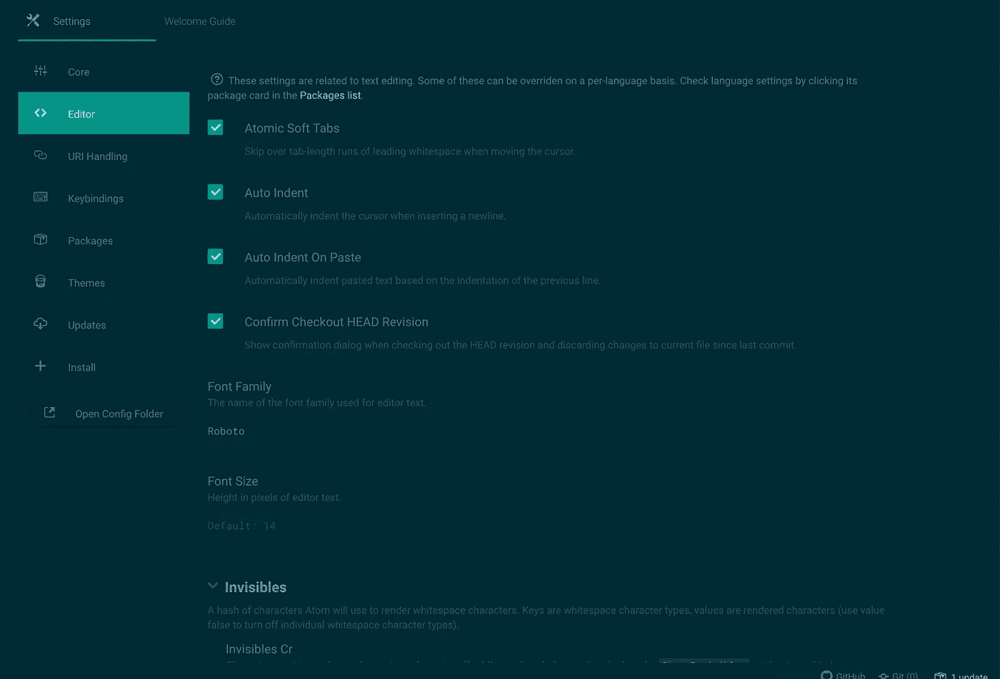

我目前使用的是 Roboto 字体系列，字体大小为 14px。然而，当我看更多的细节时，或者在编码一段时间后，我会将字体大小切换到 16 或 18px，以使我的眼睛更容易看到。

我从 Atom 字体包中获得了这组特殊的字体。你可以在这里下载[！](https://atom.io/packages/fonts)

鉴于我也经常使用 HTML、CSS 和 JavaScript，你对这些语言使用的缩进很重要。我特别喜欢默认选项，但是我也遇到过其他人修改了他们的缩进以使事情变得更加明显。

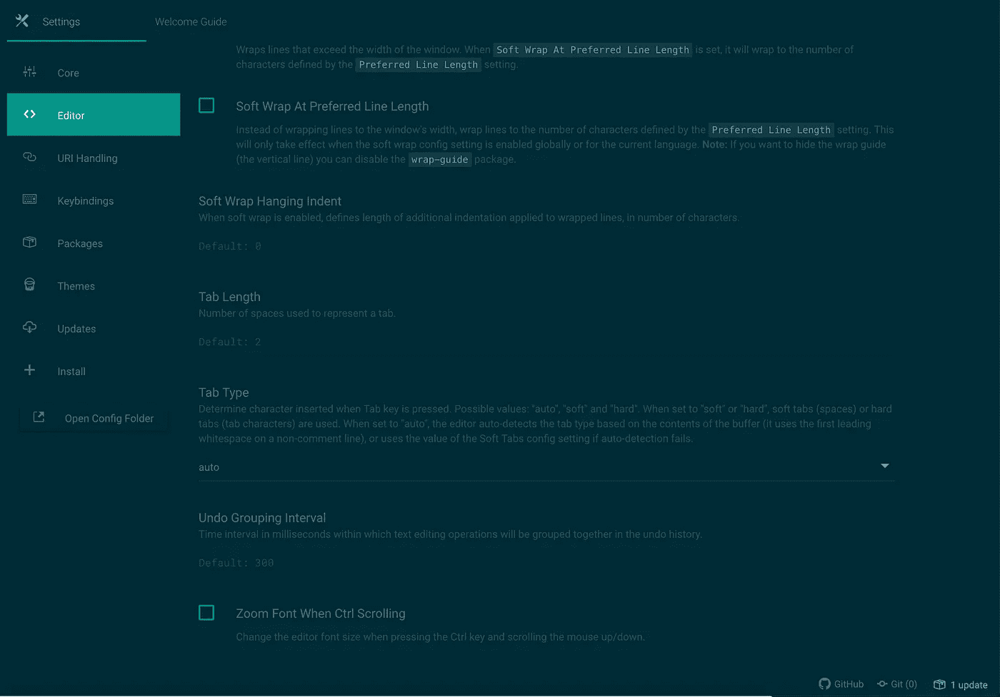

您可以在这里更改标签长度，以便为您服务。

最后，这可能是我的一个小问题，但是我也从我的项目树中删除了一些文件。

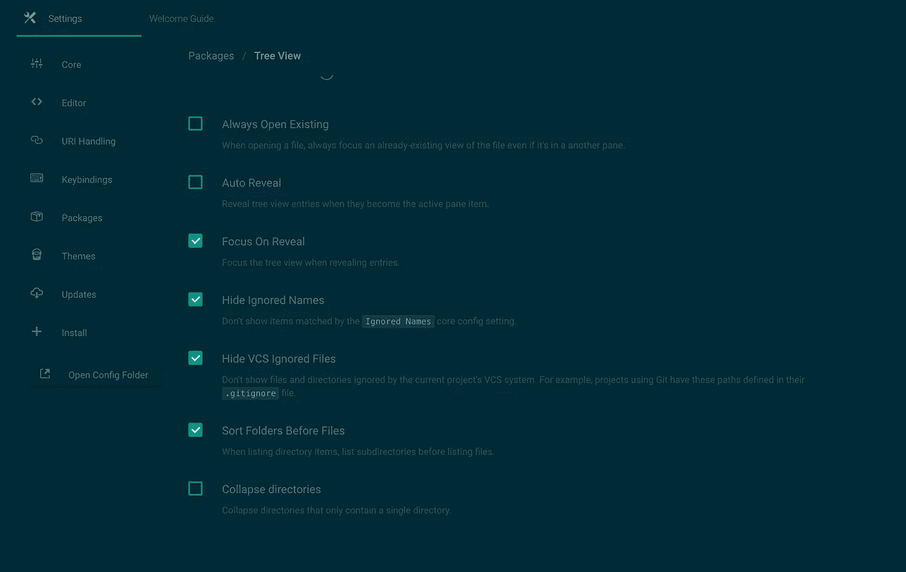

这将在您的`gitignore`中隐藏类似`.DS_Store`的文件，以及其他被忽略的名称列表。我发现这有助于我释放一些认知空间，并在处理大型项目时提高我的生产率。

我还启用了滚动到末尾选项。这使你可以做一些很酷的事情，比如，滚动到文件的末尾。

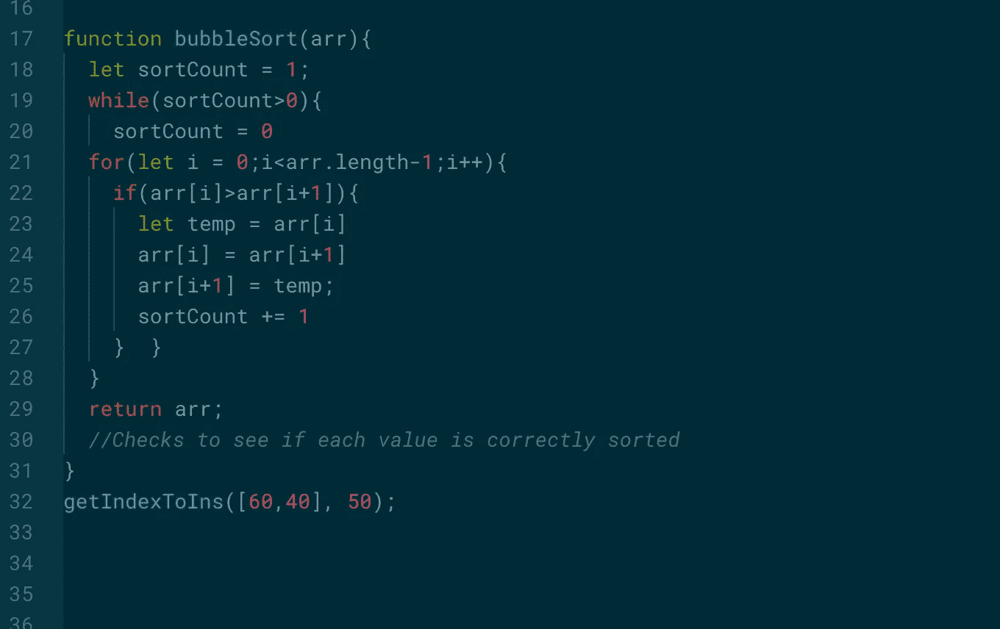

以前...

以前，你只能在代码末尾添加几个空格，以便向下滚动一点，看到程序的结尾。然而，有了这个新的选项，你可以简单地滚动过去，而不用在程序中添加那些讨厌的空格！

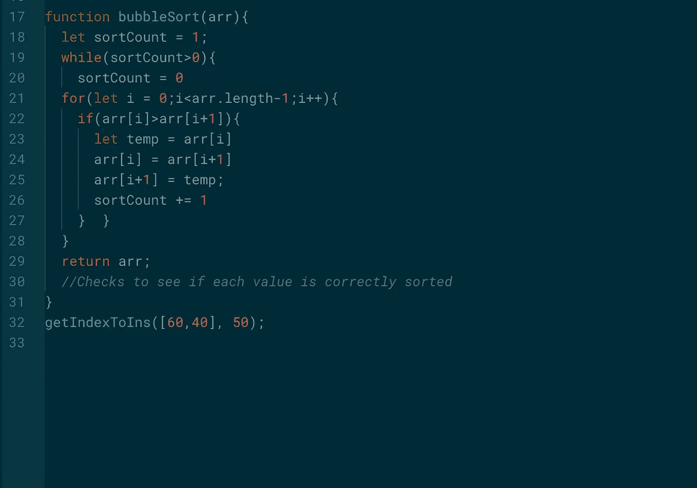

滚动-过去-结束

就我个人而言，我喜欢滚动到文件的末尾，然后看到一些空间，所以这真的有助于解决我对额外空间的困扰。

您可以在编辑器选项卡下的设置中更改它。

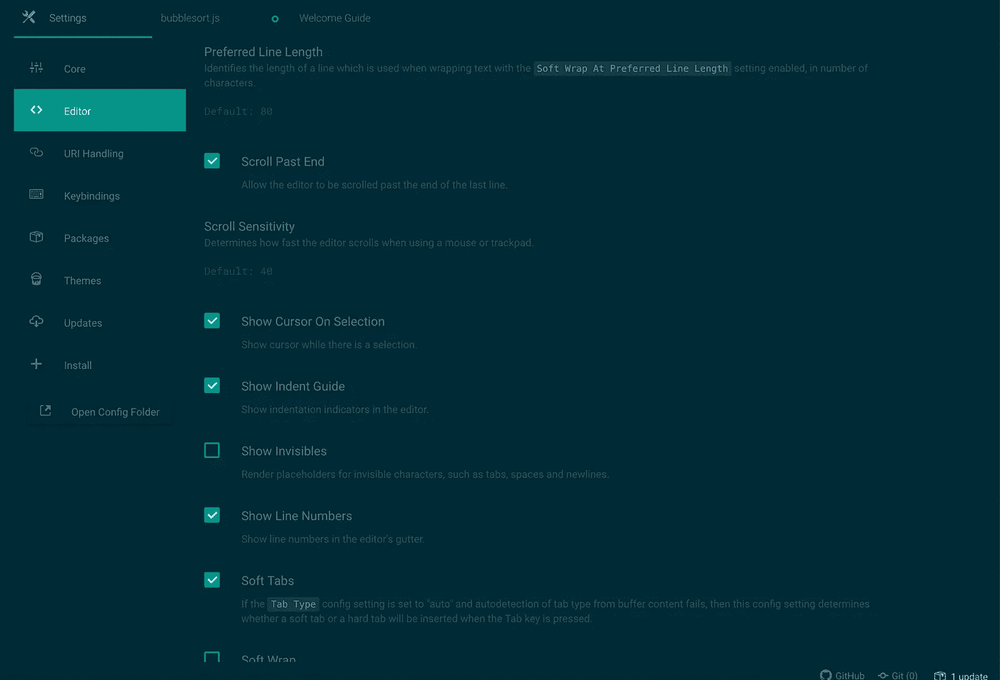

# **主题**

除了默认的、材质的 UI 主题和[纸笔咖啡](https://atom.io/themes/pen-paper-coffee-syntax)之外，我真的没怎么玩过主题。

目前我使用的 UI 主题是 [Atom 材质的 UI 主题](https://atom.io/themes/atom-material-ui)和 Atom 附带的[日晒深色选项](https://atom.io/themes/solarized-dark-syntax)。对于突出显示了关键字和特殊字符的 JavaScript 文件，它看起来像这样。

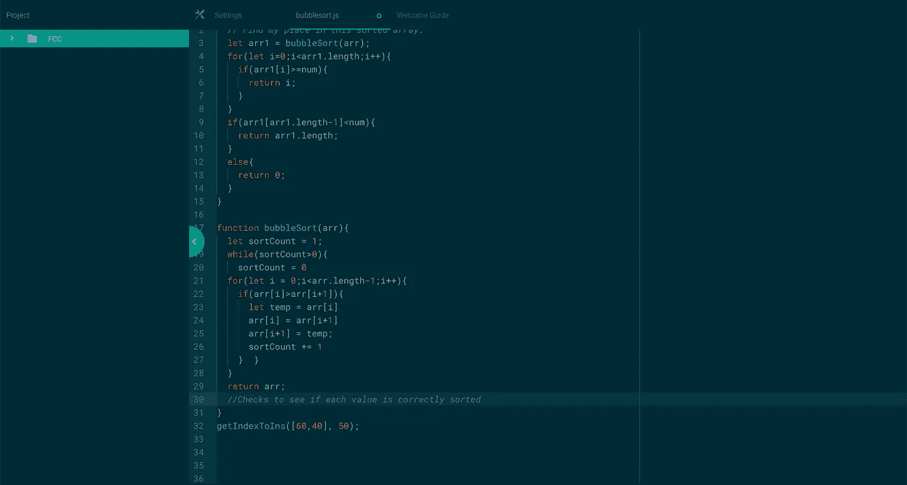

然而，当我打出我的 LaTeX 时，我倾向于使用 UI 主题 [Atom Light](https://github.com/atom/atom-light-ui) 和 Pen Paper Coffee 来轻松阅读我的 LaTeX。我还安装了一些软件包(参见 packages ),它们让我很容易写好 LaTeX。

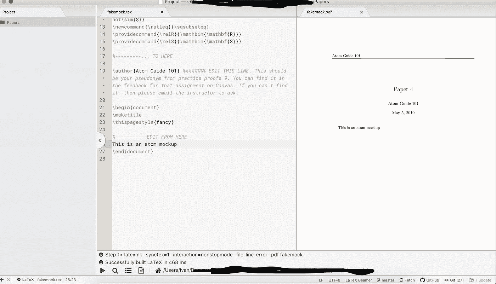

一些敏感信息被删除。

# 包装

对于 Web 开发，我目前使用的是:

1.  [颜料](https://atom.io/packages/pigments)
2.  [平台视频终端](https://atom.io/packages/platformio-ide-terminal)
3.  [拖动相对路径](https://atom.io/packages/drag-relative-path)
4.  [文件图标](https://atom.io/packages/file-icons)
5.  [待办事项显示](https://atom.io/packages/todo-show)

## 天然色素

我发现颜料对于决定 CSS 颜色和处理 CSS 变量非常有用。这是一个非常强大的插件。

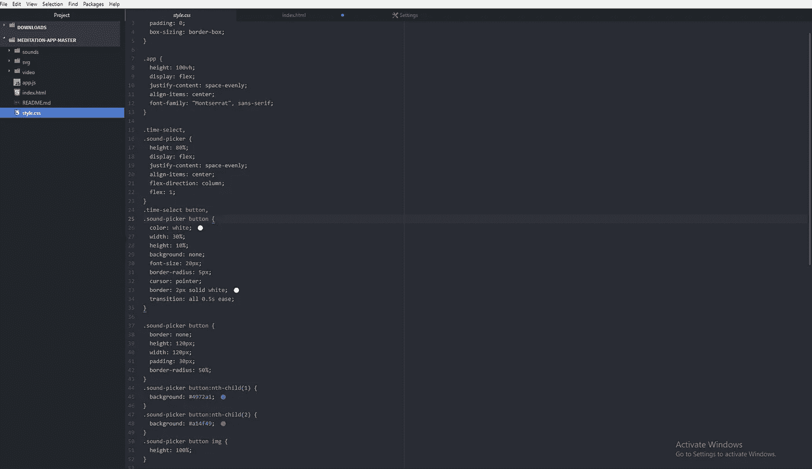

我还没能充分发挥颜料的潜力，因为它主要对`.less`文件更有用。但是 Pigments 能够检索 CSS 变量和更少的预处理器变量，这使得处理大量重复的代码变得更容易。

我目前在颜料中使用原生点设置，这有助于我看到我在 CSS 代码中选择的颜色作为点，但是还有一大堆其他选项可以使用。

## 平台视频终端

Platformio-IDE-Terminal 非常有用，因为它可以立即在运行文件的文件目录中打开一个终端。它还允许您打开多个终端，所有这些都在您的 Atom 工作站中舒适地进行。

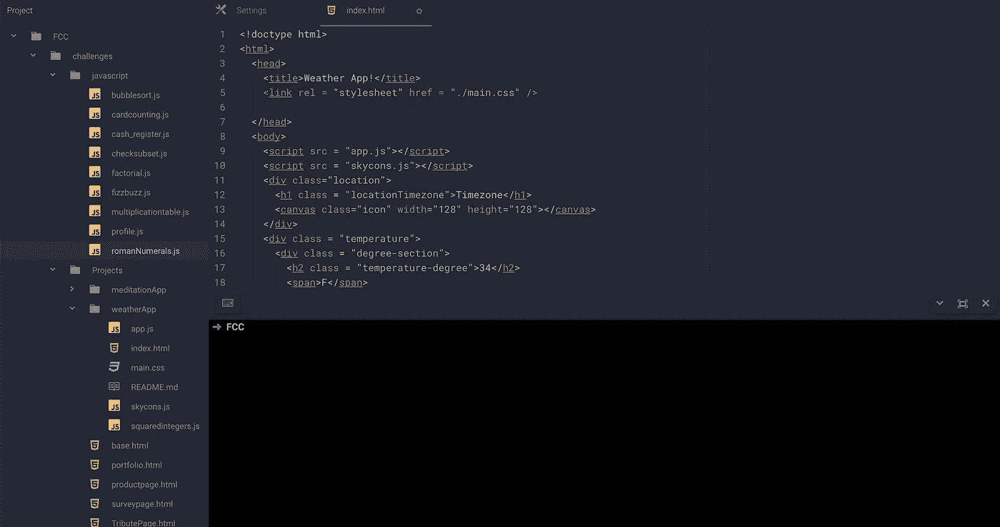

我目前正在使用“我的 ZSH”作为我的终端。因此，我的终端看起来会和你的略有不同。如果你有兴趣看看《我的 ZSH》，你可以在这里这样做。

## 拖曳相对路径

拖动相对路径在链接 html 文件中的`.css`和`.js`文件时非常有用。不用输入冗长的链接文件，只需点击你想链接的文件，放入你的文件中，瞧！

## 文件图标

文件图标是我极力推荐的东西。它帮助我用可视图标一目了然地看到我的目录中有什么样的文件，并在后台帮助整理我的工作空间。

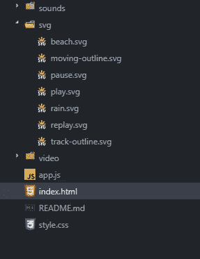

# 片段

这是 Atom 的一个部分，我最近发现它非常有用，只要你知道如何配置它。

这允许您保存可以自动完成的文本片段，以形成您经常使用的代码块。

让我们来分析一下这段代码是什么意思。

```
'.text.html'
```

这是根据文件类型将片段分组的主要方式。这是有意义的，因为您希望用于 HTML 页面的代码片段将不同于用于 JavaScript 页面的代码片段。

如果您想添加 atom 不支持的自定义代码片段类型，这非常简单！在您的`%USERPROFILE%\.atom`目录中有一个名为`snippets.cson`的文本文件，它包含了您在启动 Atom 时加载的所有定制代码片段。您也可以通过选择*文件>片段*菜单轻松打开该文件。

```
'prefix': 'clasbut'
```

前缀表示您将输入以访问代码片段的文本。您可以给它起任何您想要的名字，但是要使它易于键入并且足够清晰，这样它就不会与您将要创建的其他代码片段混淆。

```
'body':
"""
<button class="$1">$2</button>
"""
```

正文是自动完成的文本，代替文件中的原始前缀。您可能会添加大量多行代码。如果是这样，建议使用三重双引号，以便 Atom 将其作为一个整体导入。

每个后跟数字的`$`都是一个制表位。一旦代码片段被触发，通过按 Tab 键可以循环切换制表位。

例如，我刚刚创建了一个 clasbut 片段，这样我就可以在创建带有类的按钮时节省时间。只要我输入代码片段前缀的前半部分…

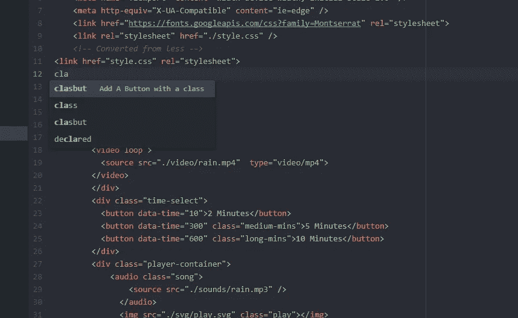

然后按回车键…

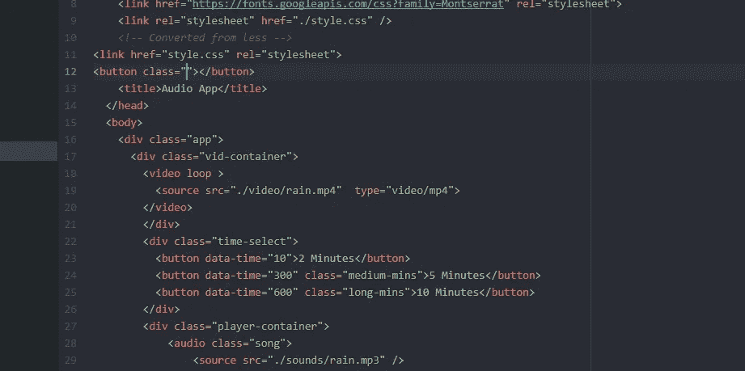

代码片段出现了！

我希望这篇文章能够帮助您了解一些可以用于 Atom 的技巧和窍门。欢迎在下面的评论中留下你的任何建议和窍门！