# 设置您自己的专用 VPN 并修复 DNS 漏洞

> 原文：<https://betterprogramming.pub/setting-up-your-own-private-vpn-and-fixing-dns-leaks-768ee8872bc>

## **了解如何在 AWS EC2 上使用 OpenVPN，以及如何在 Ubuntu 18.04 LTS 上处理 DNS 泄漏**


[Niv 歌手](https://unsplash.com/@niv?utm_source=medium&utm_medium=referral)在 [Unsplash](https://unsplash.com?utm_source=medium&utm_medium=referral) 上的照片

滚动自己的[虚拟专用网](https://en.wikipedia.org/wiki/Virtual_private_network) (VPN)远比从某人的“2019 年最佳 VPN”名单中选择 VPN 提供商复杂。但是我越了解为什么要使用 VPN，后一种选择就越没有吸引力。除了相信虚假的 VPN 应用程序或成为相似 URL 的受害者的危险之外，即使是合法的 VPN 服务提供商也有压力和动机，可能与你希望购买的隐私不一致。

通常，VPN 的目的是通过伪装你的位置来获得一层隐私。如果你目前没有使用，你可以在 DNSleaktest.com[看看互联网知道你在哪里。你会看到一个大大的“你好”，你的 IP 地址和你的位置。如果这有点令人不安，要知道 VPN 可以帮助保护你的位置和在线活动，使其免受不确定的目光和投机的广告商的影响。前者可能是一个过于好奇甚至恶意的公共 WiFi 上网者，但后者，与直觉相反，可能是你自己的家庭互联网服务提供商(ISP)。](https://dnsleaktest.com/)

使用 VPN 意味着互联网不能轻易看到你的位置，你的 ISP 不能看到你未加密的网络流量(你好奇的咖啡店邻居也不能)。您的 ISP *可以*看到您以加密形式发送的数据量，以及您发送到 VPN 服务器的数据量——但仅此而已。

除非你有一个 [DNS 泄露](https://dnsleaktest.com/what-is-a-dns-leak.html)。

如果您仍在使用 ISP 的 DNS 服务器，他们仍能看到服务器为您解析的所有 URL。因此，他们会知道你请求的是“lastminutebackwax.com”，尽管他们无法解密与该网站交换的数据。(是不是只有我觉得，或者这看起来更糟，不知何故？)

建立自己的实例和 VPN 服务比信任另一家公司来处理您的数据更让人放心。注意 VPN 不会给你完全的在线匿名；还有许多其他方法可以跟踪您的互联网状态并发现您的位置。然而，如果设置得当，没有 DNS 泄露，你将拥有尽可能多的互联网隐私而不用使用 [Tor](https://en.wikipedia.org/wiki/Tor_(anonymity_network)) 。

# 设置您的 VPN

这篇文章将介绍如何在 AWS Marketplace 上设置 [OpenVPN Access Server](https://aws.amazon.com/marketplace/pp/B00MI40CAE/) 产品，在[亚马逊 EC2](https://aws.amazon.com/ec2/) (弹性计算云)实例上运行。然后，我们将看看如何修复 Ubuntu 18.04 中一个已知的[网络管理器错误](http://Setting Up Your VPN)，该错误可能会导致 DNS 泄漏。整个过程大约需要 15 分钟，所以喝杯咖啡，让我们做一些成人活动。

*注意:本教程中显示的用于演示的 id 和 IP 地址无效。*

# 在 AWS Marketplace 上启动 OpenVPN 访问服务器

[OpenVPN 访问服务器](https://aws.amazon.com/marketplace/pp/B00MI40CAE)可在 AWS Marketplace 上获得。自带许可证(BYOL)模式实际上不需要最多两台连接设备的许可证；为了连接更多的客户端，您可以获得针对五个、十个或二十五个客户端的[捆绑计费](https://aws.amazon.com/marketplace/seller-profile/ref=srh_res_product_vendor?ie=UTF8&id=aac3a8a3-2823-483c-b5aa-60022894b89d)，或者以[15 美元/设备/年](https://openvpn.net/pricing/)的价格按菜单购买至少十个 OpenVPN 许可证。对于我们大多数人来说，两个免费连接的设备就足够了；如果使用 [EC2 微实例](https://aws.amazon.com/blogs/aws/new-amazon-ec2-micro-instances/)，我们的设置也将符合 [AWS 自由层](https://aws.amazon.com/free/)。

首先点击 [OpenVPN 接入服务器](https://aws.amazon.com/marketplace/pp/B00MI40CAE)的“继续订阅”,这将带你进入如下页面:

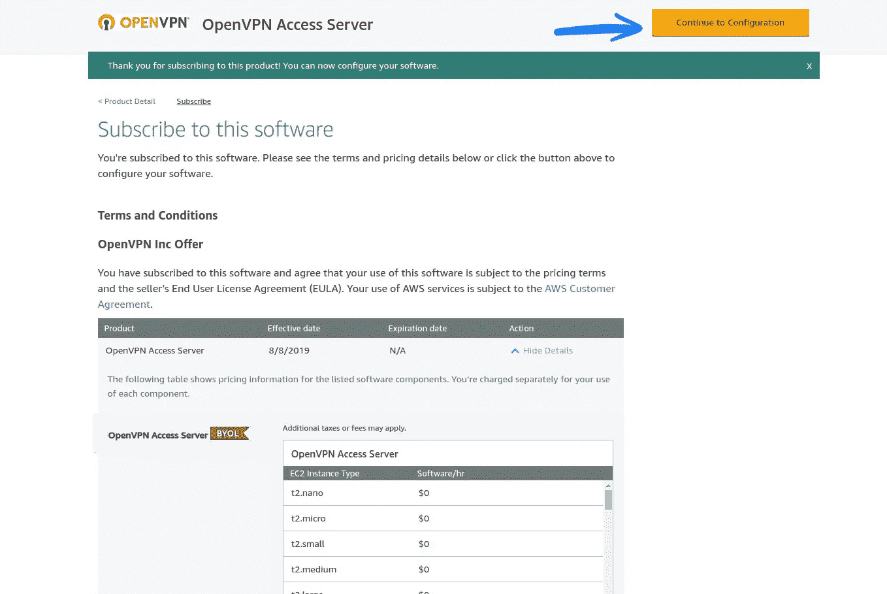

单击“继续配置”

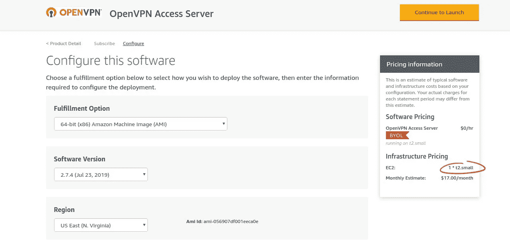

您可能会注意到，右边栏中的 EC2 实例类型(以及随后的每月评估)并不是我们想要的类型——没关系，我们很快就会改变它。只要确保选择的“区域”是我们希望实例所在的位置。一般来说，离你的客户(这里是你的笔记本电脑)越近，你的 VPN 就越快。点击“继续启动”

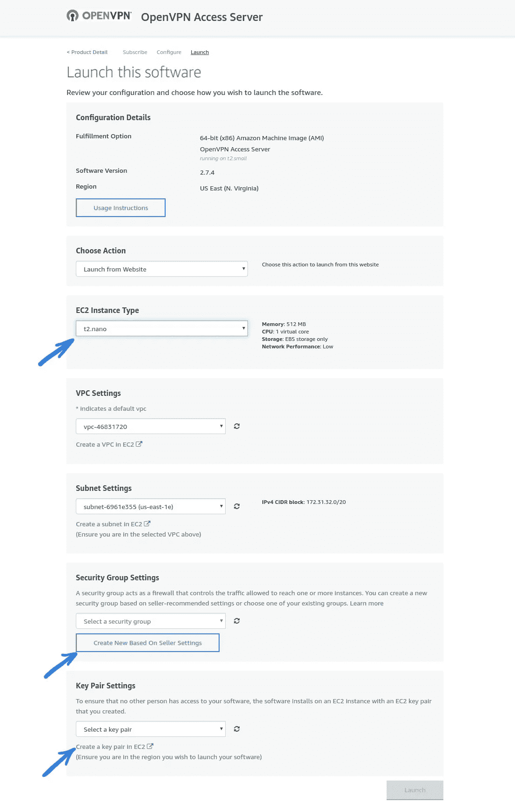

在此页面上，我们将更改三项内容:

## EC2 实例类型

不同类型的 EC2 实例将为我们提供不同级别的计算能力。如果您计划将您的实例用于除此 VPN 之外的其他用途，您可能希望选择具有更高内存或存储容量的实例，这取决于您计划如何使用它。我们可以在[亚马逊 EC2 实例类型页面](https://aws.amazon.com/ec2/instance-types/)上查看每个实例。

对于简单的 VPN 使用，`t2.nano`或`t2.micro`实例可能就足够了。只有微实例符合自由层条件。

## 安全组设置

一个[安全组](https://docs.aws.amazon.com/vpc/latest/userguide/VPC_SecurityGroups.html)是一个配置文件，或者设置的集合，Amazon 用它来控制对我们实例的访问。如果您以前安装过其他 AWS 产品，您可能已经有一些定义了自己规则的组。我们应该仔细理解我们的安全组设置的原因，因为这些定义了我们的实例是公开的还是私有的，以及谁可以访问它。

如果我们点击“根据卖家设置新建”，OpenVPN 服务器会为默认安全组定义一些推荐设置。

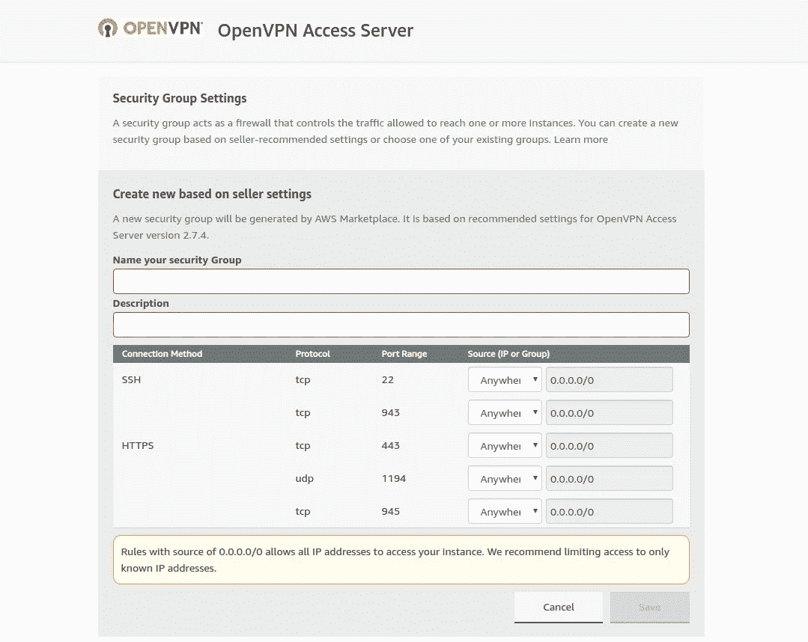

对于 TCP 端口 22、943、443 和 945 以及 UDP 端口 1194，默认的推荐设置都是`0.0.0.0/0`。OpenVPN 在其网站上提供了关于如何使用端口的解释。在默认设置下，所有这些端口都是开放的，以支持 OpenVPN 服务器的各种功能。我们可能希望将对这些端口的访问限制在一个特定的 IP 地址或地址块(比如您自己的 ISP)上，以增加我们实例的安全性。但是，如果您的 IP 地址频繁更改(例如当您旅行并连接到不同的 WiFi 网络时)，限制端口可能不会像我们希望的那样有用。

在任何情况下，我们的实例都需要 SSH 密钥来连接，并且 OpenVPN 服务器将受到密码保护。除非您有其他特定的安全目标，否则现在接受默认设置就可以了。

让我们给安全组一个名称和简要描述，这样我们就知道它的用途了。然后点击“保存”

## 密钥对设置

前面提到的 SSH 密钥是访问凭证，我们将使用它们来连接到我们的实例。我们可以在这个部分[创建一个密钥对](https://docs.aws.amazon.com/AWSEC2/latest/UserGuide/ec2-key-pairs.html#having-ec2-create-your-key-pair)，或者您可以选择一个已经在 AWS 中使用的密钥对。

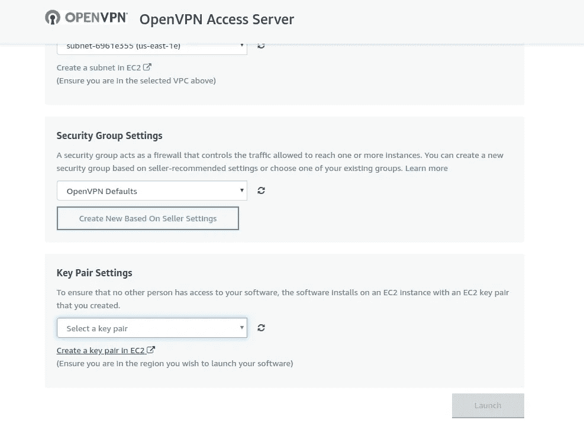

要创建一组新的访问凭证，请单击“在 EC2 中创建密钥对”以打开一个新窗口。然后，单击“创建密钥对”蓝色按钮。一旦您为您的密钥对命名，它将被创建，并且私钥将自动下载到您的机器上。这是一个以扩展名`.pem`结尾的文件。将此密钥存储在计算机上安全的地方。当我们连接到新的 EC2 实例时，我们需要引用它。

我们可以返回到上一个窗口，选择刚刚创建的密钥对。如果它没有出现，点击下拉菜单旁边的小“刷新”图标。一旦它被选中，点击闪亮的黄色“启动”按钮。

我们应该会看到这样的消息:

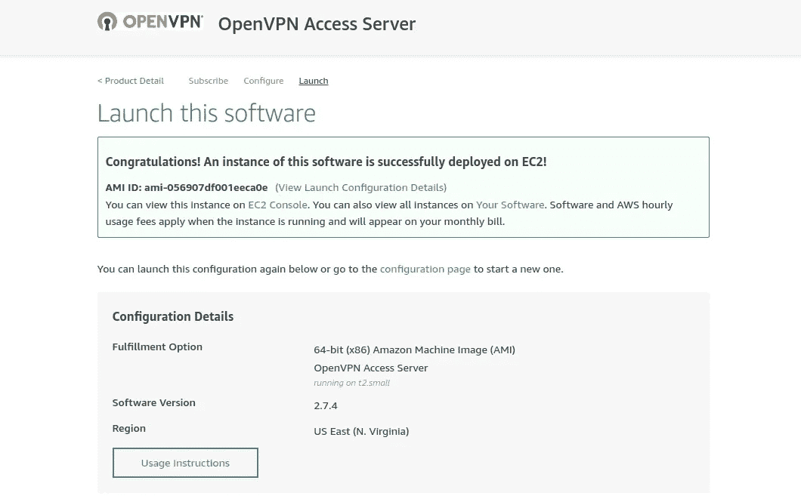

很棒的东西！现在我们的实例已经存在，让我们确保可以访问它并启动我们的 VPN。要获得下一步的快捷方式，请单击成功消息中的“EC2 控制台”链接。

# 关联弹性 IP

亚马逊的[弹性 IP 地址](https://docs.aws.amazon.com/AWSEC2/latest/UserGuide/elastic-ip-addresses-eip.html)为我们提供了一个由我们的账户控制的公共 IPv4 地址，不像公共 IP 地址绑定到我们的 EC2 实例。创建一个并将其与我们的 VPN 实例相关联被认为是最佳实践。如果我们的实例出现任何问题，或者如果我们希望将来为我们的 VPN 使用一个新的实例，弹性 IP 可以从当前实例中分离出来，并与我们的新实例重新关联。这使得我们的联网客户可以无缝过渡。把弹性 IP 想象成我们注册的网络域名——我们可以把它指向我们选择的任何地方。

我们可以在 [Amazon EC2 控制台](https://console.aws.amazon.com/ec2/)上创建一个新的弹性 IP 地址。如果您点击了上面成功消息中的链接，我们已经在那里了。

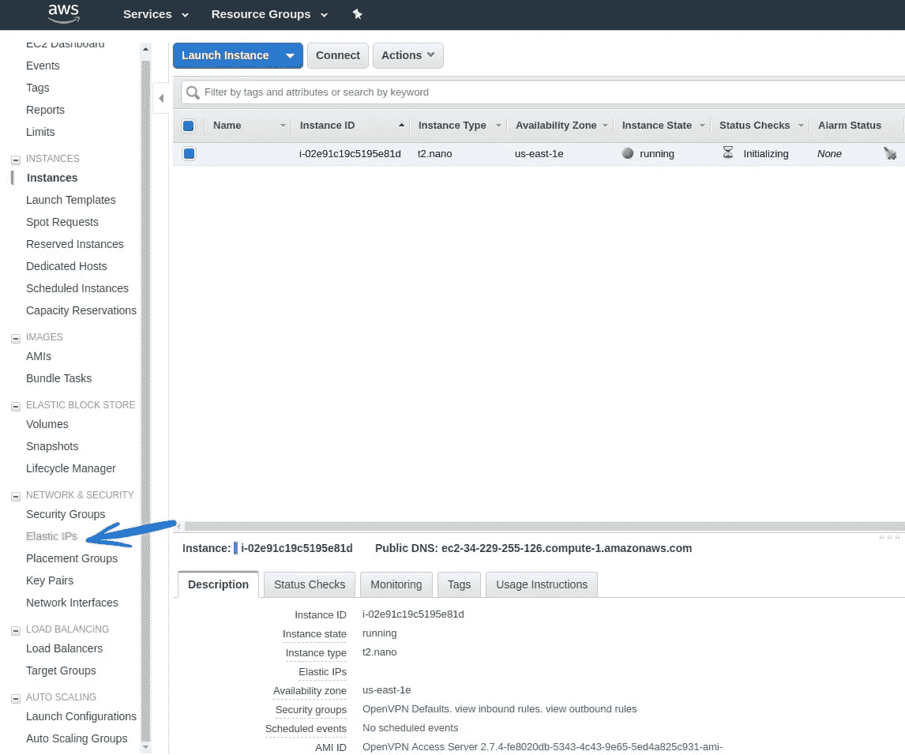

如果您有多个实例，请记下我们刚刚启动的那个实例的实例 ID。

在左侧边栏的“网络与安全”下，选择“弹性 IPs”然后点击蓝色的“分配新地址”按钮。

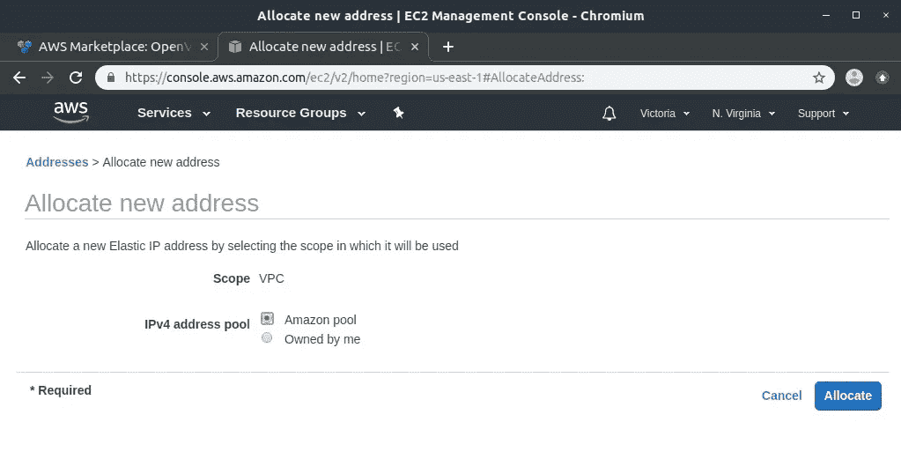

选取“Amazon Pool”，然后点按“分配”

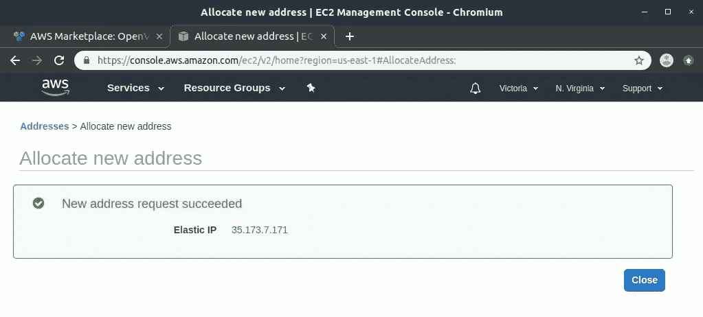

成功！我们可以点击“关闭”返回到弹性 IP 控制台。

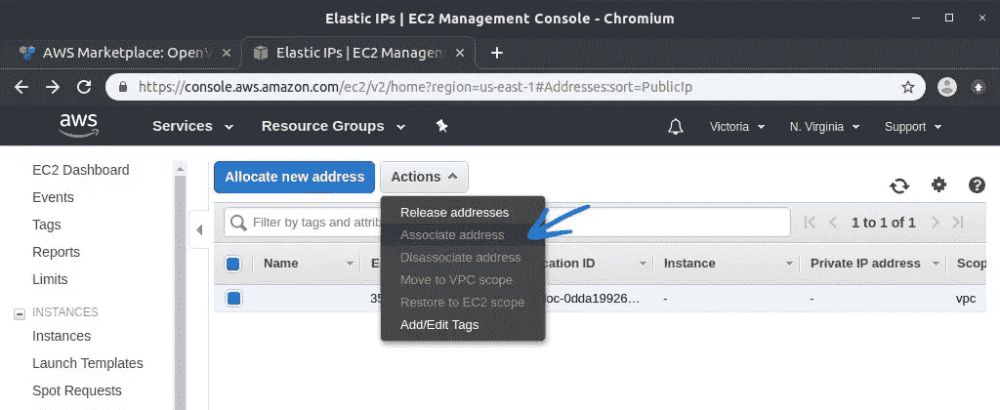

现在我们有了一个弹性 IP，让我们将它与我们的实例关联起来。选择 IP 地址，然后点按“操作”，并选取“关联地址”

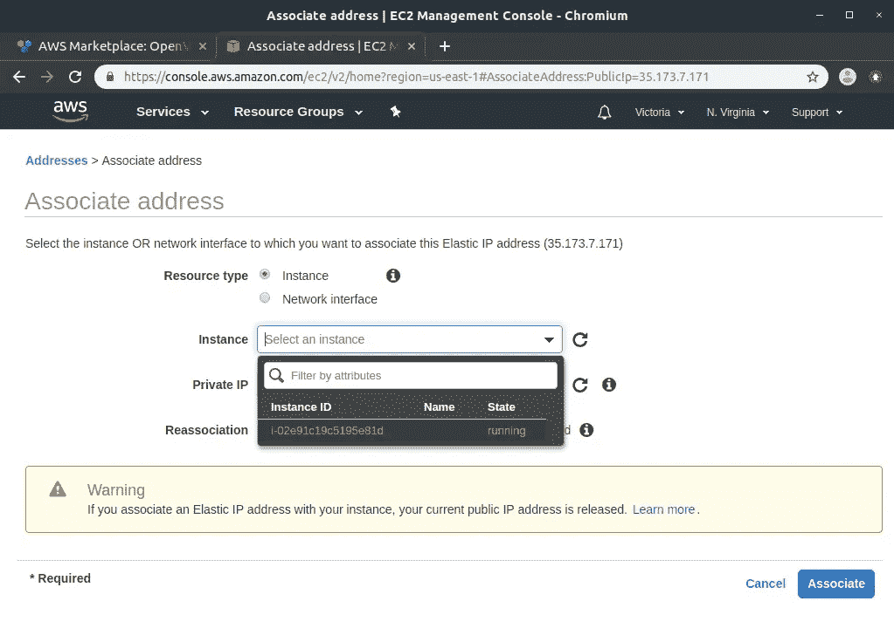

确保选择了“实例”选项，然后单击下拉菜单。我们应该在那里看到我们的 EC2 实例 ID。选择它，然后点按“关联”

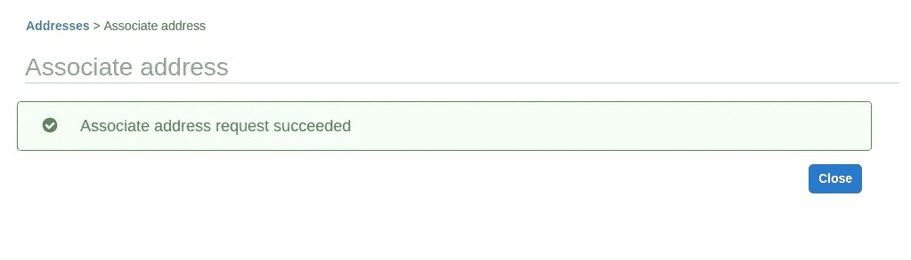

成功！现在我们将能够访问我们的 VPN 实例，让我们启动并运行我们的 VPN 服务。

# 在 EC2 服务器上初始化 OpenVPN

首先，我们需要通过终端连接到 EC2 实例。我们将使用我们之前创建的私钥。

打开一个新的终端窗口，导航到包含私钥`.pem`文件的目录。我们需要设置它的权限:

```
sudo chmod 400 <name>.pem
```

确保用您的密钥名称替换`<name>`。

这会将文件权限设置为`-r--------`，这样它只能被用户(您)读取。这可能有助于保护私钥免受其他用户的读写操作，但更确切地说，这将防止 AWS 在我们尝试连接到实例时抛出错误。

我们现在可以这样做，运行:

```
ssh -i <name>.pem openvpnas@<elastic ip>
```

用户`openvpnas`由 OpenVPN 访问服务器设置，允许我们连接到我们的实例。用我们刚刚关联的弹性 IP 地址替换`<elastic ip>`。

我们可能会收到一条消息，说我们的主机的真实性无法建立。只要我们正确地输入了弹性 IP，我们就可以对提示回答“是”。

在初始连接到 OpenVPN 实例时，应该会自动运行一个名为“初始配置工具”的设置向导。(如果由于某种原因它不工作，或者你慌乱地按了一个按钮，我们可以用`sudo ovpn-init –ec2`重启它。)我们将被要求接受协议，然后向导将帮助我们完成 VPN 服务器的一些配置设置。

您可能通常会接受默认设置，但是，有几个问题您可能想明智地回答。它们是:

**客户端流量是否应该默认通过 VPN 路由？**

为什么您可能想回答“是”:对该选项回答“是”可以防止[分割隧道](https://en.wikipedia.org/wiki/Split_tunneling)，这是一种当您连接到 WiFi 网络时可能绕过 VPN 的情况。

**客户端 DNS 流量是否应该默认通过 VPN 路由？**

为什么您可能想回答“是”:此设置可以通过指定 DNS 请求应该由 VPN 处理来帮助防止 DNS 泄漏。如果您对上一个问题回答“是”，则无论如何都会启用它。

当被要求输入我们的“OpenVPN-AS 许可证密钥”时，我们可以将其留空，以便在最多两个客户端上使用 VPN。如果您已经购买了密钥，请在此输入。

一旦配置向导运行完毕，我们应该会看到消息“初始配置完成！”在我们继续之前，我们应该为服务器的管理帐户设置一个密码。为此，请运行:

```
sudo passwd openvpn
```

然后输入您选择的密码两次。现在我们准备好连接了！

要关闭 ssh 连接，请键入`exit`。

# 将客户端连接到 VPN

要将我们的客户机(在本例中是我们的笔记本电脑)连接到 VPN 并开始获益，我们需要做两件事；首先，获取我们的连接配置文件；其次，安装`openvpn`守护进程。

## 获取您的`.ovpn`连接档案

我们需要为自己下载一个连接配置文件；这就像一个个人配置文件，其中包含 VPN 服务器允许我们连接所需的信息，包括密钥。我们可以使用刚刚在弹性 IP 地址 943 端口设置的密码登录。这看起来像:

```
https://<elastic ip>:943/
```

`https`部分很重要；没有它，实例将不会发送任何数据。

当我们转到该 URL 时，我们可能会看到一个页面，警告我们该站点的证书颁发者未知或无效。只要我们正确地输入了我们的弹性 IP，就可以安全地继续了。如果您使用的是 Firefox，请点按“高级”，然后“接受风险并继续”在 Chrome 中，点击“高级”，然后“继续…”弹性 IP。

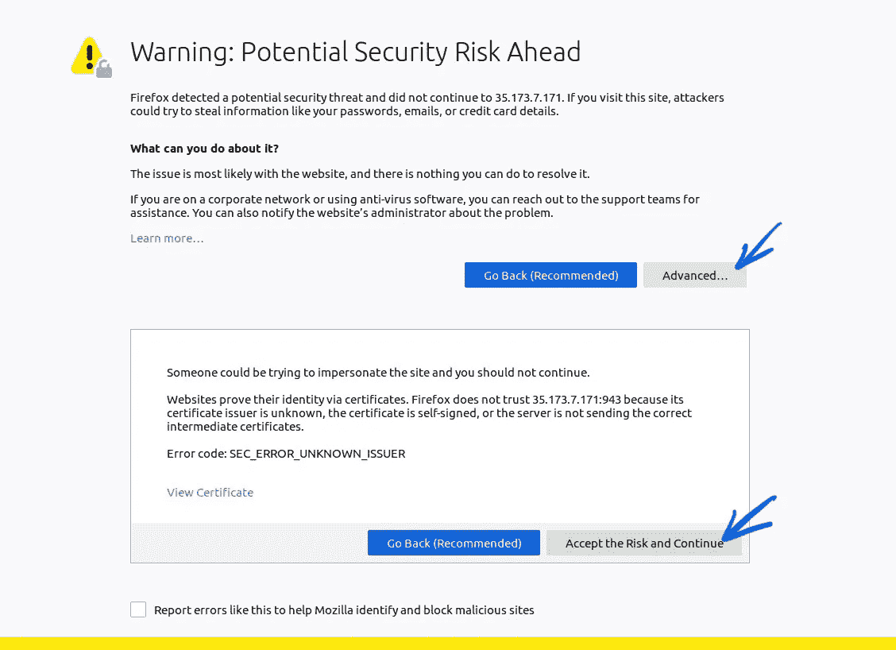

使用用户名`openvpn`和我们刚刚设置的密码登录。现在，我们将看到一个链接，用于下载我们的用户锁定连接配置文件:

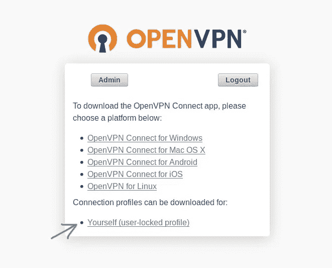

当我们点击链接时，一个名为`client.ovpn`的文件将被下载。

## 2.在你的 Ubuntu 18.04 客户端上安装并启动`openvpn`

这个`openvpn`守护进程将允许我们的客户端连接到我们的 VPN 服务器。它可以通过默认的 Ubuntu 库安装。运行:

```
sudo apt install openvpn
```

为了让 OpenVPN 在我们启动计算机时自动启动，我们需要重命名并移动连接配置文件。我建议使用[符号链接](https://en.wikipedia.org/wiki/Symbolic_link)来完成这项工作，因为它使我们的原始文件更容易编辑，并允许我们将它存储在我们选择的任何目录中。我们可以通过在文件所在的目录中运行以下命令来创建符号链接:

```
sudo ln -s client.ovpn /etc/openvpn/<name>.conf
```

这将在适当的文件夹中为连接概要文件创建一个符号链接，以便`systemd`找到它。`<name>`可以是任何东西。当 Linux 内核启动后，`systemd`用于初始化用户设置运行的服务和守护进程；其中之一就是 OpenVPN。用扩展名`.conf`重命名文件会让`openvpn`守护进程知道使用它作为我们的连接文件。

现在，我们可以通过运行以下命令手动启动并连接到 OpenVPN:

```
sudo openvpn --config client.ovpn
```

我们将被要求输入用户名和密码，这将是我们之前使用的相同凭证。一旦服务完成启动，我们将看到“初始化序列完成”如果我们现在访问[DNS 泄漏测试网站](https://www.dnsleaktest.com/)，我们应该会看到弹性 IP 和 EC2 服务器的位置。耶！

如果你使用的是更高版本的 Ubuntu，你可以点击其中一个“测试”按钮来检查 DNS 漏洞。如果显示的所有 ISP 都是亚马逊的，没有一个是你自己的服务提供商，那么恭喜你！没有泄漏！您可以继续下面第二部分中的[步骤 3，之后，您就完成了。](#3-set-up-openvpn-as-networkmanager-system-connection)

然而，如果你使用的是 Ubuntu 18.04 LTS 版，我们还没有完成。

# DNS 泄露看起来像什么

要查看 DNS 泄漏的情况，请点击 [DNS 泄漏测试页面](https://www.dnsleaktest.com/)上的一个“测试”按钮。当我们这样做的时候，我们不仅会看到我们的 Amazon.com IP 地址，还会看到我们自己的 ISP 和位置。

我们还可以通过在终端中运行`systemd-resolve --status`来查看泄漏。我们的结果将包含不同接口下的两行，这两行都有 DNS 服务器的条目。它看起来会像这样:

```
Link 7 (tun0)
Current Scopes: DNS
LLMNR setting: yes
MulticastDNS setting: no
DNSSEC setting: no
DNSSEC supported: no
DNS Servers: 172.31.0.2
DNS Domain: ~.Link 3 (wlp4s0)
Current Scopes: none
LLMNR setting: yes
MulticastDNS setting: no
DNSSEC setting: no
DNSSEC supported: no
DNS Servers: 192.168.0.1
DNS Domain: ~.
```

Ubuntu 18.04 中的 [DNS 泄露问题源于 Ubuntu 的 DNS 解析器`systemd-resolved`，未能正确处理我们的 OpenVPN 配置。为了成为一个好的、高效的 DNS 解析器，`systemd-resolved`将并行发送 DNS 查询请求到每个有 DNS 服务器配置的接口，然后利用最快的响应。在我们的例子中，我们只想使用 VPN 的 DNS 服务器。不好意思，`systemd-resolved`。你尽力了。](https://unix.stackexchange.com/questions/434916/how-to-fix-openvpn-dns-leak)

# 如何修复 Ubuntu 18.04 上的 OpenVPN DNS 漏洞

幸运的是，我们可以实现一个修复。我们需要从 Ubuntu 库安装一些助手，更新我们的配置文件，然后使用 NetworkManager 设置 OpenVPN。我们开始吧！

## 安装一些助手

为了正确整合 OpenVPN 和`systemd-resolved`，我们需要更多的帮助。在终端中，运行:

```
sudo apt install -y openvpn-systemd-resolved network-manager-openvpn network-manager-openvpn-gnome
```

这将安装一个助手脚本，它集成了 OpenVPN 和`systemd-resolved`，一个用于 OpenVPN 的网络管理器插件，以及它的用于 [GNOME](https://www.gnome.org/) 桌面环境的 GUI 副本。

## 将 DNS 实现添加到您的连接配置文件

我们需要编辑之前下载的连接配置文件。因为它是象征性链接的，所以我们可以通过改变`.ovpn`文件来实现，不管它存储在哪里。运行`vim <name>.ovpn`在 [Vim](https://www.vim.org/) 中打开它，然后在底部添加以下几行。评论中的解释:

```
# Allow OpenVPN to call user-defined scripts
script-security 2# Tell systemd-resolved to send all DNS queries over the VPN
dhcp-option DOMAIN-ROUTE .# Use the update-systemd-resolved script when TUN/TAP device is opened, and also run the script on restarts and before the TUN/TAP device is closed
up /etc/openvpn/update-systemd-resolved
up-restart
down /etc/openvpn/update-systemd-resolved
down-pre
```

有关 OpenVPN 选项的完整列表，请参见 [OpenVPN 脚本和环境变量](https://openvpn.net/community-resources/reference-manual-for-openvpn-2-1/)。您可能也喜欢[更多关于 TUN/TAP](https://en.wikipedia.org/wiki/TUN/TAP) 的信息。

## 将 OpenVPN 设置为 NetworkManager 系统连接

我们将使用 GUI 通过 NetworkManager 设置我们的 VPN。打开网络设置，应该是这样的:

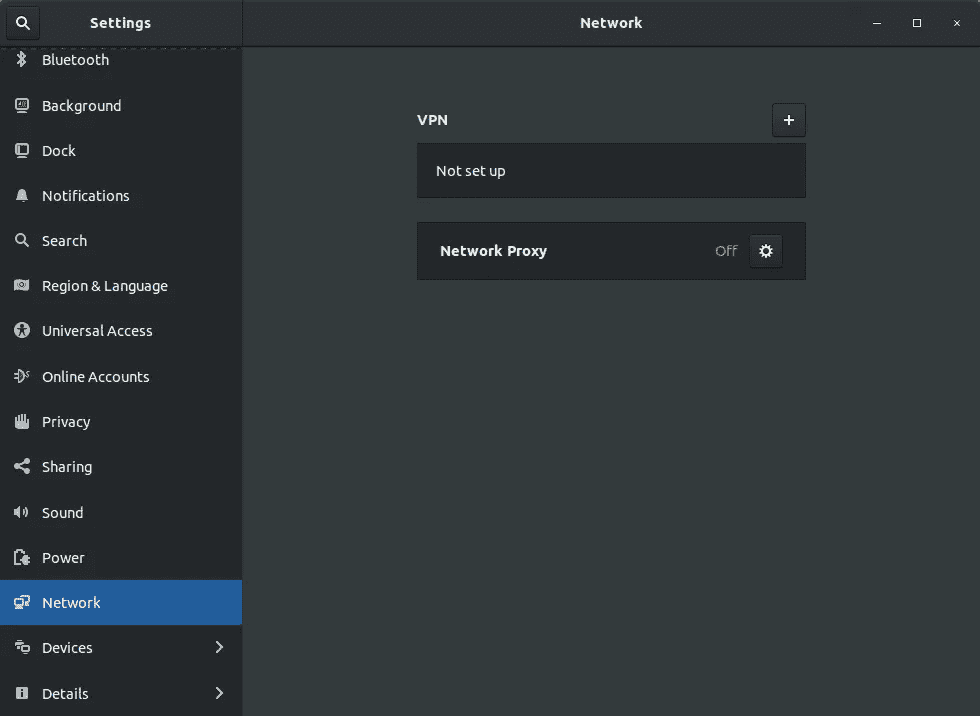

然后单击“+”按钮。在弹出的窗口上——与直觉相反——选择“从文件导入…”而不是 OpenVPN 选项。

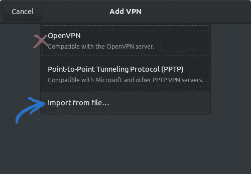

导航到并选择您的`.ovpn`文件。我们现在应该看到类似这样的内容:

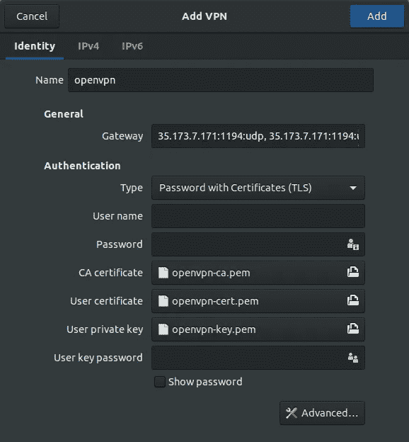

添加您的服务器用户名和密码(`openvpn`和我们在第一部分的[第三步](#6222)中设置的密码)，以及您的用户密钥密码(同样的密码，如果您遵循了本教程)，然后单击“添加”按钮。

## 编辑您的 OpenVPN 网络管理器配置

快到了！既然我们已经将 VPN 添加为网络管理器连接，我们需要对它进行快速更改。我们可以通过运行以下命令来查看网络管理器连接列表:

```
ls -la /etc/NetworkManager/system-connections/*
```

我们的 VPN 可能叫做`openvpn`，所以让我们通过运行以下命令来编辑它:

```
sudo vim /etc/NetworkManager/system-connections/openvpn
```

在`[ipv4]`下面，我们需要添加一行`dns-priority=-42`。它最终应该是这样的:

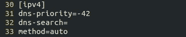

设置负数是一种解决方法，它会优先考虑此 DNS 服务器。实际数字是任意的(`-1`应该也可以)但是我喜欢 42。

# 重启，连接，盈利！

在终端中，运行:

```
sudo service network-manager restart
```

然后在网络设置中，单击打开 VPN 的神奇按钮:

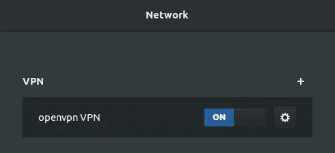

最后，访问[DNS 泄漏测试网站](https://www.dnsleaktest.com/)并点击“扩展测试”以验证修复。如果一切正常，我们现在应该看到一个只包含我们的 VPN ISP 的列表。

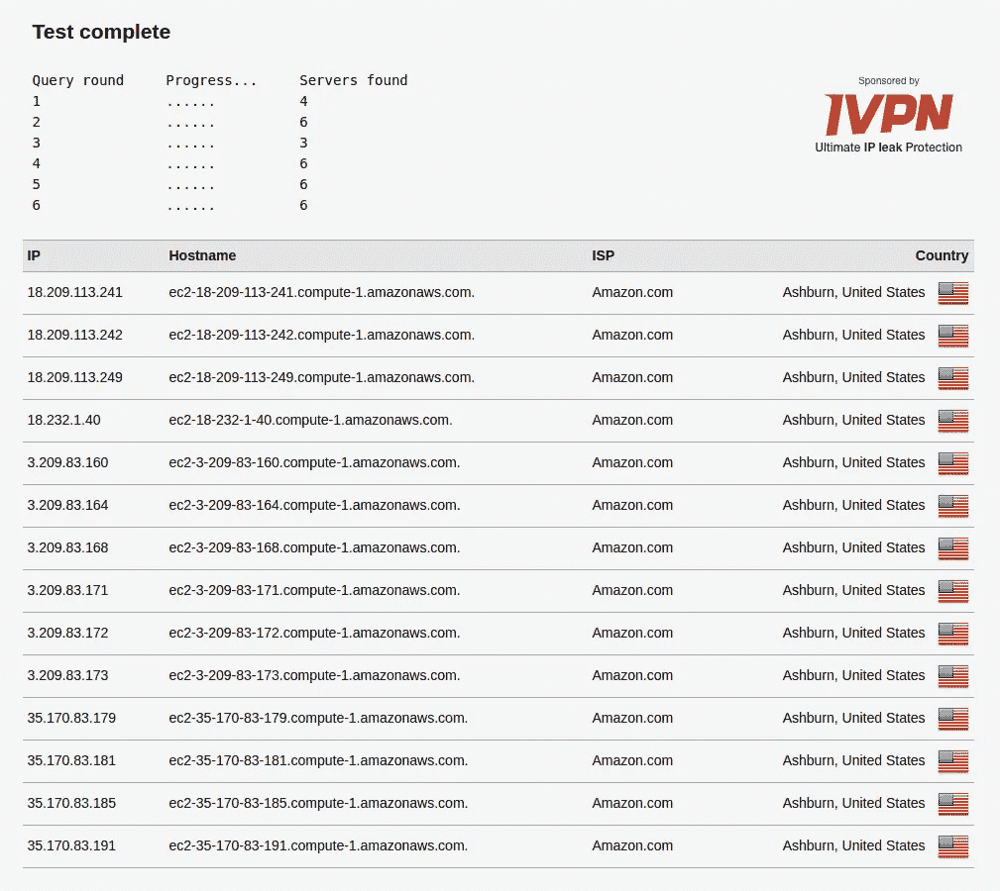

我们完事了。恭喜你拥有了自己的 VPN 服务器，并且用 OpenVPN 阻止了 DNS 泄露。享受(相对)隐私的网上冲浪。现在你在当地咖啡店唯一担心的是谁会坐在你后面看你冲浪。