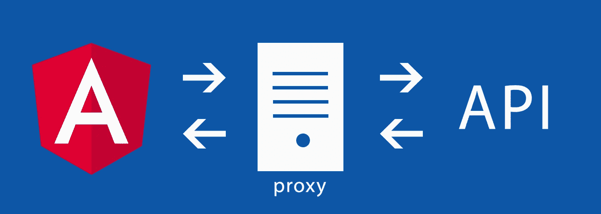

# 为 Angular CLI 应用程序的 API 调用设置代理

> 原文：<https://betterprogramming.pub/setup-a-proxy-for-api-calls-for-your-angular-cli-app-6566c02a8c4d>

## 在 Angular CLI 和 webpack-dev-server 中配置服务器端代理

当我们开发一个 Angular app，需要一个后端来持久化数据，这个后端往往是在`localhost`的另一个端口上服务的。比如前端 Angular app 的 URL 是[*http://localhost:4200*，](http://localhost:4200,)而后端服务器的 URL 是[*http://localhost:3000*。](http://localhost:3000.)在这种情况下，如果我们从前端应用程序向后端服务器发出 HTTP 请求，这是一个跨域请求，我们需要做一些额外的工作来实现它。有两种解决方案。我们可以使用 CORS 或者服务器端代理。在这篇文章中，我将讨论服务器端代理方法。

Angular CLI 使用`webpack-dev-server`作为开发服务器。`webpack-dev-server`利用了强大的`http-proxy-middleware`包，当我们有单独的 API 后端开发服务器时，它允许我们在同一个域上发送 API 请求。

例如，我们的 API 后端有以下 API 端点:

`GET [*http://localhost:3000/api/books*](http://localhost:3000/api/books)`

使用带有`webpack-dev-server`的服务器端代理后，如果我们的 Angular 应用程序在端口 4200 上提供服务，我们可以向下面的 URL 发出 HTTP 请求以到达相同的 API 端点:

`GET [*http://localhost:4200/api/books*](http://localhost:4200/api/books)`

# 在尚未退出的 Angular CLI 应用程序上启用服务器端代理

## 第一步:

在我们项目的`package.json` **旁边创建一个名为`proxy.conf.json` 的文件。**

## 第二步:

向新创建的`proxy.conf.json` 文件添加以下内容:

## 第三步:

将`package.json` 文件的启动脚本编辑为:

步骤 4:重新启动`npm start` 流程，使我们的更改生效。

# 在已退出的 Angular CLI 应用程序上启用服务器端代理

第一步:打开`webpack.config.js`文件，定位`devServer`部分；

第二步:用以下内容替换`devServer`部分:

本文描述了 Angular CLI 和`webpack-dev-server`中服务器端代理的基本配置。如果你想了解更多，请访问他们的官方网站:

**Angular CLI:**[https://github . com/Angular/Angular-CLI/blob/master/docs/documentation/stories/proxy . MD](https://github.com/angular/angular-cli/blob/master/docs/documentation/stories/proxy.md)

**web pack dev-server:***[*https://web pack . js . org/configuration/dev-server/# dev server-proxy*](https://webpack.js.org/configuration/dev-server/#devserver-proxy)*

*在我的下一篇[文章](https://medium.com/@spencerfeng/setup-reverse-proxy-for-api-calls-for-your-angular-application-with-node-js-62321f0defb5)中，我将讨论如何在 Nginx 服务器上为产品 Angular 应用程序的 API 调用设置反向代理。*

*如果你觉得这篇文章有帮助，请访问[我的 YouTube 频道](https://www.youtube.com/channel/UCoQ7C3JajfBOIjp7yWDj8Yg)，在那里你也可以找到一些有用的编程技巧。*