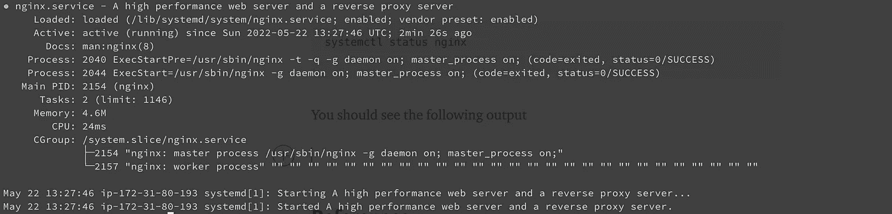
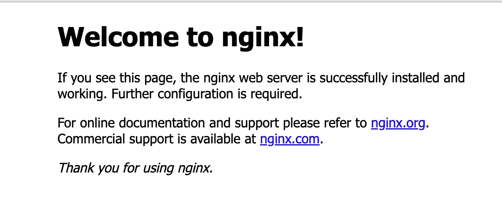

# 在 EC2 上为 NodeJS 服务器设置 Nginx

> 原文：<https://betterprogramming.pub/setup-nginx-for-your-nodejs-server-on-ec2-ae46a3d0cb1b>

## 公开我们的 NodeJS 服务器来接收 HTTP 请求


图片来自 Unsplash 由 [phil](https://unsplash.com/@philberndt)

当我在大学和 NodeJS 一起工作时，我在黑客马拉松、大学项目等活动中经常遇到的一个问题是在 web 上托管我的项目。我让一切都在本地工作，但是在考官的设备上演示的感觉给了我完全不同的感觉。

因此，在本文中，我们将讨论如何使用 nginx 反向代理，公开 NodeJS 服务器，以稳定可靠的方式通过互联网接收 HTTP 请求。

作为本文的先决条件，您应该有一个运行在 EC2 实例上的 NodeJS 服务器。要设置这一点，你可以按照我以前的[系列文章](/deploying-a-basic-express-api-on-amazon-ec2-eea0b54a825)。

# 为什么选择 Nginx？

我们将使用 Nginx 作为反向代理，从外界抽象出我们的后端配置。发送到我们服务器的各种请求在到达服务器之前都必须通过这个反向代理。

拥有反向代理有几个好处，其中一些是

*   **安全性:**反向代理在[为组织构建零信任架构](https://www.computerweekly.com/opinion/Security-Think-Tank-Practical-steps-to-achieve-zero-trust)中扮演着关键角色——保护敏感的业务数据和系统。通过反向代理，您可以将特定的端点列入白名单或黑名单，控制资源限制，只允许特定的 HTTP 方法，为所有请求添加公共头，等等。
*   **可扩展性**:使用反向代理，服务器的数量可以根据流量的波动而增加或减少，使所有这些操作从客户端抽象出来。
*   **配置:**我们可以配置超时时间，在此之后服务器将显示 503 错误，用于指定服务将使用的 HTTP 协议。
*   **缓存:**提供大量静态内容(如图像和视频)的企业可以建立一个反向代理来缓存这些内容。
*   **日志记录:** Nginx 可用于记录所有传入请求的传入头、返回的状态代码等。

反向代理还有很多其他的用例，但是这超出了本文的范围。

# 安装 Nginx 的步骤

运行以下命令来安装 Nginx

```
sudo apt update
sudo apt install nginx
```

要验证安装是否成功，请键入

```
systemctl status nginx
```

您应该会看到以下输出



正如该输出所确认的，服务已经成功启动。然而，最好的测试方法是从 Nginx 实际请求一个页面。

您可以通过导航到服务器的 IP 地址来访问默认的 Nginx 登录页面，以确认软件运行正常。

因此，您将看到以下页面，导航到

```
[http://<YOUR_SERVER_IP>/](http://44.201.157.45/)
```



# 配置到 express 服务器的流量重定向

当我们在浏览器中键入我们的 IP 时，我们看到 Nginx 默认页面，但是当我们查询服务器的 IP 时，我们希望访问我们的 express API。

为此，我们必须转移到下面的目录，所有 Nginx 配置都在这里。

```
cd /etc/nginx
```

在这个目录中有一个名为`nginx.conf`的文件，整个 Nginx 配置都在这个文件中。

在这个文件的`http`块中，有一行

```
include /etc/nginx/conf.d/*.conf;
```

这一行的意思是，在`/etc/nginx/conf.d/`目录中，包含任何以`.conf`为扩展名的文件中写入的任何配置。所以这个目录是我们写配置的地方。

创建一个名为`configuration.conf`的文件(文件可以以`.conf`结尾)。

并将以下服务器块添加到文件中

```
server {server_name <SERVER_IP>;location / {
        proxy_pass [http://127.0.0.1:3000](http://127.0.0.1:5000);
      }}
```

**注意:**我们提到端口为 3000 是因为在之前的[文章](/deploying-a-basic-express-api-on-amazon-ec2-eea0b54a825)中，我们配置了一个运行在端口 3000 上的 NodeJS 服务器，所以请确保将该端口作为运行服务器的 post。

现在，为了测试我们的 Nginx 配置在语法上是否正确，我们运行以下命令。

```
sudo nginx -t
```

这将为我们提供以下输出。


现在，由于我们的配置是有效的，我们可以重启 Nginx 反向代理来查看我们的配置。

```
sudo service nginx restart
```

在这之后，如果你进入浏览器并输入你的服务器 IP，你会看到下面的输出。


**注意:**如果您继续阅读上一篇文章，您将得到这个输出。如果您运行了其他 Express 服务器，您将会看到其默认路由的返回值。

# **结论**

通过阅读本文，您的 NodeJS 服务器将被暴露给互联网，您将能够通过它接收 HTTP 请求。但是这仍然不是设置删除服务器的理想方式，因为 HTTP 不是一个安全的协议。

因此，在本系列的下一篇文章中，我们将看到如何在 ec2 实例上设置 Certbot，并为服务器的传入请求启用 HTTPS。

# 参考

[](https://www.loadbalancer.org/blog/why-should-businesses-use-reverse-proxy/#:~:text=Reverse%20proxies%20help%20increase%20performance,%2C%20caching%2C%20and%20intelligent%20compression) [## 为什么要使用反向代理？

### 使用反向代理的原因是什么？它与负载均衡器有何不同？

www.loadbalancer.org](https://www.loadbalancer.org/blog/why-should-businesses-use-reverse-proxy/#:~:text=Reverse%20proxies%20help%20increase%20performance,%2C%20caching%2C%20and%20intelligent%20compression) [](https://www.digitalocean.com/community/tutorials/how-to-install-nginx-on-ubuntu-20-04) [## 如何在 Ubuntu 20.04 上安装 Nginx | digital ocean

### Nginx 是世界上最流行的 web 服务器之一，负责托管一些最大的和…

www.digitalocean.com](https://www.digitalocean.com/community/tutorials/how-to-install-nginx-on-ubuntu-20-04)