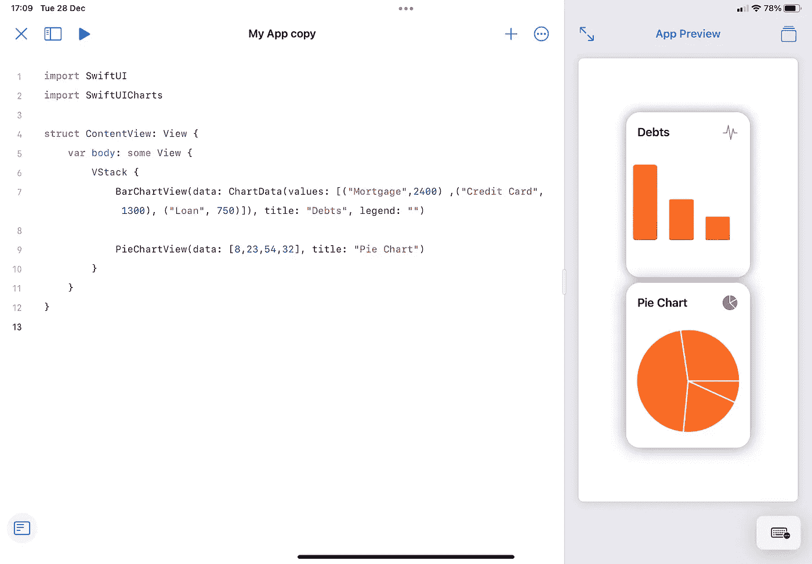
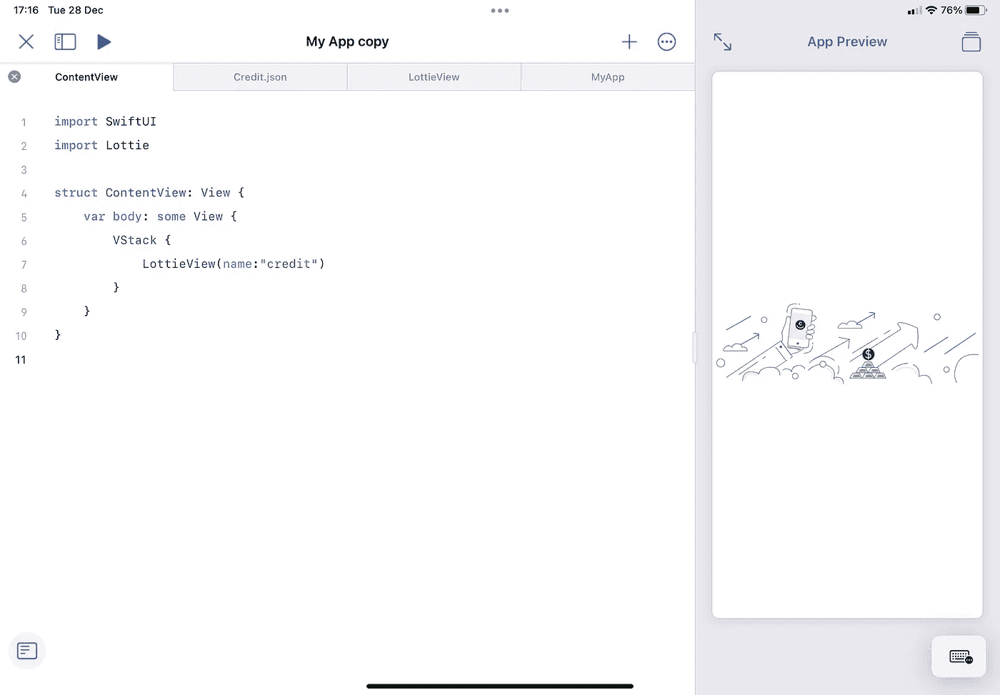
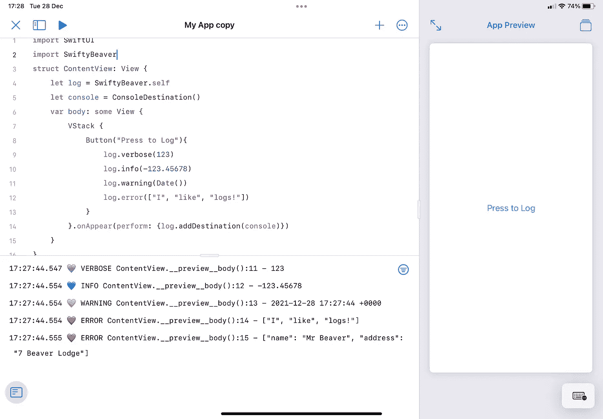
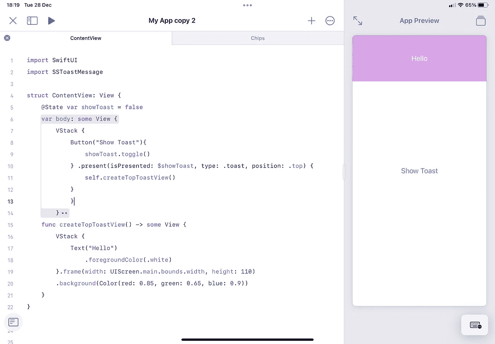
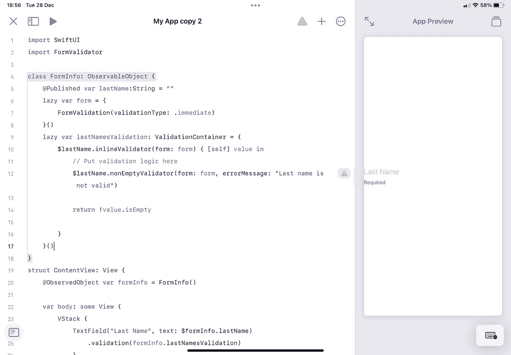

# 7 个有用的 Swift 软件包来启动您的 iOS 应用程序

> 原文：<https://betterprogramming.pub/seven-useful-swift-packages-to-kickstart-your-app-they-work-with-playgrounds-4-e4896ebaaef7>

## 他们也在 iPad 上使用 Playgrounds 4


照片由 Unsplash 上的@brandablebox 提供

一段时间以来，我一直梦想着能够在移动中编写代码，只使用我可信赖的 iPad。随着 Swift Playgrounds 4 的发布，这已经成为现实。

事实上，这不仅仅是一个现实，而是一个非常精简的工作流程。最强大的功能(在我看来)是 Playgrounds 4 中包含了 Swift 包管理器。Xcode 有数百个可用的包，但我想看看将这些包集成到 playgrounds 项目中有多容易，并与您分享对我最有益的包。

入围名单:

*   chart view——一个漂亮的图表框架和简单的方法，用很少的输入显示大量的图表
*   洛蒂动画——在你的应用程序中使用华丽动画的简单方法(对我们中的非艺术类型来说很棒——包括我自己)
*   swifty beaver——一个易于集成的日志框架，可以写入控制台和指定文件
*   swifty JSON——对于能够解析 JSON 文件很有用
*   SSToastMessage–显示 toast 通知–用于在应用程序中显示用户反馈
*   SwiftUI 表单验证器–创建带有占位符、验证和反馈通知的表单

如果你知道这些，那么这篇文章的其余部分可能不适合你。然而，如果其中至少有一个是新的，这将有希望是有价值的。所有这些都与 Swift Playgrounds 4 兼容，当我写这篇文章时，我在我的 iPad 上，利用这些 Swift 包，并使用 Playgrounds 4 截图…所有这些都带着微笑。

(注意，有时对于 swift playgrounds 4，如果您选择最新版本，这将不会添加包，因此如果“添加到项目”不可用，您可能需要选择更早的版本)

# 图表视图

ChartView 提供了一种简单的方法，只需很少的输入就可以在应用程序中显示漂亮的图表。这些图表是交互式的，可以在一个图块中，也可以不在。使创建仪表板视图变得简单。

套餐网址:[https://github.com/AppPear/ChartView](https://github.com/AppPear/ChartView)

上面的 URL 是软件包的 URL，但也有一些关于如何使用图表视图库的有用说明。

要使用它:

```
import SwiftUICharts
```

您可以只用一行代码来声明一个图表，该行代码由对图表类型的调用、后跟数据点和标签组成。



# 洛蒂动画

我以前介绍过 Lottie，但这值得再次提及，因为对于任何人来说，毫不费力地获得一个带有插图和动画的专业应用程序都非常容易。

套餐网址:【https://github.com/airbnb/lottie-ios.git 

要使用它:

```
import Lottie
```

正如在另一篇文章中提到的，添加一个 LottieView 助手文件来使这变得更加容易是值得的。将大约 30 行代码复制到“lotti view”swift 文件中。跟随教程[这里](https://medium.com/swlh/how-to-use-lottie-animations-in-swiftui-caaf19944d96)。



它的美妙之处在于，你可以在线浏览 Lottie 动画，并将它们直接下载到你的 iPad 上，然后使用 swift playgrounds 4，你可以将该文件添加为资产，以便于使用。

# SwiftyBeaver

开发应用程序时，能够追踪应用程序完成的步骤是非常重要的。

开始时，您可以简单地选择打印到控制台，在大多数情况下，这做得很好。然而，有时我们想要了解哪个代码被首先执行，我们想要记录所有的事情并且能够按照消息的类型排序。

这就是在你的应用程序中安装一个合适的日志程序的好处。为此使用框架的好处是，您仍然可以将消息打印到控制台，但是您也可以选择将它们编写为文本文件，或者放在多个位置。当需要在开发和发布之间进行转换时，我们不必重写所有的东西。

套餐网址:[https://github.com/SwiftyBeaver/SwiftyBeaver.git](https://github.com/SwiftyBeaver/SwiftyBeaver.git)



要使用它:

```
import SwiftyBeaver
```

创建一个日志实例，然后声明一个目标并将目标添加到日志实例中。

在上面的例子中，我已经登录到控制台，因为我在我的 iPad 上，但是您可以声明一个文件作为目的地，或者一个云目的地(或者同时声明所有这些！).

# SwiftyJSON

这个包使得将 JSON 文件解析成 Swift 更加容易。如果您的应用程序从互联网上获取 JSON 数据，那么您的应用程序将需要读取并转换这些数据。

套餐网址:[https://github.com/SwiftyJSON/SwiftyJSON.git](https://github.com/SwiftyJSON/SwiftyJSON.git)

要使用它:

```
import SwiftyJSON
```

以 JSON 数据的形式读入文件。在 Swift 中声明一个 struct，让它知道如何处理数据，然后解码。我还没有截图，因为我还需要写一个小的 JSON 例子，但是我会及时更新。

# SSToastMessage

一个好的用户体验就是给用户关于他们所做的事情的反馈。它能吸引用户的注意力，让他们相信某个动作已经被执行了。这就是 toast 通知派上用场的地方。

包网址:[https://github.com/SimformSolutionsPvtLtd/SSToastMessage](https://github.com/SimformSolutionsPvtLtd/SSToastMessage)

要使用:

```
import SSToastMessage
```

声明一个将被切换以显示通知的`@State`布尔变量。

然后就像创建一个按钮(或者跟随一个函数，一个切换显示变量的调用)一样简单。在这个元素的末尾添加`.present()`调用，然后声明其中的内容。因为它仍然使用 SwiftUI，所以在其中做了大量的定制，包括动画的能力。

这一点的伟大之处在于，有人呼吁不同类型的定位。你可以很容易地将它浮动在任何东西的顶部，或者在屏幕的顶部或底部，并选择框架的大小。



# SwiftUI 表单验证程序

如果您需要为任何东西创建表单，SwiftUIFormValidator 可以作为一种非常快速的方式来创建字段并输入验证和用户反馈。对于密码或意外字符等事情的规则非常简单，并允许您专注于实际编写应用程序，而不是所有这些细微差别。

套餐网址:[https://github.com/ShabanKamell/SwiftUIFormValidator.git](https://github.com/ShabanKamell/SwiftUIFormValidator.git)



# 摘要

这些只是与 Swift Playgrounds 4 配合良好的几个包，它们真正有助于启动开发，以便您可以专注于应用的实际设计。

如果您知道其他适用于 Swift Playgrounds 4 的 Swift 软件包，或者任何您离不开的软件包，请告诉我。

感谢您花时间阅读，希望这能让您受益。