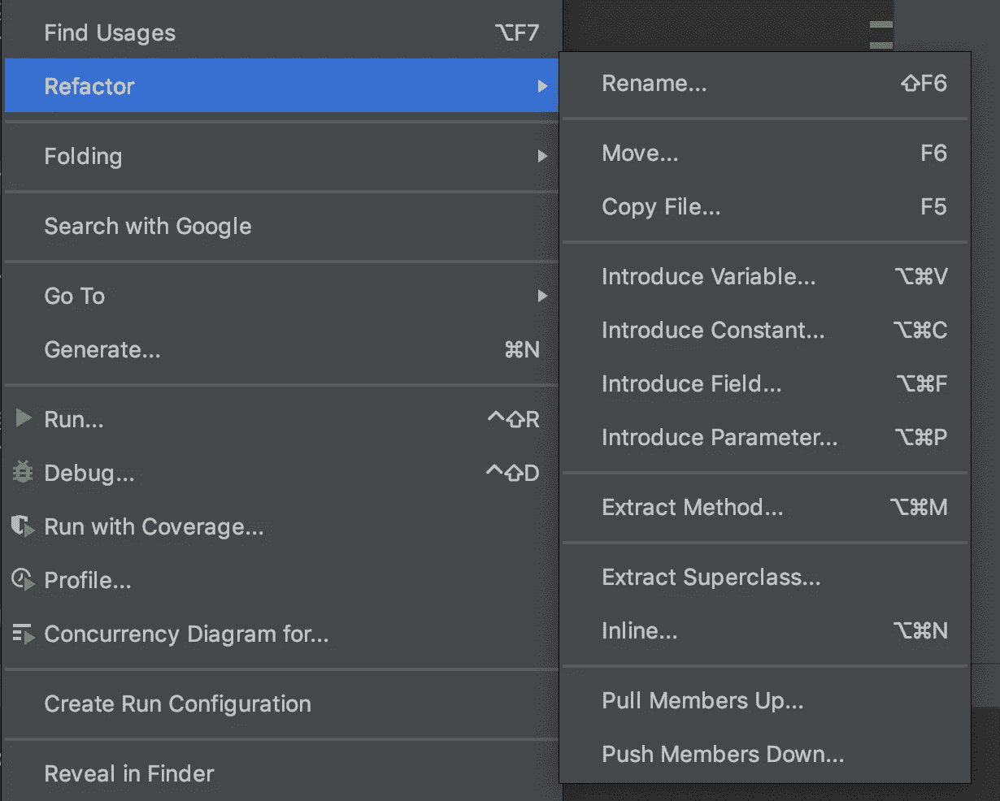
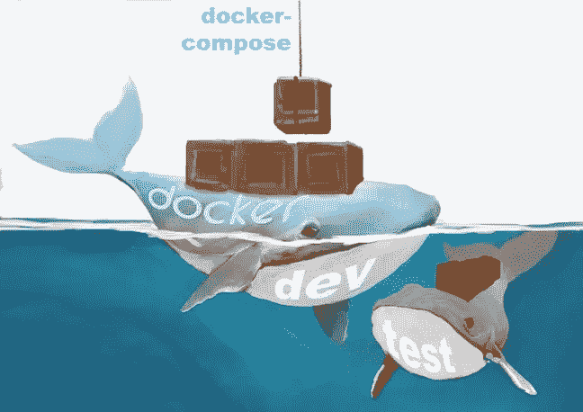

# Python 开发者沙盒的 18 种编码工具

> 原文：<https://betterprogramming.pub/seventeen-coding-tools-for-your-python-developer-sandbox-35d033c3075a>

## 编写 Pythonic 代码

[瑞安姚](https://unsplash.com/@ryanqyao?utm_source=medium&utm_medium=referral)在 [Unsplash](https://unsplash.com?utm_source=medium&utm_medium=referral) 上拍照

我们在本地机器环境中完成了大部分 Python 软件开发:软件开发人员的沙箱。我讨论了开发和测试所采用的工具，这些工具用于代码的可读性、测试、概要分析、日志记录、质量、安全性和版本控制，然后才在开发、测试和登台服务器上进行共享。

# 介绍

在 Python 开发生命周期的每个阶段，我们都在不断评估软件工具。

我尽量避免使用术语 *DevOps* 和最新的营销术语 *DataOps* 、 *GitOps* 、 *CloudOps* 和 *MLOps* 。

# 计算机编程语言

在过去的七年里，我们主要(90%)使用 Python，因为:

*   几乎所有新的机器学习模型，云，GPU 和许多其他平台都可以作为 Python 包使用。
*   自由代码和包的种类和数量是我们见过的最大的。
*   原生 Python 比 C 慢 20 多倍，但是几乎所有的 Python 包都接近 C 的速度，因为它们是 CPython 上的瘦 API，或者使用一些其他的性能增强技术。

我们认为 Python 作为机器学习的首选最终会下降，只是不会在未来几年内。

Python 的运行速度似乎招致了大多数批评。如果找到了编译 Python 的方法，很多批评就会消失。

如果 Python 4.x 或 Python 后处理工具能够实现编译和语义级线程并发，那么在可预见的未来，它将首先作为机器学习语言。

在本文的其余部分，我只讨论 Python 相关的工具，比如 ide。

# 集成开发环境(IDE)

对于 Python IDE，我们使用这四个好的选择。我们结合使用了:

*   [Jupyter 笔记本或 JupyterLab](https://jupyter.org/index.html) 和
*   [PyCharm](https://www.jetbrains.com/pycharm/) 或 [VS 代码](https://code.visualstudio.com/)

## 1.Jupyter 笔记本或 2。JupyterLab

Jupyter Notebook 或 JupyterLab 使您能够嵌入文本、嵌入代码和交互式运行代码。它们基于实验笔记本。

> “Jupyter 项目旨在开发跨数十种编程语言的开源软件、开放标准和交互式计算服务。—Jupyter project Jupyter project 旨在开发跨数十种编程语言的开源软件、开放标准和交互式计算服务。”Jupyter 项目

 [## 将 Jupyter 笔记本扩展添加到 Docker 映像

### 我们的 Jupyter Python 和 R 用户的 Docker 映像要求他们在每隔…之后设置他们的 Nbextensions 首选项

towardsdatascience.com](https://towardsdatascience.com/adding-jupyter-notebook-extensions-to-a-docker-image-851bc2601ca3) 

## 3.PyCharm 还是 4。VS 代码

PyCharm 和 VS Code 是 Python 最流行的 ide(交互式开发环境)。

我们使用 PyCharm(或 VS 代码)来开发、记录、测试和调试。两者都集成了内联文档格式、版本控制(Git 或 GitHub)、测试包、覆盖率、linters、类型提示检查器和代码格式。

 [## PyCharm:创建项目和设置项目行为的动画指南

### 我是一个视觉学习者。如果你用视觉动画演示给我看，我学得很快，记得也更久…

dr-bruce-cottman.medium.com](https://dr-bruce-cottman.medium.com/pycharm-an-animated-guide-to-creating-projects-and-setting-their-behavior-696d69dbbb6) 

# ***代码格式化***

## ***5。黑胡椒-8***

[black](https://pypi.org/project/black/) 是一个基于通用 PEP-8 风格指南的代码格式化工具。此外， [pycodestyle](https://pypi.org/project/pycodestyle/) 或 [Flake8](https://flake8.pycqa.org/en/latest/) 非常适合验证是否符合 PEP-8 指南。

我们使用 black 来格式化沙盒中的所有代码文件。

# 跟踪项目的复杂性

在开始重构之前，测量代码的复杂性。

我们使用的指标是:

*   通信线路（LinesofCommunication）
*   圈复杂度——衡量项目中有多少独立的代码路径
*   Halstead 操作数—操作数是变量的值和名称
*   可维护性指数——可维护性指数可以用来衡量应用程序的当前可维护性，并查看您在重构应用程序时是否取得了进展。该等级认为任何低于 25 的都很难维护，任何高于 75 的都很容易维护。可维护性指数也称为 MI。

## 6.狡猾的

[Wily](https://github.com/tonybaloney/wily) 是一个用于报告代码复杂性度量的开源工具。这些报告使我们能够跟踪我们的代码复杂性度量在重构过程中的表现。

## 重构

以下资源详细介绍了复杂性指标。此外，它还很好地概述了反模式方法中的一些重构实践。我建议在开始您的重构项目之前，阅读“为了简单而重构 Python 应用程序”:

 [## 为简单性重构 Python 应用程序——真正的 Python

### 你想要更简单的 Python 代码吗？你总是带着最好的意图、干净的代码库和漂亮的…

realpython.com](https://realpython.com/python-refactoring/#using-wily-to-capture-and-track-your-projects-complexity) 

注意:PyCharm 和 VS 代码支持许多重构操作。

*PyCharm eleven 重构选项*

# ***测试***

## 7.pytest

在我们的职业生涯中，我们使用过许多不同的框架。我们决定用 [pytest](https://docs.pytest.org/en/stable/contents.html) 进行单元测试，主要是因为需要最少的样板文件。

## 8.Coverage.py

[Coverage.py](https://coverage.readthedocs.io/en/coverage-5.4/) 是我们用来测量 Pytest 框架覆盖的代码量的工具。

# 压型

## 9.不等边的

我们使用[不规则三角形](https://pypi.org/project/scalene/0.9.16/)代替内置的 Python 分析器。

Scalene 是一个用于 Python 的高性能 CPU 和内存分析器，它可以做一些其他 Python 分析器无法做的事情。它的运行速度比其他分析器快几个数量级，同时提供更详细的信息。

# 检查类型提示

Python 是一种动态类型语言。Python 3.5 及更高版本允许类型提示。我强调单词*提示*，因为类型提示不会影响 Python 解释器。

从 3.5 版本开始( [PEP 484](https://www.python.org/dev/peps/pep-0484/) )，Python 引入了类型提示。类型提示(注意:不是强类型检查)使得在 Python 之外对代码进行静态类型检查成为可能。

类型提示是可选的。您可以将它们放入代码中，也可以将它们从代码中删除，但不会产生任何影响。就你而言，Python 解释器会忽略类型提示。

## 10.Mypy

2012 年，Jukka Lehtosalo 发布了第一个开源类型检查器(带有对未来雄心勃勃的静态类型编译计划)。 [Mypy](http://mypy-lang.org/) 对具有符合 [PEP 484](https://www.python.org/dev/peps/pep-0484/) 的类型注释的程序进行类型检查。Mypy 经常在持续集成中使用，以防止类型错误。Mypy 加入了其他开发者工具，如 pytest、black、 [pylint](https://pypi.org/project/pylint/) 和 [Codacy](https://www.codacy.com/) 。

类型提示只是像 Mypy 这样的第三方工具可以用来指出潜在 bug 的提示。

 [## 使用 Mypy 进行类型检查——真正的 Python

### 在这个视频中，您将使用包 Mypy 探索类型检查。那么，什么是 Mypy？嗯，这是从…

realpython.com](https://realpython.com/lessons/type-checking-mypy/) 

## 11.Pytype

pytype 是一个静态类型检查器，用于检查你在代码中放置的任何类型提示。因为它来自 Google，所以它不仅仅是一个静态类型检查器。附加功能包括:

*   它会标记错误，如拼错的属性名、不正确的函数调用等。可以用 pytype 代替 pylint。
*   为了将来的编译，pytype 在 [pyi](https://google.github.io/pytype/user_guide.html#pyi-stub-files) 文件中生成类型注释。使用 [merge-pyi](https://github.com/google/pytype/tree/master/pytype/tools/merge_pyi) 工具将生成的 pyi 文件合并回 Python 源代码。

所有这些工具都可以免费下载和安装。

 [## Python 类型检查(指南)-真正的 Python

### 在本指南中，您将了解 Python 类型检查。传统上，类型是由 Python 解释器在…

realpython.com](https://realpython.com/python-type-checking/) 

# 可靠性分析

## 12.柴堆

如果代码不可靠，它怎么可能是安全的呢？可靠性是安全性的基础。

[PyRe](https://github.com/hackl/pyre#:~:text=PyRe%20(Python%20Reliability)%20is%20a,includes%20methods%20for%20summarizing%20output) 提供支持结构可靠性分析的功能:

*   结构可靠性分析中随机变量间的相关性测量
*   苹果不同的可靠性方法
*   包括几种统计分布
*   将生成的报告保存到磁盘

# 安全性

## 13.脸书火葬场的 Pysa

Pysa 使用输入数据的[污点分析](https://dzone.com/articles/what-is-taint-analysis-and-why-should-i-care#:~:text=Taint%20analysis%20identifies%20every%20source,mean%20all%20the%20way%20through.)来识别潜在的安全缺陷。

> “被污染的数据是需要小心处理的数据。Pysa 的工作原理是跟踪数据流，从它们的源头(源)到它们在一个危险位置(汇)终止的地方。— [Pyre 文档](https://pyre-check.org/docs/pysa-basics/)

Pysa 需要的不仅仅是 Python 包的普通设置，你可以在这里读到。

 [## 运行 Pysa | Pyre

### 本页将带您了解运行 Pysa 的基础知识。如果你想练习，通过使用 Pysa 的更多…

pyre-check.org](https://pyre-check.org/docs/pysa-running) 

注意:输入数据应该来自多个来源，并随着时间的推移而变化，以证明使用 Pysa 的合理性。

# 自动化代码审查工具

## 14.皮林特

我们使用 pylint 来查找本地编码节点上的错误和可疑代码。我们使用 pylint 作为 GitHub 回购的“林挺”完整项目代码。

## 15.Codacy

[Codacy](https://www.codacy.com/) 比 pylint 捕捉更多的错误和可疑代码，包括一些我们忽略的风格警告。正如 Codacy 在他们的标语中所说的:“对提交和拉取请求进行自动化的代码审查。”

# 版本控制

## 16.饭桶

我们使用 [Git](https://git-scm.com/) 进行本地文件版本控制。一旦单元测试在一台本地机器上通过，我们就将代码推送到 [GitHub](https://docs.github.com/en/free-pro-team@latest/github) 云上的 repo 中。

# 记录

## 17.洛格鲁

Python 有 logger 包。这篇博客中有一篇关于 logger 包的好文章:

 [## Python 日志:漫步源代码——真正的 Python

### 免费奖励:关于 Python 精通的 5 个想法，这是一个面向 Python 开发者的免费课程，向你展示了路线图和…

realpython.com](https://realpython.com/python-logging-source-code) 

然而，我选择使用最近发布的 [Loguru](https://github.com/Delgan/loguru) 包，因为它比 logger 更容易使用，并且 Loguru 是进程和线程安全的，而 logger 不是开箱即用的进程安全的。

你可以通过阅读了解我们如何使用 Loguru:

 [## Python 项目的日志记录和参数服务

### 日志和参数文件对于任何生产可维护服务的部署都是至关重要的。

towardsdatascience.com](https://towardsdatascience.com/pasos-offering-of-logging-and-parameter-services-for-your-python-project-c3ae2fd6869a) 

# ***虚拟环境***

## ***18。码头工人***

[Docker](https://www.docker.com/) 创建一个应用程序及其依赖项的映像，作为一个完整的独立组件，可以迁移到大多数云供应商的产品上。

[Docker Compose](https://docs.docker.com/compose/) 用于为同一个应用程序同时管理几个容器。这个工具提供了与 Docker 相同的功能，但是允许您拥有更复杂的应用程序。

*插画作者* [*雷切尔·科特曼*](http://ralvearcottman@gmail.com)

以下博客详细介绍了 Docker 图像的构建:

 [## 面向企业的 Docker 解决方案

### 这是一个关于我们公司推出 Docker 的故事。我展示我们的 Docker 和 Docker-Compose 解决方案。被警告…

medium.com](https://medium.com/swlh/a-docker-solution-for-the-enterprise-7b5d2942b43a) 

# ***总结***

我为你的 Python 开发者沙箱详细介绍了 18 个编码工具。(请记住，我将您的本地开发环境称为您的*沙箱*。)

我强烈建议每个项目都有一个沙箱。您的沙箱由您的项目语言和所有依赖于导入的包组成，这些包通过容器化或在虚拟环境中包装。

前面描述的所有 ide 都在虚拟环境中执行。

注意:主要的集装箱软件是 Docker。

编码快乐！