# iOS 13 中的 SF 符号

> 原文：<https://betterprogramming.pub/sf-symbols-in-ios-13-60fff3127ba5>

## 关于它们的好处以及如何使用它们的指南


在 [Unsplash](https://unsplash.com/s/photos/ios?utm_source=unsplash&utm_medium=referral&utm_content=creditCopyText) 上由 [Przemyslaw Marczynski](https://unsplash.com/@pemmax?utm_source=unsplash&utm_medium=referral&utm_content=creditCopyText) 拍摄的照片

SF 符号在 WWDC 2019 期间推出，是给开发者的一份大礼。苹果公司给了我们免费的符号在我们的应用程序中使用，而且很容易使用！

是时候深入了解它们是什么，以及如何使用它们来使您的应用程序看起来更好，并与系统应用程序保持一致。

*您可以在底部找到 Swift 代码示例。*

# 什么是 SF 符号？

SF 符号是一组超过 1，500 个符号，您可以在您的应用程序中使用。它们在各种重量和秤中进行校准和配置，以适应您的设计。因为它们被集成到旧金山系统字体中，该字体自动确保光学垂直对齐，适用于所有重量和大小的文本。


一个 SF 符号示例及其所有比例和重量

# 哪些平台支持 SF 符号？

SF 符号支持的平台有:

*   iOS 13 及更高版本
*   watchOS 6 及更高版本
*   tvOS 13 和更高版本

由于这些符号包含在旧金山系统字体中，因此您也可以在 Mac 应用程序中使用它们，但需要遵守许可协议。

## 我可以在任何地方使用这些符号吗？

不，绝对不是！密切关注正在申请的[许可协议](https://developer.apple.com/terms/)。正如[引用苹果](https://developer.apple.com/design/human-interface-guidelines/sf-symbols/overview/)的话:

> 您不得在您的应用程序图标、徽标或任何其他与商标相关的用途中使用 SF 符号，或实质上相似或容易混淆的字形。苹果公司保留审查并自行决定要求修改或停止使用违反上述限制的任何符号的权利，并且您同意立即遵守任何此类要求。

## 受限符号

除了许可协议之外，还有一个只能用来指代特定苹果技术的符号列表。如果你正在使用符号来防止你的应用在商店中被拒绝，那么经常访问这个列表是很好的。

这些符号的完整列表可以在[符号下找到，以便按原样使用](https://developer.apple.com/design/human-interface-guidelines/sf-symbols/overview/)段落。

# 如何浏览可用的符号？

苹果公司提供了一个 SF 符号应用程序，允许你浏览，复制和导出任何可用的符号。这款应用可以在[这里](https://developer.apple.com/design/downloads/SF-Symbols.dmg)下载，适用于 macOS 10.14 及更高版本。

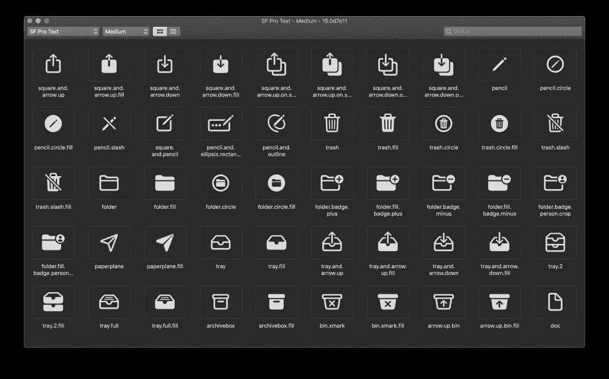

SF 符号 Mac 应用程序，包含所有符号的概述

该应用程序允许您浏览符号，并以选定的重量显示它们。上图显示了中等重量的图标，而下图显示了同样的图标在超轻重量下的外观:

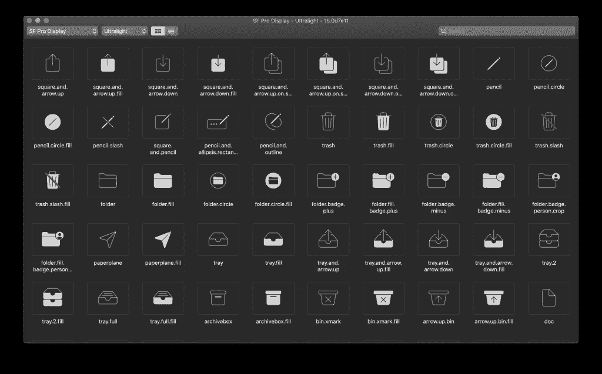

重量设置为超轻的 SF 符号概述

这对于找到重量合适的图标非常有用。

如果您愿意，您也可以使用列表视图浏览可用的符号。

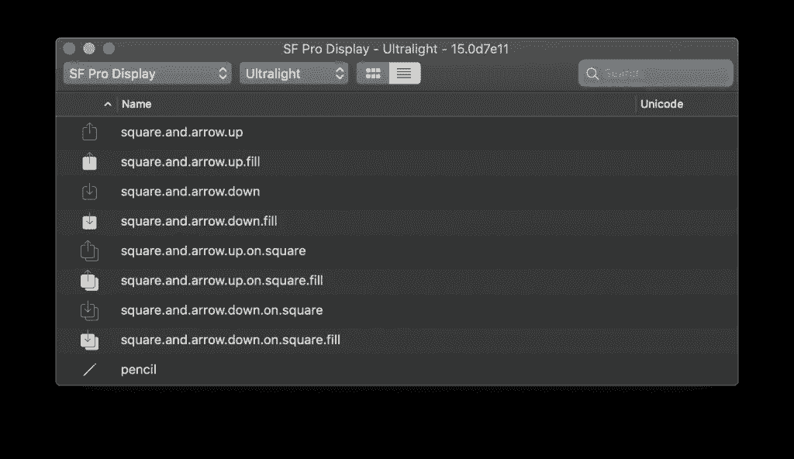

列表视图中符号的概述

# 导出符号

Mac 应用程序允许您使用`File -> Export Symbol...`或`⌘E`将所有符号支持为 SVG。这是在不能使用字体的地方包含符号的好方法。但是，请记住许可协议。

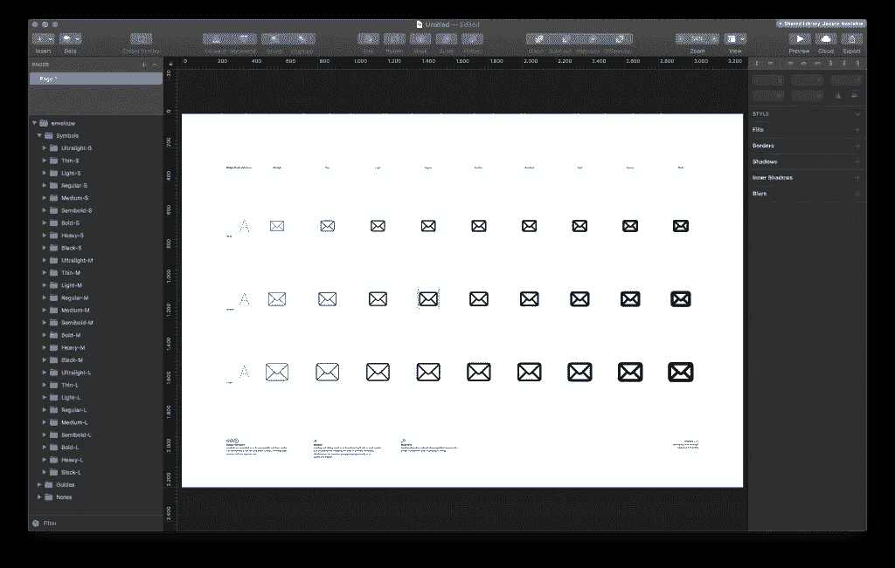

在草图中以 SVG 形式打开的导出 SF 符号

# 浏览网络上的符号

值得一提的是，你还可以在[sfsymbols.com/](https://sfsymbols.com/)浏览符号。

在本网站上搜索的一个好处是，您可以看到每个图标的应用限制，如果它们存在的话:

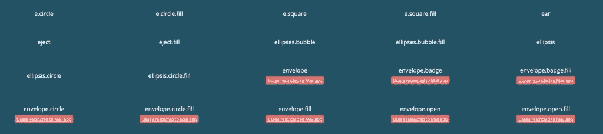

sfsymbols.com 显示每个符号的限制

然而，由于许可限制，他们只能显示符号的名称，所以你最好使用 Mac 应用程序。

# 创建自定义符号

当没有符合您要求的符号时，可以创建自定义符号。元件的导出 SVG 版本结构良好，可用作您自己的自定义元件的基础。

> 来自 WWDC 2019 的[介绍 SF 符号](https://developer.apple.com/videos/play/wwdc2019/206/)会议深入解释了如何使用定制符号

## 选择正确的符号作为基准参考

最好从一个接近你想要的符号开始。请记住:它们是受版权保护的，你不能使用苹果产品的复制品或在你的自定义符号中复制它们。此外，检查前面提到的[符号，用作](https://developer.apple.com/design/human-interface-guidelines/sf-symbols/overview/)列表，因为那些*不能被定制*。

大多数形状也可以在没有图标的情况下使用。例如`circle`或`circle.fill`:

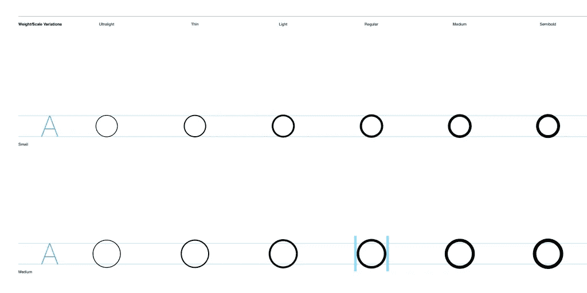

圆形符号是自定义符号的重要基础

这是您自定义符号的一个很好的起点。

## 我需要支撑所有的重量和秤吗？

你实现的重量和比例越多，你支持的文本设置范围就越广。最小比例应为常规、中等、半粗体和粗体，以便支持动态类型和粗体文本设置。

## 导出和使用自定义符号

一旦您将符号导出到 SVG，您可以简单地将符号拖到 Xcode 中的资源目录中。

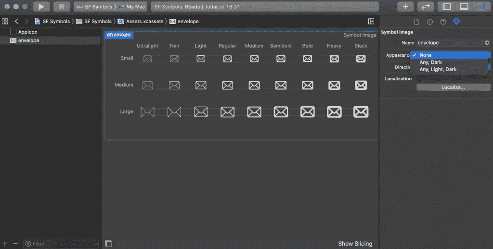

在 Xcode 中添加到资源目录的自定符号

它显示符号的预览，并允许您配置其名称、外观、方向和定位。

## 在 iOS 12 及以下版本中使用自定义符号

只有 iOS 13 及以上版本才支持符号。苹果做了很好的工作，让我们在旧系统版本的情况下可以很容易地依靠图像。只需将您的图像命名为与您的自定义符号相同的名称，如果需要，以下代码行将返回到该图像:

```
let customSymbol = UIImage(named: "my_custom_symbol")
```

# 如何在 Swift 中使用 SF 符号

要在 Swift 中使用 SF 符号，您可以使用新的`UIImage(systemName:) initializer`:

```
let image = UIImage(systemName: "square.and.pencil")
```

如你所见，苹果让 SF 符号的使用变得非常简单:

*   在 [SF Symbols Mac 应用程序](https://developer.apple.com/design/downloads/SF-Symbols.dmg)中浏览并找到您的图标
*   使用`⇧⌘C`复制符号的名称
*   使用`UIImage(systemName:)`初始化器中的名字
*   在 UIImageView、UIButton 或任何其他 UI 元素中使用图像

## 如何在 Swift 中更改 SF 符号的比例

要更改 SF 符号的比例，您可以使用 UIImage 符号配置。

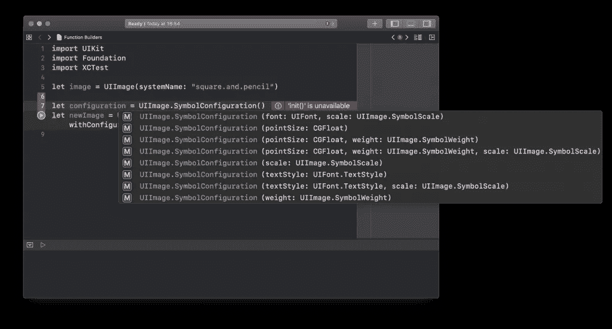

UIImage 符号配置的可用初始化器

这允许您设置字体、比例、磅值、粗细和文本样式。

```
let smallConfiguration = UIImage.SymbolConfiguration(scale: .small)
let smallSymbolImage = UIImage(systemName: "square.and.pencil", withConfiguration: smallConfiguration)
```

默认情况下，比例设置为`medium`，您可以在以下 Swift Playground 中看到:

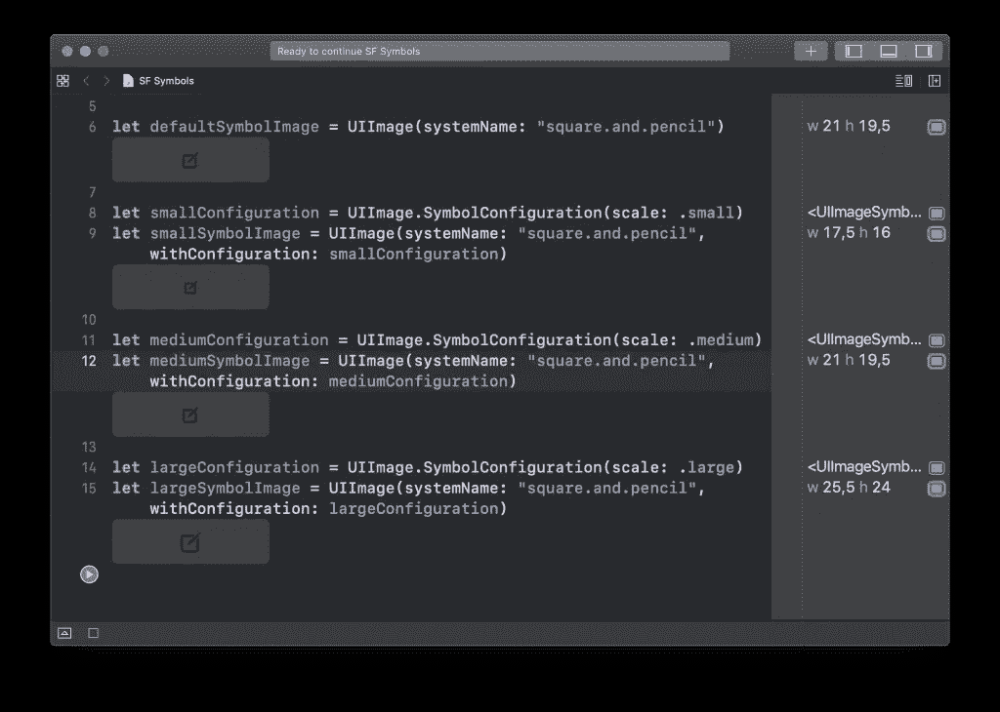

可以使用符号配置将 SF 符号设置为不同的比例

## 如何在 Swift 中更改 SF 符号的权重

权重也可以通过 UIImage 符号配置进行更改。

```
let ultraLightConfiguration = UIImage.SymbolConfiguration(weight: .ultraLight)
let ultraLightSymbolImage = UIImage(systemName: "square.and.pencil", withConfiguration: ultraLightConfiguration)
```

这是使您的符号与您的设计更好地对齐的好方法。

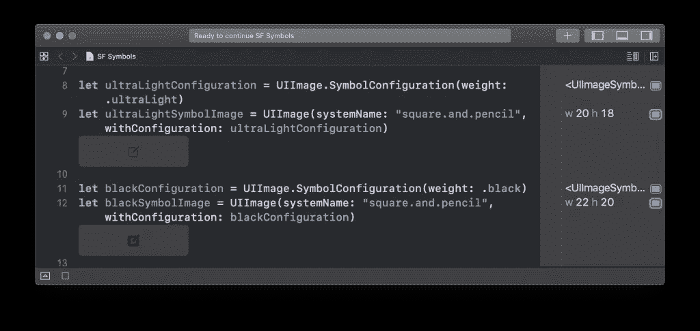

SF 符号的权重配置示例

# 更改 UIImageView 和 UIButton 中的符号配置

`UIImageView`和`UIButton`类带有一个新的属性`preferredSymbolConfiguration`，它允许你对图像视图中的任何符号集应用特定的配置。

```
let imageView = UIImageView(image: defaultSymbolImage)
let updatedConfiguration = UIImage.SymbolConfiguration(weight: .bold)
imageView.preferredSymbolConfiguration = updatedConfiguration
```

这将改变在图像视图中设置的符号。正如您在下面的 Swift Playground 图像中所看到的，该符号也呈现蓝色。

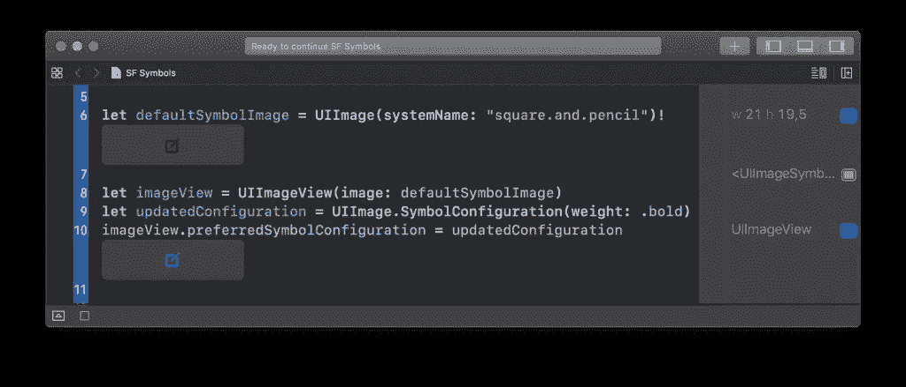

带有 SF 符号的已配置 UIImageView

这是从图像视图上设置的色调颜色继承而来的。如果你想确保一个符号总是以特定的颜色出现，你可以使用`withTintColor`方法:

```
let heartImage = UIImage(systemName: "heart.fill")!
let redHeartImage = heartImage.withTintColor(.red, renderingMode: .alwaysOriginal)
```

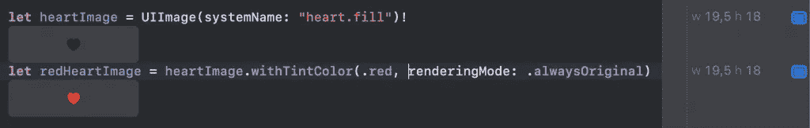

在 SF 符号上设置固定色调

对于按钮，通过使用`UIButton.setPreferredSymbolConfiguration(_:forImageIn:)`方法，它的工作方式或多或少是相同的。应用于系统按钮的默认样式是`.body`和`.large`。

# 组合配置

如果您要保存多个配置以便在整个应用程序中使用，您可能想要在共享配置的基础上应用一个小的调整。

您可以使用`applying`方法轻松做到这一点。

```
let boldLargeConfig = UIImage.SymbolConfiguration(pointSize: UIFont.systemFontSize, weight: .bold, scale: .large)
let smallConfig = UIImage.SymbolConfiguration(scale: .small)
let boldSmallConfig = boldLargeConfig.applying(smallConfig)
let boldSmallSymbolImage = UIImage(systemName: "square.and.pencil", withConfiguration: boldSmallConfig)
```

正如您在下面的游戏中所看到的，图像较小但很醒目:

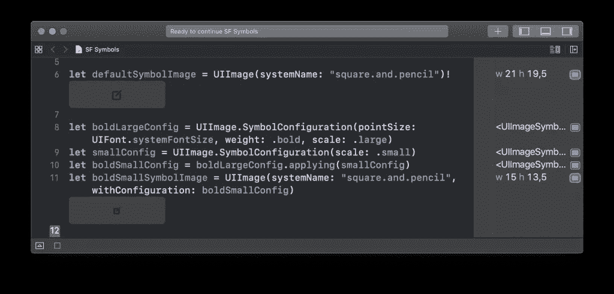

通过组合两种符号配置，您可以更加灵活

# 对齐符号

新的`UIImage.withBaselineOffset(fromBottom:)`方法允许你从图像底部对图像应用新的偏移。这种方法在图像的一般使用中也是有用的。

# 如何在 iOS 12 及以下版本中使用 SF 符号

遗憾的是，在 iOS 12 及以下版本上不能像在 iOS 13 及以上版本上那样直接使用 SF 符号。如果你想在 iOS 12 及以下版本中使用任何符号，你需要从 SF Symbols Mac 应用程序中导出它们，然后将它们作为常规资产导入到你的资产目录中。

# 结论

苹果在 2019 年 WWDC 期间给了我们一份大礼，有超过 1500 个符号可供使用。尤其是如果你没有设计师，或者你想快速行动，你可以利用这些符号来构建一个漂亮的本地应用程序。

如果您想继续提高您的 Swift 知识，请查看 [Swift 类别页面](https://www.avanderlee.com/category/swift/)。

谢谢！