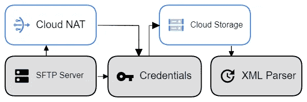
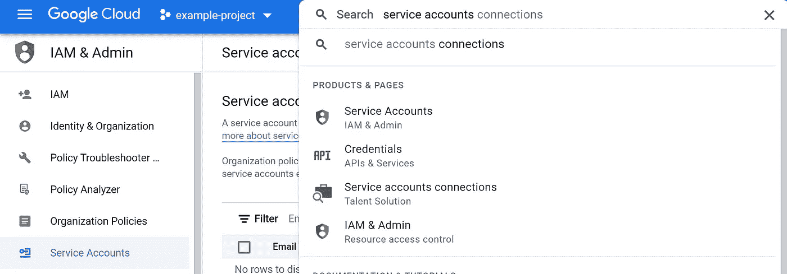
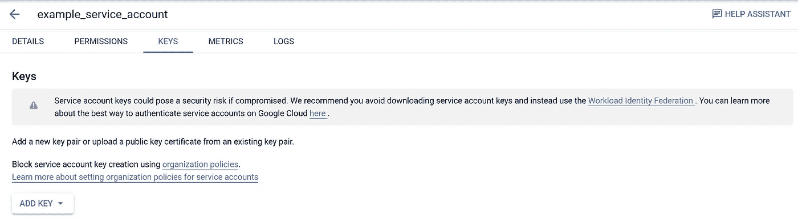
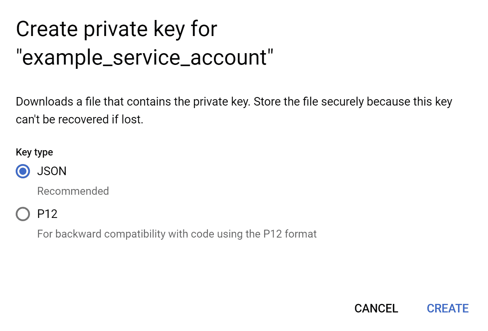

# 用 Python 在 Google 云平台中 SFTP 和处理 XML 文件

> 原文：<https://betterprogramming.pub/sftp-and-process-xml-files-in-google-cloud-platform-with-python-bdcf3a302764>

## 关于如何使用 Python 从 SFTP 服务器提取 XML 文件，将它们备份到谷歌云存储，并处理它们的指南——所有这些都不需要启动虚拟机。



图片来源:作者

# 简介——提出问题

通常，当组织在数据驱动的项目上与合作伙伴协作时，文件和信息的传输可以采用无数的技术解决方案。有时，组织的合作伙伴可能会将所需的数据文件托管在专有服务器上。组织倾向于访问这些托管数据，并将其备份到自己的谷歌云平台(GCP)云存储中以供进一步处理，这种情况并不罕见。备份到云存储的数据可以下载、处理并重定向到另一个平台，而无需在 GCP 启动虚拟机。幸运的是，这些过程不需要手动进行，也不需要相互区分。Python 可以分别与 SFTP 服务器和 GCP 通信，以便在它们之间实现一个精简的数据管道。

**注意:**在本指南中，XML 文件将用于解释目的，但同样的过程也适用于任何其他结构化数据文件(直到 XML 解析)。

**注意:**所有敏感信息已被替换为占位符值。请密切注意需要手动替换的占位符值。

总的来说，本指南将逐步说明如何:

1.  与目标 SFTP 服务器建立连接
2.  将 SFTP 服务器上所需的 XML 文件备份到 GCP 存储桶中
3.  在没有 GCP 虚拟机的情况下处理 XML 文件

如有任何问题，请[在 LinkedIn](https://www.linkedin.com/in/rfinatan/) 上加我，我会尽力回答你。相关的项目文件也可以在 [this GitHub repository](https://github.com/rfinatan/SFTP-XML-GCP-Python-Pipeline) 中找到。

# 与目标 SFTP 服务器建立连接

首先，有一个与我们的目标 SFTP 服务器通信所需的包。在 Python 中，加载以下包:

```
# import required packagesimport paramiko
```

Paramiko 是 SSHv2 协议的纯 Python 实现，提供客户端和服务器功能。它为高级 SSH 库结构提供了基础，推荐用于常见的客户端用例，比如运行远程 shell 命令或传输文件。

接下来，实例化一个新的 SSH 客户机变量。这将作为 SSH 服务器会话的高级表示。

```
# create ssh clientssh_client = paramiko.SSHClient()
```

您将需要一组凭据来启用与 SFTP 服务器的通信。这组凭证可以通过与拥有您尝试访问的 SFTP 服务器的组织的 IT 部门交谈来获得。

以下身份证明是必需的，端口规格是可选的，具体取决于 SFTP 服务器的设置。将凭据存储在各自的变量中。

```
# fill required credential informationHOSTNAME = "xfer.example.com"
USERNAME = "exampleuser"
PASSWORD = "examplepassword"
#PORT = specify your port number here
```

接下来，连接到服务器并验证上述凭证。可以选择打印一条成功声明，以验证正在建立的连接。

```
# establish connection with targeted serverssh_client.set_missing_host_key_policy(paramiko.AutoAddPolicy())
ssh_client.connect(HOSTNAME,PORT,USERNAME,PASSWORD)# optionalprint('connection established successfully')
```

> **重要提示:**如果 Python 函数的输出 IP 地址不在 SFTP 服务器的白名单中，连接尝试将会失败。如果这是一个驻留在本地机器上的功能，通过在 Google 中键入“我的 IP 是什么”找到你的 IP 地址，并请求将该地址加入白名单。如果这是一个作为 GCP 功能一部分的功能，您必须[设置一个云网络地址转换(NAT)和一个用于白名单的静态 IP](https://cloud.google.com/functions/docs/networking/network-settings)。

# 将服务器 XML 文件备份到 GCP 存储桶

下一步是在 SFTP 服务器上打开一个 SSH 会话。

```
# open a SSH session on the SFTP serversftp = ssh_client.open_sftp()
```

获取服务器的目录列表，并将目录打印到 IDE 的输出面板上。

```
# get list of filesfiles = sftp.listdir()
print(files)
```

如果您要查找的文件在最上面的目录中，请继续下一步。更有可能的是，文件将驻留在一个文件夹中。使用以下命令检查所需文件的文件夹内容:

```
# inspect a folder's contentsfolder_directory = sftp.listdir('folder_name')
print(folder_directory)
```

在检查服务器的目录时，索引也是可能的。例如，可以使用典型的索引命令检索文件夹中的第一个文件:

```
# determine first file in directoryfirst_file =  f"{folder_directory[0]}"
print(first_file)
```

还建议在文件夹目录的内容中找到所需文件的路径后，存储该路径。

```
# store the path of the first file in directoryfirst_file_path = f"folder_name/{folder_directory[0]}"
print(first_file_path)
```

> 本指南假设您对 Google 云存储有所了解，确保在执行后续步骤之前已经创建了 Google 云存储空间。有关如何创建云存储桶的更多信息，请[阅读本指南](https://cloud.google.com/storage/docs/creating-buckets)。

既然已经找到了想要的文件，备份到 Google 云存储的过程就很简单了。

首先，从 Google Cloud 客户端库中导入`storage`模块。然后，从`oauth2client`包中导入`oauth2client.service_account`模块。这将授权您的凭据，并根据您的 GCP 服务帐户进行验证。

```
# import google cloud storage dependenciesfrom gcloud import storage
from oauth2client.service_account import ServiceAccountCredentials
import os
```

要获取您的服务帐户凭据，请在 GCP 境内的搜索栏中搜索“*服务帐户*”。点击'*服务账户，IAM &管理'*。



选择与您想要放置 SFTP 文件的云存储空间相关联的 GCP 项目。

如果服务帐户存在，请选择现有帐户。如果项目不存在服务帐户，请单击“*创建服务帐户*”。创建或选择服务帐户后，单击操作菜单按钮，并选择“*管理密钥*”。

在密钥选项卡中，点击'*添加密钥'*。



之后，点击“*创建新密钥*”。使用 JSON 推荐的键类型创建一个新的键。



然后，这个密钥将被下载到您的本地或虚拟实例。在任何 IDE 或文本编辑器中打开该项以查看其内容。

回到我们的 Python 程序，实例化一个名为`credentials_dict`的新字典变量。将 JSON 凭证值作为字典的内容传递。

接下来，通过名为`credentials`的变量将 JSON GCP 凭证传递给 oauth2 模块。

```
# pass JSON GCP credentials to OAuth2 packagecredentials = ServiceAccountCredentials.from_json_keyfile_dict(
credentials_dict)
```

此外，将 JSON GCP 凭证传递给`gcloud storage`模块。确保您的项目名称与 GCP 显示的名称完全一致。

```
# pass GCP credentials to gcloud storageclient = storage.Client(credentials=credentials, project='example-project')
```

接下来，创建一个 bucket 变量，指定将 XML 文档上传到哪个 bucket。同样，确保 bucket 名称与在云存储中为各个项目创建的期望 bucket 完全对应。

```
# create bucket variablebucket = client.get_bucket('example-project-bucket')
```

对于在`bucket`变量中指定的桶值，有必要创建一个 blob 数据对象来存储二进制大对象。使用以下命令实例化 blob，将`first_file`更改为包含所需文件名的变量，该文件名先前在 SFTP 服务器的目录中找到。

```
# create blob variableblob = bucket.blob(first_file, chunk_size=262144)
```

最后，使用 blob 类型对象将文件作为副本从 SFTP 服务器推送到指定的云存储桶。同样，将`first_file_path`更改为包含先前在 SFTP 服务器目录中找到的所需文件路径的变量。

```
# upload to GCP bucketwith sftp.open(first_file_path, bufsize=32768) as f:blob.upload_from_file(f)
```

# 在没有 GCP 虚拟机的情况下处理 XML 文件

通常，已经在 GCP 的 XML 文件的附加处理将通过使用虚拟机来进行。但是，本指南提供了一种更经济的解决方案，其中不需要启动虚拟机。为了避免 VM 实例，blob 下载会将 XML 转换成可读的文本以便存储和处理。

从加载所需的依赖项开始。

```
# pull XML as string from GCP bucketimport pandas as pd
import xml.etree.ElementTree as ET
```

`pandas`包不需要介绍，但是，如果你不熟悉它的用法，请在这里阅读它的文档[。](https://pandas.pydata.org/)

`XML.etree.ElementTree` [是一个包](https://docs.python.org/3/library/xml.etree.elementtree.html)，它实现了一个简单高效的 API 来解析和创建 XML 数据。它对于嵌套的 XML 文档特别有用，因为`pandas.read_xml`不适合嵌套的 XML 文档。

以下命令将把我们的 XML 文件下载为字符串，而不是 XML。这就不需要将文件存储在本地或虚拟的虚拟机上，而是将其内容直接存储到之前实例化的变量`blob`中。

```
blob = blob.download_as_string()blob = blob.decode('utf-8')
```

为了解析 XML，需要一个函数来提取不同层次的嵌套信息。根据所分析的 XML 文件及其嵌套级别，嵌套关系的数量可能会有所不同。

下面，我给出了一个例子，说明如何解析一个包含 1 个根、1 个子元素和 3 个子元素嵌套的 XML 文档。嵌套的信息随后存储在一个名为`all_records`的空列表中，该列表构成了一个`pandas` 数据帧的基础。

最后，用之前建立的包含 XML 内容的 blob 变量调用函数。

```
# create pandas dataframe from extracted nested XMLwith sftp.open(first_file_path) as o:df = xml2df(blob)
```

对于一些可选的清除，如果在最终输出中不需要 NA 值，则删除所有的空行。

```
#Drop empty columns in dataframedf = df.drop(columns='row')# df =df.dropna(axis=1)
```

关于如何使用 Python 从 SFTP 服务器提取 XML 文件，将它们备份到 Google 云存储，并处理它们以供进一步分析的指南到此结束。和往常一样，你可以在这个项目的 [GitHub 库](https://github.com/rfinatan/SFTP-XML-GCP-Python-Pipeline)中找到相关的项目文件。

```
**Want to Connect?**Feel free to [connect on LinkedIn](https://www.linkedin.com/in/rfinatan/)
```