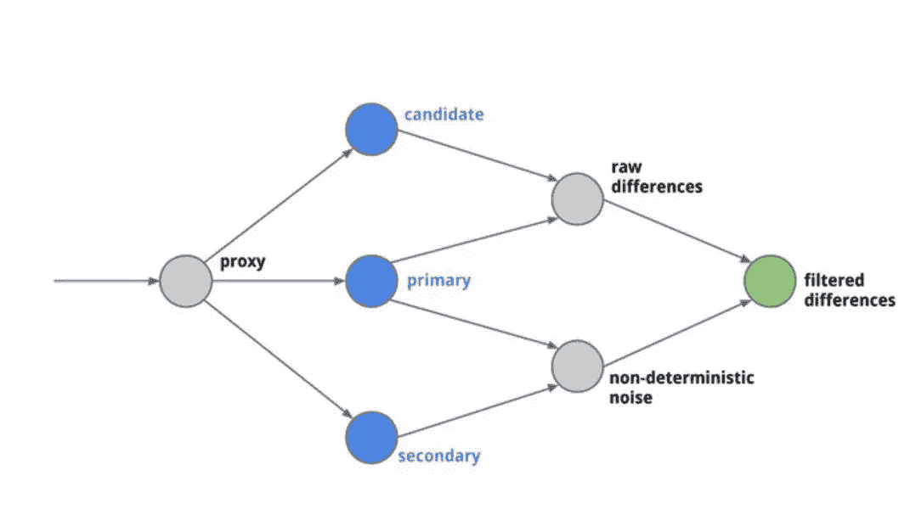
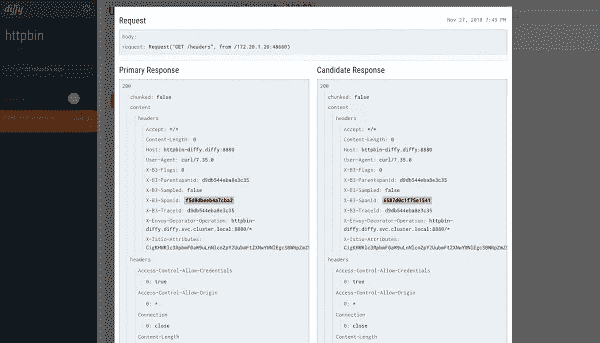

# 隐藏您的 API 流量以检测重大变化

> 原文：<https://betterprogramming.pub/shadow-your-api-traffic-to-detect-breaking-changes-6215c2c6c198>

## Diffy 帮助您比较影子流量的响应


照片由[费迪南·斯托尔](https://unsplash.com/@fellowferdi?utm_source=medium&utm_medium=referral)在 [Unsplash](https://unsplash.com?utm_source=medium&utm_medium=referral) 拍摄。

当部署新版本的 API 时，可能发生的最糟糕的事情之一就是在没有注意到的情况下违反了合同。

最好的情况是你打破了你的前端，你很快看到它，它有一个小的影响，你有一个几分钟的事件。但是你可以想象，如果你谈论商业交易、个人健康指标等，情况会更糟。如今 API 无处不在。

# TL；速度三角形定位法(dead reckoning)

本文将解释如何使用`[diffy](https://github.com/opendiffy/diffy)`在生产中直接测试你的新版本。

# API 中的重大变化是什么？

大多数情况下，API 中的重大变化包括请求中需要的额外参数或响应中重命名的字段。任何格式变化都可以被认为是 API 中的重大变化。

# 你如何确定你没有引入突破性的变化？

要做的第一件事是帮助你的团队理解你的 API 中的任何变化都有可能破坏东西。因此，您可以在 API 中引入版本控制，在验证拉请求时要格外小心，并对 QA 进行测试。

但这就够了吗？下一步是用生产中的真实流量来测试你的 API！

# 直接在生产中测试您的 API

在生产中测试破坏事物的能力总是令人害怕的部分。没有人愿意冒这个险。这就是迪菲会帮助我们的地方。

Diffy 最初是由 [Twitter](https://github.com/twitter-archive/diffy) 做的项目，现在由 [opendiffy](https://github.com/opendiffy/diffy) 管理。

[](https://github.com/opendiffy/diffy) [## opendiffy/diffy

### Diffy 在生产中使用于:并且被云基础设施提供商在博客中讨论，例如:如果您的组织正在使用…

github.com](https://github.com/opendiffy/diffy) 

`diffy`允许您跟踪新候选服务的流量，并可以比较新旧版本的结果，以验证您的候选版本工作正常。



作者照片。

## **它是如何工作的？**

`diffy`充当代理，对每个请求进行三次呼叫:两次呼叫您的实际服务(主一级，主二级)，一次呼叫候选人。

这里对实际版本的两个调用是为了检测 API 的噪声，并在与候选版本进行比较时忽略它(噪声可以是唯一的 ID、时间戳等)。).

在运行一些请求之后，`diffy`提供了一个仪表板来查看结果和 API 之间的差异。



不同的仪表板

有了这个系统，你可以运行你的候选人而不影响你的用户，因为你的候选人的流量来自影子流量，而返回的响应来自你的实际 API 版本。因此，即使你的候选程序有缺陷，也不会影响你的用户体验。

# 入门指南

`diffy`是一个 [Scala](https://www.scala-lang.org/) 项目。你可以在`jar`或通过`docker`图像使用它。

最简单的方法是使用 Docker 图像。您可以通过运行以下命令来启动它:

```
**docker** run -d - name diffy-01 \
 -p 8880:8880 -p 8881:8881 -p 8888:8888 \
 diffy/diffy \
 -candidate='**api.candidate.com**' \
 -master.primary='**api.primary.com**' \
 -master.secondary='**api.primary.com**' \
 -responseMode='**primary**' \
 -service.protocol=**https** \
 -serviceName="Service name" \
 -proxy.port=:8880 \
 -admin.port=:8881 \
 -http.port=:8888 \
 -rootUrl=localhost:8888 \
 -[summary.email='contact@email.com](mailto:summary.email='contact@email.com)' \
 -summary.delay="5" \
 -log.level="DEBUG" \
 -resource.mapping='/listing;listing-resource'
```

配置非常简单。你给你主人的主机(以前版本)。这里，我对`primary`和`secondary`路径使用了相同的 URL，因为我在服务前面有一个负载平衡器。

现在，如果您在该代理上执行`curl` ，它将为您带来神奇的效果，您可以在仪表板中看到比较结果:

```
**curl** http://localhost:8880/listing
```

# 结论

正如您所看到的，`diffy`是一个有用的工具，可以确保您的 API 在全面展示之前不会引入突破性的变化。

这需要在您的部署管道中做更多的工作，但这是值得的，因为它让您对新版本充满信心。众所周知，快速失败永远是最好的。使用 diffy，您可以在不影响用户的情况下失败。