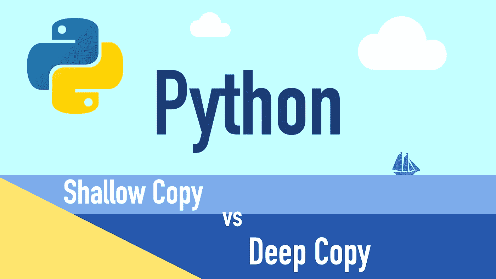
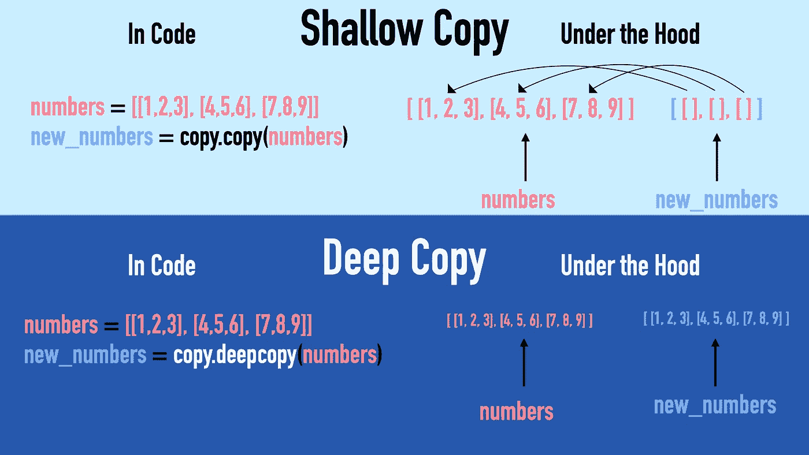
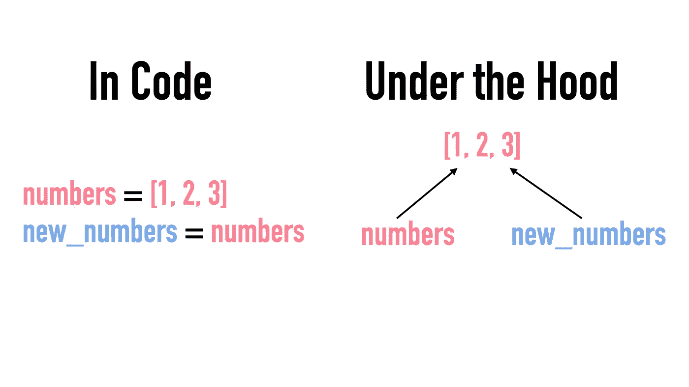

# Python 中的浅层复制与深层复制

> 原文：<https://betterprogramming.pub/shallow-copy-vs-deep-copy-in-python-357e5f502bf9>

## 通过有用的示例了解 Python 中复制的工作原理



图片由作者提供。

在 Python 中，浅拷贝是“一级深”拷贝。复制的对象包含对原始对象的子对象的引用。

深层副本完全独立于原始对象。它通过用子对象的副本递归填充来构造新的集合对象。



一张图抵得上一千个字。图片由作者提供。

# 抄袭与否

在 Python 中，您可能会使用对象的`=`操作符副本。人们很容易认为这会创建一个新对象，但事实并非如此。相反，它创建了一个新变量，使*将*指向原始对象。这意味着更改复制对象中的值也会更改原始对象的值。

让我们用列表来证明这一点:

输出:

```
numbers: [100, 2, 3]
new_numbers: [100, 2, 3]
```

由于`numbers`和`new_numbers`现在指向同一个列表，更新一个总是更新另一个。

为了验证这两个对象确实引用了同一个对象，您还可以使用`id()`方法。每个 Python 对象都有一个唯一的 ID。如果你检查一下`numbers`和`new_numbers`的 id，你会发现它们完全一样:

```
print(id(numbers))
print(id(new_numbers))
```

输出:

```
139804802851400
139804802851400
```

下面是一个有用的例子:



将对象分配给新变量会创建原始对象的别名。图片由作者提供。

# 如何在 Python 中复制

让我们来看一个常见的例子:您希望以这样一种方式复制一个列表，即在更新复制的列表时，原始列表保持不变。Python 中有两种复制方式:

1.  浅拷贝
2.  深层拷贝

这两种方法都在`copy`模块中实现。要使用这些，您需要将`copy`模块导入到您的项目中。

*   拍浅抄，叫`copy.copy(object)`。
*   要进行深层复制，请调用`copy.deepcopy()`。

让我们更深入地了解细节。

# 浅层拷贝与深层拷贝

## 浅拷贝

浅层拷贝是浅层的，因为它只拷贝对象，而不拷贝其子对象。相反，子对象引用原始对象的子对象。

下面的例子可以说明这一点:

在这里，你有`groups`，它是一个数字列表的列表。你有一个浅拷贝叫做`new_groups`。让我们来看看这些:

1.  `groups`的 ID 与`new_groups`的 ID 不同，这是合理的，因为`new_groups`是`groups`的副本。

```
print(id(groups), id(new_groups))
```

输出:

```
140315092110600 140315092266184
```

看起来好像`new_groups`是`groups`的完全独立的复制品。但是，让我们更进一步，看看它不是。

2.这就是浅薄变得明显的地方。`new_groups` *中的列表 id*等于原`groups`中的列表 id:

```
print(id(groups[0]), id(new_groups[0]))
```

输出:

```
140315092110664 140315092110664
```

浅层意味着只有“外部”列表被复制。但是内部列表仍然引用原始列表的列表。因此，更改复制列表中的数字会影响原始列表:

```
new_groups[0][0] = 100000print(new_groups[0])
print(groups[0])
```

输出:

```
[100000, 2, 3]
[100000, 2, 3]
```

3.`new_groups`的“外部”列表是原`groups`的“真实”副本。因此，您可以添加新元素，甚至替换现有的元素。这些改变不会影响原来的`groups`列表。

例如，让我们用一个字符串替换`new_groups`中的第一个列表。这应该*不会*影响`groups`。

```
new_groups[0] = "Something else"print(new_groups)
print(groups)
```

输出:

```
Something else
[100000, 2, 3]
```

## 深层拷贝

深层副本创建原始对象的完全独立的副本。

这很简单。但是为了完整起见，让我们也用深层副本重复上面的实验:

这里有`groups`，它是一个包含数字列表的列表。而你拿着深抄，`new_groups`。让我们来看看这些:

1.  `groups`和`new_groups`的 id 不匹配:

```
print(id(groups), id(new_groups))
```

输出:

```
140416138566984 140416138739016
```

2.`new_groups`中的列表 id 不等于`groups`中的列表 id:

```
print(id(groups[0]), id(new_groups[0]))
```

输出:

```
140416138567048 140416138566728
```

改变`new_groups`中的数值不会改变原始`groups`中的数值。

```
new_groups[0][0] = 100000print(new_groups[0])
print(groups[0])
```

输出:

```
[100000, 2, 3]
[1, 2, 3]
```

3.`new_groups`是`groups`的独立副本。因此，在原来的`groups`中不可能看到在`new_groups`中所做的更改。

```
new_groups[0] = "Something else"print(new_groups)
print(groups)
```

输出:

```
Something else
[1, 2, 3]
```

# 结论

在 Python 中，浅拷贝是“一级深”拷贝。它构造一个复制的对象。但是子对象指的是原始对象的子对象。因此，乍一看可能有点“奇怪”。

深层拷贝是“真正的拷贝”它是原始对象的独立副本。很多时候，深度复制才是你想要的。

# 深刻的阅读

[](https://www.codingem.com/50-python-interview-questions-and-answers/) [## 50 Python 面试问答- Codingem

### 你是在准备工作面试还是准备涉及 Python 知识的考试？还是你想快点走…

www.codingem.com](https://www.codingem.com/50-python-interview-questions-and-answers/)