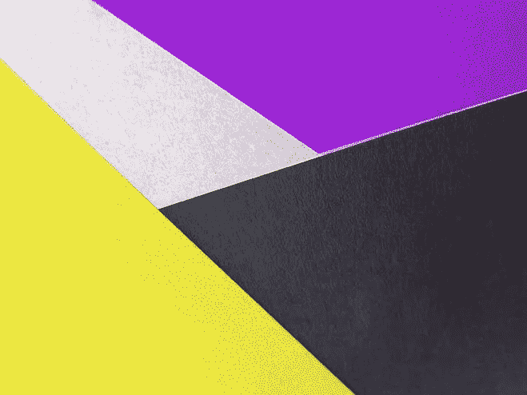
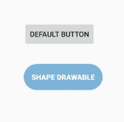
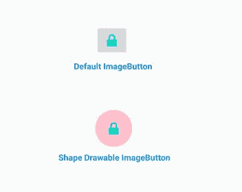
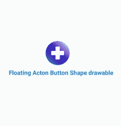
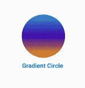
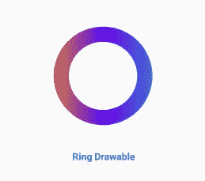
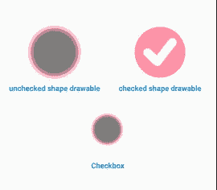
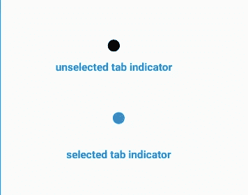
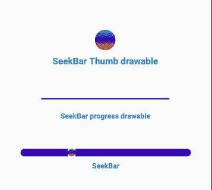

# shape Drawables——Android UI 最强大的工具

> 原文：<https://betterprogramming.pub/shape-drawables-the-most-powerful-tool-for-your-android-ui-e5c2b1ab9eef>

## shape drawables 如何让你的 Android 用户界面更好

安妮[罗恩卡](https://www.pexels.com/@anniroenkae?utm_content=attributionCopyText&utm_medium=referral&utm_source=pexels)摄于[佩克斯](https://www.pexels.com/photo/yellow-black-and-purple-colored-papers-2457284/?utm_content=attributionCopyText&utm_medium=referral&utm_source=pexels)。

如果你是 Android 应用程序开发的新手，并且你选择了 Android Studio 和 Java 或 Kotlin，在浏览了 UI 组件(视图和布局)之后，你可能会认为还缺少一些东西。但是当我进一步提高我的实践能力，并且发现了可画的形状后，我知道我找到了答案。

乍一看，许多使用 Android Studio 的新 Android 开发人员不知道 shape drawables，他们通常抱怨他们没有必要的工具来以他们想要的方式实现他们的 UIs 这是事实。然而，当你掌握了可绘制形状，并发现它们在增强你的用户界面方面有多棒时，你会爱上用它们来设计。

Shape drawables 为你的 UI 组件或视图提供了你想要的真实的自定义风格，从而使它们更有吸引力和满足感。他们在定制你的按钮、`TextViews`、`EditText`和许多布局以符合你的偏好方面做得很好。

Shape drawables 是用 XML 创建的，语法简单易懂，这使得任何新手都很容易熟悉。

在这篇文章中，你将看到一些有用的形状绘制，你如何创建它们，以及它们如何增强你的用户界面。

# 如何创建和使用可绘制的形状

用 XML 中的`<item>`和`<shape>`元素创建可绘制形状。

`<item>`元素是`<shape>`的封闭父元素。它定义了像形状的宽度和高度这样的属性，但是只有当你的项目是 API 23 和更高版本时才可能。

`<shape>`元素是定义 drawable 的形状及其所有嵌套元素的地方。`android:shape`属性可以保存四个值:`rectangle`、`oval`、`ring`或`line`。如果不指定值，默认情况下它将是一个矩形。

多个形状项目可以嵌套在一个`<layer-list>`元素中。一个层列表可以嵌套一组相互叠加的`<item>`元素，最后一个元素在其他元素之上。

在`<shape>`元素中，其他嵌套的形状创建元素如`<stroke>`、`<gradient>`、`<corners>`、`<padding>`、`<size>`和`<solid>`可以添加到形状中。

`<stroke>`元素用于设置形状边框的宽度、颜色、`dashGap`和`dashWidth`。

`<gradient>`元素用于设置`startcolor`、`centerColor`、`endColor`以及其他一些用于给形状赋予线性渐变颜色的属性。

`<corners>`元素仅用于设置形状每个角的半径。

`<padding>`元素用于设置形状所有边的填充。

`<size>`元素用于设置形状的宽度和高度，但是如果您的项目是针对 API 23 和更高版本，这可以在`<item>`元素中完成。

`<solid>`元素用于设置覆盖整个形状的整体单一颜色。

创建了可绘制的形状后，要在视图中使用它，必须将其设置为视图的背景属性值。

# 对你的用户界面有用的形状绘图

 [## CodeBoy722/Shape_Drawables_Box

### 你的 android 项目的所有类型的图形绘制，持续更新的永久链接无法加载最新的提交…

github.com](https://github.com/CodeBoy722/Shape_Drawables_Box) 

查看上面的存储库。它有一个很长的有用的形状列表，你可以在你的项目中使用。

## 圆角按钮

Android 上的默认按钮看起来不太好，但有了 shape drawables，你可以让你的按钮和图像按钮看起来像你希望的那样棒:

上面的绘图可以用来设计你的按钮，`TextViews`和`EditText`来满足你的喜好。

这可以用来设计你的`ImageButton`和`ImageView`背景，也可以修改代码来匹配你的颜色偏好。

## 可绘制的浮动操作按钮形状

对于 Android 新手开发者来说，创建一个很酷的悬浮动作按钮可能看起来很头疼，但是有了 shape drawables 的强大功能，这简直是小菜一碟

要在浮动动作按钮中使用它，将其设置为按钮的`src`属性的值。

## 渐变圆形可绘制

类似于上面的圆形背景形状，你可以使用渐变圆来做各种事情。你可以缩小它的尺寸，把它作为一个标签指示器，或者把它作为你的搜索栏的缩略图。

## 环形可拉伸

这可以用作未选中选项卡的选项卡指示器。根据您的偏好定制 XML，并在您的项目中使用它。

## 圆形复选框形状的抽屉

许多 Android 新开发人员抱怨说，没有办法实现圆形复选框，但有了 shape drawables，你可以做的远远不止圆形复选框。查看[这篇文章](https://android.jlelse.eu/creating-a-fully-custom-checkbox-in-android-a5b03f508d45)看看你如何在 Android 中定制你的复选框。

要设置复选框上的形状，您应该创建另一个可绘制状态选择器，并包括两个形状及其相应的状态，如下所示:

一旦您的状态选择器完成，您现在可以通过将复选框状态选择器设置为`android:button`属性的值，在您的复选框上使用它。

## 选项卡指示器形状

选项卡指示器是可绘制的，可用于标识选项卡布局中的选定选项卡或具有许多页面的视图页导航器中的选定页面。通常，标签指示器被设计成点状，许多开发人员为此使用图像，但是使用可绘制的形状更容易和更有效。

您可以修改上面可绘制的形状的颜色和大小，以创建各种状态的选项卡指示器—通常是选中的和未选中的。

要在选项卡布局上使用这些选项卡指示器，您必须首先创建一个可绘制的状态选择器:

创建状态选择器后，将其设置为选项卡布局的`app:tabBackground`属性的值。然后在您的活动中，您可以将它与视图分页器绑定。

## 寻找条形线和拇指形状

如果你在你的 Android 项目中实现音频回放，你可能想要使用一个`SeekBar`来向用户显示音频回放的进度。您可能想根据自己的喜好定制您的`SeekBar`,或者匹配项目的 UI 画布。这可以很容易地实现与形状拉伸。

要将这些 drawable 应用到您的`SeekBar`，将`SeekBar` thumb drawable 设置为`SeekBar`的`android:thumb`属性的值，然后将 progress drawable 设置为`SeekBar`的`android:progressDrawable`属性的值。

## 令人惊叹的用户界面，可画出形状

使用 shape drawables 的最大好处在于，当你设置好所有的形状后，你会意识到设计你想要的 UI 有多快。这也提高了你在 Android 中创建 ui 的效率——不管它有多复杂。

用户界面由形状可绘制的力量构建而成

# 使用成型拉延件的优点

1.  它们可以帮助您在 UI 中实现您想要的自定义风格。
2.  它们不占用太多空间，并且易于修改。
3.  它们可以节省您创建各种密度的自定义图像的时间，因为它们可以轻松缩放并适应您的视图。
4.  它们极大地减少了你的应用程序的大小，因为它们不需要为相同的形状绘制多个密度。PNG 和 JPG 图像要重得多，并且必须以各种密度提供。
5.  Shape drawables 更具延展性，因为您可以在活动代码中轻松使用它们，并且它们可以在同一个项目中多次使用。

# 结论

现在你已经知道使用 shape drawables 你的 UI 会有多棒了，不要忘了查看下面的资源库，为你的项目找到一长串有用的 shape drawables。您也可以通过添加自己的形状绘图来做出贡献。

 [## CodeBoy722/Shape_Drawables_Box

### 你的 android 项目的所有类型的图形绘制，持续更新的永久链接无法加载最新的提交…

github.com](https://github.com/CodeBoy722/Shape_Drawables_Box) 

在我的博客**上找到更多类似的文章。**