# 借助 Python 自动化功能，轻松分享屏幕截图

> 原文：<https://betterprogramming.pub/share-screenshots-with-ease-with-this-python-automation-16362e9da2d4>

## 编写您自己的代码来共享您计算机上的屏幕截图

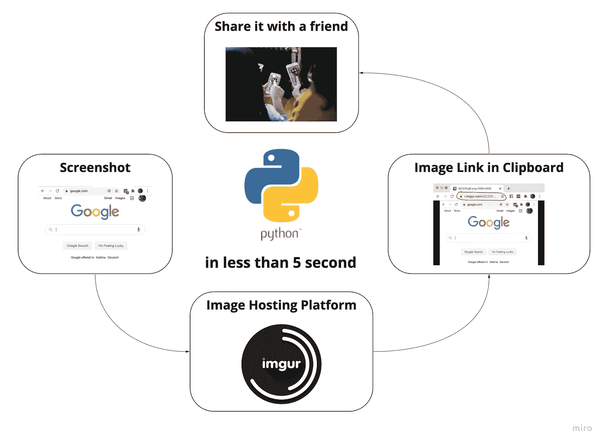

图片来源:作者(包含[优 X 创投](https://unsplash.com/@youxventures) 作品来自 [Unsplash](https://unsplash.com/photos/NYMJYXfZG-g) )

你在用你的电脑做专业工作吗？你是否定期将自己的作品截图，并通过 [Markdown](https://en.wikipedia.org/wiki/Markdown) 文档中的 URL 与他人分享？最后，你是否厌倦了从截图到上传到图像托管服务以获得可共享网址的繁琐过程？

嗯，我当然是，因为我倾向于采取了很多截图，并写了很多关于这些截图的降价。作为一名软件工程师，在经历了足够的挫折后，我最终实现了整个过程的自动化。现在，我想向你展示如何快速轻松地分享你的截图。

# 进一步阅读我会有什么收获？

到本文结束时，您将能够按下一个键盘快捷键序列，这将触发一个截图的捕获，然后在后台启动一个 Python 脚本，该脚本将截图上传到图像托管服务，不到几秒钟后，您就会在剪贴板中留下一个 URL。为了激励自己，让我们看看下面 GIF 中的最终状态。

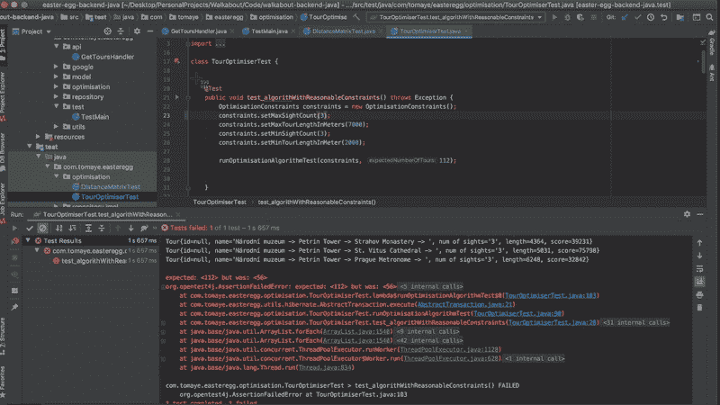

分享截图变得简单(图片来源:作者)

**免责声明:**目前，提出的解决方案只能在 MAC 上运行。然而，如果你喜欢上面看到的，并且你想在没有 Mac 的情况下使用它，请告诉我。如果我看到足够的兴趣，我会扩展代码，使其在 Windows 和 Linux 上也能工作。

# 先决条件

我将以一步一步的方式介绍解决方案，并且假设您没有编程经验。只要从上到下地遵循这篇文章，就足以让代码为您工作了。除此之外，你还需要安装 [Python3](https://www.python.org/downloads/) 和 [Git](https://www.atlassian.com/git/tutorials/install-git) 。如果您不确定您的计算机上是否已经安装了这些工具，请打开您的终端(⌘ Cmd + Space 并键入 terminal)并运行:

```
python3 --version
```

期望的输出应该类似于“Python 3.8.1”如果是“python3:找不到命令”，那么 python 没有安装。这同样适用于:

```
git --version
```

如果您没有安装这些工具，请按照这些链接找到 [Python3](https://www.python.org/downloads/) 和 [Git](https://www.atlassian.com/git/tutorials/install-git) 的安装说明。接下来，我假设你有一台安装了 Python3 和 Git 的 Mac。

# 第一步。向 imgur.com 注册

前往 https://imgur.com/register 的[创建一个账户。你可以用你的脸书或者 Gmail，所以应该会很快。](https://imgur.com/register)

接下来，拜访 https://imgur.com/account/settings/apps 并填写表格。这是获取访问密钥所必需的，这样 Python 代码就可以代表你向你的 [imgur](https://imgur.com/) 账户发布图片。填写好的表单应该如下所示:

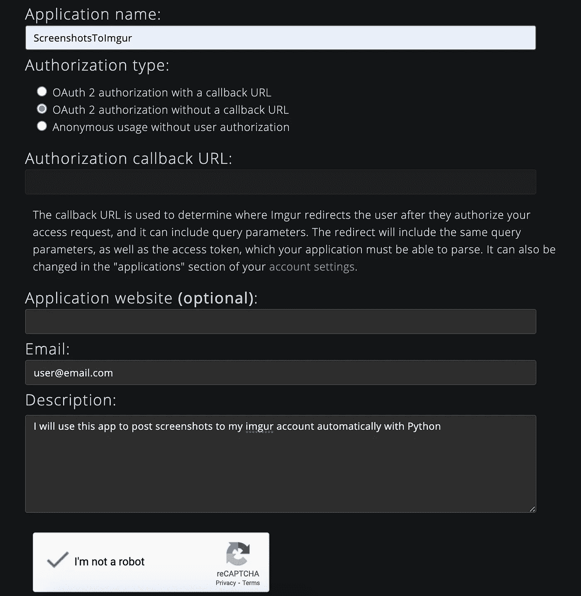

imgur 申请表(由作者提供)

完成表格后，单击提交。这将为您生成密钥。将这些内容复制并粘贴到某个文本文件中，因为一旦您关闭此页面，您将无法再看到客户机密。这些钥匙以后会有用的。

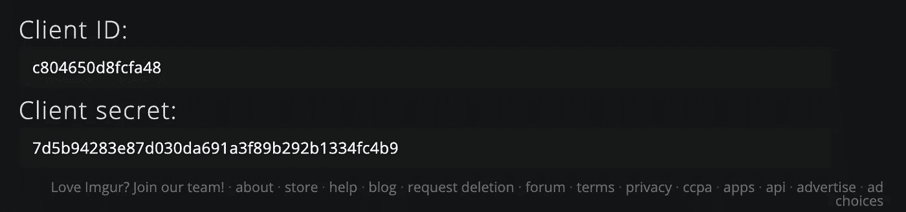

imgur 访问键示例(图片来源:作者)

干得好！您已经成功注册了将由 Python 应用程序使用的 imgur 帐户。现在我们需要得到密码。

# 第二步。下载 Python 代码

打开您的终端(⌘ Cmd +空格并键入 terminal)，[导航](https://www.earthdatascience.org/courses/intro-to-earth-data-science/open-reproducible-science/bash/bash-commands-to-manage-directories-files/#:~:text=To%20change%20directories%2C%20use%20the,to%20check%20the%20new%20path.)到您想要代码驻留的文件夹，并运行:

```
git clone [https://github.com/TomasYeOpenSource/screenshots-to-imgur](https://github.com/TomasYeOpenSource/screenshots-to-imgur.git)
```

该命令将代码复制到您的机器上。要确保一切正常，请运行:

```
cd screenshots-to-imgur; ls;
```

输出应该是这样的:

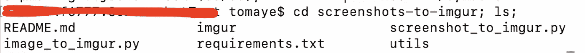

如果复制成功，您应该会看到这些文件夹内容(图片来源:作者)

现在我们的机器上有了代码，让我们运行它。你做得很好！

# 第三步。让代码运行

首先，我们需要在机器上安装所有第三方依赖项。没有这一点，代码将无法工作。为此，运行:

```
pip3 install -r requirements.txt
```

如果这个命令成功，您就可以通过 Python 自动将您的第一个截图上传到云中了。为此，运行:

```
python3 screenshot_to_imgur.py
```

第一次运行脚本时，需要一些额外的配置。但是不要担心，这是一次性设置。

在填写 imgur 表单后，系统会提示您提供您复制的访问密钥。

粘贴`client_id`并按回车键。然后粘贴`client_secret` 并回车。然后你会看到一个网址。复制此 URL 并将其粘贴到浏览器中。

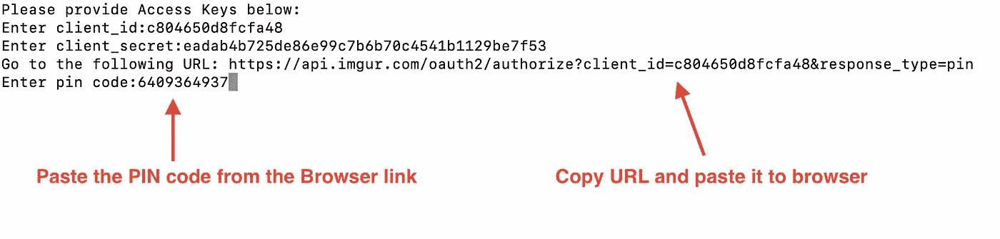

提供访问键，然后在浏览器中复制并粘贴链接(图片来源:作者)

您将被重定向到一个页面，在此您将同意该应用程序将图像上传到您的帐户。

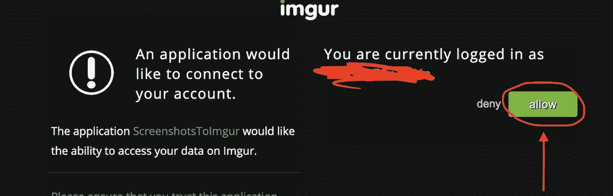

允许应用程序代表你上传图片到 imgur(图片来源:作者)

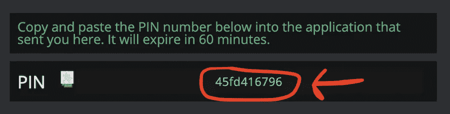

将 PIN 码复制回终端，然后按回车键。(图片来源:作者)

提供 PIN 码后，等待几秒钟。之后，您应该会在终端中看到以下内容:

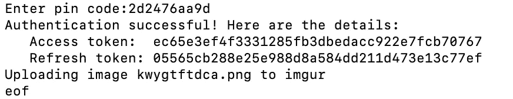

脚本成功的指示(图片来源:作者)

您还应该在屏幕的右上角看到一个提示。

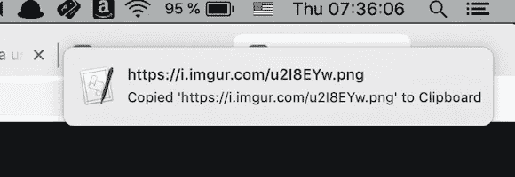

提示图片上传成功(图片来源:作者)

现在，试着在浏览器中打开一个新标签页，并将剪贴板的内容粘贴到那里。如前所述，提供访问密钥是一次性的设置。尝试再次运行代码，看着它在几秒钟内无缝地将一个截图上传到互联网，在剪贴板上留下一个可共享的链接:

```
python3 screenshot_to_imgur.py
```

恭喜你！如果一切顺利，您现在可以通过从终端运行命令行脚本将截图发布到互联网上。现在，让我们看看如何通过将工作流绑定到键盘快捷键来提高效率。

# 第四步。将其绑定到键盘快捷键

点击⌘ Cmd +空间打开查找器，并在 Automator 中键入。接下来，选择快速操作选项。

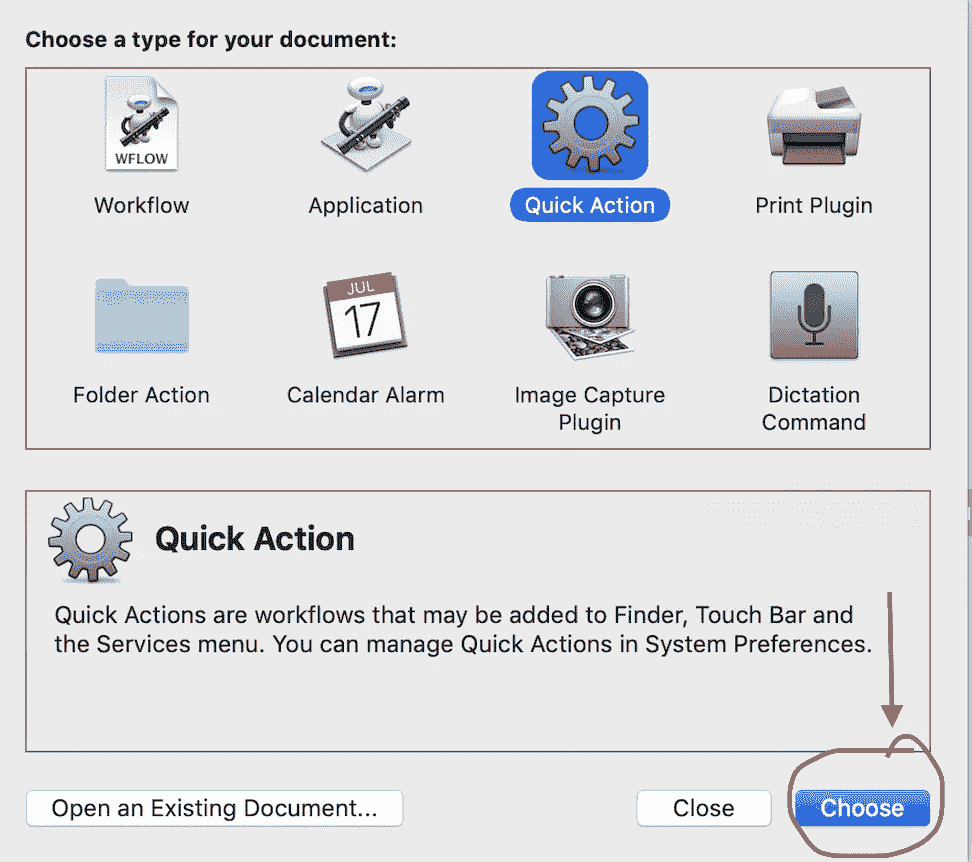

在 Automator 中创建快速动作(图片来源:作者)

然后，在左上角的搜索栏中，键入“shell”并选择 Quick Action。

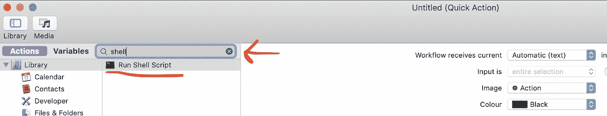

外部 Python 工具将作为 shell 脚本启动(由作者提供)

返回到您在步骤 3 中成功启动脚本的终端窗口，并运行:

```
echo "`which python3` `pwd`/screenshot_to_imgur.py" | pbcopy
```

该命令会将启动脚本转储到您的剪贴板中。现在，回到 Automator 应用程序，将剪贴板的内容(⌘ Cmd + V)粘贴到为代码输入设计的文本框中。

此外，请确保标记工作流不接收任何输入。您的表单应该看起来像这样，您应该能够通过点击应用程序右上角的播放按钮来运行它。

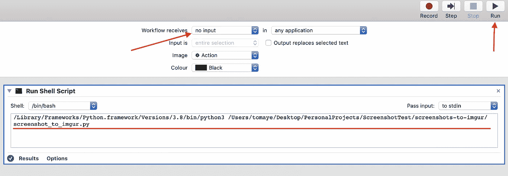

测试新的 Automator 工作流程(图片来源:作者)

点击⌘Cmd + S 保存工作流程(例如，保存为“ScreenshotToImgur”)。接下来，点击⌘Cmd +空间，键入键盘，并前往快捷方式标签。

在右侧菜单中，找到“服务”选项，然后一直向下滚动到左侧，直到在“常规”选项卡下找到您创建的 ScreenshotToImgur 服务(或您称之为的任何服务)。

单击服务右侧的“none”字段，并为其添加一个键盘快捷键。我个人更喜欢⇧Shift + ⌘Cmd + 5。

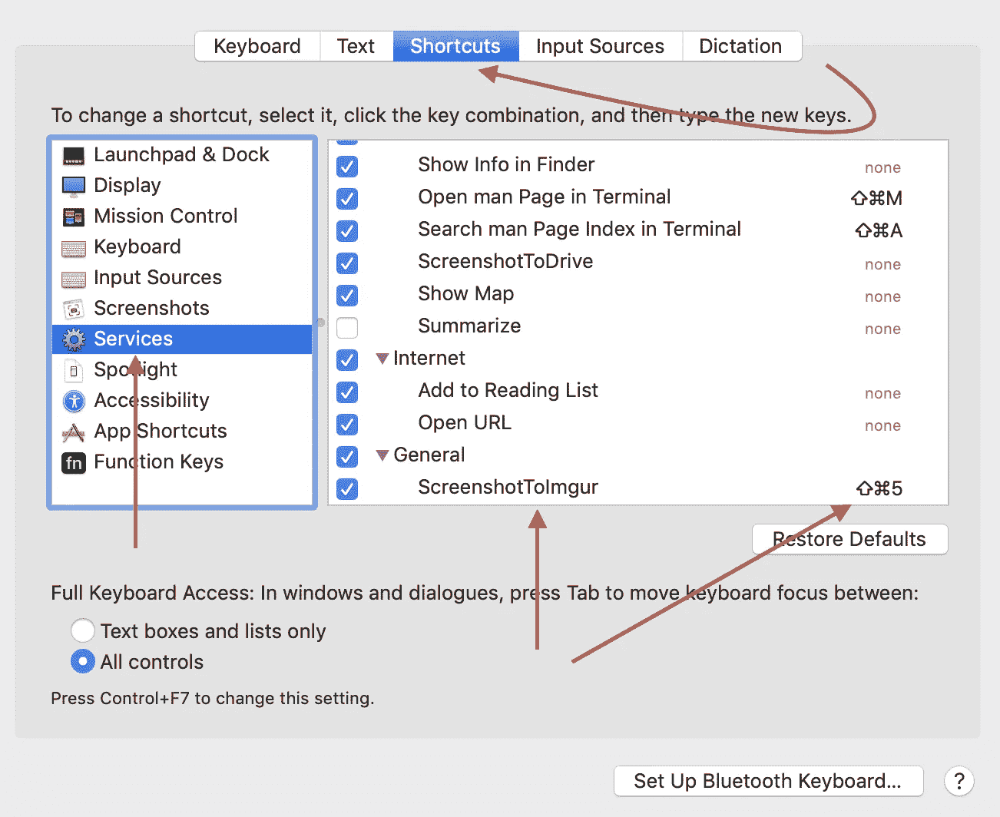

将工作流绑定到快捷方式(图片来源:作者)

现在试试你的新捷径。您的光标应该变成屏幕截图，服务应该启动。多酷啊。

如果这个解决方案不适合你，或者你发现了一些意想不到的错误，请在评论中告诉我，我会尽力帮助你。

# 结论

恭喜你！从现在开始，任何时候你需要截图并与他人分享网址，你的指尖都有一个解决方案，只需几秒钟就能完成。

在技术世界里，分享截图是一种方便且非常有效的方式，可以让业务利益相关者了解项目的最新进展。我希望这个小生活帮能在你的职业生涯中为你节省很多时间。

# 资源

*   [GitHub](https://github.com/TomasYeOpenSource/screenshots-to-imgur)