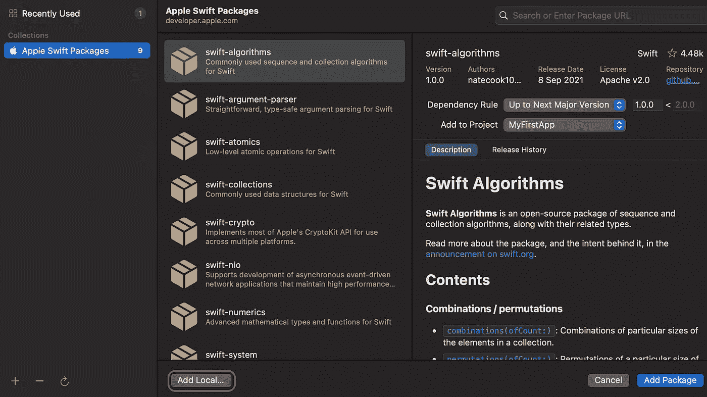
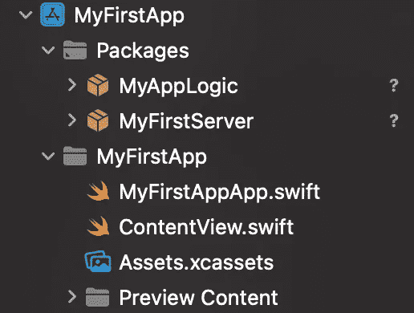
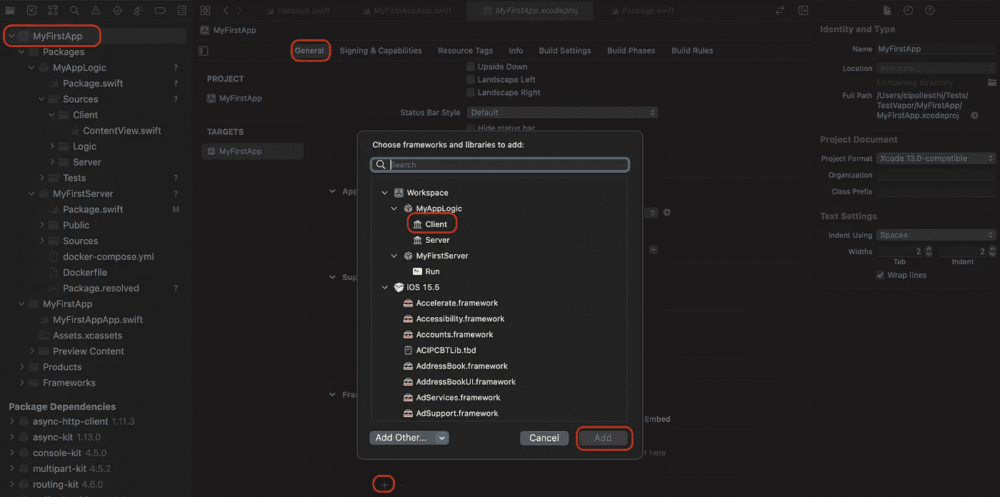
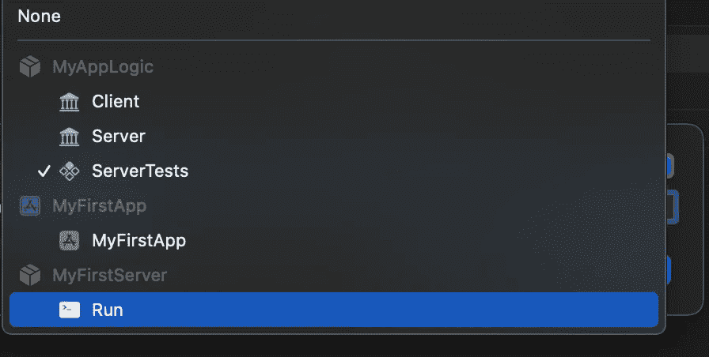
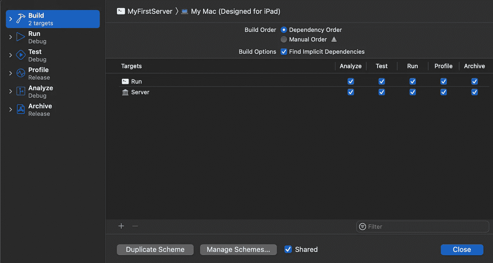
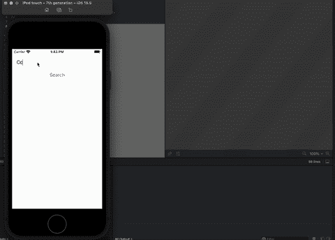

# 在客户端应用程序和 Vapor 服务器之间共享 Swift 代码

> 原文：<https://betterprogramming.pub/share-swift-code-between-client-and-vapor-server-94df9cc42543>

## 设置一个项目，其中 Vapor 共享大多数代码


照片由[阿卜杜勒拉赫曼·索比](https://unsplash.com/@sobhyabdo?utm_source=medium&utm_medium=referral)在 [Unsplash](https://unsplash.com?utm_source=medium&utm_medium=referral) 上拍摄

Swift 中我还没有研究的一个方面是服务器端开发。最著名的框架之一是 Vapor。Vapor 是用 Swift 编写的，它附带了所有标准的服务器端 API:路由、请求处理、验证等等。

Vapor 还提供了额外的包来与数据库、缓存、web 套接字等公共服务进行交互。它的结构和依赖关系是使用 SPM 定义的。正是由于 SPM，您可以在同一个项目中拥有服务器和客户机，共享主要的应用程序逻辑。

今天，我想探讨如何建立一个项目，让服务器和客户端代码一起位于同一个 Xcode 项目中，在这个项目中它们可以共享一些逻辑。

# 设置蒸汽

这个项目设置的第一步是安装 Vapor。可以按照官方[网站](https://docs.vapor.codes/install/macos/)上的说明进行操作。运行此命令以安装 brew 公式:

```
brew install vapor
```

安装后，您可以创建第一个应用程序来探索 Vapor 的结构。从终端运行以下命令:

1.  `vapor new MyFirstServer -n`创建第一个服务器。
2.  `cd MyFirstServer`。
3.  `open Package.swift`。

最后一个命令打开 Xcode，IDE 开始解决依赖关系。这可能需要一些时间来完成。完成后，您会在 Xcode 的顶部栏中看到一个用于 MacOS 的`MyFirstServer`目标:


单击播放按钮启动服务器。一旦加载，服务器使用端口`8080`响应`localhost`。如果连接到`http://127.0.0.1:8080/`，它会输出消息`It works!`。

默认情况下，服务器已经响应了另一个端点`hello`:当然，完整地址是`http://127.0.0.1:8080/hello`，输出消息是`Hello, world!`。

## 蒸汽结构

蒸汽基 app 的主要结构包括:

*   一个`Public`文件夹，用于存放静态文件，如图像、图标和脚本。它必须配置为正常工作，如这里的[和](https://docs.vapor.codes/getting-started/folder-structure/#public)所述。
*   一个`App`文件夹，其中包含一个`Controllers`文件夹，您可以在其中添加所有的逻辑。您可以使用`App`文件夹来配置其他逻辑元件。设置路线的`configure`功能位于此。
*   一个带有`main.swift`文件的`Run`文件夹。这是服务器应用程序的入口点:它加载环境变量，然后创建、配置和启动应用程序。

## Package.swift

服务器应用程序的核心结构由`Package.swift`文件定义。模板文件如下所示:

这里需要注意的要点是:

*   `Vapor`依赖项，从 GitHub 的`dependency`属性中加载。
*   `App`目标，它依赖于`Vapor`产品。
*   名为`Run`的`executableTarget`依赖于目标`App`。

这个结构告诉你除了`executableTarget`之外的所有东西都可以被移动到另一个包中，并由`Run`目标导入。

通过提取它，您将能够在服务器和客户机之间共享模型和逻辑。

# 创建可共享的包

为了将`executableTarget`与逻辑的其余部分隔离开来，您需要首先创建一个单独的 Swift 包。

1.  在`MyFirstServer`文件夹的同一级，创建一个`MyAppLogic`文件夹。
2.  将`Package.swift`文件从`MyFirstServer`复制到`MyAppLogic`文件夹。
3.  通过拆除`executableTarget`更新`MyAppLogic/Package.swift`。
4.  将`Sources/App`文件夹从`MyFirstServer`移动到`MyAppLogic`。
5.  将`Tests/AppTests`文件夹从`MyFirstServer`移动到`MyAppLogic`。
6.  在`Package.swift`中，将目标中的`App`重命名为`Server`，将`AppTests`重命名为`ServerTests`。您可能还想将封装`name`更改为`MyAppLogic`。
7.  将所有文件夹从`App`重命名为`Server`。
8.  打开`ServerTests.swift`，将`@testable import`从使用`App`改为使用`Server`。
9.  在`Package.swift`文件中，添加一个`products`属性来生成一个名为`Server`的静态库，它依赖于`Server`目标。
10.  按下`⌘+b`，看到 Xcode 成功构建包。

完成所有这些步骤后，`MyAppLogic`文件夹的文件树应该如下所示:

```
MyAppLogic
├── Package.resolved
├── Package.swift
├── Sources
│   └── Server
│       ├── Controllers
│       ├── configure.swift
│       └── routes.swift
└── Tests
    └── ServerTests
        └── ServerTests.swift
```

而`Package.swift`应该是这样的:

接下来，您必须更新`MyFirstServer` `Package.swift`来消费新创建的包:

1.  打开`MyFirstServer/Package.swift`文件，从 Vapor 和除`executableTarget`之外的所有目标中移除依赖关系。
2.  使用`.package(name:path:)`选项向`MyAppLogic`包添加一个依赖项。
3.  更新`executableTarget`依赖项，从`MyAppLogic`包中消费`Server`产品。
4.  将`main.swift`文件更新为`import Server`而不是`import App`。
5.  运行服务器以确保一切正常。

服务器的新`Package.swift`文件现在应该是这样的:

此时，您不能同时打开`MyAppLogic`项目和`MyFirstServer`项目。如果包在 Xcode 的另一个实例中打开，Xcode 就不能读取它。

> 当运行服务器时，可能会因为某些符号丢失而导致失败。如果发生这种情况，尝试打开`MyAppLogic`项目并构建`Server`库。现在你应该准备好二进制文件供`MyFirstServer`应用程序使用。

# 添加应用程序

最后，您可以通过创建 SwiftUI 应用程序将所有内容放在一个项目中。首先从 Xcode 创建一个新项目，我们称之为`MyFirstApp`。

创建完成后，右击应用程序并选择`Add Packages`选项。在出现的对话框中，点击`Add Local...`按钮并选择`MyAppLogic`包。重复此操作，添加`MyFirstServer`包。



这一步将所有代码放在同一个项目中。文件夹结构现在应该如下所示:



现在，您可以为客户端、服务器或逻辑修改任何 Swift 文件。

## 使用应用程序中的逻辑包

要在应用程序中使用`MyAppLogic`包，您必须设置另一个库:

1.  更新`MyAppLogic/Package.swift`以公开另一个库。姑且称之为`Client`。
2.  在软件包支持的平台中添加`.iOS`平台。
3.  创建一个`MyAppLogic/Sources/Client`文件夹。
4.  将`ContentView`从`MyFirstApp`处移入。

`MyAppLogic/Package.swift`的最终版本现在应该是这样的:

## 运行应用程序

由于这种设置，您现在可以同时运行服务器和客户端。在顶部 Xcode 的工具条中，`MyFirstApp`目标被选中，你可以在一些 iOS 模拟器上运行它。点击`play`可能会失败，因为在上一步之后，您将`ContentView`文件从 SwiftUI 应用程序移动到了`MyAppLogic`包中。

要使它重新构建，您可以打开`MyFirstAppApp.swift`文件并在顶部添加`import Client`语句。

Xcode 应该会告诉你没有`Client`这种模块。这是因为您需要将库链接到应用程序:

1.  在项目导航器中单击项目。
2.  单击常规选项卡。
3.  向下滚动，直到到达框架、库和嵌入式内容部分。
4.  点击+按钮，从`MyAppLogic`包中选择客户端库。



另一个可以节省时间的技巧是确保在构建应用程序时重新编译`Client`库。如果没有这一步，可能会发生这样的情况:您在没有构建库的情况下运行应用程序，Xcode 运行的是它的一个过时版本，因此不会向您显示您最近的更改。

这可以通过制定计划来实现:

1.  点击 Xcode 顶部栏中的`MyFirstApp`。
2.  选择编辑方案...`option`。
3.  在 build 选项卡中，单击底部的小+号。
4.  将`Client`库添加到其中。

现在，每次运行 SwiftUI 应用程序时，Xcode 也会检查`Client`库中的一些文件是否已经更改，并最终重建它们。

## 运行服务器

目前，没有运行服务器的方法。这是因为服务器还没有方案，您需要创建一个。

1.  点击顶部栏中的`MyFirstApp`。
2.  选择管理方案...选项。
3.  点击底部的+按钮。
4.  打开目标，向下滚动，并选择运行目标。
5.  像以前一样叫它`MyFirstServer`。



现在，您可以编辑该方案，并确保它在您构建服务器应用程序时也构建了`Server`库。该流程与您在应用程序中遵循的流程相同:

1.  点击 Xcode 顶部栏中的`MyFirstServer`
2.  选择编辑方案…选项。
3.  在 build 选项卡中，单击底部的小+号。
4.  将`Server`库添加到其中。



> 当运行服务器时，确保可执行目标是我的 Mac，而不是任何其他风格的 Mac(为 iPad 设计)。在这种情况下，服务器将无法正确构建。

最后，您可以运行服务器，在顶部 Xcode 栏中切换所需的目标，同时运行客户端应用程序。

# 共享代码

现在，您的所有代码都在同一个 XCode 项目中。你可以随意修改任何包的任何部分:所以是时候在两个应用程序之间共享一些代码了。

## 设置软件包

在客户机和服务器之间共享代码有几个好处。当然，最明显的是代码重用。其次，它消除了与数据模型不同步相关的问题，因为服务器更新了它们，但是客户机被留下了。

SPM 可以让你非常容易地共享代码，创建一个新的目标作为两个应用程序的依赖。

1.  在`MyAppLogic`包中创建一个新的目标，并将其命名为`Logic`。
2.  使`Client`和`Server`目标都依赖于它。
3.  创建一个新文件夹`MyAppLogic/Logic`来添加共享代码。

记得在需要共享代码的文件中添加`import Logic`语句。

最后的`Package.swift`是这样的:

注意第 31 行，这里定义了`Logic`包，第 22 和 32 行在`Client`和`Server`目标中都有新的`dependencies`。

## 数据模型

客户机和服务器之间最简单的共享是数据模型。例如，您可以创建一个如下所示的`Profile`模型:

这个`Profile`结构驻留在`Logic`目标中。它包含用户的用户名、名字、姓氏和生日。它有一个公共 init 和一个 helper 属性来将其转换为 Json。

> 在这个模块化设置中，可见性修饰符很重要:如果不将 init 标记为 public，就不能在服务器包中创建新的结构。

## 服务器

一旦定义了模型，您就可以在服务器和客户机中使用它。

要在`Server`库中使用它，您可以更新`routes.swift`文件以响应另一个端点:`profile`。代码可能如下所示:

该代码片段在第一行导入了`Logic`包，以便能够访问`Profile`数据结构。然后，它添加一个名为`profile`的端点，该端点接受一个路径参数。Vapor 允许您将路径参数与可用于检索其值的标签相关联。

该逻辑验证请求，并在失败时返回一些错误代码。如果一切正常，它就创建`Profile`结构并将其返回给调用者。

> 这是一个让客户机和服务器快速交互的例子。`profile`逻辑应包含在`ProfileController`中，以将端点代码与路由配置隔离开来。

# **委托人**

最后一步，您可以在客户端使用相同的结构。这个过程与服务器类似。客户端应用程序中没有路线，但您可以将它们嵌入到 SwiftUI 视图中。

打开`ContentView`并修改如下:

该视图允许您输入用户名，并在后端进行搜索。一旦搜索完成，它将数据呈现在一个类似表格的结构中，该结构使用一个名为`DataRow`的子视图来水平排列键值对。

`search()`函数使用 async-await 与后端连接，并使用在`Logic`包中定义的`Profile`结构解析数据。一旦解码，对象被存储在一个`@State`变量中，其值被用来填充视图。

以下视频展示了运行中的客户端和服务器:



> 这是一个让客户机和服务器快速交互的例子。与服务器通信的逻辑应该放在适当的网络组件中，SwiftUI 子视图应该放在自己的文件中。

# 结论

今天我试图把几个想法浓缩成一篇文章。总结一下:

*   如何用 Vapor 建立一个新项目，描述它的基本结构。
*   如何从代码中分离出 Vapor 可执行文件？
*   如何用服务器、逻辑和客户机创建单个项目。
*   如何在服务器和客户端之间共享代码。
*   如何一起运行它们。

除了代码重用之外，这种设置还带来了各种优势:

*   它推动了更好的模块化和代码结构。
*   它将逻辑隔离在单个 SPM 包中，使可执行文件保持一行。
*   它让您保持客户端和服务器之间的代码同步。
*   编写单元测试和集成测试应该更容易。

本文中讨论的代码可以在这个[库](https://github.com/cipolleschi/MyVaporTest)中找到。