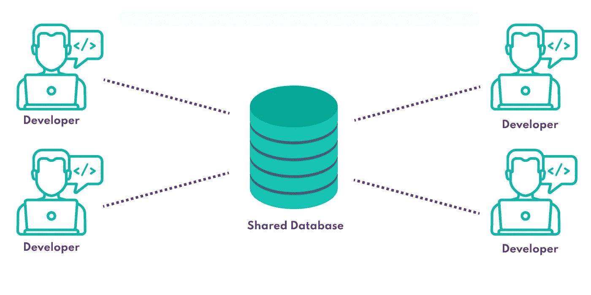
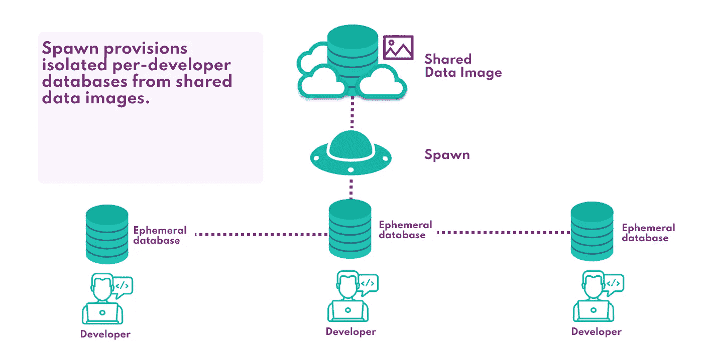

# 为什么共享数据库已经成为过去

> 原文：<https://betterprogramming.pub/shared-databases-are-a-thing-of-the-past-a9b186c0271e>

## 有了 Spawn，不再需要共享开发数据库

达里奥·维罗内西在 [Unsplash](https://unsplash.com?utm_source=medium&utm_medium=referral) 上拍摄的照片。

共享数据库范例是一种常见的开发工作流，其中团队中的所有开发人员共享对一个数据库的访问，他们都使用该数据库来支持应用程序开发。这种工作流程通常被采用，因为它很简单。不需要为每个工程师配置基础架构，因此设置成本最低。但这给工程师们带来了痛苦和瓶颈，他们总是面临着做出破坏彼此工作的改变的风险。

[Spawn](http://spawn.cc) 让我们能够轻松地为开发提供数据库，让每个工程师都拥有自己的专用数据库环境，而无需提供任何额外的基础设施。

# 共享数据库

开发人员使用共享数据库。作者照片。

共享一个数据库通常涉及到生产数据库的一个副本(适当地屏蔽掉敏感数据，并可能子集化以减小其大小)，该副本由团队中的所有开发人员共享。共享数据库的好处在于需要管理的基础设施更少，开发人员只需将连接字符串插入共享数据库，就可以快速启动并运行。

然而，虽然这种设置可能适用于非常小的团队或者数据库更改非常少的团队，但是这种方法很快会遇到几个问题:

*   踩着对方的脚趾:开发人员可能会尝试对共享数据库进行冲突性的更改，冒着相互抹杀工作的风险。
*   不能安全地应用迁移:更改一个特性的数据库模式可能会破坏其他代码。
*   未知状态:当数据库的状态可能在单个开发人员的控制之外从一个时刻改变到下一个时刻时，错误再现和应用程序测试变得更加困难。

随着容器化使得数据库供应比以往更加容易，消除了基础设施供应的开销，共享数据库范式越来越过时。

# 每个开发人员一个数据库

在这种模式下，团队中的每个开发人员都有他们自己的(屏蔽的)生产数据库副本来工作。这允许开发人员独立地对他们的数据库副本进行更改，消除了因争用共享数据库而产生的问题。

这在传统上更加困难，因为我们必须为每个开发人员提供类似生产的应用程序数据库的副本。然而，通过使用 [Spawn](http://spawn.cc) ，我们可以从命令行提供临时数据库实例，而不需要设置或托管任何额外的基础设施:

开发人员使用 Spawn 来提供专用数据库。作者照片。

使用 Spawn，我们可以每天从生产中创建一个[数据映像](https://spawn.cc/docs/concepts-data-image)(作为预定构建管道的一部分)，并使这个映像对开发人员和 CI 系统都可用——所有这些都使用 [Spawn CLI](http://spawn.cc/docs) 。可以从备份文件或脚本创建映像。然后，每个开发人员都可以基于这个映像提供他们自己的数据库，而不需要离开命令行，就像运行`spawnctl create data-container <prod-image>` *一样简单。*

在幕后，Spawn 在 Kubernetes 集群中创建和托管一个容器化的数据库实例，将开发团队从管理他们自己的数据库基础设施的负担中解放出来，并获得开发专用数据库的所有好处。

使用 Spawn 对数据库供应有几个好处:

*   快速配置任意大的数据库:Spawn 使用块级文件系统快照来恢复和写入数据库。这意味着即使是最大的映像也可以在几秒钟内完成资源调配，并且写入速度保持不变。
*   快照和恢复:可以使用 Spawn CLI `spawnctl save`命令随时为数据库拍摄快照。用`spawnctl reset`回复到任何以前的状态。可以放心地更改数据库，因为返回总是很容易。
*   没有基础设施:Spawn 负责数据库供应和托管，允许开发人员专注于代码。
*   同一个映像的多个副本:一个映像可用于提供所需数量的数据库—所有数据库都有自己的连接字符串，彼此独立且隔离。
*   多数据库支持:Spawn 支持 SQL Server、Postgres、MySQL、Redis 和 Mongo。

要了解更多关于 Spawn 的信息，请查看[的网站](http://spawn.cc)和文档。