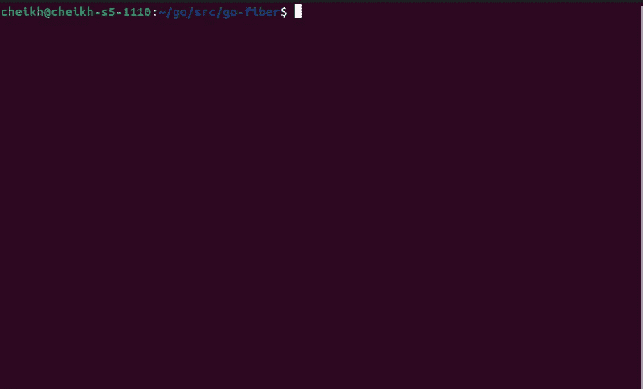

# 在“go-fiber”中共享数据库连接

> 原文：<https://betterprogramming.pub/sharing-a-database-connection-in-go-fiber-eedb305e9348>

## 我在 go-fiber 应用程序中路由变量的方法。


马特·邓肯通过 unsplash 拍摄的图片

`go-fiber`是一个 Go web 框架。它的灵感来自 ExpressJS，使用后，相似之处是不可思议的。如果你不知道的话，ExpressJS 是一个为 NodeJS 开发的 web 框架。它简化了路由和 HTTP 请求的处理。从 NodeJS 背景来看，`go-fiber`似乎是一个构建 API 的好选择。在这篇文章中，我将详细介绍我与请求处理程序共享变量的方法。

# 样板文件

用`go-fiber`启动一个 API 服务器非常简单。下面的代码将在服务器的根目录注册一个端点，并在端口`3000`开始监听:

```
package mainimport "github.com/gofiber/fiber/v2"func main() {
 app := fiber.New() app.Get("/", func(c *fiber.Ctx) error { // writes Hello, World as output
    return c.SendString("Hello, World!")
 }) app.Listen(":3000")
}
```

在这篇文章中，我将定义一个名为`Database`的自定义类型。这将是我将与我的 HTTP 处理程序共享的类型。这种类型的定义如下:

```
type Database struct {
 Name string
}func (d *Database) Get() string {
 return d.Name
}
```

为了抽象存储和检索数据，我将定义两个通用函数。通过使用泛型，我将避免在我的 HTTP 处理程序中处理任何`interface{}`类型。这两个函数的定义如下:

```
func SetLocal[T any](c *fiber.Ctx, key string, value T) {
 c.Locals(key, value)
}func GetLocal[T any](c *fiber.Ctx, key string) T {
 return c.Locals(key).(T)
}
```

如你所见，我依靠`fiber.Ctx.Locals`来存储和获取一个变量。接下来，我将实现一个中间件函数来存储每个请求的数据库变量。该变量将用函数`SetLocal`存储。中间件功能将在主功能中定义。以下是功能`main`的修订版:

```
func main() {

app := fiber.New()
db := Database{"Virtual_DB"} app.Use(func(c *fiber.Ctx) error { SetLocal[Database](c, "db", db)
  // Go to next middleware:
  return c.Next()
 }) app.Get("/", GetRoot) app.Listen(":3000")
}
```

如果你注意到了，我重构了我的根处理程序来使用函数`GetRoot`。这就是将数据库存储为局部变量的优势所在。由于`GetRoot`不在主函数范围内，它不能访问我在那里定义的`db`变量。

我必须能够在没有全局变量的情况下检索它。这可以通过`fiber.Ctx.Locals`实现。下面是功能`GetRoot`的定义:

```
func GetRoot(c *fiber.Ctx) error { db := GetLocal[Database](c, "db")
 fmt.Println(db.Get()) return c.SendString("Hello, World!")
}
```

下面是实际运行的代码:



# 结论

`go-fiber`是一个简单、快速、惯用的 web 框架。我花了大约 30 分钟翻箱倒柜，才弄清楚我需要什么来构建这篇文章中概述的功能。然而，我的观点可能有所偏颇，因为我在实现 ExpressJS 服务器方面有很长的历史。

但是，ExpressJS 方法已经经过了试验和测试。这个包很好地捕捉和再现了 ExpressJS 的魅力。你可以在下面的帖子中找到该程序的完整运行版本。

这篇文章很短，但那是因为`go-fiber`使这种简单成为可能。

# 附加链接

[](https://docs.gofiber.io/) [## 欢迎

### 光纤带来的高性能、高价值。默认情况下，Ctx 不是不可变的，将在请求间重用。作为一个…

docs.gofiber.io](https://docs.gofiber.io/) [](https://github.com/cheikhshift/medium_examples/tree/main/go-fiber) [## medium _ examples/go-fiber at main cheikh shift/medium _ examples

### 中型文章的代码示例。在 GitHub 上创建一个帐户，为 cheikhshift/medium_examples 开发做贡献。

github.com](https://github.com/cheikhshift/medium_examples/tree/main/go-fiber)