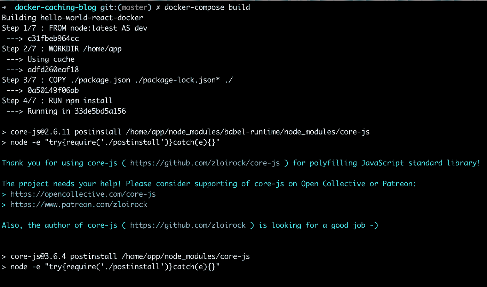
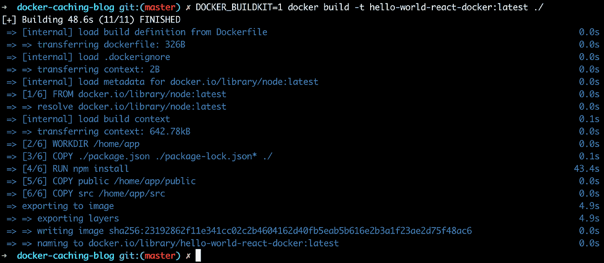
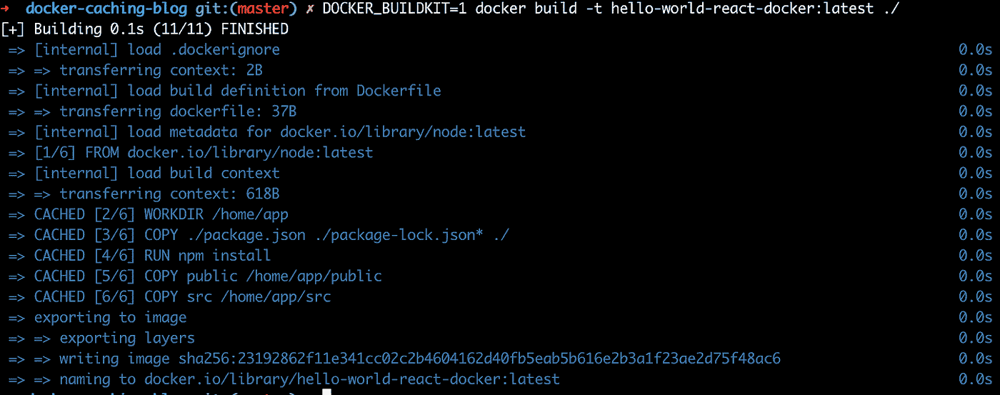
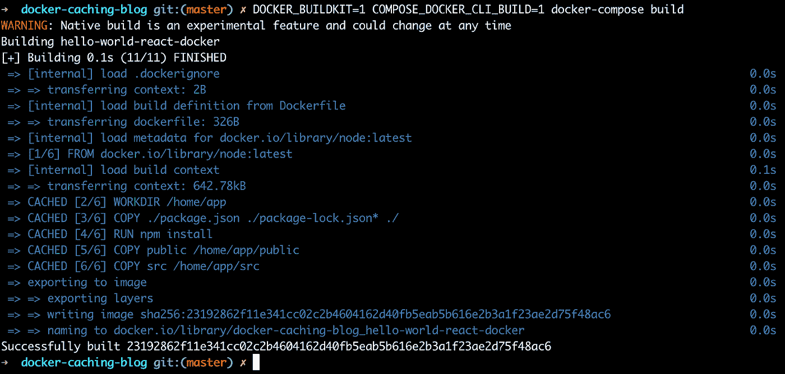

# 在 Docker 和 Docker Compose 构建之间共享缓存层

> 原文：<https://betterprogramming.pub/sharing-cached-layer-between-docker-and-docker-compose-builds-c2e5f751cee4>

## 改进您的 Docker 缓存

Marc-Olivier Jodoin 在 [Unsplash](https://unsplash.com?utm_source=medium&utm_medium=referral) 上拍摄的照片

本文是我们探索 Docker 缓存的第二部分——如果您还没有看过的话，请阅读第一部分,其中我们介绍了 Docker 层和缓存机制。现在让我们看看 Docker Compose，以及同时使用 Docker 和 Docker Compose 时的一些挑战。

# Docker Compose 是一个很棒的开发工具

我们使用`docker build`和`docker run`命令在本地从 Docker 映像构建/运行我们的应用程序。如果我们有一个包含多个组件的项目(例如，一个客户端和一个服务器)，构建和运行每个组件会很快变得繁琐和低效。幸运的是，有 Docker Compose——一个为运行多容器应用程序而设计的 CLI 工具。

Docker Compose 完全独立于 Docker，但在内部使用 Docker 引擎来协调多个容器的构建和运行。Docker Compose 的概述和安装说明可以在[官方网站](https://docs.docker.com/compose/)找到。

虽然每个组件仍然有自己的 Dockerfile 来描述应该如何构建映像，但是我们现在也有了一个`docker-compose.yml`文件——所有需要一起运行的容器及其运行时属性的 YAML 描述符。

**注意:**你可以在这里获得关于如何在开发过程中使用 Docker Compose 的更深入的细节[。](https://medium.com/tsftech/how-to-fully-utilise-docker-compose-during-development-4b723caed798)

让我们来看看`docker-compose.yml`如何看待我们的例子(这相当简单，因为我们只有一个组件):

我们只需定义一个名为`hello-world-react-docker`的服务，将构建上下文设置为包含 Dockerfile 的目录，并公开相关端口——就像我们在使用`docker run`启动容器时所做的那样

**注意:** `stdin_open: true`是 react-scripts 3.4.1 在编写时对[开放 bug](https://github.com/facebook/create-react-app/issues/8688) 的一种变通方法，其中 react 的`npm start`命令在开发服务器启动后立即退出，状态代码为`0`。

现在，运行`docker-compose up`将构建相关的图像并启动它们，因此在浏览器中，您将再次看到熟悉的 React 主页。万岁，我们正在使用 Docker Compose 从 Docker 映像运行 React 应用程序！

# 问题:Docker 和 Docker 合成版本之间的缓存共享

因此，我们有一个示例应用程序——我们可以将其打包为 Docker 映像，并在任何地方运行。我们可以使用标准的 Docker 命令(`build`和`run`)或者使用对开发人员更友好的`docker-compose`来本地构建和测试我们的应用程序。

然而，您可能已经注意到了一个小问题——尽管我们已经首先使用`docker build`命令构建了一个 Docker 映像(并且缓存了所有相关的层),但是使用`docker-compose`构建会导致整个映像的重建(因此我们必须等待`npm install`完成几分钟)。当我们使用 Docker Compose 运行后续构建时，缓存的表现与预期一样，构建周期很快。

看看下面的输出——虽然之前已经用 Docker 构建了映像，但用 Docker Compose 构建并不使用缓存层，而是重建一切(正如我们所看到的，慢速的`npm install`命令一直在运行)。

因此，Docker 和 Docker Compose 像预期的那样单独工作，重用以前构建中缓存的层。但是当使用这两种工具并在它们之间切换时，缓存似乎不起作用

为什么这是一个问题？好吧，让我们假设你有一个包含许多容器化组件的项目，所有这些都需要一些时间来从头构建。您正在处理单个组件，但是团队中的其他开发人员不断地将更改推给其他人。每个提交都构建在 CI 服务器上，因此您可以下载它。

这是为什么呢？

好吧，原因隐藏在 Docker Compose 代码库中。Docker Compose 使用 Docker Python 客户端库与 Docker 引擎进行交互，而 Docker 命令本身就可以做到这一点，不同的实现会导致使用任一工具构建的图像具有不同的图像 id，这会对缓存层产生上述影响。

在 Docker 和 Docker Compose 项目的几个标签中报告并讨论了该问题:

*   [https://github.com/docker/compose/issues/5873](https://github.com/docker/compose/issues/5873)
*   [https://github.com/docker/compose/issues/883](https://github.com/docker/compose/issues/883)

# 解决方案:输入 BuildKit

虽然对于如何为当前的 Docker 引擎版本解决这个问题还没有达成一致，但有一个简单的解决方案，使用仍然处于实验阶段(但很快成为主流) [BuildKit](https://docs.docker.com/develop/develop-images/build_enhancements/) Docker 引擎。

BuildKit 带来了期待已久的新架构和 Docker 引擎的重构，这应该会带来性能、存储管理和安全性方面的许多改进，包括增加 Docker 和 Docker Compose 映像构建之间的缓存一致性。

我们希望 BuildKit 在 Docker 的下一个版本中成为默认的，但是现在，虽然它仍然是试验性的，但它可以通过简单地设置`DOCKER_BUILDKIT=1`环境变量来启用。

**注意:**在撰写本文时，BuildKit 只适用于 Linux 容器。

让我们使用`docker build`命令重新构建我们的应用程序:

您将看到一个更简单的构建过程的内联输出，这是 BuildKit 的特征，以及每一层的计时——和以前一样，`npm install`命令花费了最多的时间。您会注意到整个图像都是从头开始构建的——build kit 具有不同的层存储策略，因此使用传统引擎构建的层不能作为缓存重用。

重复该命令将大大加快构建速度，因为所有图层都将被缓存并重复使用，而无需重新构建。您可以在下面的代码片段中看到使用层缓存的构建步骤前面的`CACHED`输出:

Docker Compose 怎么样？之前，我们已经看到 Docker Compose 没有重用使用`docker build`命令构建的缓存层——让我们看看这是如何改变的。

要启用 Docker Compose 的 BuildKit，需要一个额外的环境变量`COMPOSE_DOCKER_CLI_BUILD=1`。让我们使用 Docker Compose 重新构建应用程序:

呜-呼！构建速度非常快，因为所有层都被重用了，尽管这是第一个 Docker 构建的图像。使用`docker build`命令构建的层已经从缓存中重用，如上面输出中的`CACHE`标签所示。

在本文中，我试图阐明 Docker 缓存以及在开发过程中使用 Docker 和 Docker Compose 工具的相关问题。请记住，无论您使用什么引擎或工具，关键是要构建您的 docker 文件描述符，以便它们能够感知层缓存—确保通过使用多个`COPY`、`ADD`和`RUN`命令，根据引用组件的生命周期，将最频繁更改的文件或命令复制/运行到 docker 文件的底部！