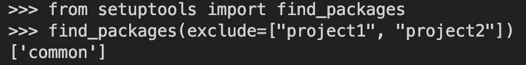
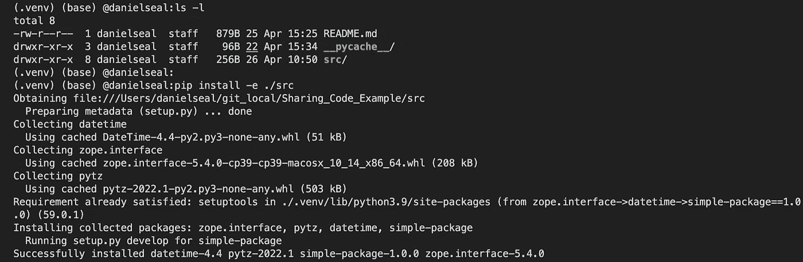
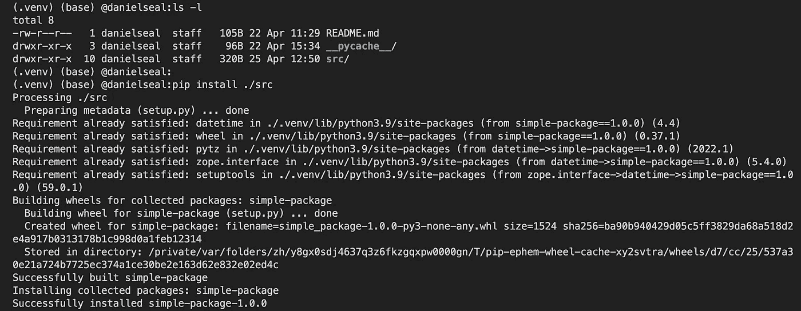
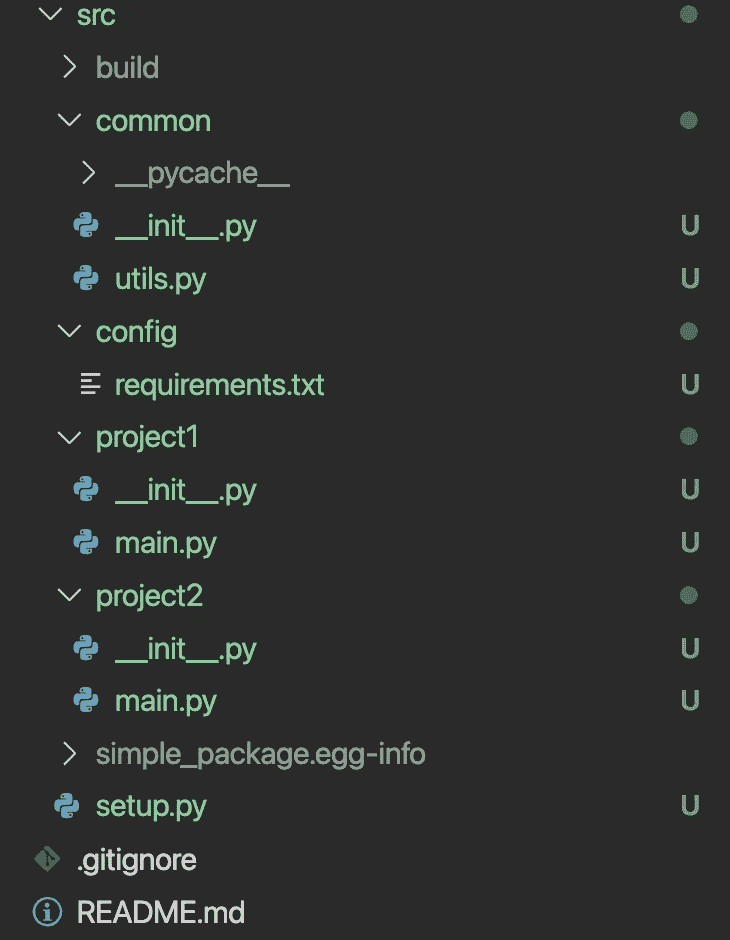
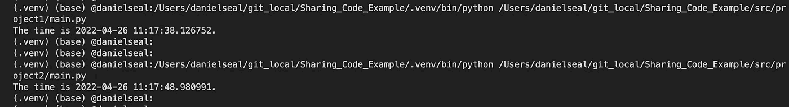

# 使用 Python 中的 setup.py 文件共享代码

> 原文：<https://betterprogramming.pub/sharing-code-using-a-setup-py-b6a596646532>

## 一篇关于如何在 Python 项目中共享代码的文章


由 [Unsplash](https://unsplash.com?utm_source=medium&utm_medium=referral) 上[absolute vision](https://unsplash.com/@freegraphictoday?utm_source=medium&utm_medium=referral)拍摄的照片

# **问题**

您有以下项目结构:

```
├── **src** ├── **common
**     ├── __init__.py
     └── utils.py ├── **config
**     └── requirements.txt ├── **project1
**     ├── __init__.py
     └── main.py ├── **project2
**     ├── __init__.py
     └── main.py├── README.md
```

其中两个子项目`<project1>`和`<project2>`都有一个使用相似代码的`main.py`文件。

您(希望)将这个*共享的*代码存储在第三个目录`<common>`中的`utils.py`文件中。

要使用存储在`utils.py`中的任何函数，您尝试将以下导入语句写入`<project1>`和`<project2>`的`main.py`文件中:

```
from common.utils import <function1>, ...
```

并且您得到下面的 *ModuleNotFoundError* :

```
ModuleNotFoundError: No module named 'common'
```

然后，您尝试将 import 语句修改为:

```
from .utils import <function1>
```

或者

```
from ..utils import <function1>
```

返回一个*导入错误:*

```
ImportError: attempted relative import with no known parent package
```

# **这怎么解决？**

在本文中，我将解释为什么您会收到这些错误，以及如何通过使用一个创建 Python 包的`setup.py`文件来避免这个问题。

首先…

## **有哪些错误？**

> ModuleNotFoundError:没有名为“common”的模块

当您尝试导入未安装在您的(虚拟)环境中的 Python 包/模块时，会出现此错误。如果您运行该命令:

```
pip list
```

在您的终端(mac)或命令行提示符(windows)中，您试图安装的模块将不在输出到屏幕的列表中。例如，在收到我得到的`ModuleNotFoundError`后，在我的虚拟环境(venv)中运行`pip list`命令:

```
Package        Version
-------------- -------
pip            21.3.1
setuptools     59.0.1
```

这不包含对`<common>`包文件夹内`utils.py`的任何引用。

> ImportError:试图在没有已知父包的情况下进行相对导入

当您试图从一个父包中导入一个模块，但是 Python 在`__main__`中存储了一个不同的父包时，就会出现相对导入错误。本质上，您是在告诉 Python 从它不知道的包中导入。

关于 Python 如何在它的`__main__`变量中存储信息的一个很好的解释可以在[【脚本与模块】StackOverflow 回答这里](https://stackoverflow.com/questions/14132789/relative-imports-for-the-billionth-time)中找到。

**注意:**相对导入不是 pythonic 式的，应该尽可能避免，以避免混淆并提高代码的可读性。

# **非 Pythonic 解**

您可能已经尝试过一些可能的非 pythonic 解决方案…

## **1。sys.path()**

您通常可以通过在错误导入之前将所需的包父路径添加到`sys.path`变量中来解决这两个错误。例如，将下面几行添加到`main.py`文件中:

但是，一般来说，我建议避免这种方法，原因如下:

*   **凌乱**:是凌乱。
*   **错误传播**:需要正确编码，避免因文件夹位置不同而被他人重复使用的错误。
*   **代码重复**:需要各加一个。包含导入错误的 py 文件。

## **2。重组项目**

您可以重新构建项目，并将每个子项目的`main.py`文件放在根目录下，使导入遵循向下的分层目录结构。

避免采用这种解决方案的两个主要原因是:

*   随着项目的增长，这种方法会变得杂乱无章、不清晰、杂乱无章。
*   定制化:它不允许你以一种可读和独特的方式构建你的项目。
*   **命名**:你不能用相同的名字命名文件，因为它们都在同一个目录下，这意味着你必须想出唯一的名字，比如`main1.py`和`main2.py`。

# 解决方案

`setup.py`去营救……

一个很好的经验法则是，如果一个项目中有许多代码可以被许多模块重用，那么就把它放到一个 Python 包中。

## **什么是 Python 包？**

包含`__init__.py`的文件夹会被 Python 识别为一个包。一个包文件夹*通常*包含多个模块。

可以使用`pip list`命令识别安装在您的(虚拟)环境中的包。

## **设置 setup.py**

*   一个`setup.py`文件提供了关于如何创建定制 Python 包的信息。它利用 Python 的`setuptools`库，基本文件如下所示:

基本 setup.py 文件

`setup()`的三大法宝是:

*   `name` —您的 Python 包的名称。
*   `install_requires` —将`setup.py`指向一个`requirements.txt`文件，该文件包含将成为包一部分的 Python 模块所需的 Python 库。第 3 行和第 4 行让`setup.py`从指定的位置读入所需的 Python 包。
*   `packages` —您希望`setup.py`包含在自定义 Python 包中的包。您可以使用`setuptools.find_packages()`来定位项目中的所有包，或者手动输入它们。`find_packages()`将识别所有包含`__init__.py`的文件夹。对于示例项目结构，运行`find_packages()`以包的形式返回以下内容(因为它们是包含`__init__.py`的文件夹)

```
['common', 'project1', 'project2']
```

*   我们只想将代码打包在`<common>`中，因此我们将`project1`和`project2`添加到`exclude` kwarg 中:

```
find_packages(exclude=["project1", "project2"])
```



## **包装安装**

考虑到本文“问题”部分的项目设置，以下是使用**上方的`setup.py` 截图时的更新结构。**

```
├── **src** ├── **common
**    ├── __init__.py
    └── utils.py ├── **config
**    └── requirements.txt ├── **project1
**    ├── __init__.py
    └── main.py ├── **project2
**    ├── __init__.py
    └── main.py ├── **setup.py** <--- Added in setup.py to the /src folder├── README.md
```

**注意:**`setup.py`文件需要位于用来构建定制包的包的位置(在`setup()`包 kwarg 中)。

要创建包，您需要转到`setup.py`文件的父文件夹 dir 并运行以下命令:

```
pip install -e ./<root of setup.py dir>
```

对于本文中的示例项目，您将运行`pip install -e ./src`:



运行 pip install -e ./src 时的终端标准输出

`-e`以可编辑模式(动态)运行软件包安装，它会自动检测开发时您对代码所做的任何更改，从而避免不断地重新安装软件包。

安装后，您可以通过重新运行以下命令来检查安装是否成功:

```
pip list
```

您现在应该可以看到您的软件包以及在列出的软件包中的`requirements.txt`中列出的软件包:

```
Package        Version Editable project location
-------------- ------- -----------------------------
DateTime       4.4
pip            21.3.1
pytz           2022.1
setuptools     59.0.1
simple-package 1.0.0   /Users/danielseal/git_local/Sharing_Code_Example/src
zope.interface 5.4.0
```

注意`pip list`输出的`Editable project location`部分。

如果你想*硬*安装包(静态的)，也就是说，对于一个稳定的版本，你不需要做任何改变，你可以简单地放弃`-e`并运行`pip install ./src`:



运行 pip 安装时的终端标准输出。/src

这个安装更加明确，在运行`pip list`后返回如下输出:

```
Package        Version
-------------- -------
DateTime       4.4
pip            21.3.1
pytz           2022.1
setuptools     59.0.1
simple-package 1.0.0        <--- this is the custom package
zope.interface 5.4.0
wheel          0.37.1\.      <--- see 2nd note below
```

当您不在`editable`模式下时，放下`-e`还会在`/build`文件夹中为您的项目中的包装创建一个轮子。

注意:

*   静态和动态安装都会在您的项目中添加一个`.egg-info`文件。
*   在运行`pip install ./src`之前，建议使用`pip install wheel`安装车轮组件，以避免出现未安装车轮的警告。



运行 pip intall 后的项目结构。/src(去掉了-e 以显示显式安装)。

在这一步，您已经成功安装了一个定制的 Python 包。

现在，当您运行之前出错的导入时，您应该不会得到任何错误…



包安装后运行 project1/main.py 和 project2/main.py 时的 stdout。

## 评论

*   **警告:**如果您静态安装了软件包(没有在 install 命令中添加`-e`)，您将需要重新运行安装命令，在最后添加`--upgrade`或`-u`，如果您对正在安装的软件包文件夹内的代码进行了更改(本例中为`<common>`):

```
pip install ./src --upgrade
```

*   **可编辑:**如前所述，使用`pip install -e ./src`安装软件包将在可编辑模式下安装软件包。它不会将`/build`文件夹添加到项目中
*   **版本控制:**如果您已经实现了 Python 包的新特性或修复，建议在`setup()` 中更新*版本* kwarg，以促进良好的版本控制。

关于使用 pip 更新本地 Python 包的 StackOverflow feed 很好地解释了-u(升级)和-e(可编辑)的用法。

`Setup.py`允许您创建一个定制的 Python 包，使您能够在一个项目中轻松地共享代码。只需将您的子项目和共享代码组织到包含一个`__init__.py`的文件夹中，并指示您的`setup.py`的`setup()`安装包含在共享代码文件夹中的代码。

运行`pip install -e ./<root of setup.py dir>`(可编辑模式)或`pip install ./<root of setup.py dir>`，你将安装`setup.py`定义的包。

一旦完成，你的项目将有两个额外的隐藏项，一个`/build`文件夹(没有`-e`)和一个`.egg_info`文件。

这些包含关于定制 Python 包的元数据，允许您共享代码，而没有任何`ImportError` 或`ModuleNotfoundError`错误。

本文中用于生成示例的代码可以在这里找到并复制:

[](https://github.com/Dseal95/Sharing_Code_Example.git) [## GitHub-dseal 95/Sharing _ Code _ Example:使用 setup.py 创建包并共享的示例…

### 使用 setup.py 创建包并在整个项目中共享代码的示例。

github.com](https://github.com/Dseal95/Sharing_Code_Example.git)