# 如何使用 Docker 绑定挂载和 CLI

> 原文：<https://betterprogramming.pub/sharing-is-caring-using-docker-bind-mounts-and-the-cli-34ff6f7cc0b2>

## 分享是关怀


就像 Snapchat 上那些令人遗憾的滤镜自拍一样，Docker 容器被设计成短暂的——当容器消失时，内部数据也随之消失。

幸运的是，有办法用 Docker 容器存储持久数据。在下面详细介绍的演练中，Docker 初学者将能够使用 CLI 命令探索 Docker 容器的`bind mounts`。

对于更有冒险精神的 Docker 用户，我建议使用 Docker Compose 探索 Docker 卷——敬请关注该演练！

# 目标

对于本演练，我将使用 CLI 构建和部署两个具有相同映像和网络的容器，每个容器都使用一种方法来处理持久数据；*绑定装载*又称*主机卷*。

## 绑定安装

绑定挂载，或*主机卷*，允许文件或目录从它们在主机上的绝对路径位置直接挂载到容器。

这种方法依赖于主机的目录和文件结构，因此不可移植。

该选项的管理通常发生在 Docker 之外，这可能会导致权限问题。此外，还存在提供对主机文件系统的访问权限的风险。

# 环境和先决条件

下面的规范是我用来完成本文中详细描述的任务的:

## 我的本地机器和操作系统

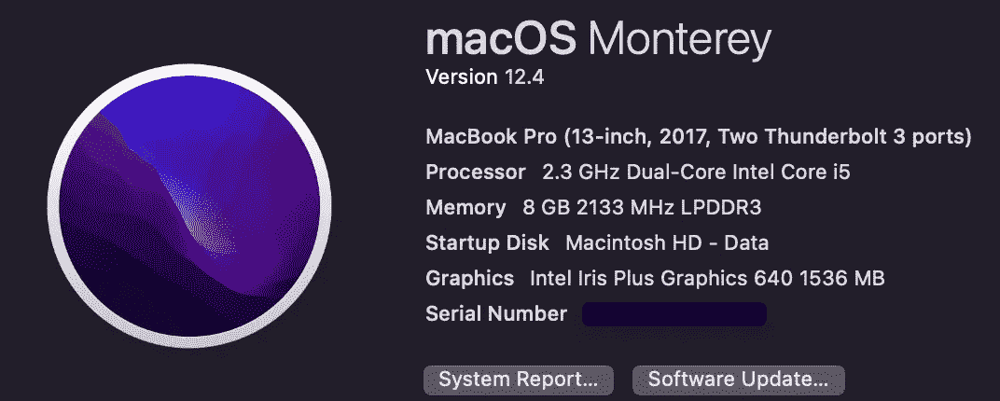

*MacBook Pro，2017；蒙特雷诉第 12.4 条*

## 集成开发环境

*   **Visual Studio Code***v . 1.68(通常称为“VSCode”)→添加这个 VSCode 扩展*:***Remote—SSH***(*我需要将这个扩展添加到 vs Code，以便轻松地 SSH 到我的 EC2 实例*)。*这里有一个很有帮助的* [*视频教程*](https://www.youtube-nocookie.com/embed/dS0dX3SGMAM?playlist=dS0dX3SGMAM&autoplay=1&iv_load_policy=3&loop=1&modestbranding=1&start=) *的设置，或者用这个* [*分步指导*](https://dev.to/dre4success/ssh-to-an-ec2-instance-from-vs-code-2707) *。*

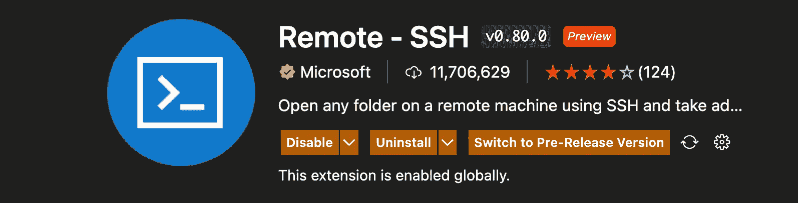

虚拟工作室代码 v. 1.86 for Mac，远程 SSH 扩展

## 虚拟服务器

*   **AWS EC2 实例**

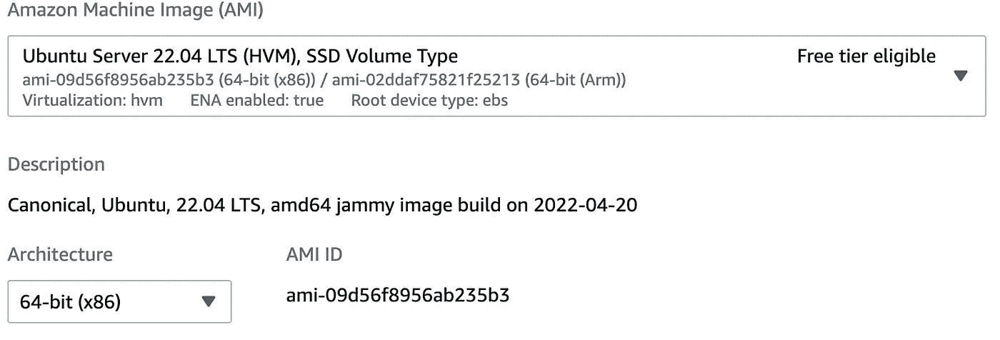

实例 AMI —运行 Ubuntu 22.04 LTS 海哲明

# 任务

1.  安装 Docker 并确保 Docker 守护进程正在运行
2.  创建两个本地目录——一个名为`webfiles`,包含以下文件:`infofile.txt`和`exportfile.txt`,另一个名为`webexport`,包含文件`websales.txt`。
3.  创建一个名为`webnet`的 Docker 网络
4.  启动两个带有 CentOS 映像的容器，并将其分配给`webnet`网络
5.  在两个容器中创建本地目录`webfiles`的挂载点
6.  验证两个容器都能看到`infofile.txt`和`exportfile.txt`

# 安装 Docker 并确保 Docker 守护进程正在运行

有几种安装 Docker 的方法，但是，我选择从存储库中安装，就像在新的主机上一样。文档[很容易理解:](https://docs.docker.com/engine/install/ubuntu/)

> **设置存储库**

1.  更新包并允许`apt`通过 https 使用存储库:

```
$ sudo apt-get update

$ sudo apt-get install \
    ca-certificates \
    curl \
    gnupg \
    lsb-release
```

2.添加 Docker 的官方 GPG 密钥。这将在安装前验证软件的完整性。

```
$ sudo mkdir -p /etc/apt/keyrings
$ curl -fsSL https://download.docker.com/linux/ubuntu/gpg | sudo gpg --dearmor -o /etc/apt/keyrings/docker.gpg
```

3.设置存储库。这个命令会将 Ubuntu 22.04 海哲明版的 Docker 库添加到`apt`源代码中。

```
$ echo \
"deb [arch=$(dpkg --print-architecture) signed-     by=/etc/apt/keyrings/docker.gpg]https://download.docker.com/linux/ubuntu \
$(lsb_release -cs) stable" | sudo tee /etc/apt/sources.list.d/docker.list > /dev/null
```

> **安装码头工人**

1.  再次更新`apt`包，安装最新版本的 Docker。

```
$ sudo apt-get update$ sudo apt-get install docker-ce docker-ce-cli containerd.io docker-compose-plugin
```

2.使用`hello-world`映像验证 Docker 守护程序正在运行。

```
$ sudo docker run hello-world
```

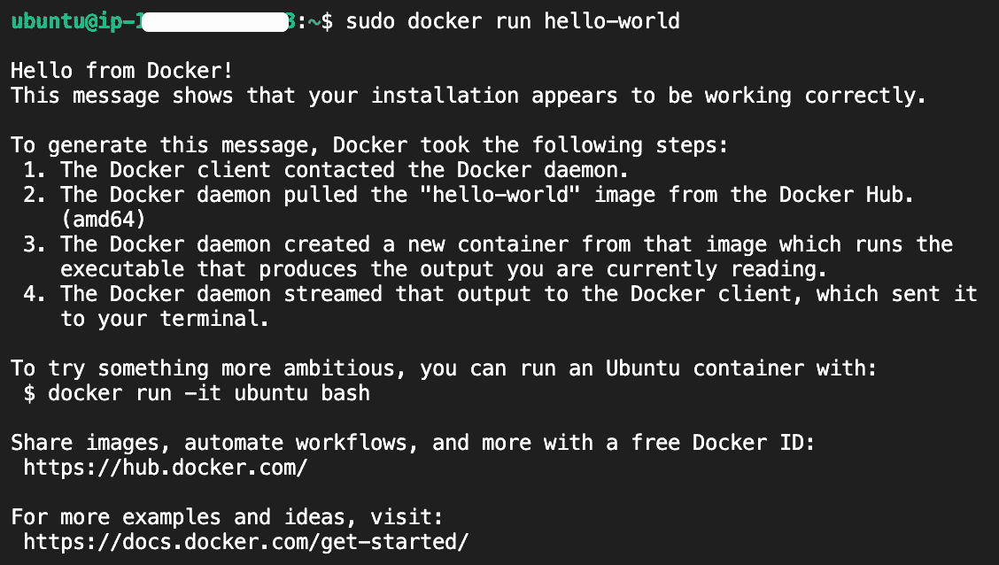

安装成功了！太神奇了！

***我真的要对每个 Docker 命令都使用*** `sudo` ***吗？***

如果您试图运行 Docker 命令 sans `sudo`，那么您可能会遇到以下错误:

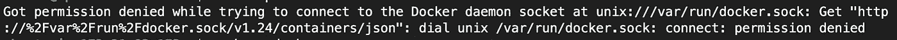

啊..

*   默认情况下，Docker 守护进程仅使用 root 权限运行，因此有两种选择:要么使用`sudo`运行每个命令，要么将当前用户添加到 Docker 组，以允许非 root 用户运行 Docker 命令。
*   为了更改当前用户的访问权限，需要使用`$ sudo gpasswd -a $USER docker`将他们添加到 Docker 组，然后使用`$ newgrp docker`激活更改。
*   通过运行一个简单的 Docker 命令如`$ docker --version`来测试您的无根访问，以确保更改是有效的。

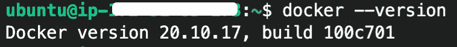

耶！没有须藤了！

# 创建包含文件的本地目录

下面创建的目录和文件将代表 Docker 容器将访问的本地文件系统。

创建一个名为`*webfiles*`的新本地目录

从终端，使用命令`$ mkdir webfiles && cd $_`创建并切换到新目录

在该目录中创建新文件:

```
$ touch infofile.txt exportfile.txt
```

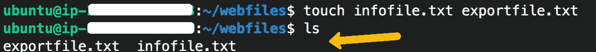

使用 ls 命令验证这两个文件都已创建

退出`*webfiles*`目录，返回工作目录。`$ cd —`

# 创建码头工人网络

> *创建一个名为* `*webnet*`的网络

Docker 安装本身包含三个默认的网络驱动程序— *主机*、*桥*和*空*。*网桥*是默认使用的网络驱动程序，如果没有指定的话，它允许同一个网络上的两个或多个容器进行通信。

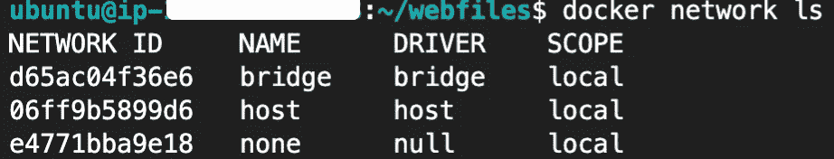

使用 docker 网络 ls，您可以列出现有的 Docker 网络。

在本练习中，我将创建一个[用户定义的桥接网络](https://docs.docker.com/network/bridge/)，而不是使用默认网络。

这种方法有几个优点，其中一些包括提供与附加的、不相关的容器及其应用程序堆栈的更好的隔离，以及附加和分离容器而不需要先停止和重新创建它们。

本练习的优势在于，用户定义的桥接网络可以允许多个容器共享环境变量，从而使它们能够装载 Docker 卷来共享信息:

```
$ docker network create <network_name>
```

要验证网络是否已创建，请使用`$ docker network ls`。要查看该网络的详细信息，请使用`$ docker network inspect <network_name>`。

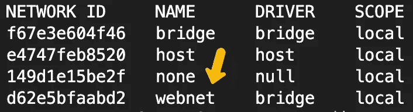

使用$ network ls 列出网络

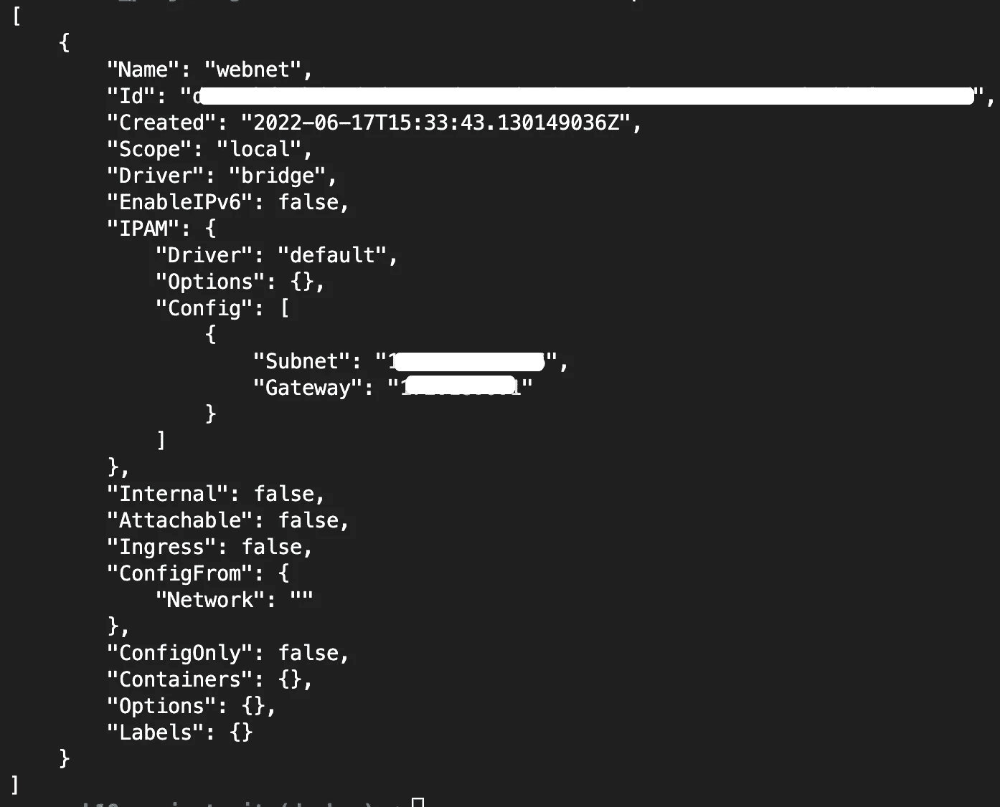

新创建的网络当前没有附加容器

# 启动两个运行相同映像的容器，分配给用户定义的网络，并使用绑定装载

把 CentOS 图像作为容器的基础。(提示:从技术上讲，您可以跳过这一步——如果您想使用官方图像而不是自定义图像，那么当您使用`docker run`创建容器时，就会创建该图像。)

```
$ docker pull centos:latest
```

使用映像启动容器，以分离模式运行，连接到用户定义的网络，绑定挂载指向本地目录。

```
$ docker run --network <network_name> \
-d \
-it \ 
-v "$(pwd)"/target:/app \
--name <container_name> \
<image> \
```

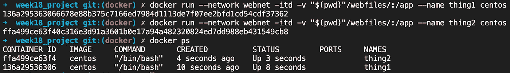

运行命令两次，并更改名称以区分容器。

运行`$ docker inspect <container_name>`来验证本地目录是否正确挂载。

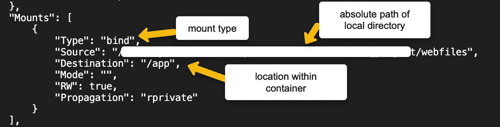

每个容器应该包含相同的信息。

# 验证两个容器都可以访问挂载的本地目录中的文件。

使用命令`$ docker exec -it <container_name> bash`登录到正在运行的容器并运行命令。

在容器内部，使用`ls`查看容器的文件系统，然后使用`cd`切换到包含已挂载卷的目录(`app`)。再次使用`ls`来列出它的内容，您应该看到两个文件— `exportfiles.txt`和`infofile.txt` —确认容器确实可以访问它们。对另一个容器重复该过程。

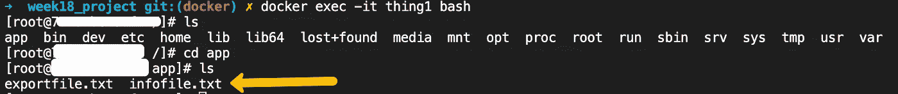

一旦进入容器，就可以使用 ls 查看容器的文件系统。

## 分解资源

使用`$ docker rm -f $(docker ps -a -q)`和任何用`$ docker rmi -f $(docker images -a -q)`创建的图像清理并移除容器。

# 思想

虽然本演练面向 Docker 和 Docker 卷的初学者，但也有一些以这种方式创建容器和卷的用例。

这对于创建一个或几个需要访问主机配置文件的容器，或者在 Docker 主机和容器的开发环境之间共享代码或工件非常有用。