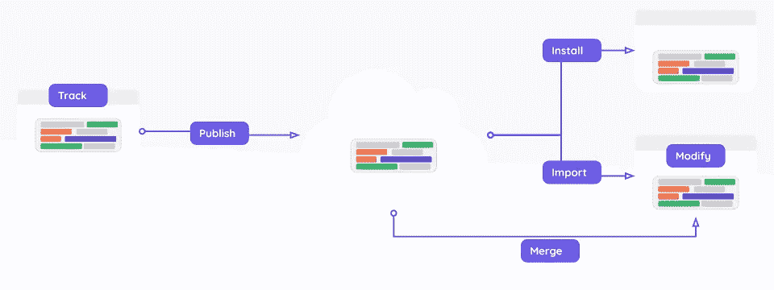
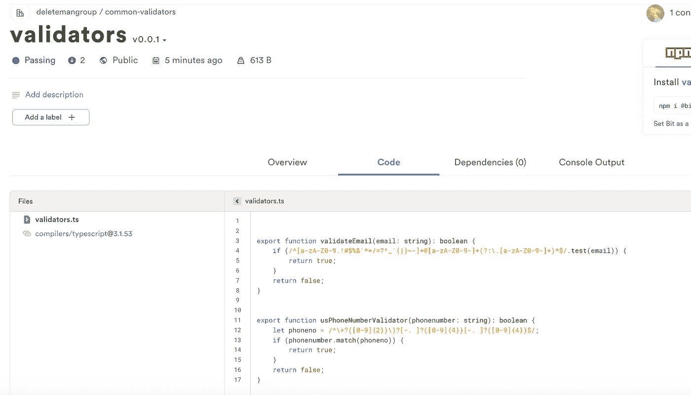
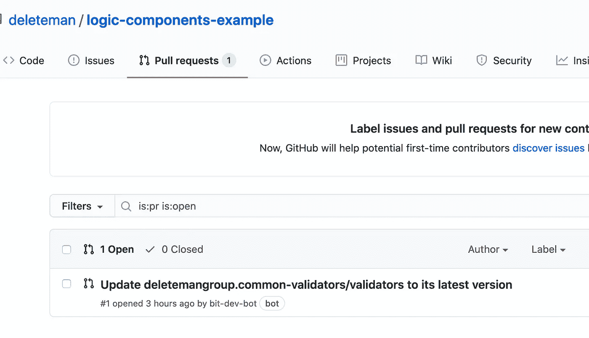

# 在前端和后端存储库之间共享逻辑组件

> 原文：<https://betterprogramming.pub/sharing-logic-components-between-frontend-and-backend-repositories-6fdc1f9cb850>

## 前端，后端，谁在乎？如果代码的逻辑有效，那么组件可以在任何地方共享


凯利·西克玛在 [Unsplash](https://unsplash.com?utm_source=medium&utm_medium=referral) 上的照片。

公司经常选择为前端和后端代码维护不同的存储库。当技术不同时，这很有意义(例如，在前端使用 JS，在后端使用 Java)。但是，即使你在前台和后台都使用 JS，保持独立的 repos 允许更简单的分支模型和版本控制工作流(每个团队都可以处理任何更适合他们需求的事情)。

也就是说，当这种情况发生时，某些逻辑组件(即解决一个特定过程的代码片段)将不得不在项目之间共享，以避免代码重复并保持功能和行为的一致性。这方面的一个例子是用户输入验证器，它不一定涉及特定的前端或后端代码，并在两个地方解决相同的问题。

对此肯定有解决方案，但大多数都要求您以包的形式提供这些公共代码，而这些包又需要从您的源代码中提取出来，放入它们自己的独立项目中。这给你的工作流程增加了额外的复杂性。通常，一个团队需要拥有它并负责更新、修改等。

然而，使用[位](https://bit.dev/)，您可以共享公共逻辑，就好像它是直接为您的项目编写的一样。不仅如此，由于 Bit 与 GitHub 的集成，您可以让所有存储库与自动 PRs 保持同步，自动 PRs 会通知您存储库使用的组件中的新变化。



跟踪任何回购的组件，并通过您自己的 Bit 服务器与其他回购共享它们。照片来自[位](https://bit.dev/)。

[](https://github.com/teambit/bit) [## 团队位/位

### 文档*教程*快速入门指南*工作流* bit.dev 组件云*视频演示 bit 是一个开源…

github.com](https://github.com/teambit/bit) 

这里有一件重要的事情需要注意:每个使用共享组件的存储库也将能够更新它，并将这些更新“推”回一个新的组件发布版本(给定适当的位权限)。这为更有效的协作铺平了道路，这种协作关注于单独的独立组件，而不是大型的整体存储库。

[](https://bit.dev)

我们的共享输入验证器

[](https://bit.dev)

共享组件改变后由 Bit 自动生成的 PR

# 先说一下比特

Bit 是一个工具，它使开发者能够在[其网站](https://bit.dev)或其他定制的 Bit 服务器上分享他们的 JavaScript 组件(我们正在谈论 React、Vue、Angular，甚至 Node.js 模块)。

Bit 常用于共享 UI 组件。然而，如果我们扩展我们的组件概念，我们可以看到 Bit 可以与任何后端组件或通用逻辑一起使用。这就是我今天想向你们展示的。

第一步是安装 Bit 的 CLI 工具，这就是我们将要使用的工具:

```
$ npm install bit-bin --global
```

# 一个简单的用例

假设我们需要将当前项目中的输入验证代码归纳为一个公司范围的组件，可以用于前端和后端。

代码已经在你的项目中了。你所要做的就是导出它，以某种方式使它可用，并将其集成到另一个代码库中。

正如我已经提到的，我们并不想从我们的解决方案中去掉代码。它已经存在，我们希望保持这种状态。太好了，比特可以处理。

因此，我们所要做的就是转到项目的根文件夹并键入:

```
$ bit init
$ bit import bit.envs/compilers/typescript --compile 
```

这将在我们的项目中启动一个 Bit 工作区，并添加 TypeScript 编译器，这是我将用于我的代码的东西(TS 编译器是另一个 Bit 组件，它确保我的组件不依赖于我的项目的构建设置)。

完成后，简单地写下:

```
$ bit add lib/validators.ts
$ bit tag --all 0.0.1 --message "first version"
```

当然，第一行将在我们有验证器的地方添加文件。现在，他们只有两个基本的例子:

代码正在导出两个验证函数:`validateEmail`和`usPhoneNumberValidator`。就是这样。

第二行将标记版本。本质上，它会对其进行快照并添加一个版本号，以便您以后可以引用它。这个新的锁定版本将会“输出”到 [Bit 的网站](https://bit.dev)上。

我们需要做的最后一件事是将我们标记的组件导出到您在 Bit 网站上创建的任何集合中。请记住，您首先必须访问网站，登录并设置收藏。

对于这个例子，我创建了一个名为“ [common-validators](https://bit.dev/deletemangroup/common-validators) ”的集合，我打算在其中发布我公司范围内的所有通用验证代码。

考虑到这一点，我需要用一行非常简单的代码将我的公共代码导出到集合中:

```
$ bit export deletemangroup.common-validators
```

注意，`deletemangroup`是我在 Bit 上建立的组织。那部分可以是你想要的任何东西。


您可以在上面的图片中看到我导出的组件的最终结果。

# 在另一个项目中使用我的通用组件

在另一个项目中重用我的组件就像使用 Bit CLI 工具或直接使用 NPM(或 yarn)添加组件一样简单，如果您已经在捆绑过程中使用了它:

```
$ npm i @bit/deletemangroup.common-validators.validators
$ yarn add @bit/deletemangroup.common-validators.validators
$ bit import deletemangroup.common-validators/validators
```

无论您如何操作，都可以使用以下模式引用它:

```
"[@bit](http://twitter.com/bit/deleteman)/ORGNAME.COLLECTION-NAME.NAME"
```

因此，如果我们想导入`emailValidator`函数，我们可以这样做:

```
import { emailValidator } from "[@bit](http://twitter.com/bit/deleteman)/deletemangroup.common-validators.validators"
```

现在，您在代码库中使用了一个通用组件。

最好的一点是，我从来没有提到后端或前端的特定术语。这意味着你的泛型逻辑是真正的泛型。这是少数几个在后端和前端都有 JavaScript 的例子之一，可以实现代码的完全重用。

# 额外的奖励

因为 Bit 和 GitHub 可以集成，所以每次更新组件代码时，可以指示 Bit 集合通知 GitHub 的 bot。

没错，通过该通知，机器人将自动创建一个 PR，更新使用您的组件的每个存储库的依赖关系。

不过，有一个警告:这只适用于库 [*导入*](https://docs.bit.dev/docs/sourcing-components) 您的组件(当他们添加整个组件时，因此能够修改它并将其导出回 Bit)。如果他们将组件作为 NPM 软件包直接安装，自动化将不起作用。

我已经在本文中介绍了如何做到这一点[，在本文中，我解释了当组件的代码发生变化时，如何自动更新文档的片段。](https://blog.bitsrc.io/keeping-your-documentation-up-to-date-with-bit-and-github-9cc6e62906f8)

虽然我不想在这里重复整个示例，但是您必须遵循以下步骤来获得带有更新依赖项的 PR:

1.  在您的 Bit enterprise 帐户上设置与 GitHub 的集成。别担心，是企业账号，但是免费的。
2.  确保在您的收藏中为所有*回购配置它。*

应该就是这样了。每次更新代码时，所有使用你的组件的 GitHub 库都应该收到一个 PR。GitHub 还会让你直接知道 PR 合并是否安全，让你的验证工作更加容易。


注意我的[测试存储库](https://github.com/deleteman/logic-components-example)上的 PR。它是我在[我的收藏](https://bit.dev/deletemangroup/common-validators)上更新版本时自动创建的。

# 结论

使用 Bit 时，在环境甚至项目之间共享逻辑可能非常简单。此外，GitHub 集成带来的额外好处是，您的所有项目都可以自动更新，只需与开发人员进行最少的交互。

你以前尝试过在不同环境之间共享代码吗？有这么容易吗？你用的是什么工具？