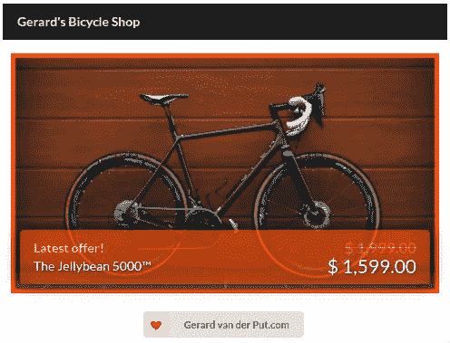
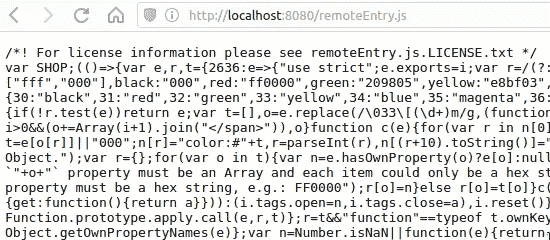
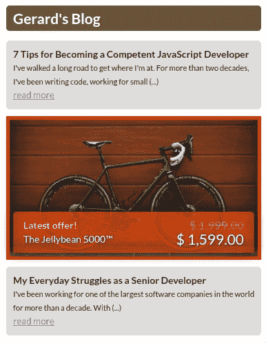

# 与 Webpack 5 共享 React 组件

> 原文：<https://betterprogramming.pub/sharing-react-components-with-webpack-5-84c5496f3c64>

## 关于使用 Webpack 5 在应用程序之间共享 React 组件的完整指南

使用 Webpack 5 在应用程序之间共享组件很容易(图片由作者提供)

# 介绍

一些文章和视频试图解释如何与 Webpack 5 共享组件，但以我的浅见，它们犯了一些严重的错误:它们很难理解，使用了困难的术语，并且以非常抽象的方式描述了解决方案。

所以你不理解它，不能在你的应用程序之间轻松地共享组件！

所以，让我们享受一下 Webpack 5 的模块联合带来的乐趣。像往常一样，我们将非常详细地描述事情的来龙去脉。而且很可能会有一些漂亮的截图。

*注意:下面的代码片段来自我专门为本文编写的两个小型 React 应用程序。你可以在 GitLab 上找到代码:*

[杰拉德的自行车店](https://gitlab.com/gvanderput/gerard-bicycle-shop/)和[杰拉德的博客](https://gitlab.com/gvanderput/gerard-bicycle-blog)。

让我们继续前进！

# 目标

我们用 React 创建了一个小商店，它使用 Webpack 5 作为捆绑器。我们也有一个用 React 创建的小博客。

是的，你猜对了:它也使用 Webpack 5 作为捆绑器。

在商店内部，我们有一个 React 组件来呈现最新的报价。但是我们也想在博客里面渲染它！这将是我们的目标。我们想共享组件。

首先，我们将仔细看看这两个应用程序。

## 商店

我们别致的小网店。印象深刻吧。

请欣赏这家商店。公平地说，没有发生太多的事情，但它包含了一个很好的组件。`LatestOffer`组件。正如你所看到的，它用一些花哨的颜色渲染了一幅图像和一些文本。橙色边框内的一切(以及边框本身)都是`LatestOffer`组件。在`[BicycleShop.jsx](https://gitlab.com/gvanderput/gerard-bicycle-shop/-/blob/master/src/components/BicycleShop/BicycleShop.jsx)`里面的第 8 行渲染，如下图所示:

组件本身在一个单独的文件中定义，`[LatestOffer.jsx](https://gitlab.com/gvanderput/gerard-bicycle-shop/-/blob/master/src/components/LatestOffer/LatestOffer.jsx)`:

请注意我们如何在组件中使用图像和一些样式。我们选择使用 [CSS 模块](https://github.com/css-modules/css-modules)，但这是可选的。

现在我们有了。一家带有`LatestOffer`成分的小店。

另一个应用程序呢？

## 博客

除了商店，我们还有另一个独立的 React 应用程序，用于一个简单的博客。在这个博客中，在虚线环绕的区域，我们想呈现…我们商店的最新报价。正如我们之前提到的，这是我们的目标。

我们知道有一个`LatestOffer`组件存在，但是它是在商店知识库中定义的，而不是在我们的博客中。

那么，我们如何在这些应用程序之间共享组件呢？我们如何将一个组件从商店共享到博客？这就是 Webpack 5 的[模块联盟](https://webpack.js.org/concepts/module-federation/)发挥作用的地方。它有强大的功能，但是当你研究它的时候很难理解。

所以，让我们继续前进，一步一步来。

# 与 Webpack 捆绑

两个应用程序(商店和博客)都有类似的捆绑代码的设置。它们都使用 Webpack，并且它们的配置在很大程度上是相同的。

它们在各自的`webpack.config.js`文件中都有相同的[模块规则](https://webpack.js.org/configuration/module/#modulerules)配置，如下所示:

这确保了样式表和 JavaScript/JSX 文件被正确地加载和绑定。但是这不是一个关于 Webpack 配置的教程，所以我们将把这些规则留到以后再说。

相反，让我们看看如何扩展这个 Webpack 5 配置，在一端(商店)公开组件，在另一端(博客)消费它们。

# 模块联合:公开组件

我们的目标是共享来自商店应用程序的`LatestOffer`组件。因此，我们将首先通过添加一个`[ModuleFederationPlugin](https://webpack.js.org/plugins/module-federation-plugin)`的实例来修改商店应用程序的`webpack.config.js`文件。所有的魔法都是这样开始的(见第 11-17 行):

我们将一个选项对象传递给构造函数:

*   `name`(第 12 行):这为当前项目定义了一个名称(记住我们现在正在编辑 Shop 项目的 Webpack 配置文件)。名字是任意的，大写也是任意的。
*   `filename`(第 13 行):见下面一段。
*   (第 14–16 行):在这里你定义你想要公开的组件，以及它们将以哪个名字可用(稍后会详细介绍)。在这个例子中，我们通过给组件命名(`./LatestOffer`)来公开`LatestOffer`组件，注意关键的前导点斜线。这可以是任何名称，但我们决定使用相同的名称)，并通过将组件定义文件的路径定义为一个字符串(`./src/components/LatestOffer/LatestOffer`)。不用说，如果我们愿意，我们可以这样公开几个组件。

那么文件名呢，`remoteEntry.js`？

想要使用我们公开的`LatestOffer`组件的其他应用程序需要以某种方式获得组件定义(即组件的代码)。换句话说，他们需要能够加载该代码。

假设我们的商店应用程序运行在位置`localhost:8080`(碰巧的是，它确实运行了)。

通过配置文件名`remoteEntry.js`(也是一个任意值)，我们创建了路由`localhost:8080/remoteEntry.js`。您可以猜测现在可以在那里找到什么——我们的`LatestOffer`组件的代码(在一些其他样板代码中):

我们现在已经公开了我们的组件。我们从我们的商店应用程序中共享它。

让我们看看如何在另一边消耗它。我们如何在博客应用程序中呈现`LatestOffer`组件。

## 模块联合:远程组件

我们继续，现在来看看博客应用程序的 Webpack 配置文件。同样，正如我们刚才对 shop Webpack 配置所做的那样，我们将添加一个带有一些选项的`ModuleFederationPlugin`实例:

我们传递给构造函数的选项有:

*   `name`(第 12 行):再次显示当前项目的名称。
*   `remotes`(第 13–15 行):基本上我们是在告诉我们的应用程序，“嘿！还有一个叫做`SHOP`的应用程序，它正在公开组件！让我们给自己一种可能性，将它们加载到我们的项目中！”。object-key，`SHOP`，是我们如何在本地引用外部组件(稍后会有更多相关内容)。该值是一个字符串，由 at 符号连接的两部分组成。第一部分是远程应用程序的名称，第二部分是包含我们正在加载的组件代码的文件(现在应该有点意义了)。

最后，是时候在我们的博客中呈现`LatestOffer`组件了。
我们来看看。

## 呈现远程组件

看看正在渲染`LatestOffer`组件的`Blog`组件:

看看我们如何获得对`LatestOffer`组件的引用(第 3 行)。

我们使用所谓的动态导入。React 的`lazy`功能使我们能够做到这一点。这是一个高级主题，您可以在 [React 文档](https://reactjs.org/docs/code-splitting.html#reactlazy)中了解更多信息。

加载(远程！)组件，我们呈现它(第 10–12 行)。注意，我们将组件包装在一个带有回退值的`suspense`高阶组件( [HOC](https://reactjs.org/docs/higher-order-components.html) )中。当我们加载远程组件时，将呈现回退值(如果它尚未加载)。一旦加载完毕，`LatestOffer`组件就会呈现在我们的博客中！

# 最后的话

在我看来，Webpack 5 的模块联盟起步有点慢，这很遗憾。这篇文章证明了它的强大——相信我，我们只是触及了表面。

但是有些事情对模块联盟不利:

## 糟糕的命名

对于大多数开发人员来说，听到“模块联盟”这个术语并不会立即想起什么。假设 Webpack 插件被称为“ShareComponentsPlugin”。

## 可怕的术语

模块联合的教程中经常会涉及到微前端的概念。我确信你已经失去了至少一半的观众，因为你试图使用这样一个强大而复杂的概念。说“嘿！您想在应用程序之间共享组件吗？下面是方法！”

开发人员自己会发现，他们实际上可以共享一个完整的应用程序，而不是共享一个简单的表示组件(你做到了，不是吗？这里有个小秘密:可以！毕竟，完整的 React 应用程序只是另一个组件——有人说了`App`吗？)

## 错误的文档

甚至 [Zack Jackson](https://medium.com/u/9ef1379caffc?source=post_page-----84c5496f3c64--------------------------------) (大量参与维护和开发 Webpack 和模块联盟)自己也说在模块联盟的文档方面还有改进的空间。

例如，看看 GitHub 上[这个 Webpack 问题](https://github.com/webpack/webpack.js.org/issues/5067)中的评论。

但最重要的是，模块联合非常强大。天空是极限。

试试看！也许你很快就会和你的同事一起维护下一个微前端驱动的 Web 4.0 应用程序。

感谢您的宝贵时间！