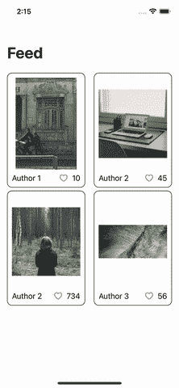

# 在 SwiftUI 视图之间共享状态

> 原文：<https://betterprogramming.pub/sharing-states-between-swiftui-views-d00d3f41a23b>

## 如何通过 SwiftUI 视图更新您的应用状态

[绝对视觉](https://unsplash.com/@freegraphictoday?utm_source=medium&utm_medium=referral)在 [Unsplash](https://unsplash.com?utm_source=medium&utm_medium=referral) 上拍摄的照片

可变状态是几个应用程序出现问题的根本原因。它会产生不一致的状态，导致错误的显示信息，或者在更糟糕的情况下，导致崩溃。

当两个不同的组件使用具有不同表示的相同信息时，我们会面临这个问题，如果用户在一个地方更新信息，这些变化不会在另一个地方反映出来。然后，如果用户在应用程序的其他部分导航，他们可能会看到旧数据，或者应用程序可能会由于这种不一致而崩溃。

这个问题如此相关和频繁，以至于整个库和体系结构都被开发来管理它。[可组合架构(TCA)](https://github.com/pointfreeco/swift-composable-architecture) 是一个可以解决这个问题的库和架构的例子。

通过仔细的设计和实现，我们可以开发一个应用程序，其中相关的状态可以在多个组件之间共享，而不会有状态不一致的风险，也没有额外的库或复杂的架构。

我们只需要记住两个概念:

1.  对于每一条信息，我们都需要一个真实的来源。单个对象必须包含当前的真值，所有其他组件从该对象获取信息。
2.  对于每条信息，我们需要一个单独的更新位置。所有的状态突变都发生在一个对象中。如果一个组件需要更新一个状态，它必须使用那个对象。

在今天的文章中，我们将牢记这些原则，实现一个简单的特性。我们将使用普通的 SwiftUI 来实现它，用 UIKit 或使用其他 UI 模式来翻译代码应该很容易。

# 该应用程序

我们将实现的功能类似于 Medium clap 功能。该应用程序呈现不同的图像，用户可以点击按钮来喜欢它们。用户可以多次喜欢一张图片，就像用户可以多次拍击一篇文章一样。

其次，用户可以点击图片来导航到细节屏幕。在该屏幕上，图片被缩放，用户可以喜欢该图片。两个屏幕之间的赞数必须始终保持同步。

下面的 GIF 展示了我们想要实现的目标:

# 模型

首先，我们需要一个模型来存储我们希望在屏幕上显示的信息。

一个`Picture`的模型非常简单:它只有一个`URL`,用于标识我们用来获取图像的图像、一个作者和一些赞。

# 图片列表视图

然后，我们需要`PictureListView`来呈现图片列表。让我们在添加行为之前先实现 UI。

为了提高可读性，`View`被组织在不同的函数中。该组件将一个`Picture`数组作为参数。

在它的`body`中，我们准备了一个带有`LazyVGrid`的`ScrollView`来渲染每行两张图片。然后，我们用一个`ForEach`组件在`Picture`上循环。`ForEach`的内容是一个`imageCard`:一个包含`Picture`信息及其框架和`NavigationLink`的组件。

清单的其他功能返回我们用来组成视图的元素。我们有链接目的地、`AsyncImage`和页脚。注意`likeButton`函数:它返回负责增加赞数的按钮。

这就完成了列表视图的 UI。正如你所看到的，我们有一个图片列表，但是`ListView`没有检索它们，也没有以任何方式管理它们。它唯一的职责是获取数组并呈现它。

目前，代码没有构建:Xcode 不知道什么是`PictureDetailsView`。我们来实施吧。

# 图片详细信息视图

我们需要的第二个元素是一个`PictureDetailView`。让我们实现没有任何行为的 UI。

这个视图非常类似于`PictureListView`的单卡。在细节中，我们没有框架，也没有导航链接，但我们仍然呈现图像和页脚。

> **注:**`PictureListView`的一些功能和`PictureDetailsView`的相应属性之间的代码非常相似，如果不是完全相同的话。我们应该提取特定 SwiftUI 组件中的代码，以便在两个组件中重用它。为了简单起见，不要创建太多的片段，我们决定容忍一点点重复。

# 将组件组装在一起

目前，我们可以从列表中导航到详细信息，但我们还没有将列表添加到应用程序中。让我们通过编辑`App.swift`文件来完成。

在`MyApp`结构中，我们声明了一个静态图片列表(我们使用 [picsum.photos](https://picsum.photos/) 来获取一些免费图片的 URL ),我们在`body`中使用它来初始化`PictureListView`。

如果我们现在运行应用程序，我们有一个工作应用程序，它在屏幕上呈现四幅图像，并让我们从缩略图导航到图片细节，然后返回。

# 实现行为

为了避免状态不一致的问题，我们需要单一的真实来源(SST)和单一的更新位置(SUL)。我们已经有了 SST:`MyApp`结构中的`pictures`数组被传递给各个组件，单个的`View`不能更新它们。

我们遗漏了 SUL:一个可以修改应用程序状态的单一元素。为此使用相同的`MyApp`结构感觉很自然。我们要实现的操作是增加赞的计数器。

我们可以将这个简单的函数添加到`MyApp.swift`文件中。该函数使用一个`URL`，作为图像的唯一标识符，并检索指向具有该 URL 的图片的第一个索引。

编译器现在抱怨:`MyApp`是一个结构，它是不可变的，尽管我们使用了`var`来声明图片数组。我们需要能够改变图片:为了实现这个行为，我们可以使用`@State`属性包装器。

让视图修改状态的最后一步是将`increaseLike(for:)`函数传递给所有需要它的组件。我们可以通过以下方式修改`PictureListView`和`PictureDetailsView`:

1.  添加类型为`(URL) -> Void`的属性。
2.  点击按钮时调用闭包。

`PictureListView`代码如下所示:

在第 4 行，我们添加了`View`从组合中接收的闭包。在第 20 到 22 行，我们调用闭包传递图片的`URL`。

我们还将闭包传播到`NavigationLink`的`destination`，以确保`DetailsView`可以使用相同的逻辑增加赞数(第 13 行)。

类似地，`PictureDetailsView`的代码如下所示:

正如我们对`ListView`所做的一样，我们在第 3 行声明闭包，并在第 14 行使用它。

所有的部分都准备好了，我们终于可以组成整个解决方案了:

我们现在可以构建和运行应用程序，它可以工作了。我们可以增加两个屏幕中的相似计数，并且它们是同步的。

# 用容器重构

这个`MyApp`结构有很多代码，包含一些关于`pictures`逻辑应该如何工作的实现细节。在一个复杂的应用程序中，我们会有多种状态，与非常不同的特性相关。我们不能向主结构添加越来越多的函数。这有可能成为将过多职责集中在一个地方的`[God Struct](https://en.wikipedia.org/wiki/God_object)`。

因此，我们可以将其封装在一个单独的对象中，该对象可以位于**域逻辑**模块中。我们可以创建一个`PictureStorage`类来处理:

1.  跟踪`Picture` s 状态( **SST** )。
2.  定义`Picture`s(**)上所有可能的操作。**

**`PictureStorage`的代码如下**

**该类将图片列表存储在内存中。`set`是私有的:除了`PictureStorage`之外，任何对象都不能修改图片。**

**存储在其初始化器中需要一个图片列表，并公开了在数组上工作的`increaseLike(for:)`方法，因此更新图片的唯一方法是调用这个方法。**

**我们已经实现了作为 **SST** 和 **SUL** 的对象。我们现在可以在作文中使用它。**

**我们用`pictureStorage`替换了`pictures`数组，并在`body`中使用它来获取图片数组和更新赞的函数。**

**应用程序构建并运行，但它已经停止工作。一切都被渲染，我们可以从缩略图导航到图片的细节。但是，如果我们点击喜欢按钮，它不起作用。**

**我们打破了 SwiftUI 自动更新机制的束缚。当状态改变时，`@State`属性包装器负责重新创建视图层次结构。现在我们还没有任何类似的行为。**

**为了重现这种行为，我们需要在`pictureStorage`变量之前添加`@StateObject`修饰符。**

> ****注意:**值类型我们用`@State`；我们使用`@StateObject`作为引用类型。**

**这个属性包装器要求`PictureStorage`符合`ObservableObject`。让我们添加协议一致性。**

**即使有这些变化，应用程序也不会工作。没有将更改传播到视图的机制。我们需要发布`pictures`数组，我们可以使用`PictureStorage`中的`@Published`属性包装器来完成。**

**增加喜欢功能现在工作正常，它在`PictureStorage`类中完全隔离。**

# **结论**

**在今天的文章中，我们讨论了大型应用程序的一个主要问题:如何保持不同组件之间的状态同步。我们探讨了可以解决这个问题的两个主要支柱:**

1.  **每条信息都有一个真实的来源。**
2.  **每条信息有一个单独的更新位置(SUL)。**

**带着这些想法，我们实现了一个示例特性来展示如何实现这一点。UI 组件必须呈现状态并捕获用户输入。逻辑的执行被委托给可以调用 SUL 的组合根。**

**我们在基础版本中实现了期望的行为，然后我们重构了代码，将其隔离在一个适当的组件中。我们发现这个过程破坏了 SwiftUI 自动更新机制，所以我们通过使用`@StateObject`和`@Published`属性包装器以及`ObservableObject`协议来更新它。**

**在进行重构时，我们没有修改视图代码中的任何一行。当设计正确完成时，我们能够只修改`MyApp`结构来以最佳方式组合我们的应用程序。这表明 app 的架构是健全的，模块划分是正确的，解决方案是灵活的。**

**这从几个方面改进了代码库:可维护性、可读性，并尽可能保持代码的简单性。**