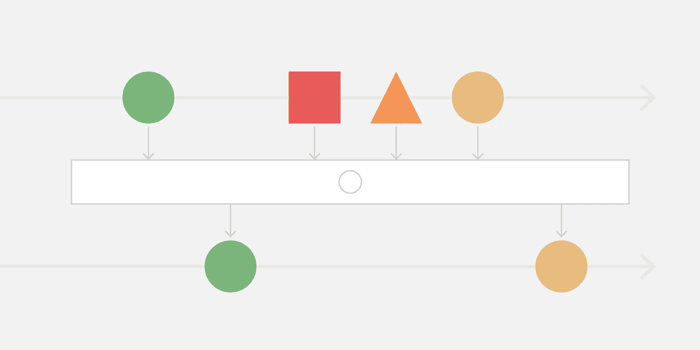
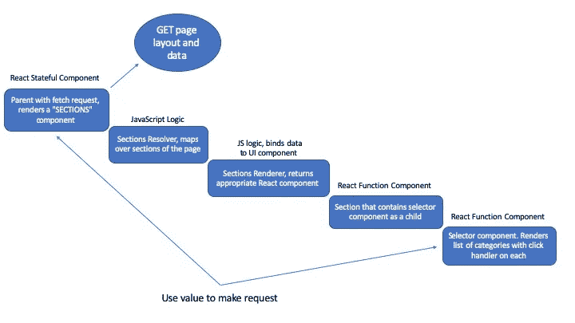

# 与 RxJS 共享 React 中的 UI 事件状态

> 原文：<https://betterprogramming.pub/sharing-ui-event-state-in-react-with-rxjs-f7edf5648027>

## 跨组件共享状态



这篇文章是一个在 React 组件之间共享 UI 事件数据的漂亮解决方案的分解，这个问题对我来说是一个长期的挑战。这是我最近在 React/ TypeScript 项目中使用的策略，但它适用于任何前端 JavaScript 框架。

这篇文章主要是关于通过 [RxJS](https://rxjs-dev.firebaseapp.com/) JavaScript 库使用[react vex](http://reactivex.io/)流的反应式编程。

# **问题**

通常，React 中的 click 处理程序(或任何 UI 事件处理程序)都以某种方式绑定到状态，要么在组件内部，要么在父/子组件中。

我们从文档中学习编写的第一个组件是一个有状态类，它有一个处理程序，可以增加状态值或其他值。这是可行的——毫无疑问——但是既要遵循自顶向下的数据流，又要保留在虚拟 DOM 范围内而不查询文档，这两者之间需要权衡。要记住的事情:

*   调和:对于 UI 事件来说，所有的不同真的值得吗？这对低 CPU 设备有很大的影响。如果你的应用程序需要一个平滑、复杂的用户界面，你就有因此而阻塞用户界面的风险。
*   **有状态 UI 组件:**如果你需要基于应用程序另一部分的 DOM 事件发出请求(后面的例子)，保持关注点的分离将是一个挑战。请记住，我们希望 UI 组件保持“愚蠢”并且没有业务逻辑。
*   **道具穿线:**不是世界末日，但是当有很多道具穿线的时候，我们会讨厌它。

基于上述原因，不建议在基于电视的应用程序中使用 React 这样的框架。

我最近需要从一个组件中访问 innerHTML 数据，该组件是组件层次结构中的多个子组件。单击该项时，我需要使用它的值在最外层的父节点中发出请求。像这样:



UI 由网络响应的形状决定，网络响应包含对组件类型和数据的引用，因此列表内容和请求本身尽可能与内容无关是很重要的。

# **解决方案:Rx，行为主体**

在过去一年左右的时间里，我一直在开发基于网络的应用程序，这些程序可以在客厅的电视和游戏机上运行。用户对 Netfilx、Hulu 和其他服务集的高期望，加上为电视浏览器构建的困难，使其成为一个有趣的挑战，我们已经知道一个对我们的需求极其有效的工具是 RxJS。

Rx 是一种被称为*反应式编程*的编程范式的实现，这种编程范式在多种语言中使用——在 JavaScript 中是 RxJS。不管您的前端语言偏好如何，事件驱动的 UI 可能会变得复杂，并且达到这样一种程度，即在事件发生时响应事件的流思维比事件发生时的状态变化更容易处理。

这里的想法是存储对所选 DOM 元素值的引用，并在应用程序的其他部分访问它(但不限于 UI)。我们希望订阅由这个存储机制发出的值，并在用户选择新值时更新它们。实施很简单，由以下步骤组成:

*   用默认值创建一个新的`BehaviorSubject`(我们将在其他组件中订阅的存储)
*   创建更新订阅的方法
*   实现点击处理程序
*   订阅`BehaviorSubject`以获取最新发出的值

代码按顺序如下所示:

```
// 1: create the BehaviorSubject*export* const *featuredCategory$* =new *BehaviorSubject*("")*.pipe*(
  *distinctUntilChanged*(),
  *skip*(1)
);// 2: create a method to update the BehaviorSubjectconst *setfeaturedCategory* =(category: *string*): *void* => *featuredCategory$.next*(*index*);
```

我们现在可以使用`BehaviorSubject`来订阅和更新:

```
// 3: Implement the click handler<li *onClick*={(category): void => *setfeaturedCategory*(category)}>{category}</li>// 4: Subscribe to the behaviorSubject to get the latest emitted value<=== Anywhere in our app ===>*import* { featuredCategory$ } *from* "component";featuredCategory$.subscribe((category: string): void => this.setState({ selectedCategory: category }))
```

如您所见，我们现在更简单地读取我们的状态。下面是使用这种方法的一些优点。

*   **Composition:** 因为 Rx 都是关于流的，所以如果我需要的话，很容易将它们与其他流结合使用。
*   **灵活性:** RxJS 附带了许多方法，我可以根据需要使用这些方法来操作我的流——例如，如果我需要在第一次页面加载时延迟发出值的发出。
*   **控制:**如果我想在满足某个条件后停止监听值的变化，我所要做的就是取消订阅。

```
featuredCategory$.unsubscribe();
```

很酷，是吧？我们只是刚刚开始接触这个强大工具的皮毛。我想过分享这个妙招，以防你发现自己处于类似的情况。希望有帮助！