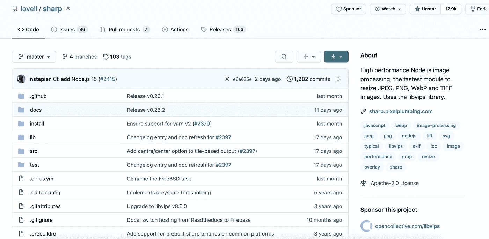
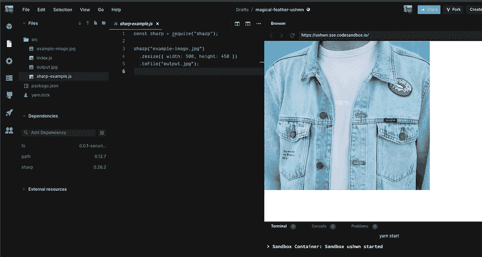
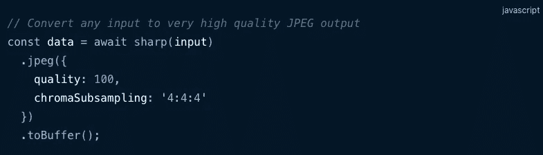
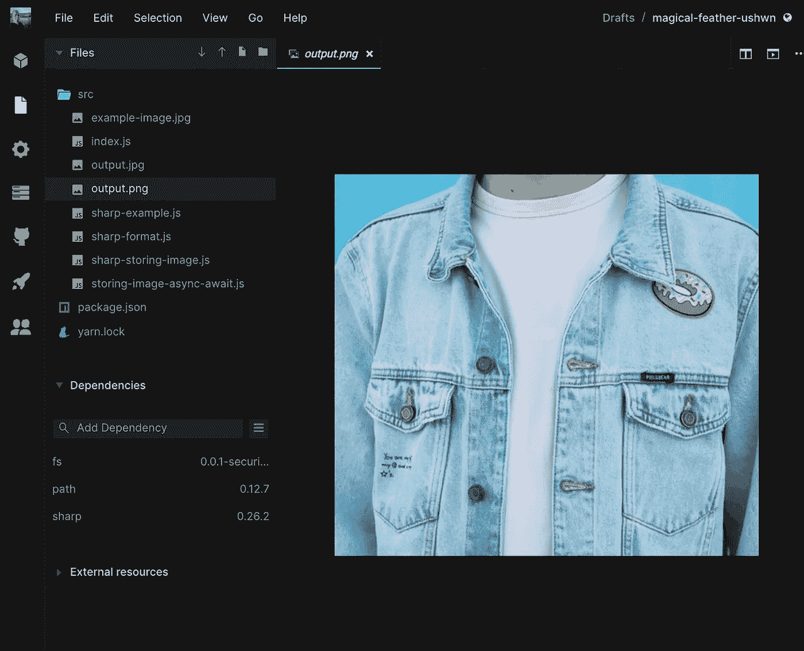
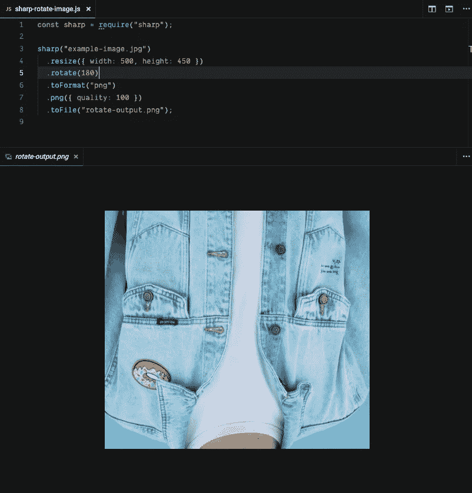

# sharp:node . js 的高性能图像处理库

> 原文：<https://betterprogramming.pub/sharp-high-performance-node-js-image-processing-library-3f04df66c722>

## 夏普是一个高性能的调整图像大小和格式的模块


克里斯蒂娜@ wocintechchat.com 在 [Unsplash](https://unsplash.com?utm_source=medium&utm_medium=referral) 上的照片

在构建现代、快速和用户友好的应用程序时，图像是您应该熟悉的难题的一大部分。每个应用程序都以某种方式使用图像。

例如，用户想要调整他们个人资料照片的大小，商家想要塑造他们的图片，这样他们就能吸引买家，等等。

处理大型图像是令人沮丧的，因为加载它们要花很长时间，存储到数据库中更令人沮丧。有一种方法可以让我们的图像更加用户友好，加载速度更快，甚至质量更高。

> Sharp library 模块的典型用例是将常见格式的大图像转换为不同尺寸的较小的、web 友好的 JPEG、PNG 和 WebP 图像。—根据夏普官方文件



夏普 Github 库—来源: [GitHub](https://github.com/lovell/sharp)

# 格式

Sharp 库支持读取 JPEG、PNG、WebP、TIFF、GIF 和 SVG 图像。

> 输出图像可以是 JPEG、PNG、WebP 和 TIFF 格式，也可以是未压缩的原始像素数据。
> 
> 流、缓冲区对象和文件系统可以用于输入和输出。
> 
> 单个输入流可以被分成多个处理流水线和输出流。
> 
> 可以生成深度缩放图像金字塔，适用于像 [OpenSeadragon](https://github.com/openseadragon/openseadragon) 这样的“滑动地图”平铺查看器。—根据夏普官方文档页面。

# 入门指南

Sharp 库的先决条件如下:

*   Node.js v10.16.0+版

## 通过纱线安装

```
yarn add sharp
```

## 通过 NPM 安装

```
npm install sharp
```

# 调整图像大小

假设我们有一个很大的图像，需要很长时间来加载。我们应该适当地调整它的大小，并大幅减少应用程序的加载时间，而不是提供如此大的图像。

幸运的是，Sharp 库很有逻辑性，使用起来也很简单。为了调整图像的大小，Sharp 只需要我们提供图像的路径、新的尺寸以及新调整的图像的输出路径。

上面的代码获取原始图像并将其调整为 **500x450** 的尺寸。



在右边，我们有调整大小的图像，在左边，我们有原始的大图像。

这里有一个交互式的 [CodeSandBox](https://codesandbox.io/s/magical-feather-ushwn?file=/src/sharp-example.js) 演示，以防你有兴趣在浏览器中尝试这些演示。

但这还不是全部！您可以对任何图像执行的操作有一个很大的列表。[点击这里查看调整大小操作的完整列表](https://sharp.pixelplumbing.com/api-resize)。

# 格式化图像

改变图像格式非常简单——只需将函数链接在一起。Formatting 有一个`.toFormat()`函数，它将新格式作为参数。

请注意，我们将图像质量提升到了`100`——这是图像所能达到的最高质量。

质量说明符是一个整数。任何给定图像的范围是从`1`到`100` —更多信息可以在找到[。](https://sharp.pixelplumbing.com/api-output#jpeg)



提高任何图像格式的图像质量—来源:[像素管道](https://sharp.pixelplumbing.com/api-output#examples-5)

一旦我们运行代码，一个`output.png`文件就会出现在我们的项目中。



我们创建了一个名为**output.png**的新图像

> PNG 输出总是 8 或 16 位/像素的全色。每像素 1、2 或 4 位的索引 PNG 输入被转换为每像素 8 位。
> 
> 其中一些选项需要使用全局安装的 libvips，该 lib VIPs 编译时支持 libimagequant (GPL)。—根据夏普官方文档。

# 将图像存储到数据库中

如果您正在处理用户配置文件，您可能希望将图像保存到数据库中。以下是您可以做到这一点的方式和位置。

使用 promises 调整图像大小并将其存储在数据库中

注意夏普是如何回应承诺的。每当我们完成对实际图像本身的任务时，我们可以使用这个承诺并采取行动。

# 异步/等待示例

也有可能使用 async/await 语法来代替 promises。这里有一个简单的例子。

使用 async/await 语法调整图像大小并将其存储在数据库中

如果您不确定或者不熟悉 async/await 语法，我会帮您解决的！请查看“ [**如何使用 Async 改进您的异步 JavaScript 代码并等待**](https://medium.com/better-programming/improve-your-asynchronous-javascript-code-with-async-and-await-c02fc3813eda) ”进行深入探讨。

# 旋转图像

使用 Sharp 可以轻松进行旋转图像等简单操作。调用`[rotate](https://sharp.pixelplumbing.com/api-operation#rotate)`函数，将图像旋转多少度。

下面是上面的例子在代码中的样子。



将图像旋转 180 度

如果您想将图像旋转 180 度，也可以使用`[flip](https://sharp.pixelplumbing.com/api-operation#flip)`功能。这将产生与上面相同的输出。

这是互动演示，你自己去看看吧。

# 证明文件

如果你好奇或感兴趣，请访问 sharp.pixelplumbing.com[的](https://sharp.pixelplumbing.com/)获取完整的[安装说明](https://sharp.pixelplumbing.com/install)、 [API 文档](https://sharp.pixelplumbing.com/api-constructor)、[基准测试](https://sharp.pixelplumbing.com/performance)，以及[变更日志](https://sharp.pixelplumbing.com/changelog)。

# 贡献的

想参与开源吗？这里有一个给贡献者的[指南，涵盖了报告 bug、请求特性和提交代码变更。](https://github.com/lovell/sharp/blob/master/.github/CONTRIBUTING.md)

# 结论

感谢阅读。编码快乐！