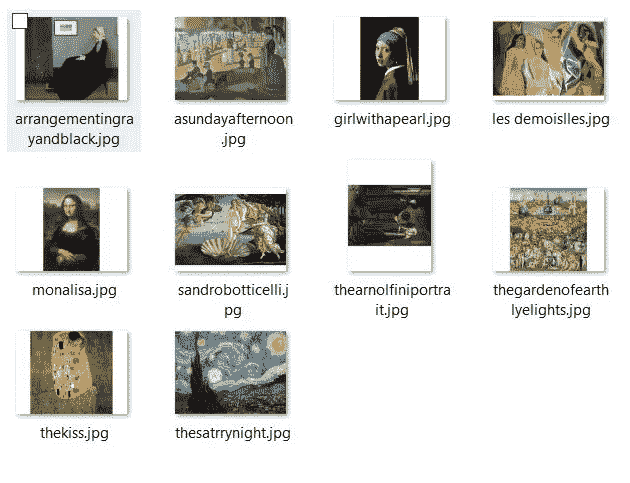
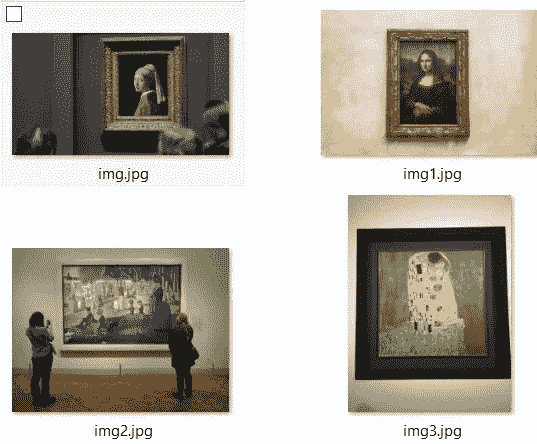
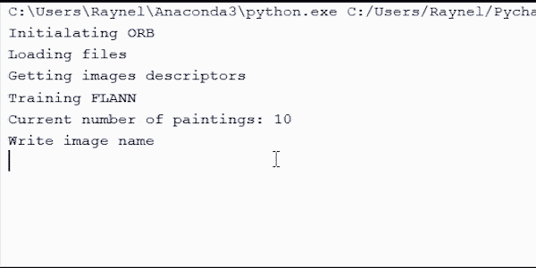

# 绘画的 Shazam:一个计算机视觉 Python 项目

> 原文：<https://betterprogramming.pub/shazam-for-paintings-a-computer-vision-project-513ff2e1b498>

## 使用 Python 和 OpenCV 识别照片中的绘画


[布鲁克林](https://unsplash.com/@brooklyngrace?utm_source=medium&utm_medium=referral)在 [Unsplash](https://unsplash.com?utm_source=medium&utm_medium=referral) 上的照片。

计算视觉是一个蓬勃发展的领域。它负责通过数学计算来理解或让计算机理解图像的内容。计算机科学的这个领域有大量的应用。

其中之一就是创造出能够判断两幅图像是否非常相似的系统。有时候，我们需要尽可能快地识别我们正在看的东西。我们总是在寻找信息。我想到了制作一个应用程序的想法，给定一幅画的照片，它可以识别它的名字。

[OpenCV](https://opencv.org/) (开源计算机视觉库)是最强大的库之一。它有许多内置功能，使处理图像更容易。对于这个项目，我们将与 Python 合作。

首先我们需要安装`cv2`。这将让我们在 Python 中使用 OpenCV。用`pip install opencv-python`安装包即可。

这个[项目](https://github.com/raynelglez99/shazampaintings/)由一个 Python 脚本、一组位于`images/`的画作的标记图像和一组博物馆中的画作照片组成。我们的目标是识别照片中的画。



一组已知的画



要鉴别的画

完整的源代码在 GitHub 上的[。](https://github.com/raynelglez99/shazampaintings/)

让我们从代码开始:

```
**import** cv2
 **import** os
 **from** collections **import** defaultdict

 paintings=[]**def** loadFiles():
 **global** paintings
 paintings = os.listdir(“**images**”)
```

我们用`images`文件夹中每个文件的名称填充`paintings`数组。这个功能非常清楚。

```
orb=**None**flann=**None***#Initializes ORB and Flann***def** initOrbandFlann():**global** orb,flannorb = cv2.ORB_create(700)   *#ORB Init*index_det = dict(algorithm = 6,table_number=10,key_size=20,multi_probe_level=0)search = dict(checks=50)flann = cv2.FlannBasedMatcher(index_det,search) *#Flann Init*
```

`orb`？`flann`？

让我解释一下:

*   ORB 是一个关键点检测器和图像描述符。我们将使用它来获得每个图像的特征。
*   [FLANN](https://github.com/mariusmuja/flann) (快速近似最近邻搜索)是一个针对大型数据库中真正快速的最近邻搜索而优化的库。

我们将使用这个来比较我们的照片和场景的图像。

在这一行中，我们用`nfeatures=700`初始化 ORB 检测器，它表示要存储的最大特征数:

```
orb = cv2.ORB_create(700)
```

在下面几行中，我们用 LSH 算法(algorithm = `6`)初始化 FLANN。对于精度，建议使用其他值:

```
index_det = dict(algorithm = 6,table_number=10,key_size=20,multi_probe_level=0)search = dict(checks=50)flann = cv2.FlannBasedMatcher(index_det,search) *#Flann Init*
```

随着 ORB 和 FLANN 的创建，我们为`images/`文件夹中的每个图像提取关键点和描述符。

```
*#Get descriptors for each image***def** getDescriptors():**global** flann,paintings**for** filename **in** paintings:img2 =cv2.imread(**"images/"**+filename,0)kp2, des2 = orb.detectAndCompute(img2, **None**)flann.add([des2])*#Add each image descriptor to flann*flann.train()img2 =cv2.imread(**"images/"**+filename,0) This line will create the object img2 containing each image as the loop run.
```

接下来的两行检测每个图像的关键点和描述符，并将描述符添加到 FLANN:

```
kp2, des2 = orb.detectAndCompute(img2, **None**)flann.add([des2])
```

随着所有描述符的检测和计算，我们继续训练我们的 FLANN 指数。此方法需要在匹配描述符之前运行:

```
flann.train()
```

这一行将生成一个索引以提高搜索速度。

所以，下一步应该是为我们的照片找到匹配:

```
*#img -> filename of the painting***def** getMatch(img):**global** kp1, des1,flannimg1 = cv2.imread(img)kp1, des1 = orb.detectAndCompute(img1, **None**)matches= flann.match(des1)matches_dict = defaultdict(**lambda** : 0)**for** f **in** matches:matches_dict[f.imgIdx]+=1temp = sorted(matches_dict.items(),key=**lambda** x:x[1],reverse=**True**)index = next(iter(temp)file = paintings[list(index)[0]]print(file)
```

在检测到包含要识别的绘画的照片的关键点和描述符后，我们可以让 FLANN 进行匹配。

下面一行将获得一个 DMatch 对象数组:

```
matches= flann.match(des1)
```

DMatch 对象是一个包含匹配信息的类。我们将使用字段`_imgIdx`，其中存储了匹配图像的索引。

计算完所有匹配后，我们继续创建一个字典，它将图像索引作为关键字，并包含为每个图像找到的匹配数:

```
matches= flann.match(des1)matches_dict = defaultdict(**lambda** : 0)**for** f **in** matches:matches_dict[f.imgIdx]+=1
```

使用`defaultdict`是因为如果没有找到关键字，它会将值初始化为 0。

然后字典按值降序排序:

```
temp = sorted(matches_dict.items(),key=**lambda** x:x[1],reverse=**True**)
```

对字典排序后，我们在`index`获得第一个值和绘画的文件名:

```
index = next(iter(temp)file = paintings[list(index)[0]]print(file)
```

这应该是我们的主要方法:

```
def main():global flannprint("Initialazing ORB")initOrbandFlann()print("Loading files")loadFiles()print("Getting images descriptors")getDescriptors()print("Training FLANN")print("Current number of paintings: "+str(len(flann.getTrainDescriptors())))while True:image = input("Write image name\n")print ("Getting match")getMatch(image)
```

我们运行脚本并输入包含要识别的绘画的图像的名称，然后…瞧:



它能够在不到 200 毫秒的时间内识别 Core i3 7100U、8 GB RAM 笔记本电脑上的绘画。一个非常好的改进是计算一次描述符，并将它们保存到一个文件中。这个脚本可以用来识别标志，计算一个产品被看到的次数，以及许多其他应用程序。

我希望这篇文章是有帮助的。保重！