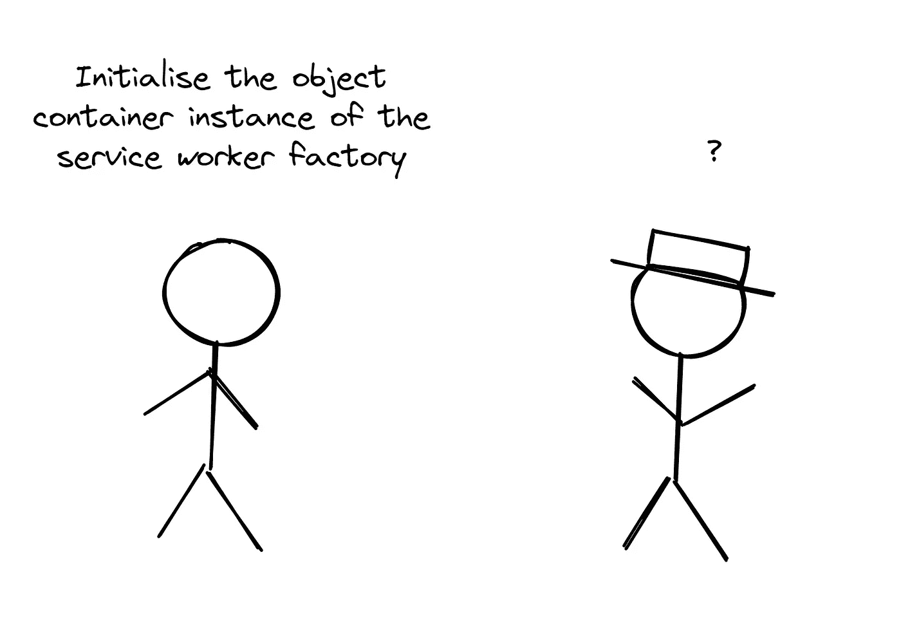
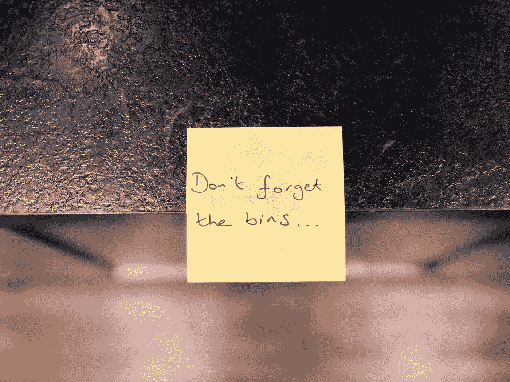
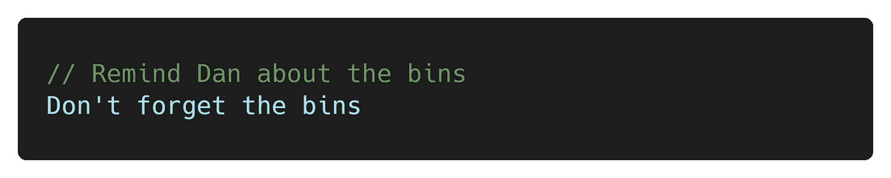
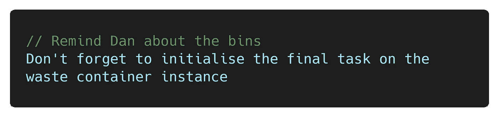
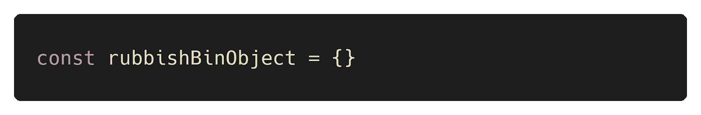
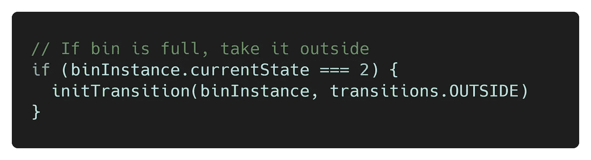
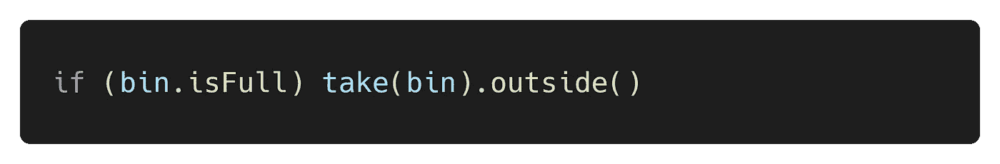
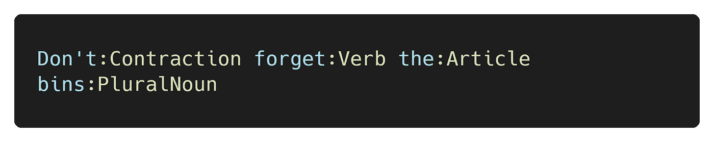

# 嘘！保持安静，只为人类编码

> 原文：<https://betterprogramming.pub/shhh-keep-quiet-and-just-code-for-humans-bdd28ce4aa70>

## 如何在 JavaScript 中降低噪音并有效沟通

我不喝茶。茶是给杯子喝的。(图片由作者提供)

我们维护代码的容易程度非常重要。代码可维护性影响一切，从工作满意度到交付速度(可以说是同一个)。

但是是什么使得代码库易于维护呢？正确的技术选择？更少的代码行？圈复杂度低？是的，是的，是的！但是有一些基本的东西支撑着*以上所有的*——**良好的沟通**。

想象以下场景。您刚刚在本地机器上克隆了一个 repo，您迫不及待地想加入进来。你自信地打开`index.js`思维，“我要让这个世界变得更好”，然后它击中了你——一堵难以理解的巨大文字墙。为什么看不懂？这是技能的问题吗？

如果在现实世界的对话中很难理解一个概念，这只能意味着两件事:

1.  这个概念对你目前的能力来说太复杂了
2.  这个概念没有有效地传达给你

在`index.js`场景中也是如此。你看不懂代码是因为上面的某个原因。我们要讲的是后者。

# 沟通

语言是人类交流的主要方式。编程语言的存在是为了让我们能够有效地与其他人交流程序的内部工作方式。

“不行！”我听到你喊，“编程语言的目的是指导机器！”—不，再想想。相信我，当我说:无论你喜欢用什么语言在你最喜欢的代码编辑器中编写，机器都不会理解。当它接近机器时，它实际上是 1 和 0。英语部分是给我们人类的。

作者图片

当你写代码时，你实际上是在向将来需要理解它的人描述一个程序。那个未来的人可能就是你！所以你最好确保你的沟通是正确的——如果你的唯一目标是让程序工作，你正在滑向一个令人沮丧的代码库。

这让我想到了 JavaScript。尽管事实上显然只有几个“好的部分”，但它有一些特殊之处。事实证明，如果你在英语交流方面还算过得去，那么你已经知道如何用 JavaScript 进行充分的交流。让我们看看怎么做。

# 评论

如果您没有注意到，当您编写 JavaScript(或任何代码，就此而言)时，您实际上是在使用我用来输入这句话的同一种键盘和字符集。

换句话说，你有所有必要的工具来传达一个有意义的信息。那么为什么你会觉得有必要在评论中再次解释什么呢？

这是我妻子的一张便条:

作者图片

我认为这是非常清楚的，如果有点被动攻击。让我们看看评论是否能强化信息:

不完全是。这个评论完全是多余的。为什么？因为这句话已经传达了我需要知道的一切。在这种情况下，添加注释的唯一原因是原句难以理解，如下所示:

但是现在我们用这个评论作为支撑。我们最好把精力放在原句上，这样它首先就能清楚地传达信息。

此外，在现实世界中，一个评论提供更多清晰度的机会实际上是非常渺茫的——[凯夫林·亨尼](https://medium.com/u/d9a09a07fe23?source=post_page-----bdd28ce4aa70--------------------------------)在这里说得很好:

对于那些熟悉[干燥原则](https://en.wikipedia.org/wiki/Don%27t_repeat_yourself)的人来说，警钟现在应该已经敲响了。如果你有话要说，就说一次，清楚地说。不要说得很糟糕，然后在旁边用不同的颜色解释你自己。

# 冗余类型

我们来谈谈命名约定。见过这样的东西吗？

这里的`Object`这个词有什么意义？我已经知道垃圾箱是一个宾语，因为 a)它是一个名词，b)我知道垃圾箱是什么(对我的美国朋友来说，那是一个“垃圾桶”)。

数组也是如此— `rubbishBinArray`不必要地冗长。我知道有些东西是数组，因为(希望)它是复数— `rubbishBins`工作得很好，谢谢。

我不打算介绍每一种类型，但是您应该明白—我不需要在变量名中包含类型。老实说，我不需要所有的技术术语。例如，这只是胡说八道:

这显然更好:

说到技术术语…

# 以打字打的文件

我敢打赌，你们中的一些人在一英里外就发现了这一点。打字稿粉丝们，你们坐的舒服吗？准备被触发…

我不喜欢打字稿——我觉得它又吵又费力！

“你显然就是不*懂*吧！”-不，不，我明白了。真的。我欣赏强类型编程语言的好处，当然也理解松散类型编程语言的缺陷(毕竟，我是一个 JavaScript 爱好者)。

它不适合我。当我阅读 TypeScript 时，我不禁看到它是这样的:

我觉得它不断打断我，坚持自己。我发现没有额外开销的工作效率更高——但是说实话，每个人都有自己的工作——只要能让你开心就好！

如果你真的有兴趣了解在*细节*中采用打字稿的影响，请查看由 [Eric Elliott](https://medium.com/u/c359511de780?source=post_page-----bdd28ce4aa70--------------------------------) 撰写的这篇精彩的[成本与收益分析](https://medium.com/javascript-scene/the-typescript-tax-132ff4cb175b)。

同时，让我们总结一下…

# 人类的代码

通过利用 JavaScript 的灵活性和简单性，我们有机会编写非常接近日常英语的代码。

避免制造噪音，避免用多余的技术术语乱丢代码。相反，专注于传达一个清晰、有意义的信息，让你的代码库成为一个更好的地方。