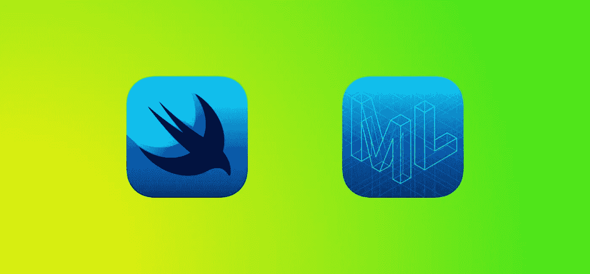
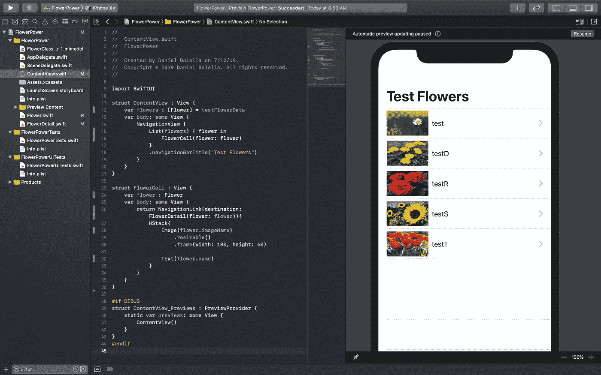
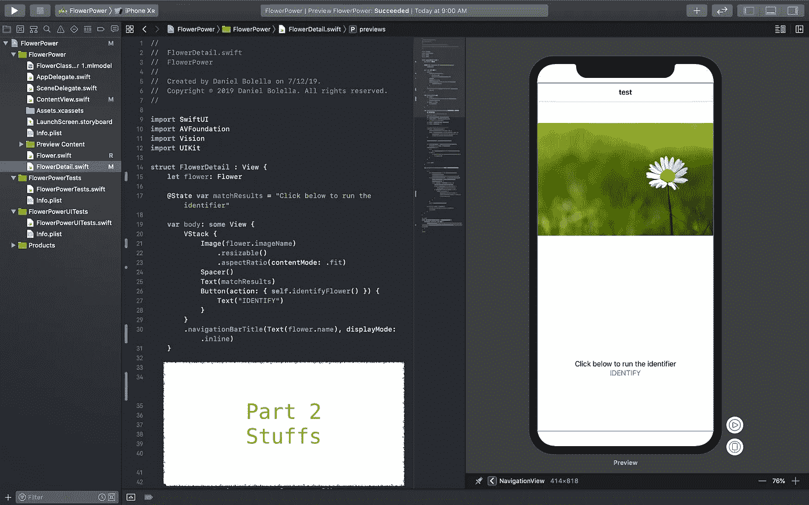

# Shoehorning SwiftUI 和创建 ML —第 1 部分

> 原文：<https://betterprogramming.pub/shoehorning-swiftui-and-create-ml-part-1-e517be035ed0>

## *我最近的旅程试图一次了解两件 WWDC 2019 的事情*

今年，我完全错过了跟上 WWDC 2019…因为我的儿子出生了…所以我很确定我可以通过。

所以现在，一个多月过去了，在重新开始工作后，我决定看看我错过了什么。

在 [SwiftUI](https://developer.apple.com/documentation/swiftui) 和 [Create ML](https://developer.apple.com/documentation/createml) 抓住了我的全部注意力之前，我还没有走那么远。

今年*将会是像 SwiftUI 这样的东西成为现实的时候。老实说，我对此很兴奋。尤其是我跟 [Flutter](https://flutter.dev/) 合作过，跟我跟 [React](https://reactjs.org/) (原生)的经历差不多。*

这三个都是反应式的、以 UI 为中心的开发框架，这意味着它们是专门为尽可能简单地构建 UI 而建立的，同时也弥合了它们和它们应该显示的数据之间的差距。

我喜欢这种构建 UI 的“新”方式。与我以前所知道的相比，这就像可读的 HTML 或 Android XML 一样，UI 和代码实际上可以共存。

但吸引我眼球的还不止这些。我还看到了新的 Create ML 应用程序的演示，它使得创建 ML 模型更加用户友好。

我承认我一直很好奇，在阅读了大量的 clickbait 文章标题之后，关于机器学习是一切事物的未来。我想，现在它似乎是点击和拖动，我真的没有借口了。

# 入门指南

声明:这更多的是叙述，而不是按部就班。但我会指出我引用的代码和项目的 [GitHub repo](https://github.com/dbolella/FlowerPower) 。

由于没有耐心，我想同时学习两者。

受到苹果[教程](https://developer.apple.com/documentation/vision/training_a_create_ml_model_to_classify_flowers)和 [WWDC 会议](https://developer.apple.com/videos/play/wwdc2019/430/)的启发，我决定将它与我在[swift ui WWDC 会议](https://developer.apple.com/videos/play/wwdc2019/204/)的介绍中所学到的东西结合起来。

本质上，我将生成一个测试花的列表，在它们各自的细节视图中，我将检查我的 ML 模型的预测是否正确，以及它是否*反应性地*显示结果。

我们需要的是:

*   [macOS Catalina beta](https://developer.apple.com/documentation/macos_release_notes/macos_catalina_10_15_beta_4_release_notes) (抱歉，没有它就不能做 SwiftUI 或使用新的 Create ML)
*   [Xcode 11 Beta](https://developer.apple.com/documentation/xcode_release_notes/xcode_11_beta_4_release_notes)
*   [花卉数据](https://www.kaggle.com/alxmamaev/flowers-recognition)

请注意，有时 SwiftUI 中的某些内容可能与另一个熟悉的 Swift 元素共享一个名称(例如`List`)。我将用(SUI) *来表示 SwiftUI 元素。*

# 构建应用程序(SwiftUI)

我创建了一个新的 iOS 单视图项目，并确保 SwiftUI 在您输入项目名称的下方被选中(旁注:我用的是 FlowerPower)。

在`ContentView`中，我创建了一个简单的`List` (SUI)，其中的内容构成了我们的单元格。这个单元格是一个包含图像和文本的 hstack，这对于现在来说已经足够了。

为了更有趣，我用 CMD +点击我的 hstack 并选择*提取子视图*，创建一个新的`FlowerCell`结构。

预览让我们几乎可以立即看到我们正在构建的内容。

让整个 SwiftUI 体验比我的其他体验好得多的是预览窗口。

它对我做的任何改变都非常敏感，我喜欢你可以在里面运行应用程序。

我知道 [React](https://reactjs.org/) 和 Flutter 可以做同样的事情，但 Xcode 提供了不同程度的查看和测试应用程序(预览，预览中的半构建运行模式，然后是传统运行)。

需要注意的一件重要事情是用测试数据填充你的用户界面。理想情况下，您应该使用`ContentView_Previews`结构，但是对于这个屏幕，只需让列表迭代五次并用占位符填充您的单元格。

接下来，在一个新文件中，创建一个 Flower struct，它将保存花的名称、分类(用于与我们的预测进行比较)和图像名称。

在同一个文件中，有测试数据*最初是*用于预览，但后来我意识到这只是一个有趣的应用程序，所以相反，我让它打开，以便它对应用程序也是静态的。

测试数据是一个包含五种花的列表，这些花的图片是我从 Google images 上下载的，每一种花都有一个类别(蒲公英、郁金香、雏菊、玫瑰、向日葵)。这些图像随后被放置在项目资源中。

现在，回到`ContentView`，我为我的测试数据创建了一个 let。

我让我的`List` (SUI)根据数据变成一个 for each，给我的`FlowerCell`添加一个参数以接收一朵花，并指向图像和文本以引用花的属性。

到目前为止，在我的预览中，我看到了我的结果。

知道我将创建一个细节页面，最后要做的事情是在一个`NavigationView`中包装我的视图，在一个`NavigationLink`中包装我的单元格。除了有个要去的目的地，我的主页是完整的！

相当简单，还没有什么新奇的东西。

对于详细页面(我计划也运行 ML 模型)，我创建了一个新的 SwiftUI 文件，并用我们将要显示/分析的花的参数调用我的新视图`FlowerDetail`。

很快，我跳回我的`ContentView`，现在将我的`NavigationLink`目的地设置为`FlowerDetail`，传入单元格的花。

回到`FlowerDetail`，我简单地创建了一个 vstack，其中有花的图像、间隔符、显示结果的文本和触发模型的按钮。

在结束第一部分并进入 ML 部分之前，我决定使用一个`State`变量。

SwiftUI 之所以具有反应性，是因为数据和 UI 可以同步的新方式。

在这里，我创建了一个名为`matchResults`的新 var，并在它前面加上了前缀`@State`。

我将它设置为默认文本(例如，“点击下面运行模型！”)并将 vstack 中的我的文本视图设置为`matchResults`。

自动地，每当`matchResults`现在被设置，SwiftUI 将告诉任何引用它的视图，它需要更新。

最终，`matchResults`将有三个状态，由三个字符串表示:

*   "点击下面运行模型！":创建`State`时设置的默认消息。
*   “匹配”:模型找到匹配项时将显示的消息。
*   “不匹配”:模型找不到匹配时显示的消息。

# 接下来:创建 ML

从这里开始，下一步是创建我们的模型，把它放到我们的项目中，然后通过模型运行我们的测试花，并用我们的发现更新`matchResults`。

在 [Shoehorning SwiftUI 中查看并创建 ML —第 2 部分](https://medium.com/@dbolella/shoehorning-swiftui-and-create-ml-part-2-a8932075e09a)！

对于代码，请查看[回购](https://github.com/dbolella/FlowerPower)。