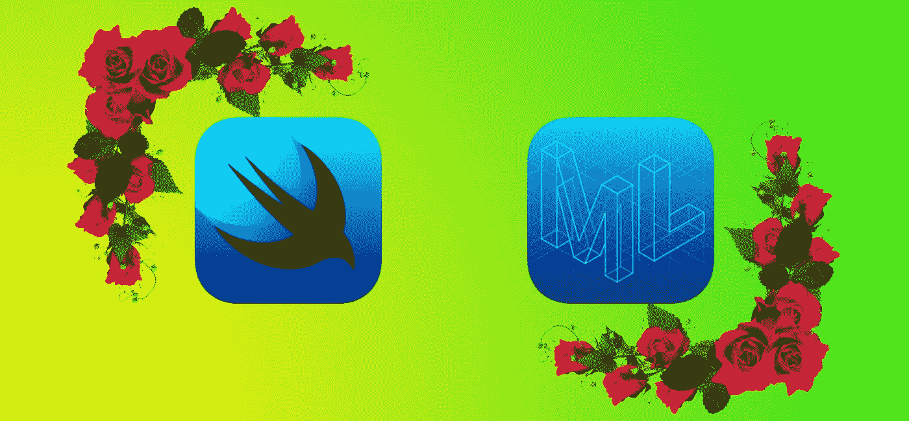
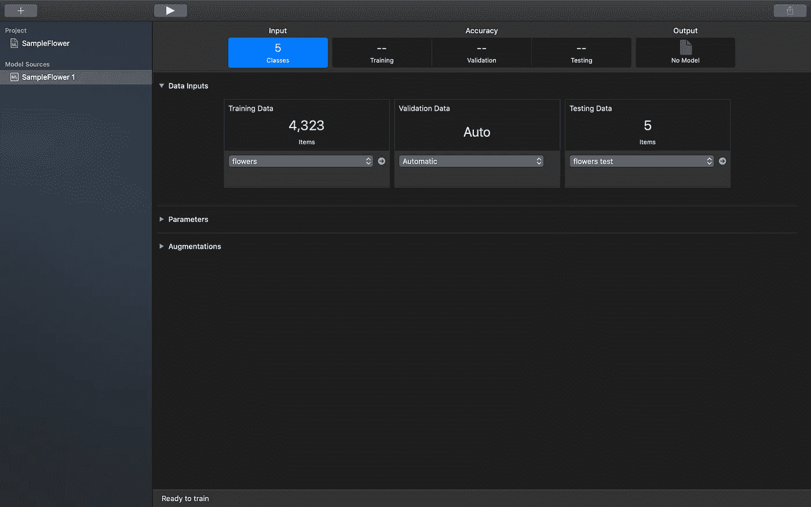
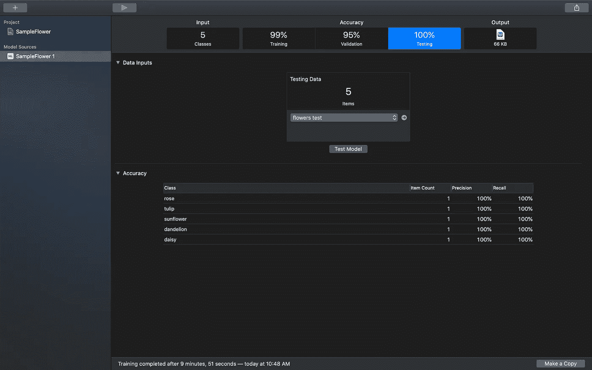
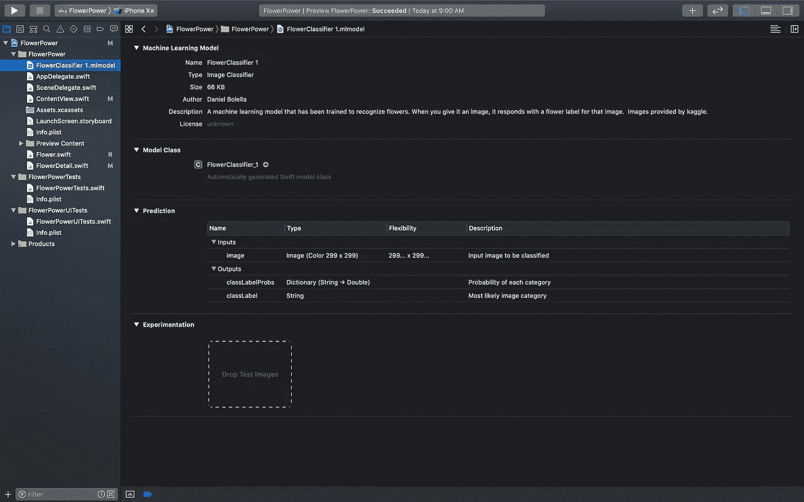
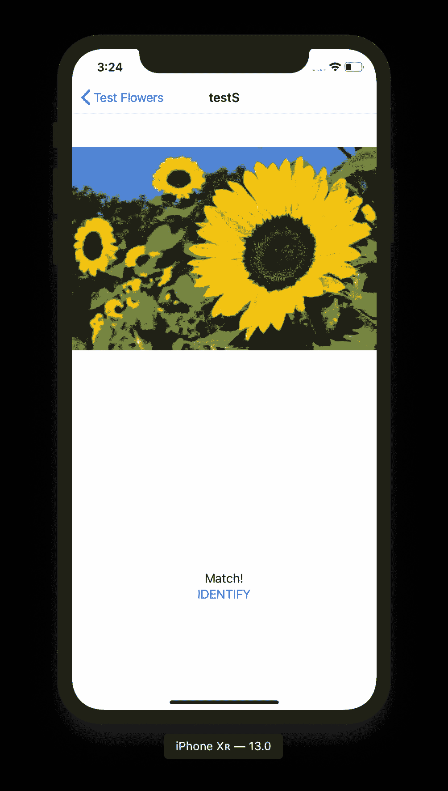

# Shoehorning SwiftUI 和创建 ML —第 2 部分

> 原文：<https://betterprogramming.pub/shoehorning-swiftui-and-create-ml-part-2-a8932075e09a>

## 第一部分的“史诗”结论

对[推销 SwiftUI 和创建 ML 的“史诗”总结—第 1 部分](https://medium.com/@dbolella/e517be035ed0?source=your_stories_page---------------------------)。

同样，这不是一步一步来的，但我确实指出了我引用的代码和项目的回购。

受我在 WWDC 2019 年追赶的启发，我创建了一个项目，将两个吸引我眼球的东西结合起来， [SwiftUI](https://developer.apple.com/xcode/swiftui/) 和 [Create ML](https://developer.apple.com/documentation/createml) 。

在第 1 部分中，我基本上创建了一个自定义的 floral 版本的教程，在 SwiftUI 会议的[介绍中演示。](https://developer.apple.com/videos/play/wwdc2019/204/)

在我试图同时学习两件事情的过程中，我使用了 Create ML，这也是我对核心 ML 的介绍。

# 跳上 ML 列车

我对机器学习、人工智能、统计学、概率等并不是完全没有兴趣。

事实上，当我还在金融行业的时候，我曾尝试涉猎过一些，但从未深入到足以说服任何人我们应该把注意力从工作上移开，进行更深入的研究。

尽管如此，每个人似乎都在谈论 ML/AI，它显然很大。

直到几年前，将 ML 作为应用程序的一部分的最有价值的解决方案似乎必须使用远程服务来做任何事情，这意味着必须使用移动应用程序的数据，这对我来说是一个障碍。

但是随着 API 在设备上思考并利用移动硬件，这种情况开始改变。而且，自从几年前 Core ML 问世以来，苹果一直在大力推广它，就其广泛的受众而言，这似乎只是一个开始。

具体来说，当苹果开始将 ML 优化的硬件纳入 iPhone X 系列时，我相信主流 ML 旗帜被放弃了，市场竞争开始了。

这就是为什么我对新的 Create ML 感到兴奋。最初是作为一个框架在去年发布的，每个人都疯狂地把它塞进了一个 Swift Playground。

老实说，我并不总是一个 GUI 势利小人(我在终端中使用 Git，而不是使用 [Sourcetree](https://www.sourcetreeapp.com/) )，但这最终引起了我的注意。

当我看到演示时，它看起来非常简单，任何人都可以使用。我是说，[时段](https://developer.apple.com/videos/play/wwdc2019/430/)本身不到 15 分钟！我没有借口了。

# 入门指南

再说一次，我正在使用 flower 应用程序，它的灵感来自于一个原始的 Create ML 教程。而且我们肯定还需要 [macOS Catalina](https://www.apple.com/au/macos/catalina-preview/) 和 [Xcode 13](https://developer.apple.com/xcode/whats-new/) 。

至于我们的花卉数据集，我应该过一遍为什么这将工作。数据集有五个子目录，用于五种花卉类别(雏菊、蒲公英、郁金香、向日葵、玫瑰)。

这些目录中的每一个都有数百张它们各自花朵的图片。

我们期望 Create ML 做的是分析每张带有各自标签的图片，以及该标签内的其他图片，并与其他花卉类别的所有其他图片进行比较，注意差异。

所有这些，实际上，所有我们需要提供的是已经预先分类到分别标记的目录中的图像。

现在，为了测试我们的模型，Create ML 允许您输入另一个包含测试数据的目录。

因此，我还创建了另一个具有相同子结构的目录，但每个类别中只有一个相应的图像(我从 Google 中提取并加载到我的应用程序资产中的相同图像)。

# 模特:准备好我们的特写镜头了吗

要打开新的 Create ML，请打开 Xcode 并进入 Xcode 下拉菜单→打开开发者工具→创建 ML。

然后选择一个图像分类项目，命名，然后，我们就成功了！

你会看到一个相当普通的屏幕。但令人难以置信的是，它已经为您准备好了您需要的一切。

首先，我抓取了包含所有花卉数据的文件夹，并将其拖到训练数据区域。我立即加载并准备好了我的训练数据。

然后，我把我的测试数据文件夹拖到测试数据区。我现在有了我的测试设置。

最后，这很棘手…我按了播放键。

就是这样！它现在将进行训练，并在训练完成后，提供关于其自身信心的细节，以及根据测试数据运行模型的结果(我们计划最终在我们的应用程序中实现这一点)。

我确保保存了模型，并把它放在我以后可以访问的地方。

请注意，培训可能需要一点时间，并将推动您的机器。我建议插上你的笔记本电脑。

所以，我有我的模型。我简直疯了，我打开一个应用程序，拖放两个文件夹，点击播放按钮，我现在有一个可以识别五种花卉的模型。

当然，这是一个相当狭窄的分类，但是因为它非常简单，我已经可以想象如何处理更复杂的模型。

# 让我的应用变得智能

最后，我将主持我一直着迷的两个主题的婚礼。

首先，我打开我的项目，简单地将我的模型拖放到其中。

如果您从项目视图中单击模型，您将看到我们模型的详细信息，模型的 Swift 类可用于我们的项目，甚至有一个实验区来进一步测试您的模型。

这向我们展示了模型中的可用内容以及进一步测试它的地方。

既然我们的模型已经存在，我们可以跳回到 FlowerDetail 结构中。

我在这里引用了[的例子](https://developer.apple.com/documentation/vision/training_a_create_ml_model_to_classify_flowers)，取我需要的，把它拆下来，放入我的模型中。

长话短说，我不需要条形码扫描仪，因此只需要处理一个视觉请求。

为了放入我的模型，而不是对我的文件进行 URL 引用，我能够只调用我的模型的类来引用它本身。

最后，我将结果与我们当前的花卉分类进行比较，三元组决定我们的状态`matchResult`是否应该变成“匹配！”或者“不匹配”。

尽管名为向日葵，但它与模型预测相符！

# 开花还是枯萎

就是这样。我已经到了关键时刻。模型会开花还是我的项目会枯萎？

记住，我将文本视图设置为`matchResult`状态。因此，一旦模型做出预测并设置了`matchResult`，SwiftUI 会自动同步并刷新我们的视图。我要做的就是点击“识别”按钮。

当我这么做的时候，我得到了那个甜蜜的，美丽的胜利的截图。

# 结论

虽然不是最漂亮的应用程序，但我对最终结果感到自豪。

老实说，最难的部分是安装 Catalina 和 Xcode Beta。

用 SwiftUI 构建应用程序非常简单。在这个过程中，我确实发现了一些很棒的 SwiftUI 工具和 Xcode 提供的服务，我希望很快在另一个故事中发布。

至于 Create ML，这肯定只是触及了表面。

我本来可以对图像做更多的事情，我真的很好奇如何使用文本分类模型。但是用于构建模型的新 GUI 已经把我推到了边缘，抓住了我的全部注意力。

对于代码，包括我的模型，去[回购](https://github.com/dbolella/FlowerPower)。

 [## dbolella/FlowerPower

### 使用 SwiftUI 和使用新的 Create ML GUI 生成的 mlmodel 进行实验。运行样本花卉图像，并确保…

github.com](https://github.com/dbolella/FlowerPower)