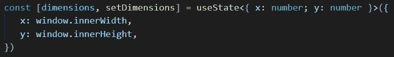
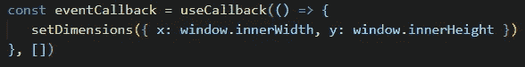
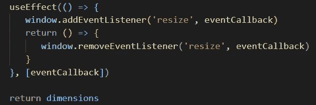
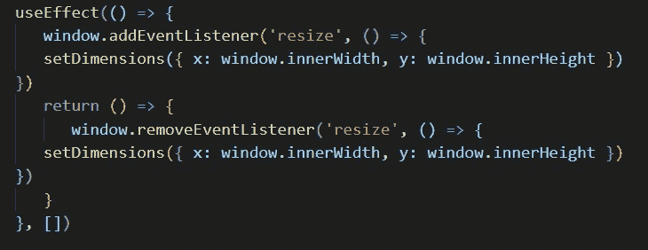
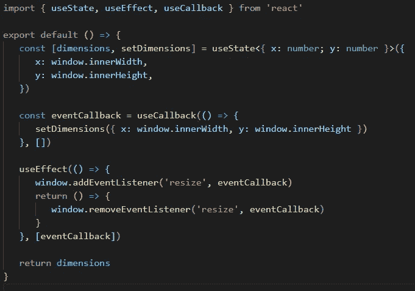
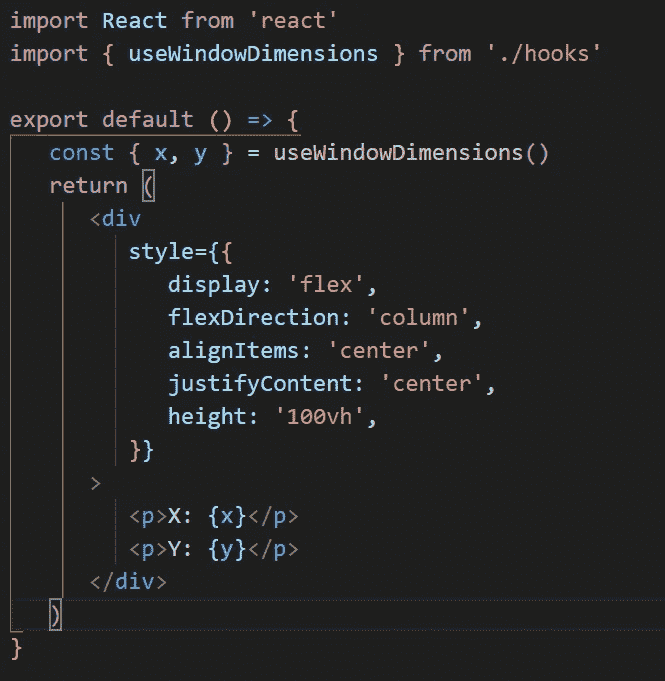
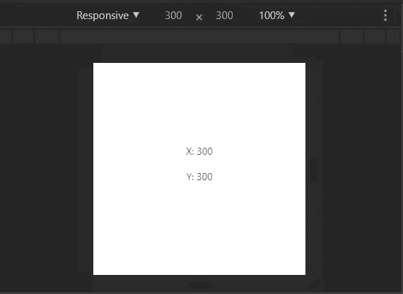
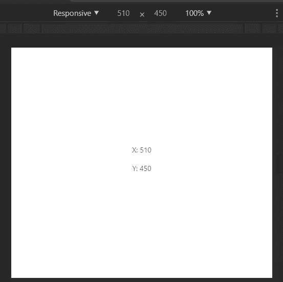

# 用 React 挂钩订阅窗口的尺寸

> 原文：<https://betterprogramming.pub/short-and-sweet-react-hook-to-subscribe-to-the-windows-dimensions-d791745fdfc8>

## 你曾经需要在一个组件中读取窗口的尺寸吗？嗯，这个钩子可以做到这一点

Pierre chtel-Innocenti 在 [Unsplash](https://unsplash.com?utm_source=medium&utm_medium=referral) 上的照片。

*注意:这段代码是用 TypeScript 编写的。*

让我们从定义我们最终希望钩子的消费者接收到的状态开始。我们用形状`{ x: number; y: number }`来定义它，并将默认值分别设置为窗口的当前(第一次调用钩子时)内部宽度和高度:

下面，我们定义一个函数，负责将状态设置为窗口的当前内部宽度和高度:

现在让我们创建一个负责订阅`resize`事件的效果，这样我们就可以在 DOM 调度它时运行我们的任意函数:

在清理效果时，我们通过将相同的引用传递给我们首先订阅的函数来移除监听器。最后，我们返回`dimensions`。

*注意:如果我们没有把* `*eventCallback*` *包在* `*useCallback*` *里面，* `*useEffect*` *钩子的依赖关系会在每次渲染时改变。*

*同样，向* `*resize*` *事件监听器的添加器和移除器传递相同的匿名函数也不会移除监听器！不要做如下所示:*

最终文件如下所示:

消耗我们钩子的一个例子:

结果是:

仅此而已。感谢阅读！