# 作为 UI 开发人员如何入门 Swagger

> 原文：<https://betterprogramming.pub/should-ui-developers-learn-swagger-d3890c4fdbe8>

## OpenAPI 规范、Swagger 编辑器和 Swagger UI 简介


图片来源:作者

你听说过由 Swagger 开发和记录的 API 吗？

是的，这些天招摇很热。这种新颖的方法使用 OpenAPI 规范，以前称为 Swagger 规范。在多年的 API 自由之后，终于有了一个设计、构建、测试、记录和使用 RESTful APIs 的行业标准。

下面是来自[https://swagger.io/](https://swagger.io/)的定义。

> “借助 Swagger 开源和专业工具集，为用户、团队和企业简化 API 开发。了解 Swagger 如何帮助您大规模设计和记录您的 API。”

Swagger 是关于 API 的。UI 开发人员是 API 的消费者，因此了解 OpenAPI 规范和 Swagger 工具是一大优势。开源方面，有 Swagger 编辑器，Swagger UI， [Swagger Codegen](https://javascript.plainenglish.io/swagger-codegen-from-server-to-client-d6a13910ed1f) ，和 [Swagger Plugins](https://medium.com/codex/exploring-swagger-codegen-and-swagger-plugins-a8d507b9fd5e) 。企业版有 [SwaggerHub](https://swagger.io/tools/swaggerhub/) 和 [Swagger Inspector](https://swagger.io/tools/swagger-inspector/) 。

通过理解 Swagger 如何工作，UI 开发人员变得更有能力执行 UI 工作甚至全栈工作。在本文中，我们主要关注 OpenAPI 规范、Swagger 编辑器和 Swagger UI。

# OpenAPI 规范

[OpenAPI 规范](https://swagger.io/specification/) (OAS)是机器可读接口文件的规范，用于描述、生成、消费和可视化 RESTful web 服务。它描述了 API 端点、输入和输出参数、认证方法等。OAS 是 OpenAPI Initiative(一个 Linux 基金会合作项目)中的一个社区驱动的开放规范。

API 定义可以用 YAML 或 JSON 编写。在之前的一篇文章中，我们解释了 YAML 是“YAML 不是标记语言”的递归首字母缩写它是一种人类可读的数据序列化语言。事实上，YAML 是 JSON 的超集，它提供了名称空间、注释、属性支持等更多特性。

以下是宠物店的 YAML 定义，[来自 OpenAPI 规范 3.0](https://github.com/OAI/OpenAPI-Specification/blob/main/examples/v3.0/petstore.yaml) 的官方示例。

YAML 是非常可读和不言自明的。

第 1 行指定`openapi`版本为`3.0.0`。此字段是必填的。

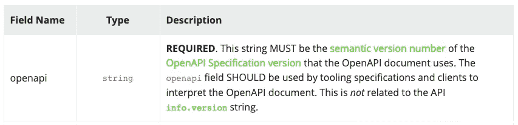

第 2–6 行指定了`info`，这是提供关于 API 的元数据所必需的。其中，`title`和`version`为必填项。

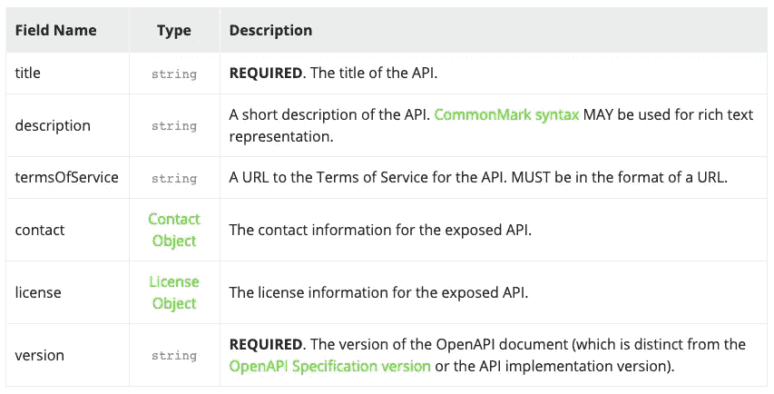

第 7–8 行以数组格式列出了一个服务器`http://petstore.swagger.io/v1`。它是 API 的目标主机。

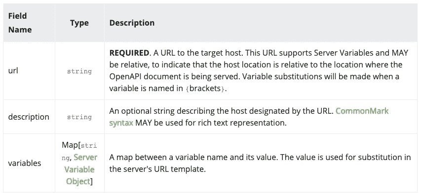

第 9–81 行定义了`paths`对象，它保存了各个端点及其操作的相对路径。每个路径都被附加到`servers`对象中的`url`以构建完整的 URL。

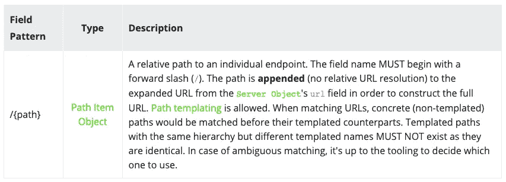

宠物店有三种路径和操作组合:

*   `/pets`-`get`(10-41 台词)
*   `/pets` - `post`(第 42-55 行)
*   `/pets/{petId}` - `get`(第 56-81 行)

第 82–111 行定义了`components`对象，它保存了 OAS 不同方面的可重用对象。

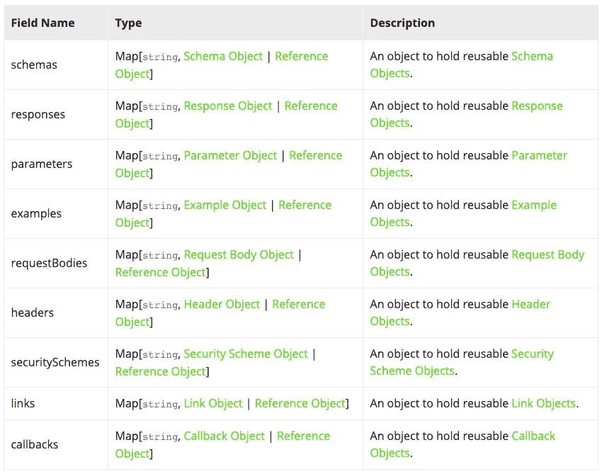

Pet Store 是 OAS 的一个例子，OAS 是一个针对 RESTful APIs 的一页文档，既可读又可读。

# 招摇的编辑

Swagger 是由最初的 Swagger 规范背后的团队创建的，该规范后来被重命名为 OpenAPI 规范。Swagger 已经发展成为使用 OAS 开发 API 的最广泛的开源工具集之一。

Swagger 编辑器是一个使用 OAS 定义和记录 RESTful APIs 的编辑器。Swagger 编辑器可以在 Web 上访问，可以在本地运行，也可以在云中运行。

让我们在网上访问 Swagger 编辑器:[https://editor.swagger.io/](https://editor.swagger.io/)。

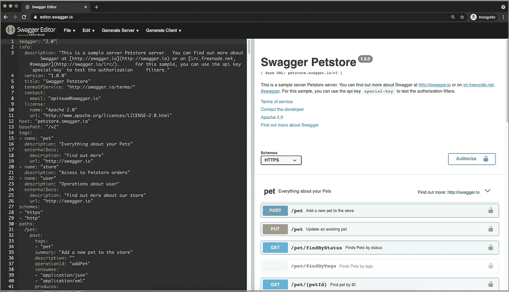

左侧是 Swagger 编辑器，它使用 OAS 定义和记录 RESTful APIs。API 在左边编辑，文档在右边实时预览。右边是 Swagger UI。有时术语*Swagger*和 *Swagger UI* 可以互换使用。无论如何，它们都存在于同一个用户界面中，只是侧重点不同。

web 上的 Swagger 编辑器有一个默认的 YAML 文件。有点过时的 YAML 文件被定义为`swagger: "2.0"`。

删除编辑器中的所有内容。在 Mac 上点按 Option-Space 键以获取 OAS 对编辑 YAML 文件的建议。

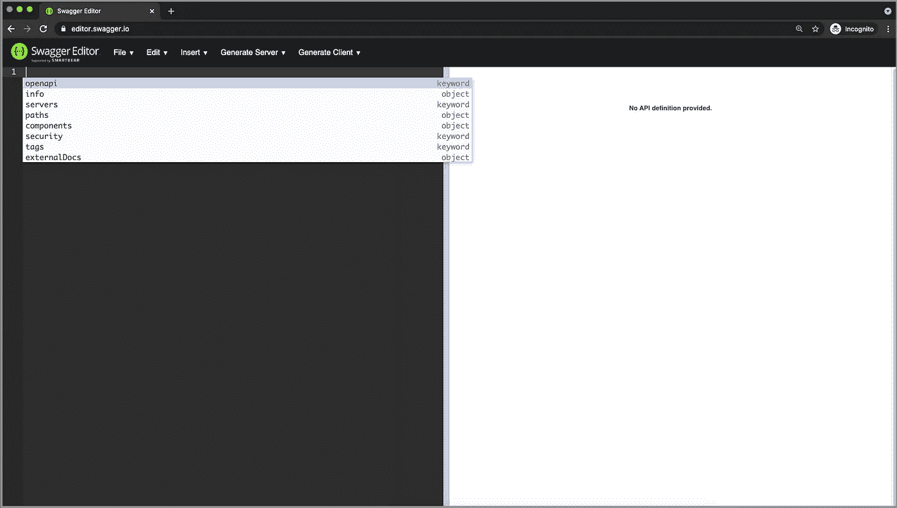

选择`openapi`。右侧提供验证信息。


当您键入时，右侧会验证语法并预览文档。

将宠物店定义复制粘贴到编辑器中，然后就可以在 Swagger UI 中查看宠物店 API 了。

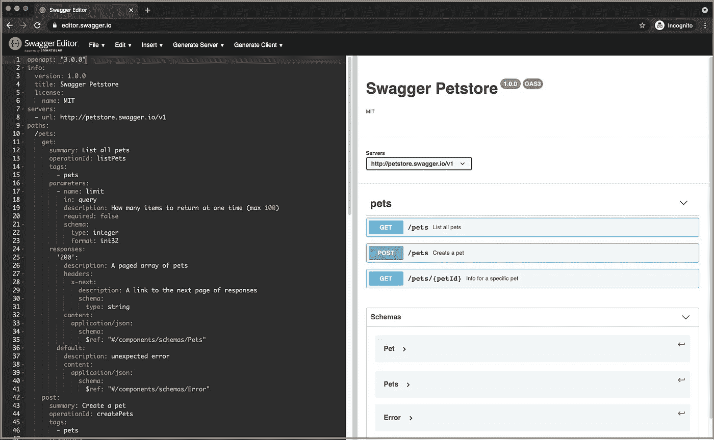

# Swagger UI

Swagger UI 是 HTML、JavaScript 和 CSS 资产的集合，可以从符合 Swagger 的 API 动态生成漂亮的文档。

在浏览器的 Swagger 编辑器中，我们可以将中间分隔线向左移动，以便只查看 Swagger UI。

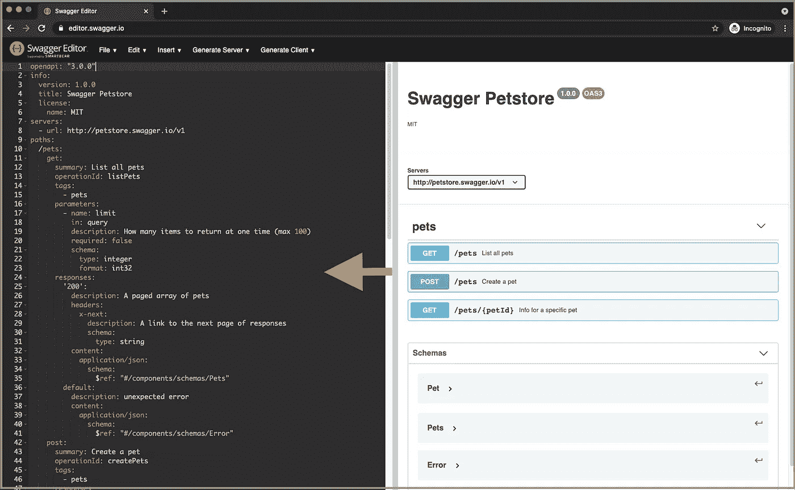

或者，Swagger UI 可以在本地运行，Swagger 编辑器也可以。

安装[创建反应应用](https://www.npmjs.com/package/create-react-app)。将 Swagger UI ( `npm i swagger-ui-react`)添加到`package.json`中的`dependencies`。

```
"dependencies": {
  "swagger-ui-react": "^3.48.0",
  ...
}
```

将`petstore.yaml`放在`public`文件夹下，并如下重写`src/App.js`。

第 5 行用`petstore.yaml`调用 Swagger UI。

在浏览器中，我们看到的是 Swagger UI，类似于 Swagger 编辑器的右侧。它显示了服务器 URL、RESTful API 端点和模式。

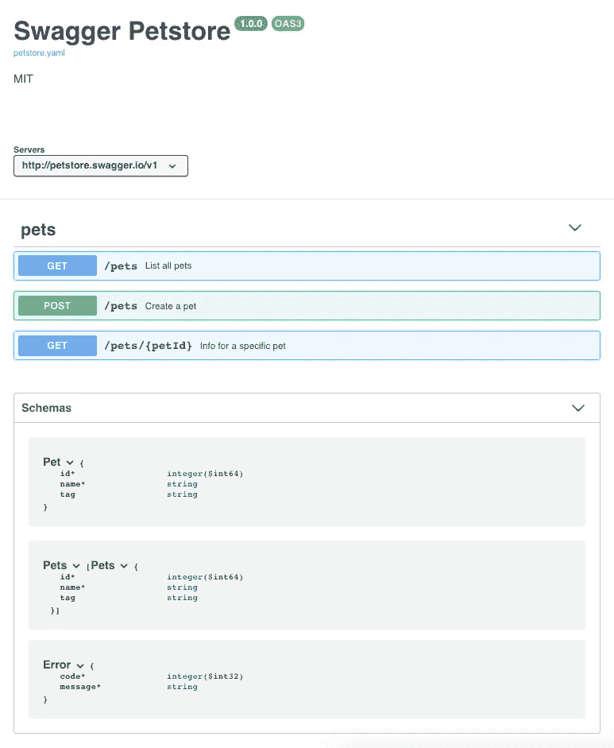

点击行`GET /pets`。这将打开一个包含输入参数和响应定义的详细面板。

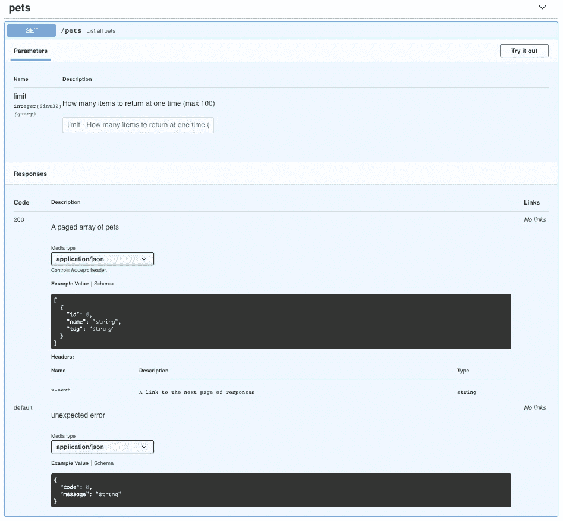

单击“试用”按钮。以下用户界面显示了“执行”按钮:

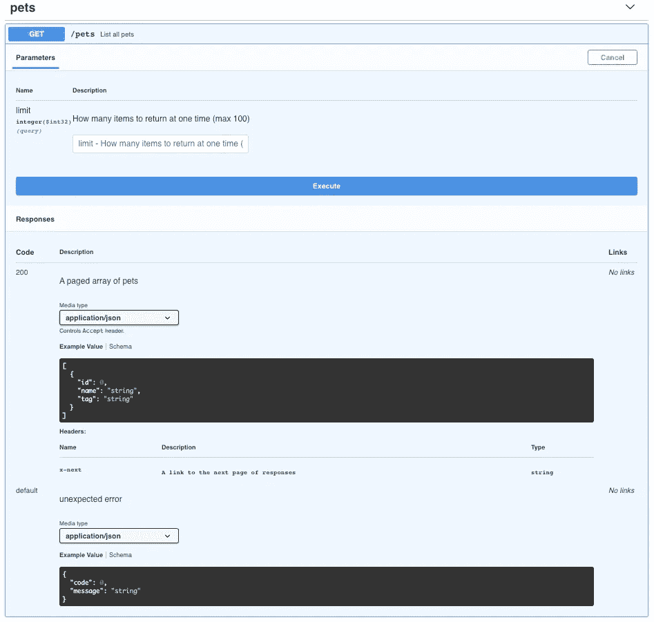

单击执行按钮:

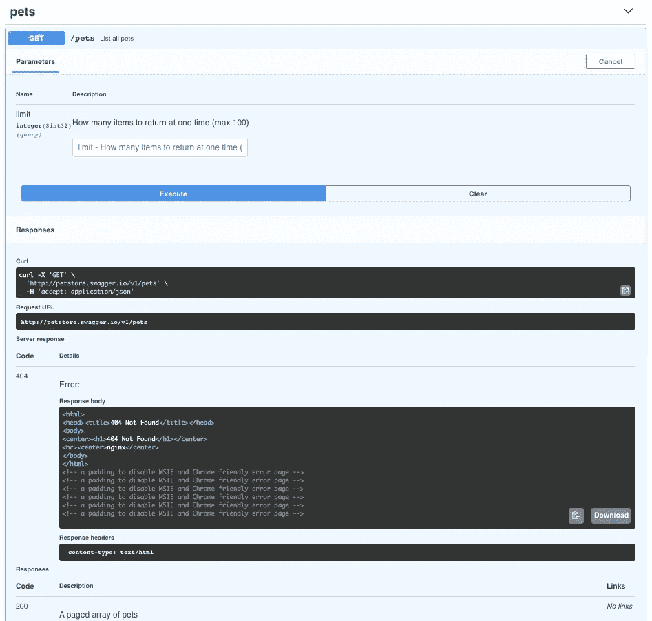

命令被执行。但是，回应是“404 未找到”

发生了什么事？

请看上图中的请求 URL。就是`[http://petstore.swagger.io/v1/pets](https://petstore.swagger.io/v1/pets)`。

单击链接并查看以下错误:


为了让 Swagger 工作，它需要有一个目标主机来处理 API，即监听请求并提供响应的有效服务器/部署。

回到官方的 Swagger 编辑器，`[https://editor.swagger.io/](https://editor.swagger.io/)`，执行`GET` `/store/inventory`命令:

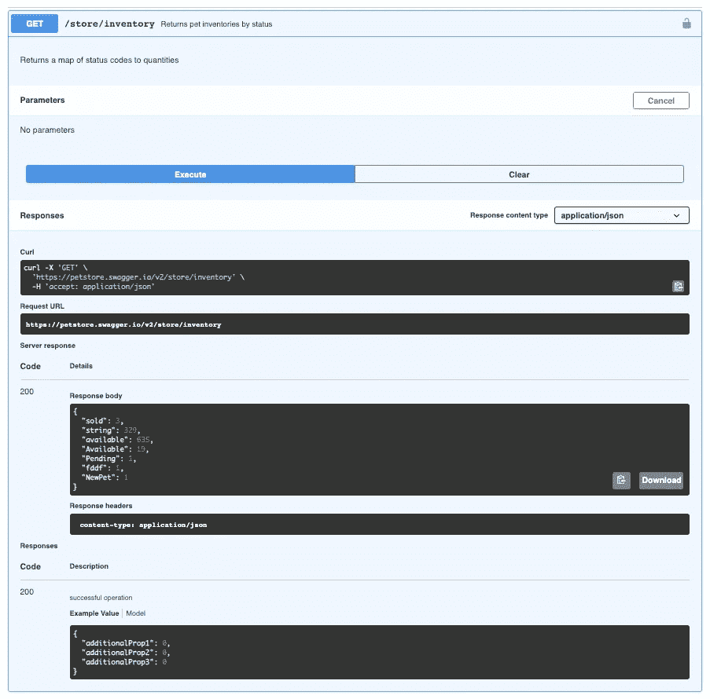

这是成功的。

请求 URL 是`[https://petstore.swagger.io/v2/store/inventory](https://petstore.swagger.io/v2/store/inventory)`。

单击链接并查看服务器响应:

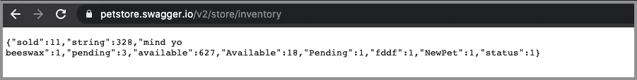

服务器`[https://petstore.swagger.io/v2](https://petstore.swagger.io/v2/store/inventory)`启动并运行，它监听请求并提供响应。

想看看另一个成功的 Swagger UI 执行示例吗？

转到`[https://petstore.swagger.io/](https://petstore.swagger.io/)`:

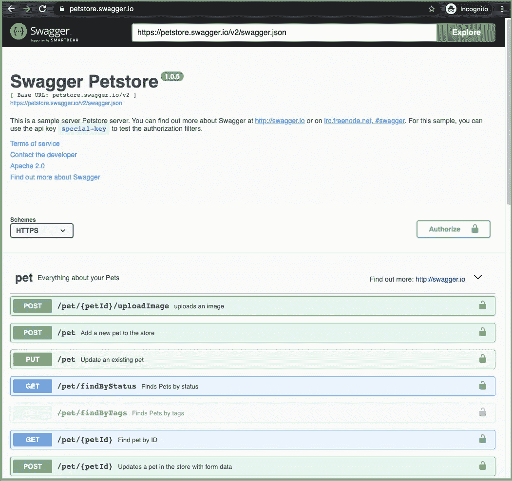

虽然是标准接口，但是我们不用 UI 开发工作就有了不是很好吗？

在[的下一篇文章](https://medium.com/codex/exploring-swagger-codegen-and-swagger-plugins-a8d507b9fd5e)中，我们将建立一个服务器/部署来解决我们的服务器错误。

# 结论

OpenAPI 为 RESTful web 服务定义了一种公共语言。Swagger 工具促进了整个 API 生命周期的开发，包括设计、测试、部署和文档。

OpenAPI 和 Swagger 工具为 API 开发者形成了一个流行的框架。有了标准化的工具和易于使用的 UI，也许是时候让 UI 开发人员掌握它了。

感谢马克西姆·库兹涅佐夫和朱利奥·卡波利诺向我展示了斯瓦格的迷人之处！

感谢阅读。我希望这有所帮助。你可以在这里看到我的其他媒体出版物。