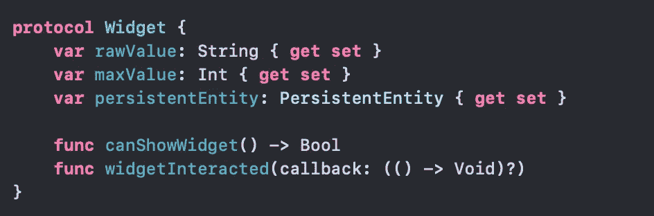
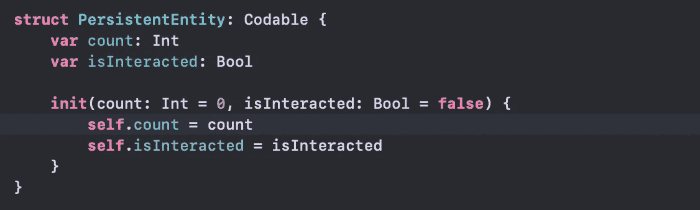
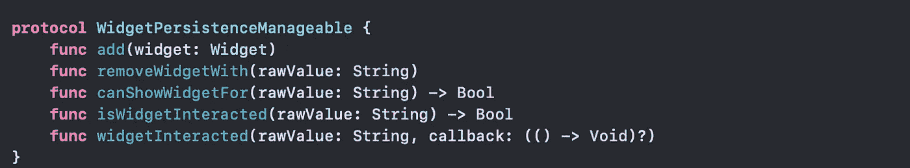
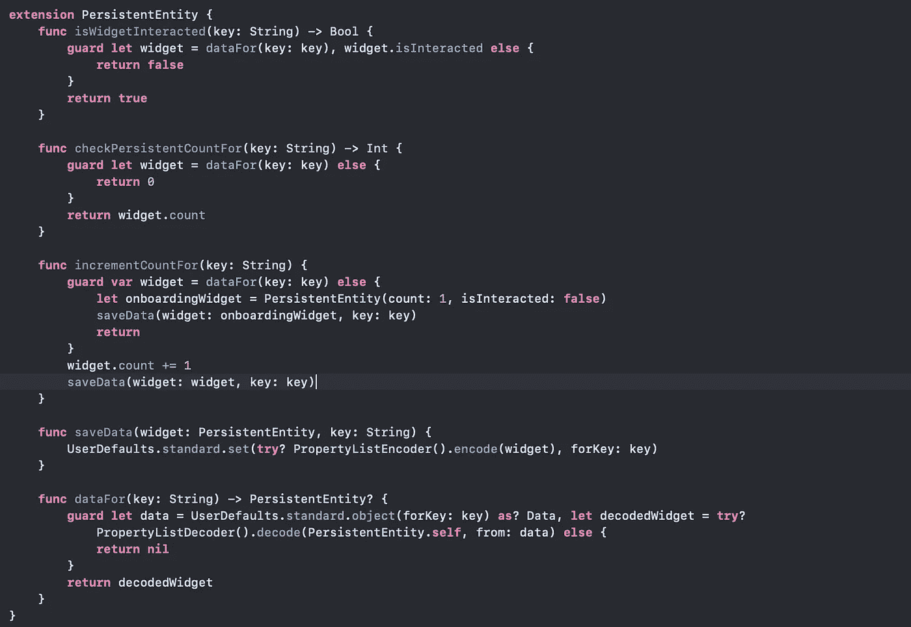

# 我们真的应该讨厌单身族吗？

> 原文：<https://betterprogramming.pub/should-we-really-hate-singletons-c75d1fe07111>

## 单身者受到很多讨厌，但这是合理的吗？

斯科特·韦伯在 [Unsplash](https://unsplash.com?utm_source=medium&utm_medium=referral) 上拍摄的照片

大约四年来，我一直是一名 iOS 开发人员。任何有类似经历的人可能一生中至少和单身人士一起工作过一次。当然，我们也听说过关于辛格尔顿的诅咒。对设计模式有一种广泛的憎恨。

但是，我们仍然多次看到它们的用法，甚至在 iOS 核心库中，如`UserDefaults`、`NotificationCentre`等。

# 那么我们为什么要使用它呢？

*   共享资源:我们希望一个单独的对象来控制一些东西
*   容易访问:你只需要类名和共享对象，瞧，你有你的实例。另外，它是封装的(pssst …不再有自由飞行的全局实例)。

# 有利有弊

可能有很多原因，但是憎恨单例的根本原因是*他们使代码紧密耦合，所以我不能对我的类进行单元测试，等等等等。*

那么，如果我们可以让它们松散耦合，并实际测试它们，会怎么样呢？

好吧，让我给你讲一个我做的例子。它被称为`WidgetPersistanceManager`。

## **用例**

通常，我们会展示一些 onboarding 小部件来介绍一些特性。也许在其他屏幕上显示要使用的特性时会再次需要这些小部件。

现在你想知道小部件是可以显示的，还是交互的？我需要解散吗？所以我需要一些类来维护这些。此外，我希望该实例在我需要时随时可用。所以是的，我们这里需要一个独生子。

## 表演开始了

1.  抽象:我们的主要目标是可测试性。于是抽象的游戏开始了。句号。(附:前方协议。)首先，我需要一个小部件，它在这里:

一个 widget 包含一个`rawValue`(可以帮助识别我的 widget 的唯一 ID)、一个`maxValue`(用于存储这个 widget 可以显示的次数)、一个`persistentEntity`(用于维护显示和交互次数)。和一些方法，这些方法将具有小部件显示和交互的逻辑。

下面是`PersistentEntity`:

2.**让我们介绍一下我们的持久性管理器:**

持久性管理器应该有一些基本要求:

*   添加小部件的一些方法
*   移除小部件的一些方法
*   一个知道小部件是否可以显示的函数
*   当窗口小部件被交互时做某事的功能
*   知道小部件是否被交互的方法

3.**具体化**:我们来看看以上抽象的一些具体实现。

`**WidgetPersistenceManager**`:一个`WidgetPersistenceManageable`的具体化，带有添加、删除和显示小部件的方法。

**注意:**功能之间没有逻辑耦合。这些函数简单地调用与各个小部件相关联的逻辑，这对于每个小部件都是可配置的。因此，没有紧密耦合。

在我的例子中，我需要使用一个动画的人字形来指向一个特性。所以我把这个小工具命名为`Chevron` *。*

注意，这里的逻辑封装在函数中。这就是我们想要的。

**注意:**还有一些辅助函数，像上面用的`dataFor(key: String)`、`saveData(widget: Widget, key: String)`。这些来自于`PersistentEntity`的扩展(创建`PersistentEntity`对象的全部要点)。

4.**用法**:

所以我们创建了一些类。现在是表演的时间了。

我们创建一个演示者，并将`WidgetPersistenceManageable` 作为我们的依赖项。这种依赖性是由某个构建器用共享实例初始化它来实现的。

注意依赖项的类型是`WidgetPersistenceManageable`(一个协议)。因此，我们可以在单元测试时注入一个模拟管理器，而演示者将采用类型`Widget`(另一个协议)，这样我们就可以在测试时提供一个模拟小部件。耶。

# 结论

所以到这里，我们已经到了文章的结尾。我们看到了如何使用抽象和依赖注入让我们的单例单元可测试。尽管我还没有为上述内容创建任何测试用例，但我保证我会写另一篇文章来展示`WidgetPeristenceManager`的测试部分(很快会发布链接)。

如果你想看代码，这里有回购协议的[链接。](https://github.com/akhilesh-gandotra/WidgetPersistanceManager)

最后，我只想说，单件属于设计模式的一个家族。它们被放在那里是有目的的。除了我们给他们的所有仇恨，他们仍然有他们的优势。我认为与其憎恨，我们应该驱使自己减少他们的缺点，然后我们可以从他们身上得到最多。

感谢阅读！