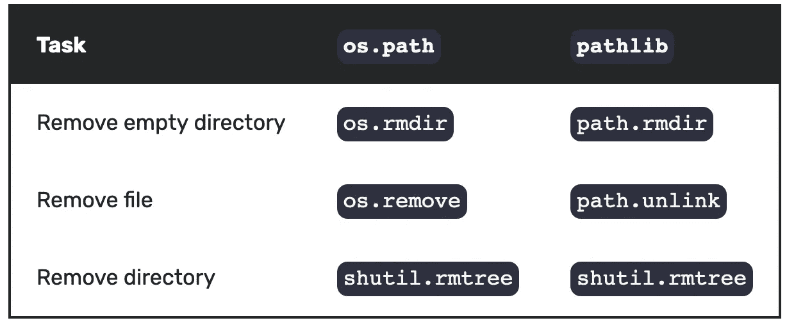

# 应该用 Python pathlib 还是 os？

> 原文：<https://betterprogramming.pub/should-you-be-using-pathlib-6f3a0fddec7e>

## 两个 Python 路径库之间的决斗


尼泊尔 Gokyo(作者拍摄)

本文比较了两个使用文件路径的 Python 库: [os](https://docs.python.org/3/library/os.html) 和更新的 [pathlib](https://docs.python.org/3/library/pathlib.html) 。

这是一场黎明对决——一场比较两种常见编程任务方法的四轮对决。

谁将是我们的冠军？

# `os`还是`pathlib`？

如果你已经用 Python 编程一段时间了，很可能你正在使用操作系统中的函数，比如`os.path.join`。

pathlib 是在 Python 3.4 中引入的，它为处理路径提供了一组不同的抽象。然而，仅仅因为它更新，并不意味着它更好。

那么如何决定哪个是最好的呢？一场传统的决斗怎么样？黎明时的手枪！

# 第一轮-单一路径

我们的第一轮由通常使用单个文件路径完成的任务组成:

*   从字符串形成文件路径
*   获取主目录和当前工作目录
*   使用文件名和后缀

## 创建单个文件路径

操作系统对文件路径采取不同的方法——例如，LINUX 使用`/`,而 Windows 使用`\`作为路径的分隔符。

由于这种复杂性，可移植性是一个关键问题——`os.path`和 pathlib 都提供了可移植的方法来构造路径。

os 提供`os.path.join`来创建文件路径:

```
import os
path = os.path.join(os.path.expanduser('~'), 'data', 'file.txt')
# /Users/adam/data/file.txt
```

在 pathlib 中，使用除法运算符`/`和初始化的`Path`对象形成路径:

```
from pathlib import Path
path = Path.home() / ‘data’ / ‘file.txt’
# /Users/adam/data/file.txt
```

`Path`对象是 pathlib 的焦点。我们需要的几乎所有功能都可以作为这个对象的属性或方法来访问。

## 获取主目录

主目录位于不同操作系统的不同位置。我们的两个竞争者都提供了一种获取用户主目录的方法，这种方法在 UNIX 和 Windows 系统上都适用:

*   Ubuntu `/home/$USER`
*   苹果电脑`/Users/$USER`
*   窗户`C:\Users\$USER`

带操作系统:

```
import os
os.path.expanduser(‘~’)
# /Users/adam
```

使用 pathlib:

```
from pathlib import Path
Path.home()
# /Users/adam
```

## 获取当前工作目录

带操作系统:

```
import os
os.getcwd()
```

使用 pathlib:

```
from pathlib import Path
Path.cwd()
```

## 使用文件名和后缀

文件名包含后缀。

通过操作系统获得此功能需要使用`basename`:

```
import os
os.path.basename('/path/file.suffix')
# file.suffix
```

通过 pathlib，我们可以在一个`Path`对象上使用`name`属性:

```
from pathlib import Path
Path('/path/file.suffix').name
# file.suffix
```

词干不包括后缀。用操作系统获得这个需要使用`basename`和`splitext`:

```
from os.path import basename, splitext
splitext(basename('/path/file.suffix'))[0]
# file
```

通过 pathlib，我们可以在一个`Path`对象上使用`stem`属性:

```
from pathlib import Path
Path('/path/file.suffix').stem
# file
```

后缀是文件路径的最后一部分，通常表示文件类型。以`os.path`为后缀:

```
import os
os.path.splitext('/path/file.suffix')[-1]
# .suffix
```

pathlib 将`suffix`作为`Path`对象的属性:

```
from pathlib import Path
Path('/path/file.suffix').suffix
# .suffix
```

## 摘要—单一路径

我们的第一轮比赛结束了——胜者是 pathlib！我们的评委喜欢的一些东西:

*   将数据和功能移动到单个`Path`对象上
*   记住一些操作系统方法(比如`os.path.expanduser`)是很困难的

# 第二轮——制造东西

我们的第二轮由制作产品时通常完成的任务组成，包括:

*   制作目录
*   将数据保存到文本文件
*   将数据追加到文本文件

## 制作目录

先用`os`:

```
import os
path = os.path.join(os.path.expanduser('~'), 'python-file-paths')
os.mkdir(path)
```

使用 pathlib:

```
from pathlib import Path
path = Path.home() / 'python-file-paths'
path.mkdir()
```

有时，我们希望创建一个比上一个文件夹更深的新文件夹。尝试这样做会引发一个错误(因为`foo`还不存在):

```
from pathlib import Path
path = Path.home() / 'python-file-paths' / 'foo' / 'bar'
path.mkdir()
# FileNotFoundError
```

我们可以通过使用`parents=True`来避免这种情况:

```
from pathlib import Path
path = Path.home() / 'python-file-paths' / 'foo' / 'bar'
path.mkdir(parents=True)
```

错误的另一个原因是试图创建一个已经存在的目录:

```
from pathlib import Path
path = Path.home() / 'python-file-paths' 
path.mkdir()
# FileExistsError
```

每当我们创建一个文件夹时，我们通常使用`parents=True`和`exist_ok=True`:

```
from pathlib import Path
path = Path.home() / 'python-file-paths' / 'foo' / 'bar'
path.mkdir(parents=True, exist_ok=True)
```

上面的例子都是关于从一个路径创建一个目录。有时我们也有一个带文件名的路径。

有时我们实际上有一个完整的文件路径(包括文件夹和文件名)。如果我们在一个完整的文件路径上使用`mkdir`,我们将最终创建一个与我们即将创建的文件同名的目录！

我们可以使用`Path.parent`来访问我们的文件所在的文件夹，并在该文件夹上调用`.mkdir`:

```
from pathlib import Path
path = Path.home() / 'python-file-paths' / 'foo' / 'bar' / 'baz.file'
path.parent.mkdir(parents=True, exist_ok=True)
```

## 将数据写入文件

假设我们有一个 32 个样本的数据集，我们想将每个样本保存在`$HOME/python-file-paths/`中的一个文件中。

使用 os，我们在`os.mkdir`中缺少`exist_ok`参数，这意味着我们需要在创建`base`文件夹之前检查它是否存在:

我们可以用`cat`打印出我们的第一个样本:

```
$ cat ~/python-file-paths/sample_0.data
[37.45401188 95.07143064 73.19939418 59.86584842]
```

然后使用 pathlib，我们可以在`Path`对象上使用`exist_ok=True`和`write_text`方法:

再次使用`cat`打印出我们的第一个样本，由于我们的随机种子，是相同的:

```
$ cat ~/python-file-paths/sample_0.data
[37.45401188 95.07143064 73.19939418 59.86584842]
```

## 将数据追加到文件中

上面的任务是写入许多文件:每个样本一个文件。其他时候，我们想追加到一个文件中，这样做的好处是我们所有的数据都存储在一个文件中。

这些示例将文本追加到一个文件`all_samples.data`中。首先是操作系统:

使用 path lib——注意，我们被迫使用上下文管理来传递一个`a`的附加标志:

现在我们的数据存储在一个文件中(每行一行):

```
$ head -n 2 ~/python-file-paths/samples.data
[37.45401188 95.07143064 73.19939418 59.86584842]
[15.60186404 15.59945203  5.80836122 86.61761458]
```

## 总结——制作物品

丁！胜利者又是 pathlib！这一轮评委喜欢的一些东西:

*   `Path.mkdir()`中的`exist_ok`的参数避免了创建一个已经存在的目录的错误。
*   `Path.parents`属性允许轻松访问文件所在的文件夹。
*   用`Path.write_text`将数据写入文本文件

# 第三轮——阅读和发现

我们的第三轮是关于使用已经存在的东西，例如:

*   读取文本文件
*   查找文件
*   查找目录

## 从文本文件中读取

让我们打开之前创建的一个文本文件。

首先，我们将使用操作系统打开它，这需要上下文管理来在打开后正确关闭文件:

```
from os.path import join, expanduser
path = join(expanduser('~'), 'python-file-paths', 'samples.data')
with open(path, 'r') as fi:
    data = fi.read()
```

然后我们将使用 pathlib，在这里可以使用我们的`Path`对象上的`read_text()`方法打开、读取和关闭文件:

```
from pathlib import Path
path = Path.home() / 'python-file-paths', 'samples.data')
data = path.read_text()
```

## 递归查找许多文件

有时我们想找到许多文件的路径。我们想要找到文件系统深处的路径，也就是递归地。

有了操作系统，我们可以使用`os.walk`来做到这一点:

用 pathlib，`glob`最好:

```
from pathlib import Path
path = Path().home()
paths = [p for p in path.glob('**/*.py') if p.is_file()]
```

`glob`不会确定地返回路径顺序。如果您依赖订单，请务必在`paths`上调用`sorted`。

## 查找所有目录

我们经常需要某个路径下的目录列表。这里我们使用用户的主目录。我们不希望这是递归的。

对于`os.path`,我们使用`os.path.listdir()`迭代一个路径，用`os.path.isdir()`检查路径是否是一个目录:

```
from os import listdir
from os.path import expanduser, join, isdir
path = expanduser('~')
dirs = [join(path, p) for p in listdir(path) if isdir(join(path, p))]
```

对于 pathlib，我们使用`path.iterdir`和`path.is_dir`。两种方法都在`Path`对象上调用:

```
from pathlib import Path
path = Path().home()
dirs = [p.name for p in path.iterdir() if p.is_dir()]
```

## 递归查找所有目录

有时，我们希望超越单一路径，递归地搜索文件夹。

我们可以使用`os.walk`来做到这一点:

对于 pathlib，最好使用`path.glob`来完成:

```
from pathlib import Path
path = Path().home()
paths = [p for p in path.glob('**/*') if p.is_dir()]
```

## 摘要—阅读和查找

我们的第三回合结束了——胜者是 pathlib！我们的评委喜欢的一些东西:

*   用`Path.read_text`读取文本文件
*   能够使用`Path.is_dir()`检查路径是目录还是使用`Path.is_file()`检查文件夹

# 最后一轮——移除物品

我们的最后一轮是移除物品:

*   删除目录
*   删除文件

## 删除目录

最好的方法是使用`shutil.rmtree`，它将删除目录，即使它不是空的。

除了创建文件路径之外，os 和 pathlib 之间没有真正的区别。以下示例使用 pathlib:

```
from shutil import rmtree
from pathlib import Path
path = Path.home() / 'python-file-paths'
rmtree(path)
```

这通常是您在删除目录时想要的行为:即使不是空的也要删除。

## 删除文件

有时，当我们知道路径时，我们希望删除特定的文件。

我们可以通过操作系统做到这一点:

```
import os
from os.path import expanduser, isdir, join
path = join(expanduser('~'), 'python-file-paths', 'data.txt')
if os.path.exists(path):
    os.remove(path)
```

使用 pathlib:

```
from pathlib import Path
path = Path.home() / 'python-file-paths' / 'data.txt'
path.unlink(missing_ok=True)
```

由于这项任务非常复杂，下面给出了一个摘要:



## 摘要—移除物品

我们的最后一轮比赛结束了——平局！这是最后一项任务，由于两种方法的复杂性，需要使用额外的库`shutil`。

对于我们的评委来说，这是一个公平的结果——也许是对 os 的一点同情，OS 是一个勇敢的竞争对手，但被它的继任者远远超过。

# 摘要

决斗已经结束，最终结果如下:

*   第一轮—单一路径—路径库
*   第二轮——制造东西——path lib
*   第三轮—阅读和寻找—路径库
*   第四轮—移除物品—抽签

pathlib 名列前茅是因为:

*   将大多数功能转移到一个`Path`类上
*   `Path.mkdir()`上的`exist_ok`自变量
*   在读写文本文件时避免使用上下文管理

感谢阅读！

*最初发表于*[*https://www.datasciencesouth.com*](https://www.datasciencesouth.com/blog/python-file-system)*。*