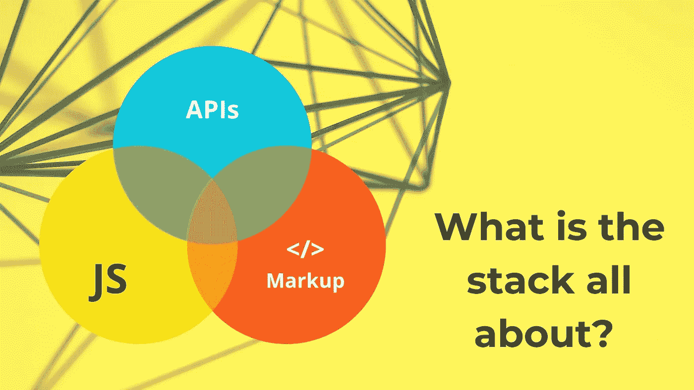
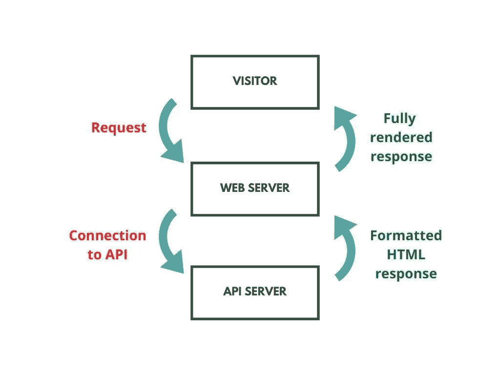
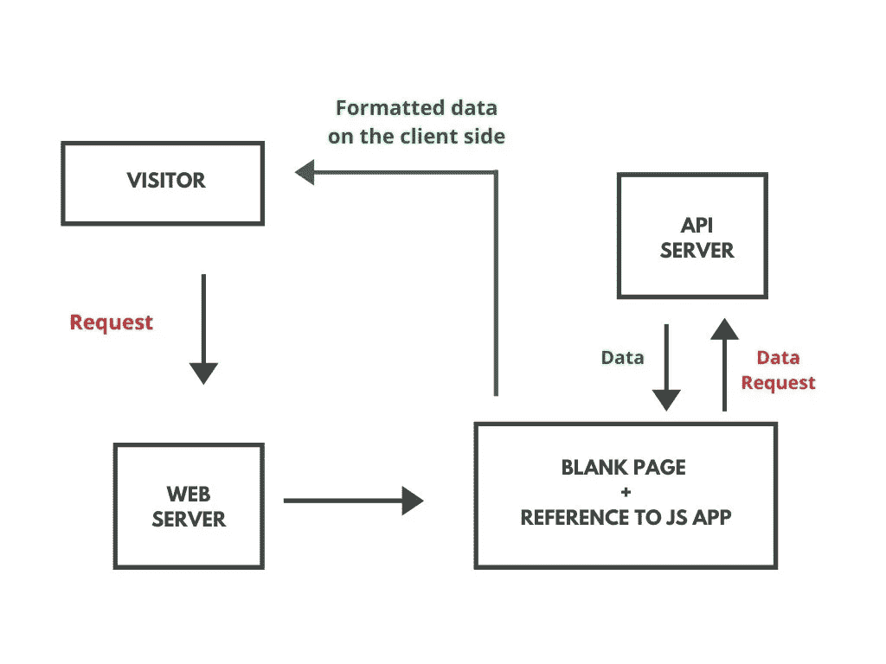
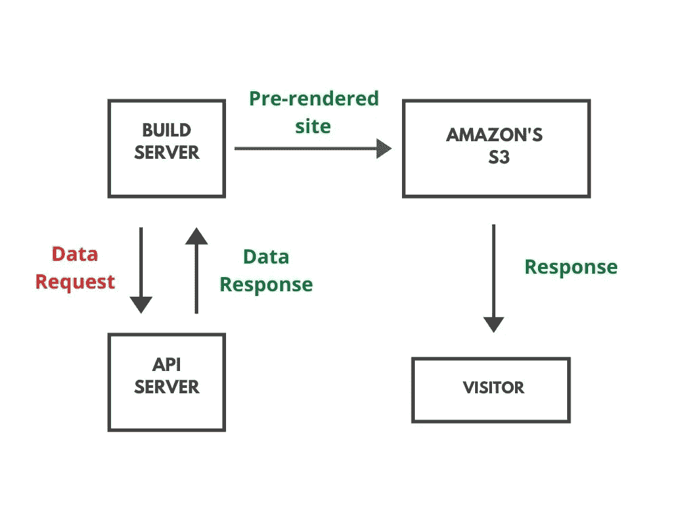

# 您应该在项目中使用 JAMstack 吗？

> 原文：<https://betterprogramming.pub/should-you-be-using-the-jamstack-for-your-projects-11dcef1e93be>

## JAMstack 是关于什么的？

作者照片。

自从 JAMstack 出现以来，它就受到了很多关注，在 web 开发社区中也有很多关于你是否应该从 WordPress 迁移到 JAMstack 的讨论。我想我应该写一篇关于这个的综述文章，这样你就可以知道它是否是你项目的正确选择。

理解 JAMstack 的关键是了解 web 世界中静态和动态的区别。

简单来说，静态意味着你已经预先构建或预先计算好了某个东西，并在静态托管系统上对其进行了预编译。动态是指你实际上是在动态地构建东西，计算它来响应每一个请求。当你凭直觉思考它时，用你已经拥有的东西来响应会快得多，也便宜得多，而不是为了响应每一个请求而匆忙计算。

一些一直是静态的东西包括 JavaScript、音频和视频文件以及 CSS。是的，JavaScript 是动态的。没错。它在页面及其行为上是动态的，但是代码本身在一个软件的不同版本之间总是一致的。非常重要的一点是要明白，任何时候你在计算一个请求时，都会遇到性能或可伸缩性的问题。如果你能预先计算出反应——即使是很短的一段时间——你会过得更好。

一个老派的 web 服务器有三个主要工作:服务 HTML、静态资产和 API 端点。如今，你所有的静态资产都将放在类似亚马逊的 S3 上。说到 API，我们已经把它们转移到了其他服务器上，或者一组服务器上，如果你正在做微服务的话。

这使得 web 服务器只做一项工作，那就是提供 HTML 页面。如果是这样的话，我们能让这些页面保持静态吗？为此，我们需要了解 web 服务器如何呈现 HTML 页面。

假设一个访问者访问了[媒体的主页](https://medium/blog)。请求发送到服务器，服务器连接到 API，请求页面上的数据，格式化 HTML 响应，然后将其发送回完全呈现的访问者。

作者照片

在过去的十年中，web 开发越来越趋向于客户端渲染。在这个模型中，用户向服务器发出同样的请求，但是服务器的响应实际上是一个空白页面和一个对 JavaScript 应用程序的引用，然后 JavaScript 应用程序向 API 发出请求。该 API 用数据进行响应。然后，客户端代码(JavaScript)格式化该数据，并将其呈现到客户端的体验中。

作者照片

还有另一种新的方法来做同样的事情。在构建期间，为了响应数据或代码更改，服务器从数据库中获取所有数据的列表，然后使用一组模板来格式化包含所有这些内容的站点。所有这些页面都是预先渲染好的，放在亚马逊的 S3 上。当访问者访问该页面时，他们会立即返回一个完全呈现的页面。

作者照片。

这样做的好处是，您只需将数据转换成 HTML 一次。在其他模型(客户端和服务器端呈现)中，您每次都呈现 HTML，而不管在哪里完成。一个关键因素是，每个客户对于给定的 URL 都将获得相同的 HTML 页面。在其中的两个模型中(客户端渲染和静态站点生成)，我们可以摆脱 web 服务器，节省大量的时间和金钱，这通常是每个人的目标。

这就是 JAMstack 的意义所在。

JAM 是首字母缩略词。j 代表 JavaScript，A 代表 API，M 代表标记。HTML 是堆栈中的超文本标记语言。按照执行顺序，其实是标记，JavaScript，然后是 API。所以理想情况下，应该是 MJA，这不是一个好的缩写。无论如何，它被称为堆栈，因为这是一个术语，只要你有一堆技术一起工作。我认为这是足够的解释了。为什么应该使用 JAMstack？

*   这对性能更好，因为你可以从 S3 或任何类型的静态托管网站上提供的任何东西总是比你从 web 服务器上提供的东西要快。
*   您不再需要监控任何服务器。它永远是可用的。如果它昨天还在，今天、明天和将来都会在，只要你继续支付账单。
*   这样更安全。我是说，黑一个不存在的服务器真的很难。

到达那里有多容易？如果你的服务器已经有了一个主页面，那么把它放在 S3 上，指向你的客户，然后你就可以走了。如果您的 web 服务器对每一个 URL 请求都发出 API 请求，那么情况会稍微复杂一点，但这是可能的。有几种不同的方法可以做到这一点。

*   微前端——这是您在页面上留下点的地方，然后运行在客户端上的代码开始运行，发出请求，并格式化 HTML，然后进入这些点。
*   边缘包含—如果您有一个内容交付网络(CDN)位于您的客户和您的 S3 之间，您可以使用边缘包含，从而在页面发送给访问者之前将材料注入页面。页眉和页脚就是一个很好的例子。您静态地生成没有任何页眉或页脚的站点，然后 Edge Side Includes 在它发送到客户端之前注入页眉和页脚。

除了这两种方法，还有很多方法可以做到。关键是你可以给静态生成的站点添加动态行为。

现在您已经知道了 JAMstack 是什么，包括它的优点，剩下的主要问题是“为什么我们没有一直这样做？”我还是无法落地一个一刀切的答案。

鉴于可以选择在客户端呈现或者在静态站点生成期间呈现，新的平台、服务和 API 已经出现。平台方面，出现了雨果、哲基尔、盖茨比这样的新平台。在服务器端，有 Netlify、Now.sh、Zeit 等网站。API 方面，有 AWS 的 Amplify 和 Google 的 Firebase。这两者都为您提供了一整套服务，并且它们还允许您拥有一个托管的数据库，您可以将 CRUD 功能嵌入到 API 中，而您不必自己构建。

堆栈是否决定了前端框架的选择？事实并非如此。所有这些前端框架都允许您构建一个静态站点并快速部署。JAMstack 只是一个架构，并不特别依赖于其中的任何一个。当涉及到静态站点生成时，静态站点生成器通常依赖于特定的前端技术(例如 Gatsby to React)。您的应用程序也不必是使用堆栈的单页应用程序，尽管如果是这样会更容易。一定要用 Netlify 这样的 JAMstack 服务提供商吗？他们有一些好工具可以让你的工作变得更容易。我想另一个问题是从哪里开始。这很大程度上取决于您的 web 服务器今天在做什么。如果只是做一个静态的主机页面，很容易移植。如果它在做更复杂的事情，你需要看看它具体在做什么，看看你如何获得动态行为，并将其转化为静态行为。总的来说，微前端、Edge Side Includes 和 JavaScript 可以帮你做到这一点。

我希望这篇概述能够帮助您获得一些有用的信息，了解 JAMstack 是什么，它的优点，以及它是否会让您和您的项目感兴趣。在开发世界中，如果您知道多种技术，那么您的项目通常会决定要使用的最佳技术。