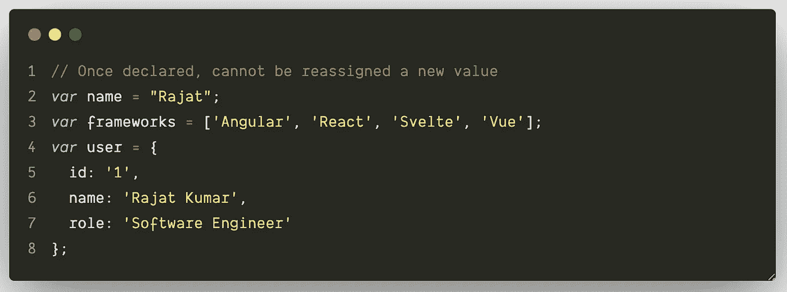
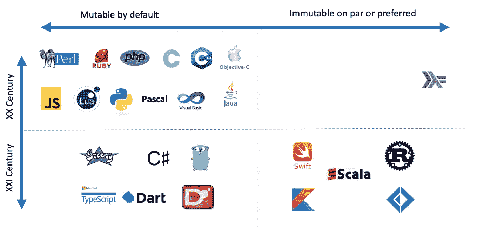
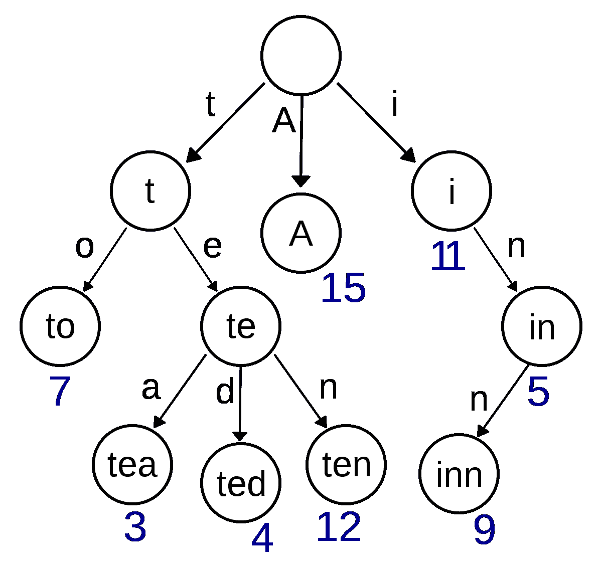
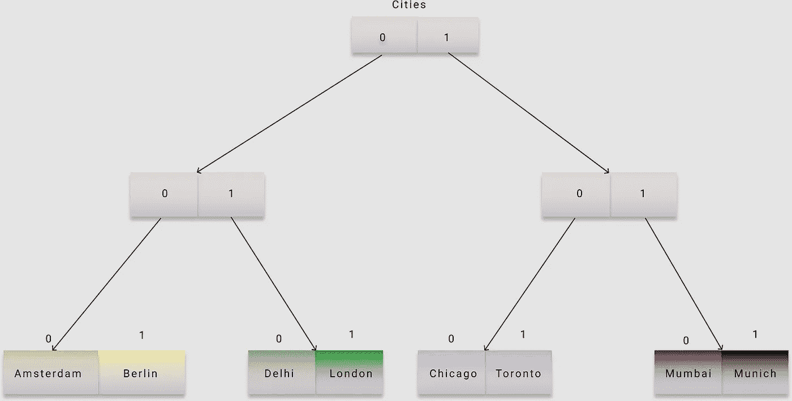
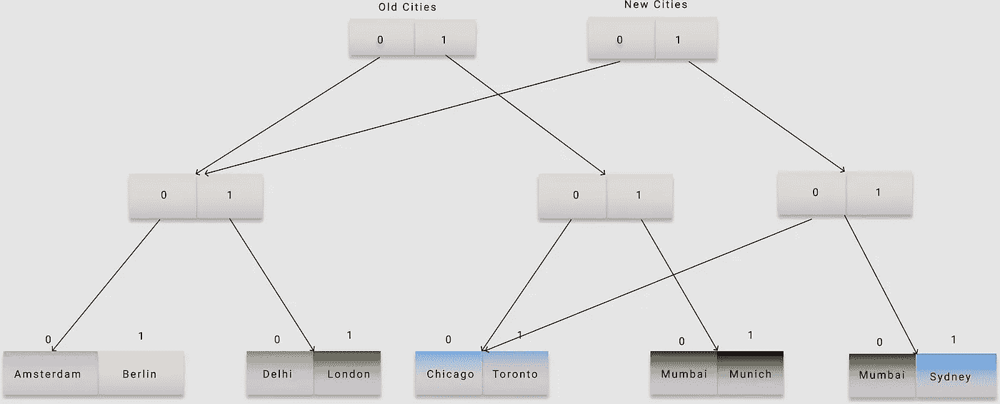
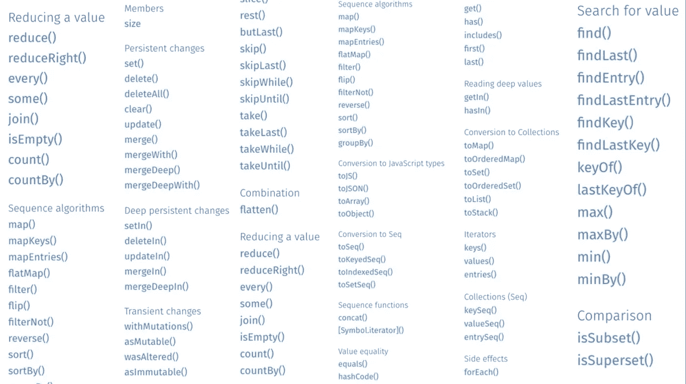
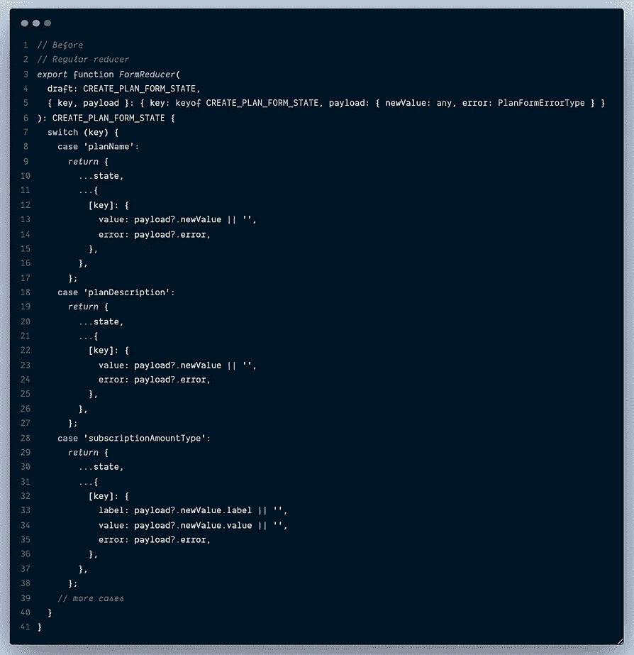
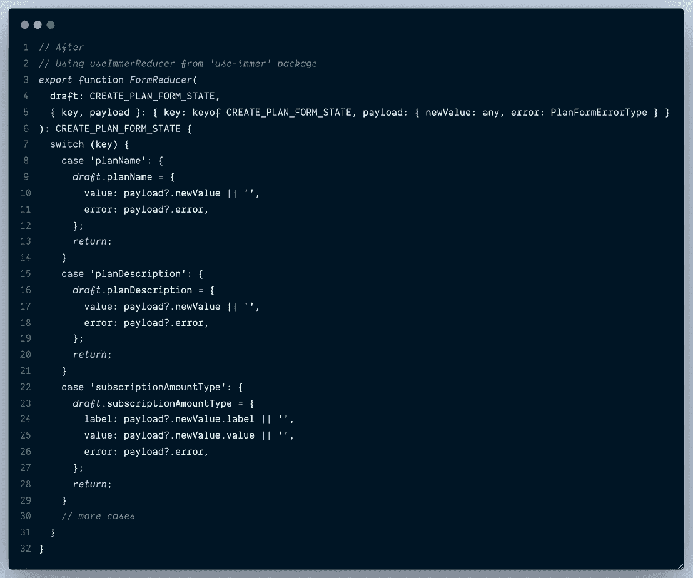

# JavaScript 中应该关心不变性吗？

> 原文：<https://betterprogramming.pub/should-you-care-about-immutability-in-javascript-a-brief-intro-to-immer-js-ft-react-febabd7e73b2>

## Immer.js 简介


照片由[罗斯·芬登](https://unsplash.com/@rossf?utm_source=medium&utm_medium=referral)在 [Unsplash](https://unsplash.com?utm_source=medium&utm_medium=referral) 拍摄

TL；DNR——是的，你应该这么做。

注意:本文主要在 React 的背景下介绍 Immer，并假设您对它有一些经验。

# 让我们先理解不变性

*不可变*的字典含义是“不随时间变化或者不能改变。”在编程中，不变性意味着数据或对象一旦被创建就不应该被修改。



在 JavaScript 中声明变量。作者截图。

传统上，在多线程编程语言中使用不变性来维护多线程之间的数据一致性。但是既然 JavaScript 是单线程编程语言，我们为什么还要关心不可变性呢？

另外，`[const](https://developer.mozilla.org/en-US/docs/Web/JavaScript/Reference/Statements/const)`关键字的引入让您可以在一个范围内创建常量。那何必呢？

让我们看几个例子来理解这一点。

我们可以使用`const` ***，*** 来创建常量，但是这有一个问题。以下来自 [MDN](https://mdn.io/) :

> “`*const*`声明创建了一个对值的只读引用。这并不意味着它保存的值是不可变的——只是变量标识符不能被重新赋值。例如，在内容是对象的情况下，这意味着对象的内容(例如，其属性)可以被改变。”

根据这个例子，很明显，如果您在更改数据时没有格外小心，您的应用程序将容易出现错误，因为您可能会在不知不觉中更改(和破坏)某些东西。

# JavaScript 本质上是可变的

JavaScript 属于可变编程语言的范畴，我们最喜爱的数据结构，[数组](https://mdn.io/Arrays)和[对象](https://mdn.io/Objects)，总是被作为引用传递(如上所示)，因此这些语言的绝大多数内置方法本质上都是破坏性的，也就是说，它们就地改变了数据。(是的，我在看着你，[推](https://mdn.io/push)，[弹出](https://mdn.io/pop)，[拼接](https://mdn.io/splice)等。但是因为它们是[就地算法](https://en.wikipedia.org/wiki/In-place_algorithm)的一个实现，它们应该表现得像那样。)也有几种非破坏性的方法，如[切片](http://mdn.io/slice)、[贴图](http://mdn.io/ArrayMap)、[过滤](http://mdn.io/ArrayFilter)、[还原](http://mdn.io/ArrayReduce)，它们不会原地改变数据，也不会在对数据进行操作后返回数据的新副本。



图片来自"[不变性我们买得起](https://medium.com/@elizarov/immutability-we-can-afford-10c0dcb8351d)"

到目前为止，您可能已经猜到了可变代码的一些问题。

*   使代码不可预测
*   如果多人在同一个代码库上工作，会增加引入错误的漏洞
*   更难测试
*   很难调试。不支持时间旅行调试(如 Redux 开发工具)

# 怎样才能防止变异，避免 bug？

答案是否定的，你不能(完全)阻止突变(没有一些帮助)。

现在，这篇文章不应该深入讨论函数式编程与面向对象编程范例之间永无休止的争论，但是[函数式编程](https://en.wikipedia.org/wiki/Functional_programming)有一个非常简单的想法:

> “当用一些给定的参数调用一个函数时，它将总是返回相同的结果，并且不会受到任何可变的[状态](https://en.wikipedia.org/wiki/State_(computer_science))或其他[副作用](https://en.wikipedia.org/wiki/Side_effect_(computer_science))的影响。纯函数式编程声称，通过限制副作用，程序可以有更少的[错误](https://en.wikipedia.org/wiki/Software_bug)，更容易[调试](https://en.wikipedia.org/wiki/Debugging)和[测试](https://en.wikipedia.org/wiki/Software_testing)。”

这听起来绝对是我们可以从中受益的事情。由于我们已经确定了本地数据结构的可变性，我们可以按照下面的简单步骤来实现不变性。

*   如果需要更改数据，不要直接做。相反，创建数据的副本。
*   对副本进行修改/操作。
*   返回修改后的副本。

这将使原始数据保持完整，作为回报，我们可能会处理更少的错误。听起来很棒，对吧？直到你意识到复制数据通常是低效的，会消耗额外的内存，如果你的代码运行在一个不太强大的设备上(比如一个低端的移动设备)，会导致严重的性能问题。

# 事情现在要变得严重了(一个小的迂回)

最初，我决定不讨论这个问题，您完全可以跳过这一部分。但是，如果能知道 [Immer](https://immerjs.github.io/immer/docs/introduction) 和其他几个库用来让我们的生活变得更容易的底层技术，那就太好了。

创建和管理数据结构的副本是一个老问题，有几种 DS 实现和一些非常强大的技术可以优化这个过程。

## 数据结构

1.  不可变 DS——一旦创建，状态永远不会改变。
2.  部分持久 DS —保留状态的所有先前版本。您可以读取所有以前的状态，但只能修改最近的状态。
3.  持久性 DS —您可以访问状态的所有先前版本，并且可以修改任何版本。这可以被认为是版本控制，您可以及时返回并查看以前的状态，还可以修改内容。[维基百科](https://en.wikipedia.org/wiki/Persistent_data_structure)将它们描述为:

> “在[计算](https://en.wikipedia.org/wiki/Computing)中，持久数据结构是一种[数据结构](https://en.wikipedia.org/wiki/Data_structure)，当它被修改时，它总是保持其自身的先前版本。这种数据结构实际上是[不可变的](https://en.wikipedia.org/wiki/Immutable_object)，因为它们的操作不会(明显地)就地更新结构，而是总是产生一个新的更新结构。”

1.  [](https://en.wikipedia.org/wiki/Copy-on-write)**—“*是一种资源管理技术，用于高效地对可修改的资源执行“复制”或“拷贝”操作。如果资源被复制但没有被修改，则没有必要创建新的资源；资源可以在副本和原件之间共享。修改仍然必须创建一个拷贝，因此出现了这种技术:拷贝操作被推迟到第一次写操作。通过以这种方式共享资源，可以显著减少未修改副本的资源消耗，同时给资源修改操作增加少量开销。”***
2.  **[**路径复制**](https://en.wikipedia.org/wiki/Persistent_data_structure#Path_copying)**——“W*利用路径复制方法，在到任何将要被修改的节点的路径上制作所有节点的副本。然后这些变化必须通过数据结构* [*级联*](https://en.wikipedia.org/wiki/Fractional_cascading) *回来。所有指向旧节点的节点必须改为指向新节点。这些修改导致更多的级联变化，等等，直到到达根节点。*****
3.  ******结构共享** —要理解这一点，首先我们必须了解 [Trie](https://en.wikipedia.org/wiki/Trie) 数据结构。Trie 是一种特殊的树数据结构。看看维基百科上的下图。****

********

****来自[维基百科](https://en.wikipedia.org/wiki/Trie)。关键字 A、to、tea、ted、ten、I、in 和 inn 的 trie。****

****在二叉查找树中，每个内部节点存储与该节点相关联的键以供遍历。但是在 Trie 中，没有节点存储代表该节点的键。节点在树中的位置定义了它所关联的键。根据维基百科:****

> ****一个节点的所有后代都有一个与该节点相关联的字符串的公共[前缀](https://en.wikipedia.org/wiki/Prefix)，并且根与空字符串的[相关联。键往往与叶相关联，尽管一些内部节点可能对应于感兴趣的键。因此，键不一定与每个节点相关联。](https://en.wikipedia.org/wiki/Empty_string)****

****为了实际理解这一点，让我们以一个表示为 Trie 的数组为例，并尝试修改某个索引处的值。****

```
****let** cities = ['Amsterdam', 'Berlin', 'Delhi', 'London', 'Chicago', 'Toronto', 'Mumbai', 'Munich']**
```

********

****图片来源:作者****

****城市和索引 1 的地址是根节点的“001”。0 表示左节点，1 表示右节点。这样，每个叶节点都可以被索引，并且将具有唯一的地址。****

****将数组表示/存储为 Trie 使得以持久的方式进行改变成为可能。例如，如果我们必须将最后一个城市从“慕尼黑”更改为“悉尼”，我们可以重新使用旧的 Trie 结构，并修改最后一个索引(111)处的值。这是非常有效的，因为我们不需要对整个结构进行新的复制。相反，我们更改了结构的特定部分，并且仍然引用旧结构中未更改的值。****

****仍然可以从旧根访问未更改索引处的值。具有新根的结构包含我们添加的新城市。修改后，我们的结构将如下所示。****

********

****图片来源:作者****

****简而言之，这就是结构共享。****

****类似的技术可以应用于[对象](https://mdn.io/Objects)来产生副本。在对象中，我们为每个键获取一个数字散列，并使用它来创建数据的下一个版本/状态。****

```
****hash**('name') = 034334 // hash value will be used as address in Trie
**hash**('role') = 045356 // hash value will be used as address in Trie**
```

## ****[分支因子](https://en.wikipedia.org/wiki/Branching_factor)和时间复杂度****

****在上面的例子中，我们看到每个节点被分成两个分支。但是在实际情况中，大的数组(或对象)会导致非常深的嵌套树，因此修改的时间也会增加。已经证明分支因子和性能的良好平衡是 32。在 [Clojure](https://clojure.org/) 中十亿个元素的数组深度只有 6 个节点。****

****创建一个新数组和改变一个元素需要 O(n)时间。但是通过结构共享和使用尝试，这可以减少到 O(log(branching_factor) n)，并且由于分支因子是常数，这意味着时间复杂度将为 O(log n)。****

******有趣的事实**——Tries 在读取数据时速度非常快 ***trie*** 这也是这个名字的由来。谷歌在谷歌搜索的自动完成功能中使用它们。****

****总结一下我们的(不那么)小弯路，这些强大的技术已经被 Immer 和其他几个库所利用，所以我们不必太担心性能，同时保持不变性。****

# ****不变性和反应****

## ****问题****

****假设您在本地状态中有一个用户信息(嵌套对象),需要更新对象中的一个值。****

```
****state** = {
  **user**: { 
    **personalDetails**: {
      name: "Rajat Kumar",
      address: {
        house: 1234,
        street: "street1",
        city: "Chandigarh",
        pin: "000001"
      }
    },
   **employmentDetails**: {
     company: "Paytm",
     role: "Software Engineer"
   }
}**
```

****在保持不变性和更新街道地址的同时，它看起来会像下面这样。****

```
**this.**setState**({
  **user**: {
    ...this.state.user,
    **personalDetails**: {
      ...this.state.user.personalDetails,
      **address**: {
        ...this.state.user.address,
        **street**: 'New Street Value' // this is the change
      }
    }    
  }
})**
```

****除了看起来很难看之外，这种方法还会迫使您编写更多的代码。这是一种常见的方法，你们中的许多人可能正在这样做。连我以前也这么做。****

# ****让我们解决这个问题****

## ****解决方案 1****

****还记得我们讨论过创建数据副本吗？让我们试着利用这一点。****

```
**import **deepcopy** from 'deepcopy'**updateUserStreet** = () => {
   **const** userCopy = **deepcopy**(this.state.user);
   userCopy.personalDetails.address.street = 'New Street Value';
   this.**setState**({ user: userCopy })
}**
```

****这种方法看起来更 DX 友好，可读性更好。但是有一个问题。这将创建我们整个用户对象的深层副本，可能导致组件不必要的重新渲染，甚至会破坏通过使用 [React.memo](https://reactjs.org/docs/react-api.html#reactmemo) **实现的性能优化。**花几分钟时间理解下面的例子，看看它为什么会中断 React.memo****

****使用深度复制对 setState 做出反应****

*****注意:—点击“查看源代码”打开代码*****

****如果您得出的结论是，每次调用`handleInput`时，深度复制都会为`EmploymentDetails`组件创建一个新的 props 值，从而绕过 React.memo，那么您是对的。****

## ****解决方案 2****

****使用 [Immutable.js](https://immutable-js.github.io/immutable-js/) 提供的解决方案。****

****不可变是由脸书在 2014 年发布的，它提供了 JavaScript 原生数据结构的不可变版本(以及更多)。它解决了以不可变方式更新状态的问题，并遵循自顶向下的数据流方法，因此不需要订阅数据更改。****

****Immutable 很棒，目前在 NPM**上每周下载量超过 330 万。但是它有一个有点不寻常的 API 和一个巨大的学习曲线(个人观点)。例如，请参见下面的 API 列表。******

********

****地图的不可变. js API****

****这些只针对[映射](https://immutable-js.github.io/immutable-js/docs/#/Map)数据结构。我确信这样设计 API 是有原因的，但是你明白我在说什么。****

## ****解决方案 3****

****方案三也用 Immer **。Immer 的主页用一个更简单的类比解释了这一点。******

> ****“使用 Immer 就像拥有了一个私人助理；他/她会拿一封信(当前状态)给你一份副本(草稿),让你在上面草草修改。一旦你完成了，助理会拿走你的草稿，为你产生真正的不可改变的，最终的信(下一个状态)。”****

****如果你希望有一个更简单的 API 来完成我们讨论过的所有这些，Immer 就是这样。它实际上只是公开了一个名为`[produce](https://immerjs.github.io/immer/docs/produce)` 的简单函数，可以简单地如下使用。****

```
**import **produce** from "immer"**const** baseState = [
    {
        todo: "Learn typescript",
        done: true
    },
    {
        todo: "Try immer",
        done: false
    }
]**const** nextState = **produce**(baseState, draftState => {
    draftState.push({todo: "Tweet about it"})
    draftState[1].done = true
})**
```

****`produce`函数有两个参数，即。,****

1.  ******当前状态** —您想要变异的状态****
2.  ******配方功能** — 接收可自由改变的当前状态的草稿/副本的功能****

****因为 Immer 运行在 JavaScript 的原生数据结构上，所以它使用了[代理和反射](https://javascript.info/proxy)API 来实现这一点。****

****下面的例子来自 Immer 文档。****

*   ******设置状态并产生******

*   ******useState vs. useImmer******

****易于在 useState 和 useImmer 之间更新状态****

*   ******减速器/用户减速器与产品******

******在**之前****

******在**之后****

****我们上面的`setState`使用 Immer 的例子看起来像这样:****

****使用 Immer 反应 setState****

*****注意:—点击“查看源代码”打开代码*****

****因为我们没有改变`setState`中的`employmentDetails`，引用保持不变:没有重新渲染`employmentDetails`组件。****

****最近在工作中，我不得不编写一个复杂的表单(分为几个部分，如订阅计划详情、计划频率、支付设置等。)以及各种输入类型和验证。我最初的设计方法是使用`[useContext](https://reactjs.org/docs/hooks-reference.html#usecontext)`、**、**将(相关)状态传递给表单的不同部分(子组件)、**、**、**(以更易读的方式更新状态)。结果很棒，但是我对`FormReducer`的最终版本特别不满意。这是 Immer 表现最好的一个用例。如果你有兴趣看最终版本，请在评论中告诉我。******

********

**作者截图。**

**Immer 有一个特别小的 API(和大小),并声称其性能和不可变的一样好。它还附带了[异步生产者](https://immerjs.github.io/immer/docs/async)，并且还支持[类型脚本](https://immerjs.github.io/immer/docs/typescript)。Immer 也暴露为自定义钩子—[use—immer](https://www.npmjs.com/package/use-immer)。**

**这应该是一个简短的介绍，而不是深入探讨。但是如果你对学习 Immer 感兴趣，这里有一个[免费 Egghead.io 课程](https://egghead.io/courses/immutable-javascript-data-structures-with-immer)，来自 Immer 的作者 Michel Weststrate。**

**React 喜欢不变性，并在差分算法和最终的[协调阶段](https://reactjs.org/docs/reconciliation.html)中占据很大优势。Redux 还通过使用[自顶向下](https://facebook.github.io/flux/docs/in-depth-overview/)(单向)数据流方法来保持不变性。如果你最近使用了 [Redux Toolkit](https://redux-toolkit.js.org/) 并且发现 reducers 有一个非常简单的 API 来更新状态，你应该感谢 Immer，因为它[在引擎盖下使用 Immer](https://redux.js.org/tutorials/fundamentals/part-8-modern-redux#immutable-updates-with-immer)。**

****最后一个有趣的事实** — [Om](https://github.com/omcljs/om) 是(曾经是)一个 UI 库，发布于 2013 年，是 React 本身的一个包装器。事实上，它比 React 更快，因为它实现了不变性。**

## **解决方案 4**

**无论哪种方法适合您的代码风格。**

**这篇文章本来没打算这么长，但是如果您能够利用我们讨论的各种陷阱和方法，它绝对是值得的。**

**最后，我计划写[一篇后续文章](https://rkrajat.medium.com/react-hooks-and-forms-dedb8072763a)来演示一个更真实的场景和更多使用 Immer 和 use-immer 的代码示例。**

***继续学习…***