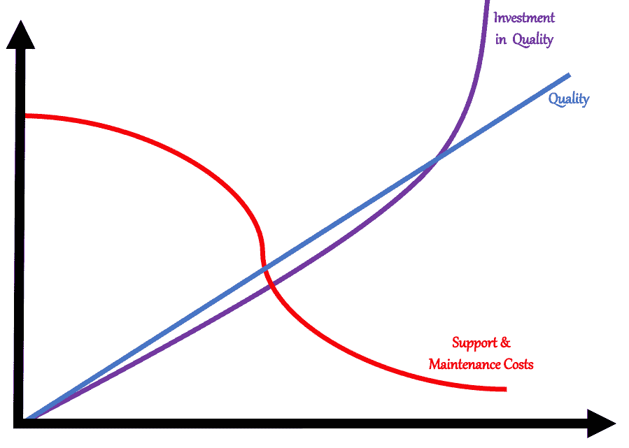

# 你应该投资软件质量还是速度？

> 原文：<https://betterprogramming.pub/should-you-invest-in-software-quality-or-speed-68904fa993e>

## 两者都有，但在不同的场合

戴尔在 [Unsplash](https://unsplash.com?utm_source=medium&utm_medium=referral) 上拍摄的[照片](https://unsplash.com/@dell?utm_source=medium&utm_medium=referral)

我们靠生产产品赚钱，所以没有什么比投入时间创造尽可能多的产品更自然的了。然而，发布这些产品会带来直接和间接的成本，比如维护、支持和复杂性成本。

在这篇文章中，我分三部分解释了你的公司应该投资于质量还是速度。

# 第 1 部分:构建新特性的冲动

"新功能将是致命的，对吗？"

“是的，转化和留存会增加！”

“这个功能出了，世界会更美好！”

“还是推直播吧，不用担心技术债。发布后，我们可以修复它！”

"那么测试、警报、日志、跟踪、监控和弹性呢？"

“这些我们都可以以后再做。快速上市至关重要。”

如果每当一个工程师听到这样的句子，我就能赚到一分钱，我现在就是亿万富翁了。

依我看，一个很大的误解是认为衡量我们成功的标准是发布特性的数量，而不是它们的影响。这很难接受，但是客户通常不会不眠不休地等待你的下一个特性发布。

假设您已经有了一个使用您产品的客户群，他们对当前的功能感到满意。在这种情况下，用一个可靠的产品留住你的客户，比以牺牲产品的稳定性为代价增加新功能更重要。

公司不是靠他们正在开发的产品赚钱，而是靠他们正在运营的产品赚钱。

正如我在另一篇关于团队的[重要性的博客中所说，只要这个特性还在生产中，你发布的每个特性都会增加支持和维护工作。如果此功能在运行中出现问题，它将消耗负责团队、一级支持和利益相关者(即销售)的能力。](/focus-on-nurturing-teams-instead-of-on-hiring-and-retaining-individuals-eb601bf2c98b)

作者的剩余图像

上图显示了产品开发后，维护/支持方面的一些能力将会受到影响，从而减缓后续产品的开发。

不稳定性会进一步增加支持带宽，从而削弱团队开发更有价值特性的能力。

换句话说，产品质量越好，您在支持和维护上的投资就越少，您的团队就越有生产力。但是过了临界点，就不值得在质量上再多投入了。过度工程只是一种奇特的浪费。

# 第 2 部分:关注核心

产品有一个核心，就是解决需求。例如，Airbnb 在租房者和寻找住处的人之间充当中间人。

为了使租房更加可靠、愉快和有利可图，Airbnb 建立了地图搜索、主机评估等功能。

这些功能很有帮助，并且有价值。它们被大量使用，已经成为 Airbnb 核心的一部分。

正如你在 Eric Ries 的经典著作《精益创业》中读到的那样(或者在这篇[博客](https://techcrunch.com/2011/09/11/are-you-building-the-right-product/?guccounter=1&guce_referrer=aHR0cHM6Ly9lbi53aWtpcGVkaWEub3JnLw&guce_referrer_sig=AQAAAFV2_8-BsuBa3LA_8VAwacdNWHOdmiXbKRn9sdB3n8LRBc0uX_YTidSmxKenFsGPOY4X7DedxCiuUQ6Cx9-kZvakxUr7Txhfp26tPeNQ_TncSJwygHTVWK0DxgLjBbW4UQzkFoWdXq9YyVGTK-kXOO7cFNgXuK83cWsvXBR1RbBD)中)，我们必须做大量实验来为我们的客户找到合适的功能，而不应该依赖我们的直觉来发布一个又一个功能。

我们至少应该有两种工作方式:a)我们如何与我们的核心工作，b)如何发现以下产品或功能。

在与我们的核心一起工作时，我们不应该接受任何妥协。该核心必须在所有相关方面都具备所需的质量:

*   可用性和设计
*   表演
*   稳定性
*   可靠性
*   可维护性
*   易测性
*   弹性
*   完整
*   安全性

您的核心应该有一个零错误策略和几分钟内恢复的平均时间。负责的团队会收到任何问题的警报，并立即开始处理这些问题。

最初，团队会做很多救火工作，但是他们会学习并使用模式和工具来帮助他们，如下所示

*   发布自动化
*   测试自动化
*   监控、记录、跟踪和警报
*   混沌工程
*   SAST(静态应用安全测试)和 DAST(动态应用安全测试)
*   随叫随到
*   运行手册

投资于最先进的架构和良好实用的代码质量也是必不可少的。

所有这些方面都将提高您的产品在运营中的质量，从而减少支持它的认知负荷，并避免您的团队的上下文切换。

过一段时间，你的核心就变成了一个可靠的平台。在此基础上，您可以高效地构建新产品和新功能，并且有望更有效。

# 第 3 部分:现在您可以加速了

新产品和新功能的发现必须尽可能的快和便宜，快速迭代并丢弃 100%测试过的东西，即使成功了。我们的目标不是构建“准备生产”的东西，而是验证问题及其解决方案。

将您正在验证的内容和您想要的内容分开是至关重要的，因为开发人员往往会对他们构建的所有内容产生依恋感，并且会丢弃任何一项工作，甚至是失败的工作。

如果这个想法得到了验证，并且您决定值得构建它，那么您可以用您对当前平台的所有想法来实现它。

有几种工具、框架和实践可以尽可能简单地验证想法:

*   设计冲刺
*   快速原型制作
*   金丝雀释放
*   A/B 测试

你验证的所有东西都必须被删除，不要在你的平台上留下任何残留。

# 最后的想法

这个想法就是只经营那些无疑为你的客户提供价值的产品。

建立一个有弹性的技术平台方法来减少你的团队的认知负荷。

尽可能简单明了地验证这些想法，如果它们确实是相关问题的适当解决方案，那么在生产中考虑它们的优点。