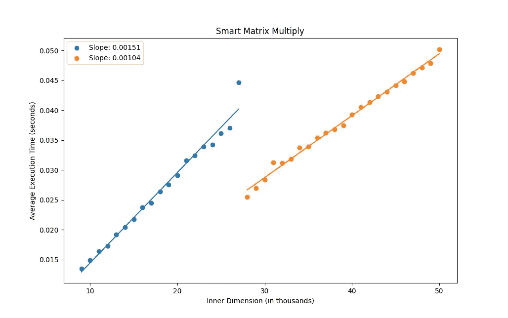

# 应该多线程吗？实验驱动的方法

> 原文：<https://betterprogramming.pub/should-you-multithread-an-experiment-driven-approach-92c09db6a1f>

## 实现矩阵乘法，并从 pThreads 中了解开销


照片由[夏羽·加尼翁](https://unsplash.com/@metriics?utm_source=medium&utm_medium=referral)在 [Unsplash](https://unsplash.com?utm_source=medium&utm_medium=referral) 上拍摄

作为一名大学生，我一直想写一个多线程程序，但是在开始写之前，我从计算机科学转到了数学。今年夏天，我一直在重温一些我想做的旧项目，我终于找到了多线程。

我一直认为多线程程序优于单线程程序，但是片刻的思考表明事实并非如此。产生和处理线程肯定会有一些计算开销；因此，像两个数相加这样的简单任务在多线程的情况下一定会花费更长的时间。

在本文中，我们将实现一个矩阵乘法例程，并尝试回答这个问题:我们甚至应该多线程吗？在这个过程中，我们检查代码执行需要多少时间，并使用一些简单的数学方法来构建一个“智能”矩阵乘法器，它将决定是否并行运行矩阵乘法例程。

我假设读者熟悉 C 语言编程，具有相当于标准本科课程前几周的线性代数基础，有一台能够运行这些代码示例的计算机，并且对他们的编译器有足够的了解，能够为自己编译链接的代码。

# 实现矩阵乘法

在我们编写多线程矩阵乘法例程之前，我们应该有一个简单的矩阵库，它可以在单线程上运行。

我们将矩阵实现为一个简单的结构，它跟踪行数、列数和条目数。我们将数据存储为`double`类型，因为在大多数机器上，这对于涉及矩阵的标准计算任务来说已经足够精确了。

我更喜欢用一个`double*`来存储数据，而不是一个`double**`。后者允许我们以熟悉的`data[i][j]`符号访问第`i`行和第`j`列的数据。然而，使用一个`double**`会占用更多的内存空间，更重要的是，不能推广到处理张量。

接下来，我们需要创造和摧毁新矩阵的方法。下面代码中的错误处理充其量是微不足道的，但对于我们这里的目的来说应该足够了。

如果不能获取和设置数据，我们就无法有效地使用矩阵。因为我们使用线性数组来存储数据，所以我们必须实现自己的索引器，并首先存储数据。看起来是这样的:

我们终于谈到了矩阵乘法。回想一下，给定两个矩阵`A = [a_{ij}]`和`B = [b_{ij}],`，当`A`的行数等于`B`的列数时，定义矩阵乘积`AB`，在这种情况下，乘积由`c_{ij} = \sum_{k=1}^N a_{ik}b_{kj}`给出。

在代码中实现矩阵乘法，在最坏的情况下是`O(N³)`，因此我们必须迭代结果`( O(N²) )`的所有行和列，并且在乘积中的每个条目处，我们必须计算`A`的第`k`行和`B` `( O(N) )`的第`k`列的点积。

有一种算法叫做 Strassen 算法，可以把这个降到`O(N^{~2.807})`，但是实现起来不切实际。我们的单线程矩阵乘法函数提取内点积，这将使向多线程实施的过渡更加平稳:

对于测试来说，为我们的矩阵提供一个“漂亮的打印”例程是很好的。我们添加了最后一块:

我们现在有一个工作的矩阵乘法程序。我们可以通过做一些标准的测试矩阵乘法来试验新代码:

# 天真的多线程:大量的线程

首先要尝试的是为 N 个点积中的每一个运行一个线程。对于小型矩阵来说，这可能接近核心的数量，但是对于大型矩阵来说，我们将很快产生数千个线程。

我们创建了一个名为`thread_params`的新结构，它允许我们将必要的参数传递给`matmul_subroutine`的包装代码:

`pthread`实现允许我们调用一个线程来运行带有`void* (*)(void *)`签名的函数。`void *`参数允许我们通过将`void`指针转换为`thread_params`指针来传递参数结构函数和子参数。

我们用下面的线程包装器代码替换对`matmul_subroutine`的调用，该代码将前面的`matmul_subroutine`包装在所需的`void* (*)(void*)`调用签名中:

我们必须做一些`pthread_t`管理来将参数传递给`matmul_subroutine_thread`，但是除此之外，矩阵乘法的实现是相同的:

在上面的代码中，我们为乘积矩阵中的每个条目创建了一个新线程，并在每个线程中计算行列点积。最后，在返回指向产品的指针之前，我们等待所有线程返回。

我们在主循环中运行以下内容:

以上代码的完整版本可以在[这里](https://gist.github.com/KyroChi/6820ba6be6b652ff166bc0a08b12cb6f)找到，在我的机器上，我得到了以下令人沮丧的结果:

```
Linear took     0.00017200 seconds
Parallel took   0.00313400 seconds
```

并行乘法的执行时间大约是线性乘法的 30 倍！坏消息:多线程不是万能的。

# `pthread`管理费用

我想改进我的日常工作。我知道，在某个地方，使用所有可用的内核会有一些优势。我们需要找出如何找到这种优势。

我们可以很快猜测出是`pthread_create`还是`pthread_join`导致并行乘法运行得更慢，因为指针分配和数组索引不应该花费太多时间(不足以解释 30 倍的速度降低)，并且与线性例程相比，对`pthread_create`和`pthread_join`的调用是唯一的实质性差异。

我很快发现对`pthread_create`的调用花费了最多的时间。下面的代码量化了这些调用有多慢:

我们使用`clock_gettime`来测量时间，以获得墙时间而不是 CPU 时间，因为当测量多线程程序的性能时，CPU 时间将总是高于相同程序的线性版本。这是因为 CPU 时间衡量执行了多少操作，调用线程管理函数会增加额外的 CPU 操作。请记住，多线程的最终目标是减少墙时间。

当运行时，上面的程序给我

```
Average amortized overhead:    0.00010 seconds 
Total elapsed overhead:         0.97482 seconds
```

对于我们创建的每一个线程，我们最终会为每个线程额外增加 1 万分之一秒。在一个已经有 10，000 个条目的矩阵中(例如，带有`shape (100, 100))`的乘积)，我们在线性实现上增加了额外的一秒(这不太正确，我们稍后会解决这个问题)。

将两个`(1000, 1000)`矩阵相乘增加了 100 倍的额外开销:我们的程序仅创建线程就要花费大约一分半钟！这让我们猜测我们想要最小化我们创建的线程的数量。我们通过发现在多线程有意义之前矩阵必须有多大来解决这个问题。

## 最佳穿线条件

设`S`为`A->n_rows * B->`，`T`为`matmul_subroutine`执行所花费的时间，`C`为内核数量，`h`为使用 pthreads 所花费的时间。那么(理论上)线性实现花费的时间量是`ST`，而并行实现花费的时间量是`ST/C + Sh`。将这些设置为彼此相等并求解`T`，我们发现无论何时`T = hC/(C-1)`，并行实现都应该优于线性实现。

在我的机器上，我有四个内核，所以理论上，当执行`matmul_subroutine`的时间大约是`4*h/3`时，并行实现应该开始胜过线性实现。

注意`S`从计算中分出；也就是说，乘积数组的大小在计算中并不重要，唯一重要的是(从并行实现优于串行实现的角度来看)内部点积有多大。随着我们增加这个内部维度，`T`增加(线性)。

我们已经(大概)计算过`h`。在我的机器上，我运行下面的代码来计算我的`T`(再次，大约):

哪些输出:

```
$ ./ht.o 
 100       took: 0.0000010
 1000      took: 0.0000040
 10000     took: 0.0000350
 100000    took: 0.0004900
 1000000   took: 0.0038400
 10000000  took: 0.0313800
 100000000 took: 0.3031080
```

注意这里明显的`O(N)`行为是 matmul 子例程线性的结果。回想一下上面的内容，创建 pthreads 的开销是`0.00010 seconds`，因此(大约)我们应该在`T(n) = 4/3 * 0.00010`时并行运行该例程。这大约是`n = 27000`。

# “更智能”的矩阵乘法

我们现在可以编写一个“更智能”的矩阵乘法例程，考虑主机的具体情况以获得最佳性能。对于具有“小”内部维度的矩阵乘法，我们应该使用并行实现，对于较大的内部维度，我们应该切换到并行实现:

# 标杆管理

也许我们的理论分析没有击中要害，我们没有看到智能矩阵乘法带来的任何性能提升。为了测试这一点，我们将在 42 组内部维数增加的矩阵上运行乘法例程，并将每个乘法运行 30 次，以获得平均执行时间。我们的目标是展示当我们从串行实施切换到多线程实施时，斜率会降低:

我们可以使用最佳拟合线来可视化改进。下面绘制的结果显示，与外推的非多线程实现(蓝色)相比，性能有了明显的提高:



我们还注意到，近似值 27，000 太高，再做一点工作，我们就可以找到一个更优的截止值。这可能是由于我们在上面所做的简单计算中积累的误差造成的。

上面的图是使用以下 Python 脚本生成的:

# 外卖食品

多线程并不总是正确的做法。使用多线程会带来额外的开销，根据应用程序的不同，应该找到多线程给定例程带来性能提升的临界点。