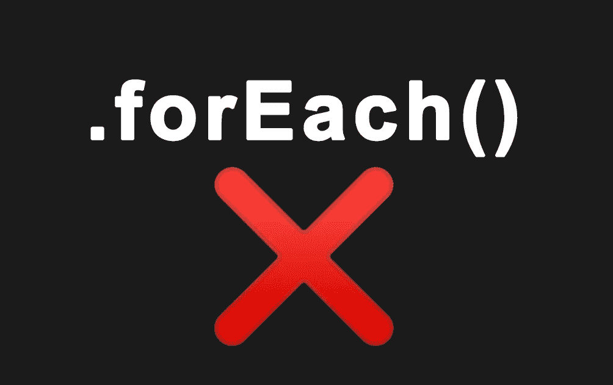
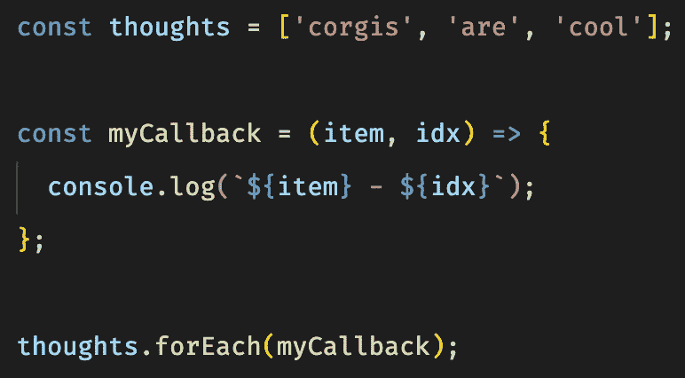
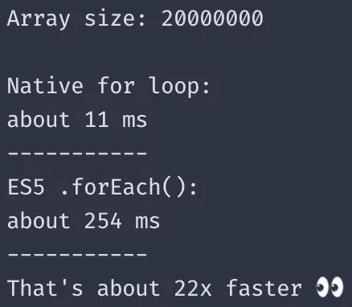

# 你应该停止使用。JavaScript 代码中的 forEach()。

> 原文：<https://betterprogramming.pub/should-you-stop-using-foreach-in-your-javascript-code-efe1e86c78e5>

## 深入探讨流行的 ES5 数组方法背后的警告



图片来源:作者

# 介绍

我来自 PHP 背景，当我第一次看到人们利用`.forEach()`方法遍历他们的数组时，我的 nooby self 认为这没什么——这和标准`for`循环的实现完全一样，我告诉自己。写了一些 JavaScript 代码后，我很快意识到这两者有其不同之处。

在这篇文章中，我想概述标准的`for`循环和`.forEach()`方法背后的区别，并评论它们各自带来的好处。

作为免责声明，请不要照字面理解标题。我写这篇文章的目的是告诉读者瓶颈，并提供关于何时你可能想或不想使用`.forEach()`的见解——仅此而已。我们开始吧！

# forEach 如何工作

`forEach`方法接受一个回调函数作为输入，对于你正在迭代的数组中的每个元素，这个回调函数将被执行。应该注意，回调函数可以接受一些可选参数。它们包括传递给函数的当前值，当前值各自的索引。`forEach`函数还为在回调函数中定义`this`提供了一个可选参数。

请考虑以下情况:



相应的输出将是:

```
corgis - 0
are - 1
cool - 2
```

# 短路

如果你不知道短路是什么，它指的是我们提前终止和/或跳过一个循环的迭代。当我们使用`forEach()`时，没有办法利用短路，在我们循环的所有情况下，我们将忍受相对于数组大小的线性运行时间。

我为什么要关心这个？假设我们有一个由 10 亿个元素组成的未排序数组，我们想要找到某个元素。假设我们非常幸运，在循环的第一次迭代中找到了这个元素。实际上，我们想要提前返回，因为我们找到了我们要找的东西，但是按照`forEach()`的实现方式，我们将总是遍历剩余的元素。对于这类问题，我们可能会使用`.findIndex()`方法。

# 表演

在`forEach()`方法中，由于我们在每次迭代时都调用回调函数，所以我们创建了一个额外的作用域开销，这导致了比本机`for`循环更慢的速度。与传统的`for`循环相比，我们有一个初始化语句，一个在每次迭代中评估的条件，以及一个在循环体递增后的执行阶段。相对于`forEach()`方法，我们必须在每次迭代中创建额外的函数调用，这是一个更低的成本。

为了测试性能，我创建了一个计时器脚本，它在初始化数组后跟踪执行时间。两个循环都在它们的体内执行一个简单的 O(1)运算:



# 可读性

开发软件时，创建可维护和可读的代码应该是重中之重。我认为在你的代码中继续使用`forEach()`的一个非常有效的理由是为了可读性。随着方法链接几乎成为 JavaScript 中数组的第二天性，使用`forEach()`循环而不是`for`循环遍历数组读起来会更好。

还应该注意的是，输入量非常大的情况(如上例所示)不太可能出现。在合理的输入大小时，这两个环路的性能相对相同。你愿意牺牲可读性，让函数的执行速度快几毫秒吗？

# 结论

ECMAScript 最新版本中发布的方法从整体上提高了 JavaScript 的标准。我最相信在工作中使用正确的工具。如果你需要读取一个数组中的大量元素，那么一个本地的`for`循环可能是你问题的解决方案。否则，当使用`.forEach()`或任何后来发布的 ES 数组方法时，除了轻微的性能损失之外，我看不到任何问题。在大多数情况下，我倾向于在可读性和性能之间进行权衡。