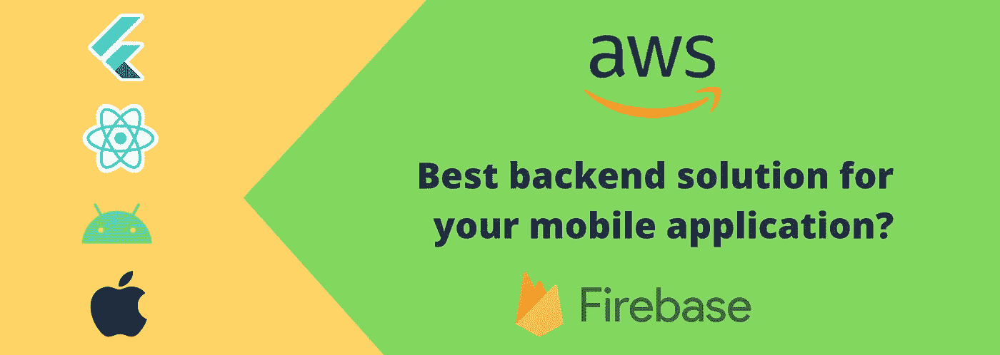

# 手机应用的后端应该用 AWS 还是 Firebase？

> 原文：<https://betterprogramming.pub/should-you-use-aws-or-firebase-for-the-back-end-of-your-mobile-app-a28f93540520>

## 哪种解决方案最符合您的需求？

我们将按以下顺序比较这两种服务:

1.  他们有什么共同点？
2.  如何将它们与你的前端融合？
3.  他们的优势。
4.  他们的定价。
5.  构建和维护所需的努力。
6.  最后的想法。

好吧，在我们开始之前，我只是想在这些服务的铁杆粉丝对我不满之前澄清一些事情…

# 一个不比另一个好

## 为什么？

因为正确的问题应该是:“对于您的需求，哪个是正确的解决方案？”

我开发原生 Android 应用程序已经有一段时间了，最近开始在 [Flutter](https://flutter.dev/) 开发移动应用程序，我使用 Firebase 和 AWS 作为后端服务。

但是我最近不得不为一个移动应用程序寻找一个解决方案，实际上我花了很多时间来决定后端的正确服务。

所以，我在这里与你分享我的见解和理解，也许可以帮助你选择正确的服务，而不浪费太多时间。

# 这些服务有什么共同点？

核心功能包括:

*   作家（author 的简写）
*   推送通知
*   储存；储备
*   主办；主持
*   分析学

这些都是为了让您可以使用这些平台轻松部署您的无服务器解决方案。

# 你希望如何将你的后端与你的应用集成在一起？

集成这些服务最流行的方式是使用它们的 SDK，但是这符合您的需求吗？

照片由[威尔·波拉达](https://unsplash.com/@will0629?utm_source=medium&utm_medium=referral)在 [Unsplash](https://unsplash.com?utm_source=medium&utm_medium=referral) 上拍摄

## 重火力点

Firebase 为 Android、iOS 和 web 提供了一个 SDK，因此作为前端开发人员，您可以轻松地构建一个数据驱动的应用程序，而不必依赖后端技能。

Firebase 还有一个 REST API，如果您想构建自己的自定义 API(根据您的需求)，可以使用它。

## 自动警报系统

AWS 为移动开发人员提供了一个非常好的解决方案，名为 [AppSync](https://aws.amazon.com/appsync/) ，您可以使用它来集成到您的 Android、iOS 和 React Native 中。

AWS AppSync 中没有对 Flutter 的官方支持，正如你在这个网站上看到的一样。

如果你想在前端使用 Flutter，你必须创建一个你自己的 API。

## 建议

*   看到解决方案的复杂性和业务需求，并牢记可伸缩性，决定是否需要创建 API。
*   如果你有一个 API，那么对 SDK 的依赖就会消失。此外，拥有一个 API 对于更大的项目来说更有意义。
*   如果您的解决方案很简单，并且您不想投资拥有 API，那么选择提供 SDK 的服务/前端框架，以便直接将后端集成到前端。

# 让我们看看他们的长处

Firebase 和 AWS 各有所长，让我们看看哪个可能更适合你？

弗拉德·希利塔努在 [Unsplash](https://unsplash.com?utm_source=medium&utm_medium=referral) 上拍摄的照片

## 自动警报系统

**1。设置不同的环境**

在 AWS 中，不同的开发、测试和生产环境更加优雅。

见鬼，你也可以在 Firebase 中这样做，但是你必须建立不同的项目，这需要更多的时间。

**2。持续部署**

如果您使用过类似于 [Netlify](https://www.netlify.com/) 的服务，AWS 为持续部署提供了另一个优雅的解决方案。同样，你也可以用谷歌云做 CD，但是需要更多的配置。

**3。图表 QL**

用于移动应用的 AWS Amplify SDK 与 [GraphQL](https://graphql.org/) 和 [Apollo](https://github.com/apollographql) 紧密集成。

**4。数据库的选择**

您可以完全控制在后端使用什么类型的数据库。Firebase 只提供 NoSQL 数据库。

**5。单一包装解决方案**

AWS 提供了您的应用程序可能需要的所有服务。因此，AWS 是您可以完全依赖的单一云解决方案，可以满足您的所有需求。

如果你的整个后端都在一个地方，就更容易理解和维护。

## 重火力点

**1。专用数据库**

Firebase 提供两种专用的数据库服务，云 Firestore 和实时数据库。

这两个数据库都是 NoSQL 数据库，因此您不必担心设置数据库和编写查询来部署您的数据驱动应用程序。

只要你的需求和要求是简单的，并且你知道它在未来不会变得更加复杂，那么你可以选择 NoSQL 数据库。

**2。可调用功能**

由于 Firebase 云函数，您可以创建云函数，并通过 URL 设置触发器来将侦听器写入数据库。

这些功能类似于 AWS Lambda，但从应用程序触发 Lambda 需要您设置 API 网关并添加授权逻辑，这使得它有点困难。

**3。质量控制服务**

Firebase 提供了许多服务来监控和维护应用程序的质量。这些服务包括:

*   动态链接:无论应用程序是否已经安装，都可以将用户发送到正确的位置。
*   远程配置:使用服务器端配置定制和试验应用程序行为。
*   测试实验室:跨设备测试您的应用。
*   应用内消息传递:发送用户参与活动。
*   分析:帮助您规划未来版本和用户参与的策略。
*   ML Kit:在应用的前端或后端为你的解决方案增加机器学习的能力。

# 平台定价(AWS 与 Firebase)

这两个平台都有吸引人的价格，甚至有免费层，所以你不必支付任何费用，除非你有相当数量的活跃用户。

照片由[你好，我是尼克🍌](https://unsplash.com/@helloimnik?utm_source=medium&utm_medium=referral)开启[防溅](https://unsplash.com?utm_source=medium&utm_medium=referral)

## 自动警报系统

AWS 掌握了其服务的定价，并以便宜得多的价格提供许多优秀的服务。随着时间的推移，他们实际上已经将服务价格降低了 80%以上。

这就是为什么你会发现 AWS 的大部分服务比 GCP 的要便宜一些。

对于构建实时应用程序，AWS 提供了相对昂贵的 DynamoDB。

对于云功能，AWS 提供的服务价格是 Firebase 云功能的一半。

## 2.重火力点

尽管 AWS 在某些服务上更便宜，但 Firebase 提供了一些完全免费的服务，如:

1.  用户认证—使用 [FirebaseAuth](https://firebase.google.com/docs/reference/android/com/google/firebase/auth/FirebaseAuth) ，相当于 [AWS Cognito](https://aws.amazon.com/cognito/) 。
2.  推送通知—使用 Firebase 云消息传递，相当于 AWS 中的简单通知服务。

对于构建实时应用程序，Firebase 似乎比 AWS 便宜得多，也更容易安装。Firebase 会处理它的实时数据同步，而你不必太担心。

随着用户数量的增加，Firebase 显然是构建实时应用程序的更好选择。

但是如果你对你的查询优化不够小心，Firebase 会给你一张 30000 美元的账单。

 [## 如何不从 Firebase 获得 3 万美元的账单

### 秘密就在建筑中

medium.com](https://medium.com/@PurpleGreenLemon/how-not-to-get-a-30k-bill-from-firebase-37a6cb3abaca) 

顺便说一句，谷歌在了解发生的事情后已经放下了几个案例。谢谢你，谷歌。

有些东西比平台定价更贵…

# 时间和劳动

是的，这是一个需要考虑的重要因素，因为你将依赖资源来设置、构建和维护你的应用架构。

奥马尔·阿尔贝克在 [Unsplash](https://unsplash.com?utm_source=medium&utm_medium=referral) 上拍摄的照片

## 重火力点

Firebase 非常简单，使用起来非常直观。前端开发人员实际上可以自己创建和维护整个后端，只需要一点关于设置的知识。

对于创建实时应用程序，Firebase 处理了许多复杂性，并为您提供了一个非常强大且易于使用的 SDK，为您节省了大量时间，而时间就是金钱。

## 自动警报系统

由于 AWS 提供的服务是 Firebase 的十倍，使用和维护起来也要复杂十倍。我想说的是，与 Firebase 相比，AWS 有一个学习曲线。

为了创建实时应用程序，您将希望使用 GraphQL API 和 DynamoDB 实例，后者也是一个 NoSQL 数据库，但是您必须设置 API 和数据库，这对于一个简单的实时应用程序来说似乎有些多余。

# 最后的想法

照片由[詹姆斯·庞德](https://unsplash.com/@jamesponddotco?utm_source=medium&utm_medium=referral)在 [Unsplash](https://unsplash.com?utm_source=medium&utm_medium=referral) 拍摄

## 重火力点

*   易于设置、使用和维护。
*   需要您做出更少的决定，非常适合简单的应用程序。

## 自动警报系统

*   提供了更多的灵活性，这对于构建大型复杂的应用程序很有帮助，但对于简单的应用程序来说可能有些过头了。
*   一个满足所有应用程序需求的潜在解决方案，您可以构建一个整洁打包的解决方案，但它的成本可能会高一些。

这就对了。我希望这有助于您做出正确的决定，并在尝试构建应用程序时提出更好的问题。

你对这两者的体验如何？我错过了什么吗？请在下面的评论中告诉我。我也很想向你学习。

一如既往，感谢阅读。