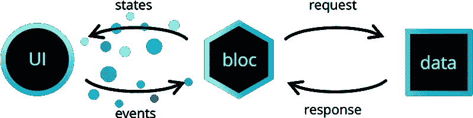

# 在 Flutter 中应该使用阻塞来管理状态吗？

> 原文：<https://betterprogramming.pub/should-you-use-bloc-to-manage-state-in-flutter-4f504ebc8711>

## 关于 Flutter 最受欢迎的州经理的三集系列


由[法比安·阿尔伯特](https://unsplash.com/@fabiraw?utm_source=unsplash&utm_medium=referral&utm_content=creditCopyText)在 [Unsplash](https://unsplash.com/s/photos/mobile-device?utm_source=unsplash&utm_medium=referral&utm_content=creditCopyText) 上拍摄的照片

在这个由三部分组成的系列中，我将对 Flutter 使用最广泛的状态管理器进行并排比较。

有很多工具，但是它们之间缺乏清晰的对比。这是一个遗憾，因为选择错误的状态管理器并不容易从你开始构建的地方撤销。

因此，我给你一个简短的指导手册。首次使用前请仔细阅读！第二个最受欢迎的州经理叫做 [Flutter bloc](https://pub.dev/packages/flutter_bloc) ，是这篇博客的主题。下面是第一部分的链接。

*   [第 1 部分:如何使用提供者管理 Flutter 中的状态](https://javascript.plainenglish.io/how-to-manage-state-in-flutter-with-provider-661ff322dd22)

## 什么是颤动集团？

[颤振模块](https://pub.dev/packages/flutter_bloc)封装的名称来源于[模块设计模式](https://medium.com/r?url=https%3A%2F%2Fwww.flutterclutter.dev%2Fflutter%2Fbasics%2Fwhat-is-the-bloc-pattern%2F2021%2F2084%2F)。BLoC 是“业务逻辑组件”的缩写，与大多数状态管理器一样，它旨在将业务逻辑从视图中分离出来。

Flutter bloc 包为您提供了在应用程序中实现 bloc 模式的所有工具。这个包的核心围绕着两个主要的概念“Cubits”和“Blocs ”,我将简单解释一下。

## 用 Cubit 管理状态


图片来自[包:bloc 文档](http://1/#/coreconcepts?id=cubit)

使用 Cubit 管理状态对于以前使用过状态管理器的人来说可能很熟悉。

*   状态在`[Cubit](https://bloclibrary.dev/#/coreconcepts?id=cubit)` [类](https://bloclibrary.dev/#/coreconcepts?id=cubit)中存储和处理。此外，Cubit 公开了一系列状态变化。
*   `[BlocProvider](https://bloclibrary.dev/#/flutterbloccoreconcepts?id=blocprovider)`使腕尺可被视图访问。
*   `[BlocBuilder](https://bloclibrary.dev/#/flutterbloccoreconcepts?id=blocbuilder)`监听变化的状态，并相应地呈现用户界面。

因此，管理递增计数器的状态将如下所示:

这种模式非常类似于带有提供者的状态管理，我在本系列的第一部分中描述过。因此，Flutter Bloc 的真正价值不是在 Cubit 中，而是在实际的 Bloc 本身中。

## 用 Bloc 管理状态



图片来自[包:bloc 文档](https://bloclibrary.dev/#/coreconcepts?id=bloc)

Bloc 的独特卖点是*事件*。Cubit 只是发送状态更新，而不提供关于变更的*根源*的额外信息。

只要你的状态是简单的，就像反例一样，这就不是问题。但是假设你的计数器有 10 种不同的递增方式。您将如何调试意外的状态更新，或者根据变化原因区分您的应用程序的行为？简而言之，缺乏可追溯性造成了一个真正的问题。

```
// A Bloc transition**Transition {
  currentState: Counter(0),
  event: Increment,
  nextState: Counter(1)
}****Transition {
  currentState: Counter(0),
  nextState: Counter(1)
}**
```

Bloc 通过引入事件解决了这个问题。事件提供关于*为什么*状态已经改变的信息。事件使您可以完全控制应用程序的状态流。对于不仅仅是增加计数器的应用程序来说，这是非常理想的。

但是每个伟大的礼物都是有代价的。Blocs 比 Cubits 更冗长。状态和事件需要额外的样板文件，如下例所示。但是，在我看来，这是值得付出的代价。从长远来看，可追溯性是应用程序可管理性的先决条件。

## **谁应该使用颤振闭锁**

那么现在你已经掌握了 Flutter bloc 包，你真的应该使用它吗？

## **优点**

*   作为第二受欢迎的状态管理器，该包得到了很好的维护，并证明了它的价值。
*   该软件包提供基于非事件的库比特以及基于事件的块，能够适应您的应用需求。
*   有很多方法可以防止 UI 的冗余更新。例如，集团国家利用[等同于](https://pub.dev/packages/equatable)。Equatable 将旧状态与新状态进行比较，并在状态不变时阻止更新。此外， [BlocListener](https://bloclibrary.dev/#/flutterbloccoreconcepts?id=bloclistener) 有一个`listenWhen`属性，它作为一个看门人，只允许访问想要的更新。总之，这个包提供了关注应用程序性能的工具。
*   [文档](https://bloclibrary.dev/#/)非常出色，详细阐述了不仅仅是核心内部的东西。这里有大量的例子，一种方法的优点和缺点，最佳和不好的实践，以及关于包核心概念的背景信息。

## **缺点**

*   Flutter Bloc 包的巨大尺寸使它很难学习。当面对一个质量工具的大工具箱时，很难选择一个合适的。对于不熟悉流和基于事件的状态管理的开发人员来说，学习曲线尤其陡峭。
*   这个方案有着可疑的荣誉，它需要所有州政府官员中最多的样板文件。尤其是基于事件的块非常冗长。要设置前面提到的基本计数器块，您需要三个单独的文件:一个用于计数器的状态，一个用于计数器的事件，一个用于实际的块。尽管有很好的[扩展](https://marketplace.visualstudio.com/items?itemName=FelixAngelov.bloc)来自动化样板文件的创建，你的代码库仍然会像一个喂养良好的幼儿一样成长。

总之，在我看来，Flutter bloc 是大多数 Flutter 应用程序的发展方向。它克服了提供者基于事件的状态管理的不足。此外，它的工具集是广泛的，使其可用于更简单和更复杂的应用程序。这些优势使得陡峭的学习曲线是值得的。

# *资源*

*   Flutter_bloc 包:[https://pub.dev/packages/flutter_bloc](https://pub.dev/packages/flutter_bloc)
*   集团设计模式:[https://medium.com/r?URL = https % 3A % 2F % 2fwww . flutter clutter . dev % 2ff lutter % 2f basics % 2f bloc-pattern 是什么%2F2021%2F2084%2F](https://medium.com/r?url=https%3A%2F%2Fwww.flutterclutter.dev%2Fflutter%2Fbasics%2Fwhat-is-the-bloc-pattern%2F2021%2F2084%2F)
*   区块库文档:[https://bloclibrary.dev/](https://bloclibrary.dev/)
*   用于生成块样板文件的扩展:[https://marketplace.visualstudio.com/items?itemName=FelixAngelov.bloc](https://marketplace.visualstudio.com/items?itemName=FelixAngelov.bloc)