# 在 Eclipse 集合中应该使用 ForEach 还是 InjectInto？

> 原文：<https://betterprogramming.pub/should-you-use-foreach-or-injectinto-in-eclipse-collections-5f7f791022e2>

## 学习 [Eclipse 集合](https://github.com/eclipse/eclipse-collections)中的`forEach`和`injectInto`模式。

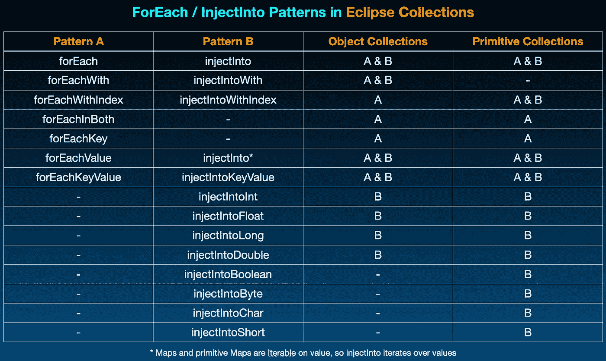

Eclipse 集合中的许多 forEach / injectInto 模式

# 是 forEach 还是 injectInto？

在 [Eclipse 集合](https://github.com/eclipse/eclipse-collections)、`forEach`和`injectInto`都是内部迭代器，提供了最基本的迭代模式。开发人员可以使用这两种模式来完成大量的迭代任务。作为内部迭代器，这些方法封装了“如何”迭代集合元素的实现细节，并让开发人员使用 lambda 来指定应该应用于集合中每个元素的行为。

`forEach`和`injectInto`模式可以用作许多其他迭代模式的构建模块(例如`select`、`reject`、`collect`等)。).这两种模式都从集合的开头到结尾遍历集合，并执行一些接收集合的每个元素作为参数的操作。`forEach`和`injectInto`模式都不能有效地用于实现任何短路模式(例如`detect`、`anySatisfy`、`allSatisfy`、`noneSatisfy`)。

`forEach`和`injectInto`的功能总结如下。

*   `forEach`接受一个参数`Procedure`并返回`void`。集合中的每个元素都被传递给`Procedure`。
*   `injectInto`举一反二`Function2`。一个值作为`Function2`的第一个参数和集合的每个元素一起被注入。该方法返回最后一个元素处理后`Function2`返回的最终结果。

这两种模式都有专门化。`injectInto`模式比`forEach`有更多的原语专门化，因为`injectInto`返回某种类型，它可能返回八种原语类型之一，或`Object`。`forEach`模式总是返回`void`。

`injectInto`能做而`forEach`不能做的事情之一是执行一个[副作用](https://en.wikipedia.org/wiki/Side_effect_(computer_science))自由操作。有了`forEach`，副作用总会在某个地方发生。这就是它的目的——让这个系列的元素产生副作用。可能有一个突变应用于集合的一个元素，或者一个 lambda 范围内的一个变量的突变，或者这个元素被打印到`System.out`等等。

使用`injectInto`，可以执行无副作用的操作，因为它注入、返回和重新注入来自双参数`Function`的一些结果。注入和返回的值可能是不可变的，比如一个`String`或`Integer`或一个原始值。

我将展示一些使用`forEach`和`injectInto`解决类似问题的例子。这应该开始清楚地表明，什么时候一种模式比另一种模式更合适或更理想。一个比另一个更好的答案将留给你，读者。在某些情况下，`forEach`会更具可读性。在许多情况下，`injectInto`将更加灵活、安全和/或高效。

以下是我将展示的例子:

*   数数
*   总和
*   转换为集合

# 示例:计数

在下面的例子中，我将对 a `MutableList<Integer>`和`MutableIntList`中包含的偶数整数进行计数。在 Eclipse 集合中的对象和原始集合上都定义了一个名为`count`的方法，该方法将一个`Predicate`作为参数。这些例子的目的是展示使用`forEach`或`injectInto`模式实现`count`的一些选项。

## 1.计数:forEach(对象列表)

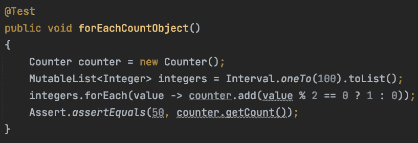

使用 forEach 计算对象列表中的偶数

我必须创建一个可变的`Counter`来记录偶数值的总数。我使用三元运算符编写了一个简化的 if 表达式，以确定是将值`1`还是`0`添加到`Counter`中。

## 2.计数:forEach(原始列表)

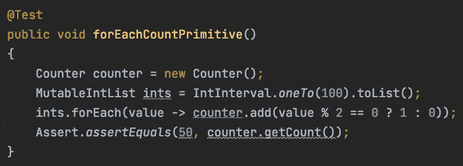

使用 forEach 计算基元列表中的偶数

对象和原语列表上的`forEach`之间的唯一区别是原语`List`中的`int`值不需要像对象`List`中的`Integer`值那样取消装箱。这种方法仍然需要有一个有效的 final 可变的`Counter`对象在 lambda 中递增。

## 3.计数:注入(对象列表)

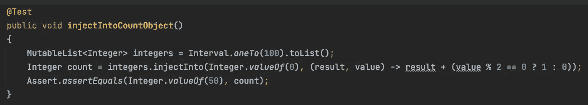

使用 injectInto 计算对象列表中的偶数

这种实现是无副作用的。我们从初始`Integer`值`0`开始，如果结果是偶数，则为每个元素添加一个`1`或`0`。这里有很多取消装箱和自动装箱的操作，因为每个函数的结果都会取消装箱值，然后自动装箱结果。

## 4.计数:injectInto(原始列表)

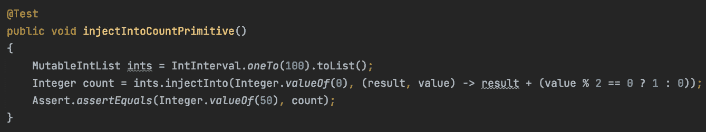

使用 injectInto 计算基元列表中的偶数

本例使用了一个`MutableIntList`，它不会将`List`中的`int`值装箱。`injectInto`的结果仍然是一个对象，所以每个元素的结果都是自动装箱的。

## 5.计数:injectIntoInt(对象列表)

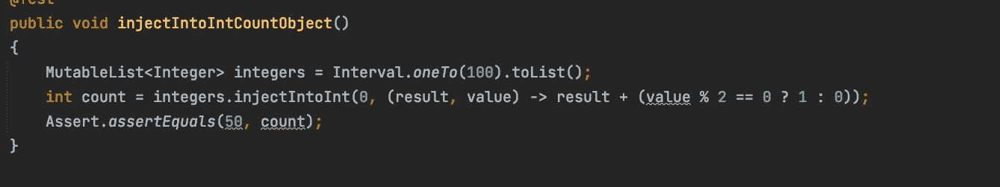

使用 injectIntoInt 计算对象列表中的偶数

专门化`injectIntoInt`允许将`0`的`int`值注入到迭代中，并作为结果返回。这里不会对结果进行自动装箱，但是会对值进行取消装箱，以便测试它们是否相等。这种解决方案既没有副作用，又不会导致自动装箱。然而，整数`List`中的值仍然被装箱，因为它是一个`MutableList<Integer>`。

## 6.count:injection point(原始列表)

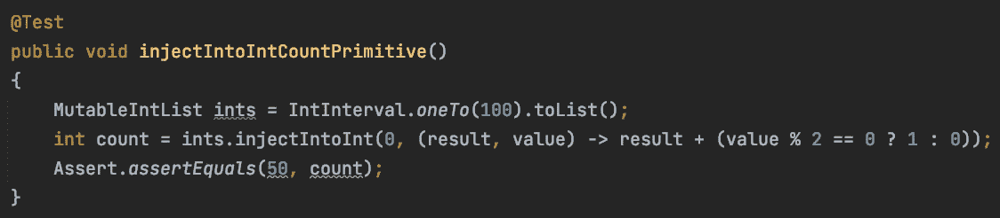

使用 injectIntoInt 计算基元列表中的事件数

对`MutableIntList`的特殊化`injectIntoInt`允许实现无副作用的计数，没有将`int`值装箱到列表或计算中的`Integer`对象。

# 示例:总和

在下面的例子中，我将对包含在一个`MutableList<Integer>`和`MutableIntList`中的整数求和。在 Eclipse 集合中，在对象集合上定义了一个名为`sumOfInt`的方法，而在原始集合上只定义了`sum`。这些例子的目的是展示使用`forEach`或`injectInto`模式实现`sum`的一些选项。

## 1.Sum: forEach(对象列表)

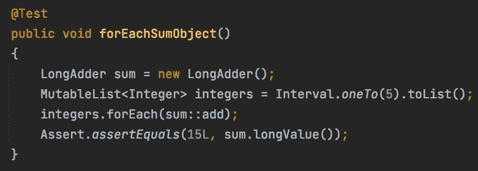

使用 forEach 对对象列表中的数字求和

我使用来自 JDK 的`LongAdder`来累加总和。在`LongAdder`上有一个`add`方法接受一个`long`。整数列表中的每个`Integer`对象都被取消装箱并转换为一个`long`。

## 2.Sum: forEach(原始列表)

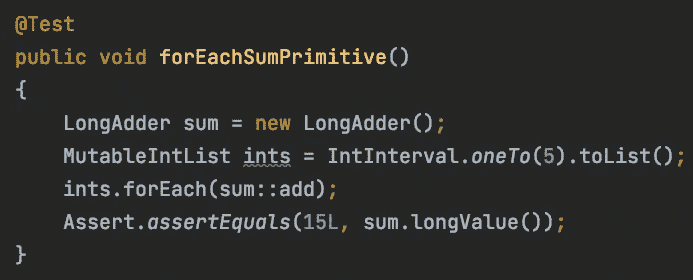

使用 forEach 对原始列表中的数字求和

带有`forEach`的 sum 的原始版本本质上与对象版本相同，只是不需要在调用`LongAdder`上的`add`时取消`Integer`对象的装箱。

## 3.Sum: injectInto(对象列表)

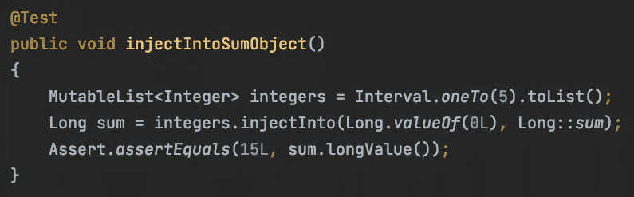

使用 injectInto 对对象列表中的数字求和

通过注入一个初始值`Long.valueOf(0)`，返回类型`injectInto`将会是一个`Long`。我使用了将两个`long`值作为参数的`Long::sum`方法引用。结果从`Long`解装箱到`long`并且`List`中的`Integer`值解装箱并转换到`long`。

## 4.Sum: injectInto(原始列表)

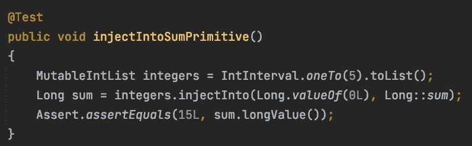

使用 injectInto 对原始列表中的数字求和

sum 使用`injectInto`使用`Long`作为注入值的原始版本与对象版本本质上是一样的。一个区别是不需要对`Integer`对象进行拆箱。

## 5.sum:inject long(对象列表)

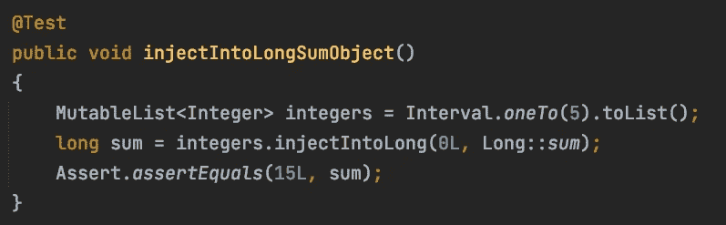

使用 injectIntoLong 对对象列表中的数字求和

在对象列表上使用`injectIntoLong`并注入初始的`long`值`0L`，那么`injectIntoLong`的返回类型就是原语`long`。我使用了将两个`long`值作为参数的`Long::sum`方法引用。结果作为`long`传入，列表中的`Integer`值被取消装箱并转换为`long`。

## 6.sum:inject long(原始列表)

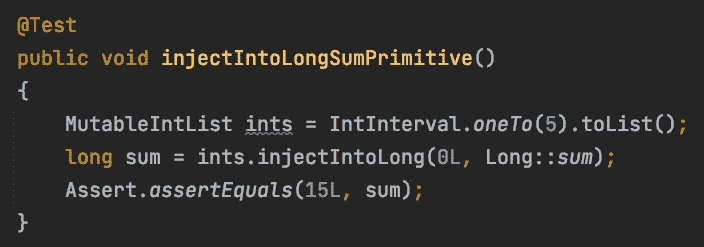

使用 injectIntoLong 对原始列表中的数字求和

在原语列表上使用`injectIntoLong`并注入`0L`的初始`long`值，`injectIntoLong`的返回类型是原语`long`。我使用了 Long::sum 方法引用，它将两个`long`值作为参数。结果以 long 形式传入，原语列表中的`int`值被转换为`long`。

# 示例:转换为集合

在下面的例子中，我将把包含在一个`MutableList<Integer>`或`MutableIntList`中的整数加到一个`MutableSet<Integer>`或`MutableIntSet`中。我还将展示如何使用`injectInto`添加到`ImmutableSet<Integer>`或`ImmutableIntSet`中。

对象和原语集合上有用于从一种类型的容器转换到另一种类型的转换器方法(例如，`toSet`、`toImmutableSet`)。这些例子的目的是展示使用`forEach`或`injectInto`模式实现`toSet`和`toImmutableSet`的一些选项。

## 1.到可变集:forEach(对象列表)

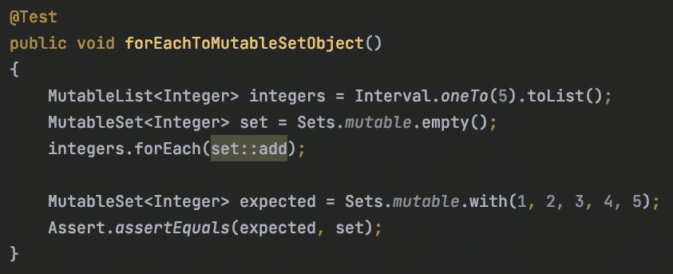

使用 forEach 向可变集合添加列表元素

我创建了一个名为`set`的`MutableSet<Integer>`来保存我想从`integers`转移的元素。然后使用 forEach，我传递方法引用`set::add`。这段代码非常简单明了。

## 2.To 可变 Int Set: forEach(原始列表)

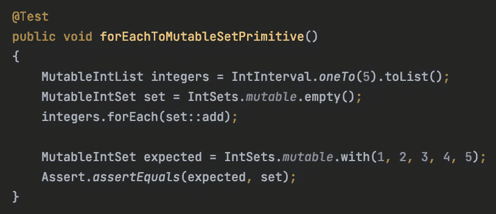

使用 forEach 将 MutableIntList 的元素添加到 MutableIntSet 中

原始版本与目标版本基本相同，目标`set`为`MutableIntSet`。

## 3.To MutableSet: injectInto(对象列表)

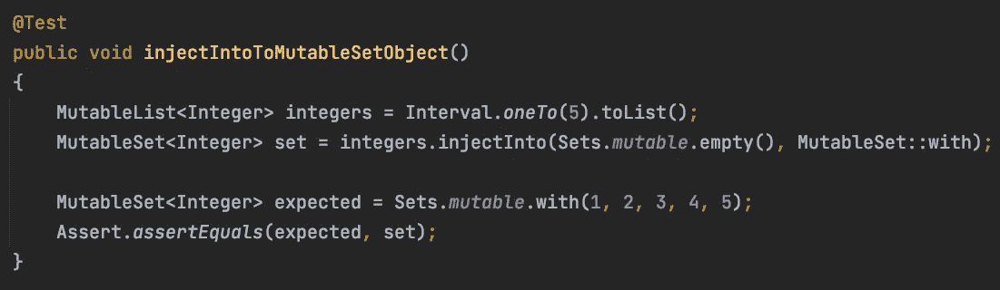

使用 injectInto 将可变列表的元素添加到可变集合中

使用`injectInto`，我注入`MutableSet<Integer>`作为`Function2`的第一个参数。我使用了与`Function2`所需的双参数类型相匹配的`MutableSet::with`方法引用。

第一个参数类型是`MutableSet<Integer>`，第二个参数类型是集合中每个元素的类型(`Integer`)。

Eclipse 集合中任何`MutableCollection`上的`with`的返回类型是集合类型本身，因为`with`调用`add`然后返回`this`。

## 4.To MutableIntSet: injectInto(原始列表)

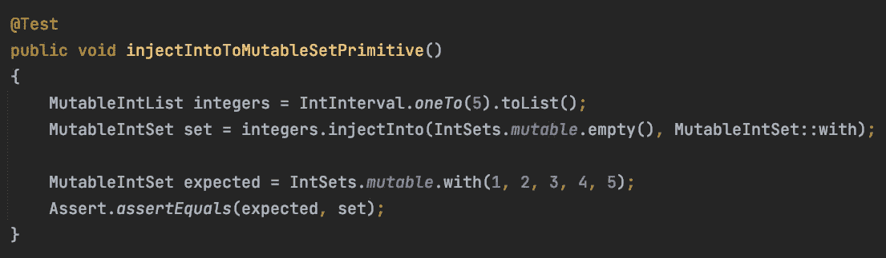

使用 injectInto 将 MutableIntList 的元素添加到 MutableIntSet 中

原语版本与对象版本基本相同，目标`set`为`MutableIntSet`。

## 5.To ImmutableSet: injectInto(对象列表)


使用 injectInto 将可变列表的元素添加到不可变集合中

将一个`MutableList`转换成一个`ImmutableSet`是展示`injectInto`相对于`forEach`的灵活性的另一个例子。一只`ImmutableSet`没有变异方法。没有像`MutableSet`那样的`add`方法。有一个`newWith`方法，它通过复制原始集合并添加一个元素来创建一个新的`ImmutableSet`，从而创建一个新的`ImmutableSet`。我将一个空的`ImmutableSet`和一个对`ImmutableSet::newWith`的方法引用一起传递给`injectInto`。

## 6.到不可变的 Int Set: injectInto(原始列表)

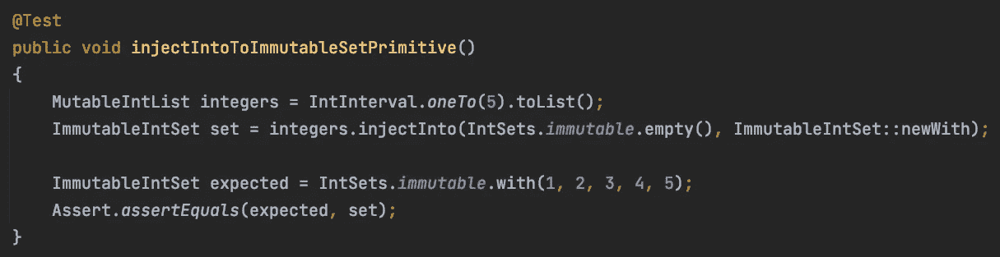

使用 injectInto 将 MutableIntList 的元素添加到 ImmutableIntSet 中

原语版本与对象版本基本相同，目标`set`为`MutableIntSet`。

# forEach 的其他示例

有时候你可能需要一个索引。谢天谢地，在 Eclipse 集合中，有用于这个目的的`forEachWithIndex`。这里有一个博客描述了提供索引的方法，包括`forEachWithIndex`。

[](https://medium.com/javarevisited/i-need-an-index-with-this-list-iteration-method-1e339fd55ed7) [## 我需要这个列表迭代方法的索引

### 使用外部和内部迭代器通过索引在 Java 中对列表进行迭代

medium.com](https://medium.com/javarevisited/i-need-an-index-with-this-list-iteration-method-1e339fd55ed7) 

还有一个博客描述了一种叫做`forEachInBoth`的`forEach`的专门形式。自从这篇博客开始写以来，我已经将`forEachInBoth`直接添加到 Eclipse 集合中的对象和原始`List`容器中。

[](https://donraab.medium.com/mysterious-eclipse-collections-apis-foreachinboth-2102912f1eee) [## 神秘的 Eclipse 集合 API:forEachInBoth

### 有时 API 很长时间都没有被发现

donraab.medium.com](https://donraab.medium.com/mysterious-eclipse-collections-apis-foreachinboth-2102912f1eee) 

# 注入的其他示例

有几个博客涵盖了更多关于`injectInto`的例子以及`injectInto`的特殊形式，比如`injectIntoKeyValue`。下面的博客涵盖了一些`injectInto`的一般例子。

[](https://donraab.medium.com/ec-by-example-injectinto-923a35c3b0cd) [## EC 示例:注入

### 了解 Eclipse 集合中最通用、最灵活、最难理解的迭代模式之一。

donraab.medium.com](https://donraab.medium.com/ec-by-example-injectinto-923a35c3b0cd) 

下面的博客描述并展示了使用 Eclipse 集合中的地图和原始地图的例子。这篇博客是由艾米莉·罗比查德写的。

[](https://emilie-robichaud.medium.com/injectintokeyvalue-in-eclipse-collections-8b29c9a4830d) [## Eclipse 集合中的 InjectIntoKeyValue

### 在 Eclipse Collections 11.1.0 版本中，引入了一个新的 API！最近，我致力于这个问题，以实现…

emilie-robichaud.medium.com](https://emilie-robichaud.medium.com/injectintokeyvalue-in-eclipse-collections-8b29c9a4830d) 

# 关于 forEach 和 injectInto 的一些最终想法

我发现用`forEach`开始思考问题非常容易。如果你需要引起一些基本的副作用，`forEach`是一个非常简单的去方法。

有时候在我用`forEach`写了一些东西后，我想知道如果我用`injectInto`同样的代码会是什么样子。如果我想要一个没有副作用的操作，或者在我传递给`injectInto`的`Function2`的上下文中完全控制任何副作用，我将使用`injectInto`。

那么在 Eclipse 集合中应该使用`forEach`还是`injectInto`？与许多事情一样，最好的解决方案可能是主观的，我建议使用您认为最容易阅读和理解的代码。

如果你真的学会了如何将`injectInto`添加到你的锦囊妙计中，你可能会开始对它的力量和灵活性感到惊讶，即使它的神秘从未完全消失。

# 示例来源

本博客中示例的来源要点

```
**Want to Connect?**I am a Project Lead and Committer for the [Eclipse Collections](https://github.com/eclipse/eclipse-collections) OSS project at the [Eclipse Foundation](https://projects.eclipse.org/projects/technology.collections). [Eclipse Collections](https://github.com/eclipse/eclipse-collections) is open for [contributions](https://github.com/eclipse/eclipse-collections/blob/master/CONTRIBUTING.md). If you like the library, you can let us know by starring it on GitHub.
```