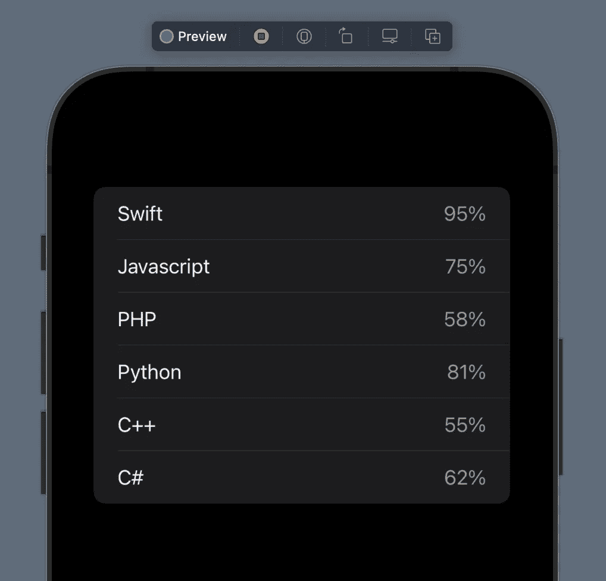
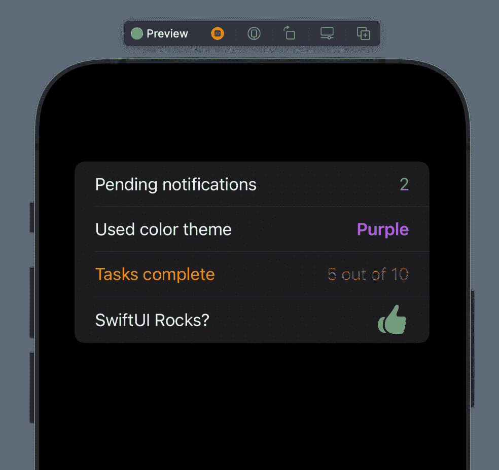
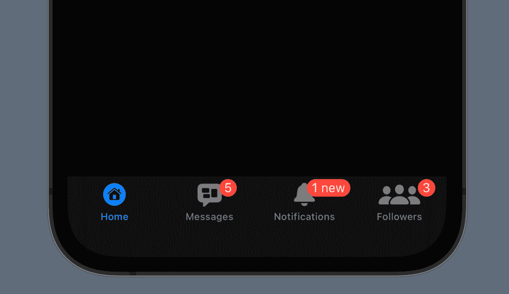

# 如何在 iOS 15 版 SwiftUI 中显示徽章

> 原文：<https://betterprogramming.pub/show-badges-in-swiftui-665c2a1db70d>

## 看看 SwiftUI 的新特性

迪米特里·卡拉斯泰列夫在 [Unsplash](https://unsplash.com/s/photos/iphone?utm_source=unsplash&utm_medium=referral&utm_content=creditCopyText) 上的照片。

在 2021 年 WWDC 大会上，苹果宣布了 SwiftUI 第三版的重大新增功能和改进。有些是大的，有些是小的。然而，有一个事实是真实的:SwiftUI 变得更好了！

在该框架的所有新增功能中，有一项听起来可能并不那么重要……直到我们需要它——那就是如何在 SwiftUI 中显示徽章。

徽章不是今年出现的新概念。我们每天都知道并使用徽章。从带有未读邮件的徽章到第三方应用中的通知徽章，以及设置应用中设置旁边的徽章，徽章在 iOS 和 macOS 中已经存在多年。

然而，SwiftUI 中没有对徽章的原生支持。在它的第三个版本之前，如果开发人员需要给应用程序添加徽章，那么他们必须想出一个自定义的实现。那是一个大麻烦。今天的文章将演示如何在 SwiftUI 中使用新的徽章 API。

在我们开始使用徽章之前，有一些事情需要注意。首先，无论你在这篇文章中读到什么，都可以在 iOS 15 和更高版本以及 macOS 12 和更高版本(Monterey 和更高版本)上找到。因此，如果你打算在以前的 iOS 或 macOS 版本中使用新的 SwiftUI badges API，那么你就不走运了。

此外，请记住，徽章不能适用于任何地方。它们仅适用于列表中的*行，以及基于选项卡视图的应用程序中的*选项卡项目*。*

说到这里，让我们继续看徽章的使用。

# 在 SwiftUI 列表中使用徽章

我们将涵盖如何在 SwiftUI 中使用和显示徽章的各种示例，从一个简单的示例开始。假设我们把各种编程语言的学习进度保存在一个简单的应用程序中。首先，让我们考虑下面的实现，它在一个列表中显示了几种语言:

可识别的类型保存了一种语言和它所取得的进步。在`ListView`结构中，有一个带有`LearningProgress`值的数组——一些语言的集合，以及每种语言的假设进度。

当前实现的问题是，它没有在每种显示的语言旁边显示学习进度值。我们将通过出示徽章来改变这种情况。在这里，我们将用百分比来表示进度。

为了添加徽章，我们将在 SwiftUI 中使用一个名为`badge`的新视图修改器。修饰符应用于列表中的每一行。在这种情况下，行内容是上面的`Text`视图:

注意，我们将进度值包含在一个`String`中，以百分比的形式显示。只需添加这一行，无需任何进一步的努力，现在就可以在每种编程语言旁边看到进度:

# 玩徽章

我们刚刚看到,`badge`视图修饰符的内容可以是一个`String`值。然而，这不是我们能提供的唯一参数类型。也可以给出局部化的`String`值。但是除了`String`值，我们还可以提供一个整数值:

除了字符串和整数值，徽章还可以获得一个`Text`视图作为参数:

这种类型的参数的真正优点是可以使用其他视图修饰符来修饰`Text`,因此最终会有一个不同于默认标记的标记:

除了通过`Text`视图定制徽章本身，还可以对整个`List`行进行样式化。这样做也会影响徽章:

最后，徽章不一定总是数字或`String`——即使在`Text`视图中。它也可以是作为图像提供给`Text`视图的`SFSymbol`:

以下代码片段收集了本部分中出现的所有内容:

以下是带有各种徽章的结果列表:

# 标签项目中的徽章

当应用程序中有标签栏时，标签也可以出现在标签项目中。一般来说，我们已经讨论过的内容也适用于标签项目中的徽章。

尽管看起来很明显，但有一点值得强调:徽章内容应该尽可能简短，避免与项目图标或其他项目重叠的长内容。

这不仅是苹果的建议，也是一个有意义的声明。我们绝对不希望有太长的徽章——只有最少的内容，将必要的信息传递给用户。

假设我们有一个标签栏应用程序，除了显示一些标签项之外，它什么也不做。对于那些应该显示徽章的项目，我们应该在每个项目后应用`badge`视图修改器。

下面的代码段说明了带有四个选项卡项目的`TabView`的实现。其中三个展示了徽章，如下图所示:

上述实现的结果是:

为了这个例子，并且由于缺乏实际的视图，我使用上面的`VStacks`来使用`tabItem`修改器。

注意，每个`badge`修改器紧跟在各自的`tabItem`修改器之后。最重要的是，很明显，数字内容可能是在标签项目中使用徽章时最适合提供徽章的值。

不管怎样，带有`String`值的徽章也包括在内，但主要是为了演示。

# 摘要

在 SwiftUI 中显示徽章现在是一项简单的任务，框架本身就支持这项任务。

然而，有一个缺点，那就是我们仍然要处理的向后兼容性。

一两年后，这不会是什么大问题。但在此之前，我们将有条件地使用新的徽章 API，因为它只适用于最新的操作系统。

无论如何，我希望你喜欢这篇文章，并且觉得它足够有趣。感谢阅读！

*最初发布于 2021 年 7 月 23 日*[*https://serial coder . dev*](https://serialcoder.dev/text-tutorials/swiftui/show-badges-in-swiftui/)*。*