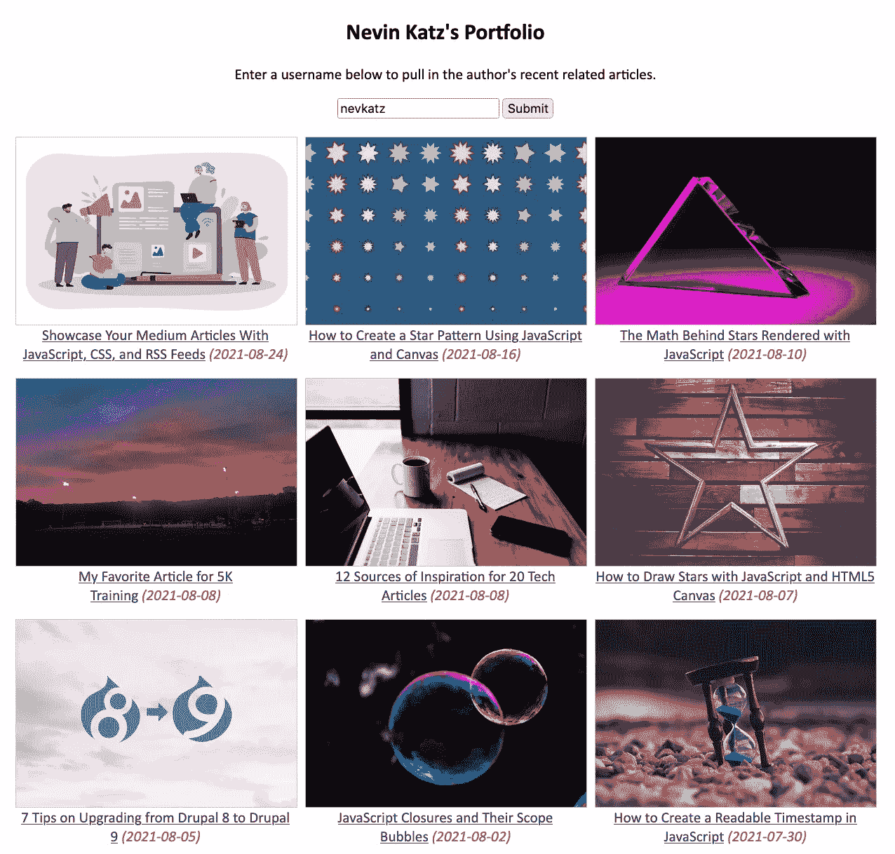

# 用 JavaScript、CSS 和 RSS 提要展示你的中型文章

> 原文：<https://betterprogramming.pub/showcase-your-articles-with-javascript-css-and-rss-feeds-92553d80aa1a>

## 为任何网站创建一个你最近工作的作品集


图片由 freepik.com 的 [pch-vector](https://www.freepik.com/pch-vector) 拍摄

在最近一个下雨的早晨，我发现了 [Medium 的 RSS Feeds API](https://help.medium.com/hc/en-us/articles/214874118-Using-RSS-feeds-of-profiles-publications-and-topics) ，从那以后我一直在尝试一场风暴。

在过去的几天里，我一直在创建各种各样的 CodePens，这些 CodePens 允许我通过标签筛选文章，通过主题搜索，或者挖掘特定出版物的文章列表。

我还寻找了一些如何使用 Feeds API 的其他示例，在我漫游的过程中，我偶然看到了这篇由 [KonradDaWo](https://medium.com/@KonradDaWo) 撰写的[文章](https://medium.com/@KonradDaWo/how-to-display-medium-posts-on-a-website-with-plain-vanilla-js-basic-api-usage-example-865507848c2)，它解释了如何使用 Fetch API 来获取作者的 feed 并创建一个最近文章的图库。我发现这是一个令人信服的用例，因为它允许作者在一个单独的网站上保存一个当前媒体作品的临时组合，而不必经常手动更新它。

本文重点介绍我用 Konrad 的 code pen[做的一个 fork。虽然它仍然使用他的提取逻辑，但在几个关键方面有所不同:](https://codepen.io/Konrad29/pen/ZoQRoz)

*   它使用 CSS 网格样式缩略图
*   它使每个图像的大小相同
*   它允许你按作者搜索
*   它使用`createElement`而不是模板文字来组装 DOM 元素

这是我的[代码笔](https://codepen.io/nevkatz/pen/KKqKXmY?editors=1111)供你试用，由于提要的限制，它最多只能写十篇文章。虽然它以我的用户名(nevkatz)开始，但你可以在 Medium 上键入任何用户名，它应该会拉入该作者最近文章的图库。

让我们看看如何使用 CSS 和 JavaScript 创建这个作品集。下面的标记将作为我们内容的外壳。

HTML 外壳。

# CSS

让我们为图库构建 CSS，首先添加一个设置字体和对齐方式的`body`样式。

```
body {
  font-family: Calibri;
  text-align: center;
}
```

接下来，让我们添加一个样式的字体颜色时，画廊加载。

```
body.loading {
  color: grey;
}
```

最后，让我们为`<span>`元素添加一个样式，我们将使用它来保存文章日期。

```
 span {
  color: grey;
  font-style: italic; 
}
```

## 图库样式

接下来，让我们使用`display: grid`作为`results`部分，并为相对较宽的屏幕宽度创建一个三列网格。请注意，我将它居中，并给它一个固定的宽度。

```
#results {
  display: grid;
  grid-template-columns: repeat(3,300px);
  grid-column-gap: 10px;
  grid-row-gap: 16px;
  margin: 20px auto;
  width: 920px;
}
```

让我们将带有类别`image`的链接设计成缩略图。我们将使用 JavaScript 动态设置`background-image`属性。这有助于保持所有图像的尺寸不变。

```
#results a.image {
  width: 300px;
  display: block;
  height: 200px;
  border: 1px solid #ccc;
  background-position: center;
  background-repeat: no-repeat;
  background-size: cover;
}
```

## 回应型风格

让我们使用媒体查询将网格列布局更改为两列。

```
[@media](http://twitter.com/media) screen and (max-width:1000px) {
  #results {
    grid-template-columns: repeat(2,300px);
    width: 620px
  }
}
```

对于第二个媒体问题，我们只需要一个专栏。为了实现这一点，我们将为`results`容器用`display: block`覆盖`display:grid`。

```
[@media](http://twitter.com/media) screen and (max-width: 800px) {
  #results {
    display: block;
    width: 300px;
  }
  #results section {
    margin-bottom: 20px;
  }
  #results a.image {
    width: 300px;
    max-width: 100%;
  }
}
```

CSS 完成了！这是完整的代码。

作品集画廊的完整 CSS。

下面的布局代表了一旦我们完成 JavaScript，CSS 将把我们的图库变成什么样子。列数取决于屏幕宽度。



描述投资组合布局的屏幕截图。

# JavaScript

现在，让我们添加一些交互性来完成以下任务:

*   填充图库
*   允许您通过单击“提交”来更改图库的内容
*   获取 RSS 提要并将其转换成 JSON
*   将数据呈现为 DOM 中的图库内容

## 启动功能

首先，让我们编写一个启动程序的`init`函数。它将首先调用一个`fetchArticles`函数，并将我的用户名作为参数传入。然后它会抓取`submit`按钮，并向其添加一个`click`监听器。

init 函数。

注意，当点击`submit`按钮时，我们将`body`元素的`className`设置为`loading`。这是为了让用户知道程序正忙。

## 取物品

现在让我们编写`fetchArticles`函数，它获取 RSS 数据。它有一个参数，`text`，应该是传入的用户名。注意`text`默认为空字符串。让我们从获取标题和文章显示区域的引用开始。

```
function fetchArticles(text = '') {
    let h2 = document.querySelector('#portfolio-title');
    let results = document.querySelector('#results');
}
```

让我们设置一下`rss_url`，如果`text`有字符就加上作者的用户名。

```
function fetchArticles(text = '') { let h2 = document.querySelector('#portfolio-title');
   let results = document.querySelector('#results'); **let rss_url = 'https://medium.com/feed/';                             
   if (text.length > 0) {                              
      rss_url += `/@${text}`;                           
   }**
}
```

现在让我们使用`api.rss2json.com`服务来构建 URL。注意，我们在最后添加了`rss_url`作为查询字符串的值。

```
fetch(`https://api.rss2json.com/v1/api.json?rss_url=${rss_url}`)
```

让我们获取 XML 数据并将其转换成 JSON。注意，表示异步操作的`then`被使用了两次。第二个`then`之后，我们要么有一些数据，要么没有。一旦我们到达这里，我就从`body`中删除`loading`类。

“获取外壳

注意，在第二次异步`then`调用之后，我们现在有了一个新变量——`data`——它包含了我们需要的所有 JSON。

让我们创建一个名为`res`的变量，它的`items`在`data`中。

```
const res = data.items;
```

如果`res`不存在，则没有数据返回，所以让我们离开这里。

```
if (!res) {
     results.innerHTML = `Please enter a valid author username.`;
     return;
}
```

如果`res`确实存在，我们将抓取所有实际发布的项目。每个帖子应该至少有一个类别，所以我们可以过滤。

```
const posts = res.filter(item => item.categories.length > 0);
```

如果没有`posts`，让我们打印一条“没有结果”的消息，然后离开这里。

```
if (posts.length == 0) {
      results.textContent = h2.textContent = 'No results.';
      return;
}
```

如果我们确实有一些`posts`，让我们从第一个帖子中抓取`author`并更改标题。

```
let author = posts[0].author;                                   h2.innerHTML = `${author}'s Portfolio`; 
```

现在，让我们创建一个名为`output`的文档片段。对于`posts`中的每一项，我们将通过调用`renderItem`在 DOM 中呈现它。

```
let output = document.createDocumentFragment();                                                           posts.forEach((item) => {                                          
    output = **renderItem(item, output);  **                                 }); 
```

现在让我们清空`#results`区域并添加新的`output`元素。

```
let results document.querySelector('#results')                                   results.innerHTML = '';                                   results.appendChild(output);
```

下面是我的`fetchArticles`的完整代码。

fetchArticles 函数。

## 呈现每个项目

现在让我们编写`renderItem`函数，它创建一个图库条目。这需要两个参数:

*   `item`，一个 JavaScript 对象
*   `output`，我们正在添加项目的文档片段

下面是函数外壳。

```
function renderItem(item, output) {}
```

在这个函数中，让我们抓住`url`，它将在多个地方使用。注意，我使用了`split`来删除查询字符串。

```
let url = item.link.split('?')[0];
```

准备好`url`之后，让我们构建我们的 DOM 元素。我们将从包含所有内容的`section`元素和包含我们图像的链接开始。

```
let section = document.createElement('section');                           let a_img = document.createElement('a');
```

现在，让我们根据`item`的`thumbnail`属性设置元素的`backgroundImage`。

```
a_img.style.backgroundImage = "url('" + item.thumbnail + "')";
```

让我们继续设置图片链接的其余属性。

```
a_img.href = url; 
a_img.className = 'image';                                                    a_img.target = '_blank';                           section.appendChild(a_img);
```

现在让我们创建另一个名为`blurb`的元素。这将保存链接的标题和日期。

```
let blurb = document.createElement('div');
```

让我们为这个链接标题创建一个元素，设置它的属性，并把它附加到`blurb`。

```
let a_txt = document.createElement('a');                           a_txt.href = url;                           
a_txt.textContent = item.title;                           a_txt.target = '_blank';                           blurb.appendChild(a_txt);
```

让我们创建保存日期的`<span>`元素。

```
let span = document.createElement('span');
```

接下来我们来抓`item.pubDate`，它有下面这个大致的样子。

```
"2021-08-05 03:57:29"
```

我们只想要粗体的日期，所以我们将这个字符串用空格字符`split`，把它变成一个数组。然后，我们可以在索引`0`处获取日期部分。

```
let date = item.pubDate.split(' ')[0];
```

现在让我们将日期添加到`<span>`元素的`innerHTML`中，并在一个不可破坏的空间中进行更好的测量。

```
pan.innerHTML = `&nbsp;(${date})`;
```

现在有很多附加工作要做:

*   我们将`span`附加到`blurb`上，
*   将`blurb`附加到`section`上，
*   并将`section`附加到`output`上。

```
blurb.appendChild(span);                           section.appendChild(blurb);                           output.appendChild(section);
```

然后我们返回文档片段，这样它就可以继续用`forEach`循环中剩余的任何帖子填充。

```
return output;
```

下面是整个`renderItem`功能。

renderItem 函数。

现在让我们在最后添加一个对`init()`的调用，代码应该会运行。

```
init();
```

下面是 CodePen 再次供参考。

完成的代码笔

如果你已经完成了这个项目，恭喜你！你现在有一个灵活的组合画廊，你应该能够整合到一系列的网站。虽然它只引入了少量的帖子，但它应该保持定期更新，只需要很少的维护，甚至不需要维护。

# 建议的后续步骤

*   尝试分叉 CodePen 或将其下载为 zip 文件，以便您可以调整它来满足您的需求。
*   我的风格很简单，所以试着为你自己的调色板添加 CSS。随意尝试 [Canva 调色板生成器](https://www.canva.com/colors/color-palette-generator/)获取灵感。
*   尝试调整`grid-template-columns`,以便获得不同的列数。
*   尝试移动优先的方法，其中窄宽度是默认的，媒体查询是针对更宽的宽度。
*   如果您想在自己的投资组合中使用这个，请随意移除输入框并硬编码您的用户名。
*   尝试将代码添加到您自己网站的某个地方。

我希望你喜欢这个教程。感谢阅读！