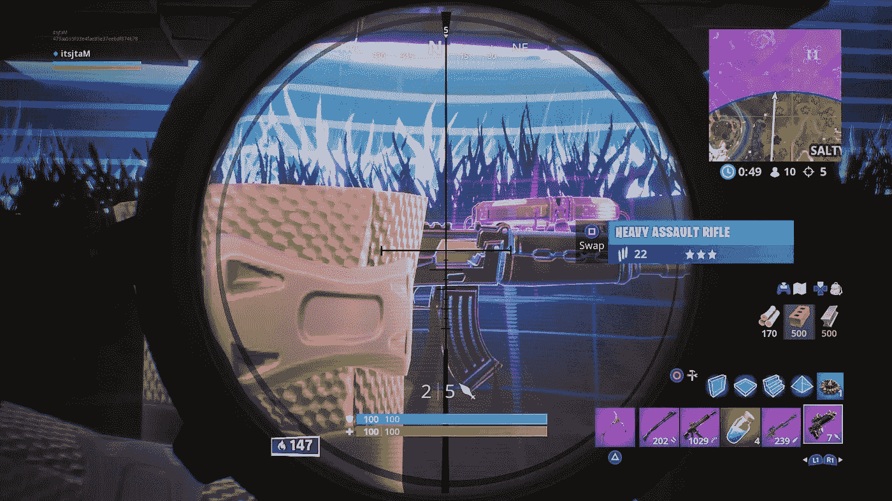
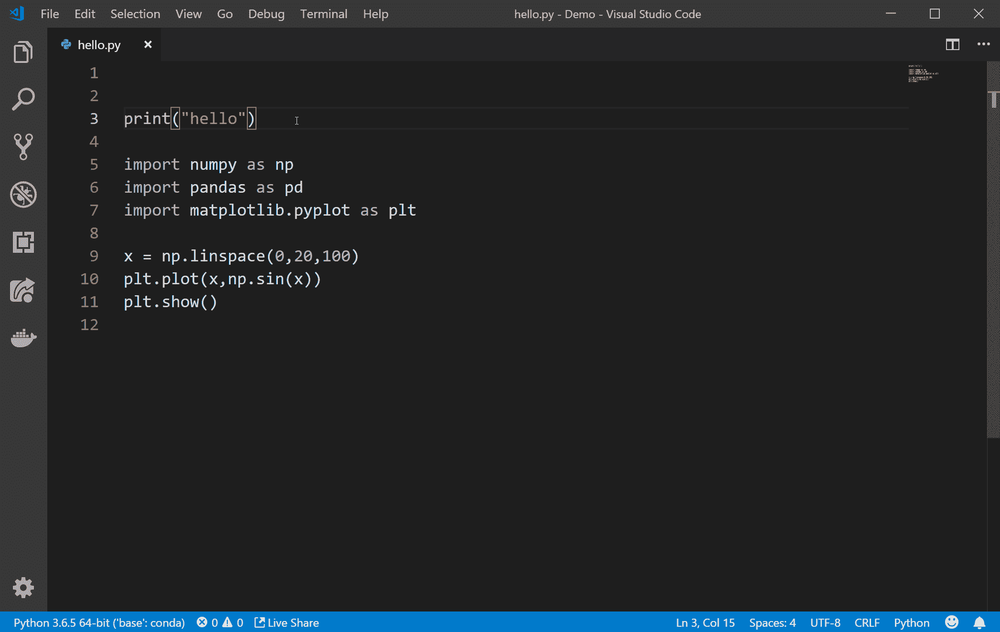
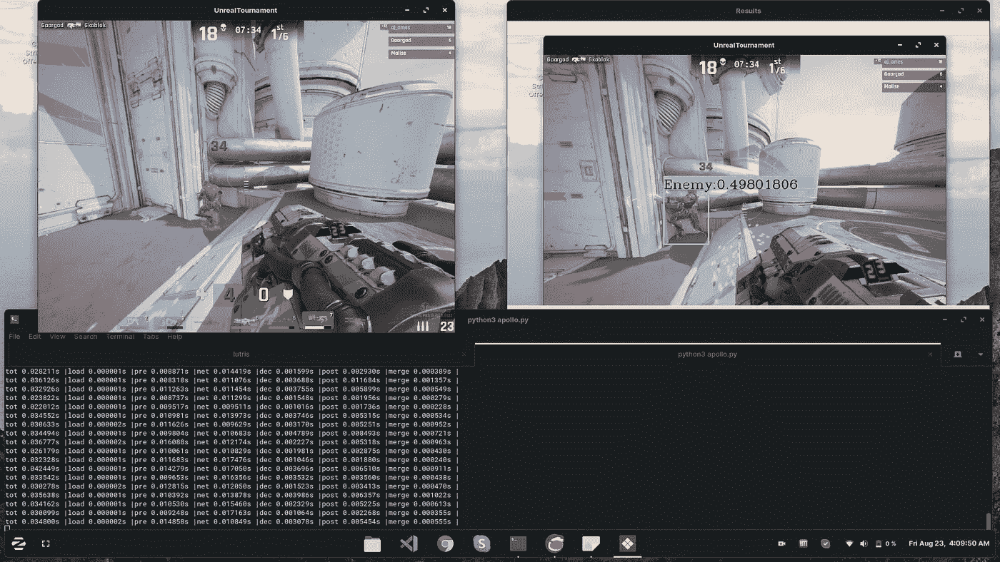

# 用 AI 粉碎你的第一人称射击对手

> 原文：<https://betterprogramming.pub/shred-your-first-person-shooter-opponents-with-ai-390b60046997>

## 使用对象检测来提前发现敌人


虚幻竞技场预阿尔法

早在 1958 年，一位物理学家创造了第一个视频游戏:一种让你控制虚拟世界实体的娱乐形式。从那以后，游戏加快了步伐，给我们提供了可以启发人生的平台和故事。从在《超级马里奥》中从怪物的愤怒中拯救公主，到在《极品飞车》中以非法速度驾驶汽车，从在《使命召唤》中经历激烈的战争般的情况，到成为一名职业杀手，几百万行代码可以给计算机注入魔力，产生一个沉浸式环境，等待你去探索。

站住。故事并不是游戏提供的唯一好东西。游戏可以让你在世界各地的高手面前测试你的勇气，并结交新朋友。也就是说，有时候你需要消灭你的对手才能达到神一般的表现。作为一名深度学习工程师，我总是努力让机器变得更智能，利用它们拥有的精度和计算能力。“那么，为什么不让我们的游戏机做更多的事情呢?”深藏在我邪恶想法地牢里的双角暗黑破坏神说道。:)



对象检测是检测视觉数据中不同实体的概念。对象检测器在 GPU 上加速。游戏是视觉数据，也运行在 GPU 上。看看我是如何制定精确的总体规划的？(穆哈哈。)

在这篇文章中，我将带你设置 YOLOv3 物体检测器，并把你喜欢的 FPS 游戏放入其中。

# 全系统设置

我只支持 Linux，特别是 Ubuntu 18.04 以上的版本，因为 Windows 太烂了！继续在您的机器上安装以下软件。

```
sudo apt update -y && sudo apt -y upgrade
sudo apt install python3.7 python3.7-dev
sudo apt install python3-protobuf
sudo apt install ffmpeg
```

我们主要使用 Python 来编写代码。是的，这很简单，不需要我使用 C 语言，也不需要我想象自己缺乏其他语言的知识。(开玩笑，我是 c 处的 pro)

# 用于 GPU 加速的 CUDA 和 CUDNN

如果你有一个 NVIDIA GPU，并希望提高推理速度，我建议你继续设置 CUDA 和 CUDNN 以提高性能。

## **删除任何以前版本的 CUDA**

```
sudo apt --purge remove "cublas*" "cuda*"
sudo apt --purge remove "nvidia*"
```

## **为 Ubuntu 18.04 下载并安装 CUDA 10.0】**

```
# Download the deb file installer
wget https://developer.nvidia.com/compute/cuda/10.0/Prod/local_installers/cuda-repo-ubuntu1804-10-0-local-10.0.130-410.48_1.0-1_amd64 -O cuda-repo-ubuntu1804-10-0-local-10.0.130-410.48_1.0-1_amd64.deb# Run the installer
sudo dpkg -i cuda-repo-ubuntu1804-10-0-local-10.0.130-410.48_1.0-1_amd64.deb# Add Public Key
sudo apt-key add /var/cuda-repo-ubuntu1804-10-0-local-10.0.130-410.48/7fa2af80.pub# Perform an update
sudo apt update# Install CUDA
sudo apt install cuda
```

## **为 CUDA 10.0 下载并安装 cud nn 7 . 5 . 0**

前往 [cudnn-archive](https://developer.nvidia.com/rdp/cudnn-archive) 下载 Ubuntu 18.04 的运行时库、开发者库和代码示例。

注意:您将需要一个帐户；如果你没有，就注册吧。

```
sudo dpkg -i libcudnn7_7.5.0.56-1+cuda10.0_amd64.deb 
sudo dpkg -i libcudnn7-dev_7.5.0.56-1+cuda10.0_amd64.deb 
sudo dpkg -i libcudnn7-doc_7.5.0.56-1+cuda10.0_amd64.deb
```

# **使用虚拟环境进行 Python 依赖**

建议使用虚拟环境来安装依赖项。

```
pip3 install virtualenv virtualenvwrapper
```

接下来，如果使用 Bash shell，在`.bashrc`中设置环境变量；如果使用 Zsh shell，在`.zshrc`中设置环境变量。

```
# For ZSH
echo '# virtualenv and virtualenvwrapper' >> .zshrc
echo 'export VIRTUALENVWRAPPER_PYTHON=/usr/bin/python3' >> .zshrc
echo 'export WORKON_HOME=$HOME/.virtualenvs' >> .zshrc
echo 'source ~/.local/bin/virtualenvwrapper.sh' >> .zshrc # For Python 3.7 only# For BASH
echo '# virtualenv and virtualenvwrapper' >> .bashrc
echo 'export VIRTUALENVWRAPPER_PYTHON=/usr/bin/python3' >> .bashrc
echo 'export WORKON_HOME=$HOME/.virtualenvs' >> .bashrc
echo 'source ~/.local/bin/virtualenvwrapper.sh' >> .bashrc # For Python 3.7 only
```

现在，运行下面的命令，或者启动一个新的终端。

```
source ~/.zshrc # For ZSH
source ~/.bashrc # For BASH
```

要创建虚拟环境，请使用以下内容:

```
mkvirtualenv <name_of_env>
```

要启用/禁用您的虚拟环境:

```
# To enable
workon <name_of_env>
# To disable
deactivate
```

专业提示:要删除您的虚拟环境，请使用以下命令。

```
rmvirtualenv <name_of_env> # Be as sure as you can...
```

## **安装依赖关系**

本节列出了您必须安装的依赖项。

```
absl-py==0.7.1
astor==0.8.0
certifi==2019.6.16
chardet==3.0.4
Click==7.0
Flask==1.1.1
gast==0.2.2
google-pasta==0.1.7
grpcio==1.23.0
gunicorn==19.9.0
h5py==2.9.0
idna==2.8
itsdangerous==1.1.0
Jinja2==2.10.1
Keras-Applications==1.0.8
Keras-Preprocessing==1.1.0
Markdown==3.1.1
MarkupSafe==1.1.1
mss==2.0.22
numpy==1.17.0
opencv-python==4.1.0.25
Pillow==6.1.0
protobuf==3.9.1
requests==2.22.0
six==1.12.0
tensorboard==1.14.0
tensorflow-estimator==1.14.0
tensorflow-gpu==1.14.0
termcolor==1.1.0
urllib3==1.25.3
Werkzeug==0.15.5
wrapt==1.11.2
```

运行此命令安装所有依赖项:

```
# Activate the virtual environment
workon <env-you-created>
## After you run the command, look for a change in the prompt.
## The nameof the env must be displayed.# Now, run the following to install the dependencies
pip3 install -r requirements.txt
```

也可以自己安装。参考上面的列表。

# 让代码运行起来！



如果你还没有 Git，那就安装一些代码管理工具吧！

```
sudo apt install git 
```

克隆以下存储库:

```
git clone [https://github.com/aj-ames/ShredFPSOpponents.git](https://github.com/aj-ames/ShredFPSOpponents.git)
```

我使用 Git 大型文件系统来存储 YOLOv3 模型。你需要下面的包来访问它。

```
sudo apt install git-lfs
```

要获取模型，请运行以下命令:

```
cd path_to_repo
git lfs pull
```

厉害！现在你准备好摇滚了！我使用了服务器-客户端架构进行推理。要启动推理服务器，请使用以下命令:

```
gunicorn inferenceserver:flaskserver --bind=127.0.0.1 --threads=8 --timeout=100
```

要启动将您的屏幕作为输入并执行推理的客户端，请使用以下命令:

```
python3 ingame_detector.py
```

就是这样。这将把你屏幕的一部分作为神经网络的输入。要改变作为检测输入的屏幕分辨率，改变`args.py`中的`mon`变量。

```
mon = {'top': 0, 'left': 0, 'width': 800, 'height': 600}
```

无论你选择什么游戏，一定要将它设置在`Window Mode`中，并相应地调整你的屏幕，或者使用多个显示器来获得更身临其境的体验。



这是我在虚幻竞技场上彻底消灭敌人的视频！

去吧！代码是你能获得的最强大的武器。征服这个游戏并获得新的等级:)去用高射炮粉碎他们！