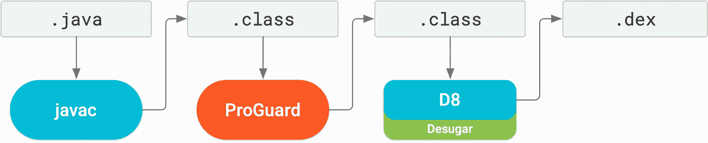
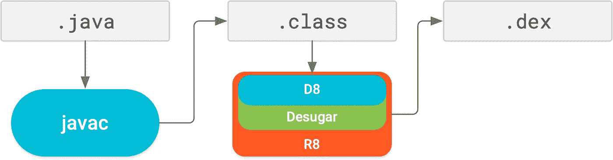
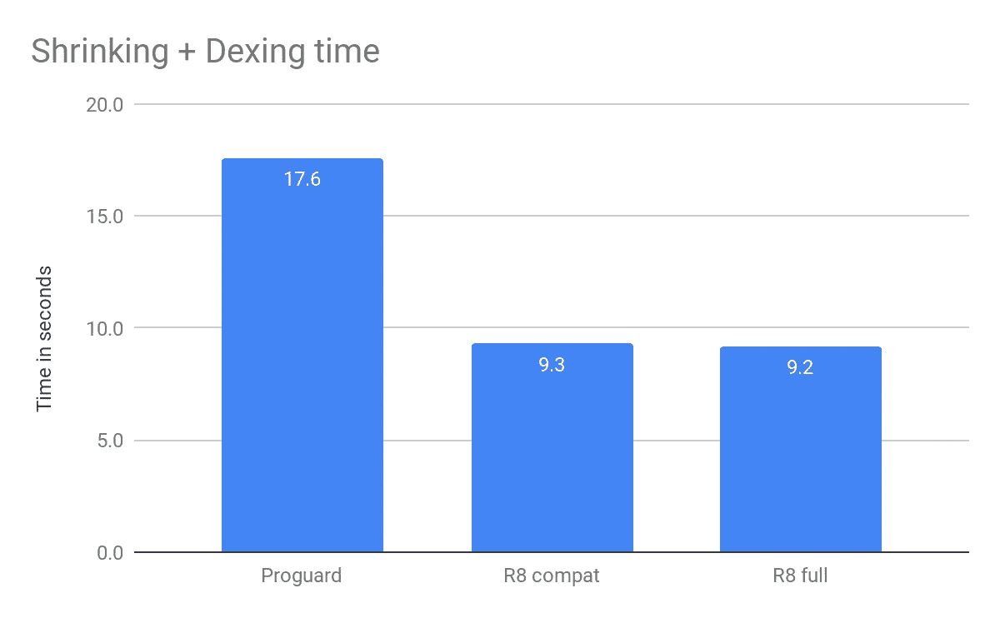
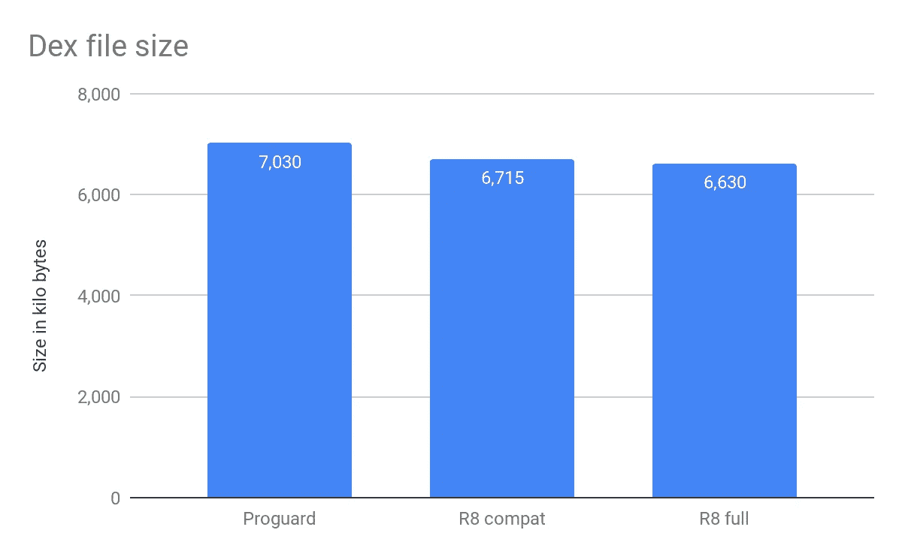
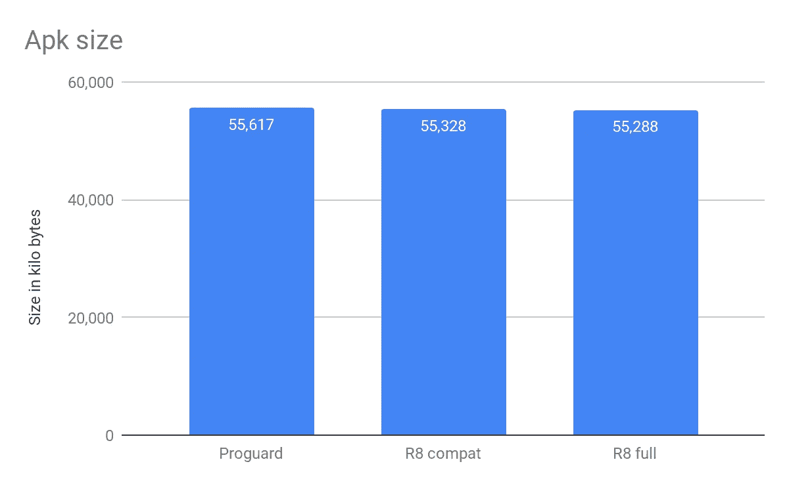

# 如何用 R8 缩小你的安卓应用的大小

> 原文：<https://betterprogramming.pub/shrink-your-android-app-with-r8-afe17c4d393>

## 当用户可以更快地下载你的应用程序时，他们可以更快地爱上它

照片由[山姆·沃伦](https://unsplash.com/@samwarren?utm_source=medium&utm_medium=referral)在 [Unsplash](https://unsplash.com?utm_source=medium&utm_medium=referral) 拍摄

对于现代企业来说，一个 Android 应用程序可以服务于许多目的。您可以开发一个定制的 Android 应用程序，提供所需的功能来简化业务，并轻松地与客户联系。

然而，你需要关注你的 Android 应用的大小。决定人们是否会安装你的应用的是应用的大小。多亏了 R8，你可以用更轻的 APK 优化你的应用。

让我们从 Android 应用程序开发的角度来讨论 R8 的角色。

# 在 Android Studio 中启用 R8 的配置

1.  Android Studio 版本 3.4.0 或更高版本。
2.  [Android Gradle 插件](http://tools.android.com/tech-docs/new-build-system/user-guide)版本 3.4.0。
3.  `minifyEnabled true` ( `build.gradle`项目级代码优化)。
4.  `shrinkResources true` ( `build.gradle`资源缩减的项目级别=可选)。

当你使用 Android Studio 3.4 或 Android Gradle plugin 3.4.0 或更高版本时，R8 是默认的编译器。

您可能会想，在项目中运行或启用 R8 的实现步骤应该是什么，请不要想太多，因为只要您当前正在使用上述功能，就没有一行代码可以做到这一点。

> “请记住，R8 旨在与您现有的 ProGuard 规则一起工作，因此您可能不需要采取任何行动来受益于 R8。”—[Android Dev](https://developer.android.com/studio/build/shrink-code#shrink-code)

谷歌非常注重构建性能，这表明谷歌是多么专注于此，以及他们愿意为此走多远。

你可能在想幕后的过程是什么，对吗？那么，让我们来看看这个过程…

# 生成 APK 时构建流程

1.  Desugar 在编译期间将 Java 8 特性转换成可被 [Dalvik](https://source.android.com/devices/tech/dalvik) / [ART 编译器](https://source.android.com/devices/tech/dalvik)识别的东西。
2.  [ProGuard](https://www.guardsquare.com/en/products/proguard) 删除未使用的类、字段、方法和属性。
3.  DEX 编译器将 Java 字节码转换成 Android 的字节码。dex 文件格式。

后来，在 2017 年，谷歌推出了 D8，这是 DEX 编译器的可选替代品。

# 对于 D8，构建过程如下所示

[来源](https://developer.android.com/studio/releases/#r8-default)

ProGuard 是一种压缩代码的技术，它检测并删除未使用的类、字段、方法、包和属性(包括代码库)。

1.  收缩:它通过检测和删除未使用的代码来收缩代码。
2.  优化器:它分析并优化字节码。
3.  混淆器:它用短名称重命名优化的类和方法。(用于防止逆向工程)。

D8 运行速度更快，产量更小。与以前的编译器 DX 相比，dex 文件具有相当或更好的运行时性能。

谷歌在 2018 年将 D8 作为默认的 DEX 编译器。后来，在 2019 年，谷歌推出了 R8，它是 ProGuard 的替代品，拥有 D8 的所有功能。

# 对于 R8，构建过程如下所示

[来源](https://developer.android.com/studio/releases/#r8-default)

作为开发者，你们都知道我们只能相信实际的结果。所以，这就是为什么 [Android 官员](https://android-developers.googleblog.com/2018/11/r8-new-code-shrinker-from-google-is.html)上传了下面的结果，以更好地了解 R8 如何比 ProGuard 工作得更快更好。

以下是[圣诞老人追踪器应用的结果。](https://github.com/madsager/santa-tracker-android)

[来源](https://android-developers.googleblog.com/2018/11/r8-new-code-shrinker-from-google-is.html)

[来源](https://android-developers.googleblog.com/2018/11/r8-new-code-shrinker-from-google-is.html)

[来源](https://android-developers.googleblog.com/2018/11/r8-new-code-shrinker-from-google-is.html)

# R8 配置文件

1.  `proguard-rules.pro` (Android Studio 在那个模块的根目录下创建这个文件，你可以根据你的要求添加你的自定义 ProGuard 来保存规则。)
2.  `proguard-android-optimize.txt`(运行时由 Android Gradle 插件生成。)

如果您想查看 R8 编译器的报告，请将下面几行添加到`proguard-rules.pro`文件中

1.  `-printconfiguration ~/tmp/full-r8-config.txt`**(R8 的报告适用于构建您的项目。)**
2.  **`-printusage <output-dir>/usage.txt` (被 R8 删除代码的报告。)**
3.  **`-printseeds <output-dir>/seeds.txt`**(R8 从你的项目的 keep 规则中确定的入口点的报告。)****

# ****R8 和普罗瓜德的区别****

## ****R8****

****R8 在一个步骤中结合了去糖、收缩、模糊、优化和去索引，从而显著提高了构建性能。****

## ****ProgGuard****

****ProGuard 只集成了收缩、模糊和优化。****

****根据上面的陈述，ProGuard 只对减少 APK 大小有效。因此，其他过程，如去糖和去兴，被额外包括在构建过程中，所以它们需要更多的时间来构建。****

****R8 在一个步骤中处理三种不同的事情，所以它在一个步骤中完成整个构建过程，以减少编译的总时间。****

****我绝对相信你会想让 R8 在你的项目中体验到建造过程时间的减少和 APK 规模的缩小。****

****那么， [R8](https://developer.android.com/studio/build/shrink-code#shrink-code) 到此为止。****

****快乐编码，我希望你喜欢看我的博客。****