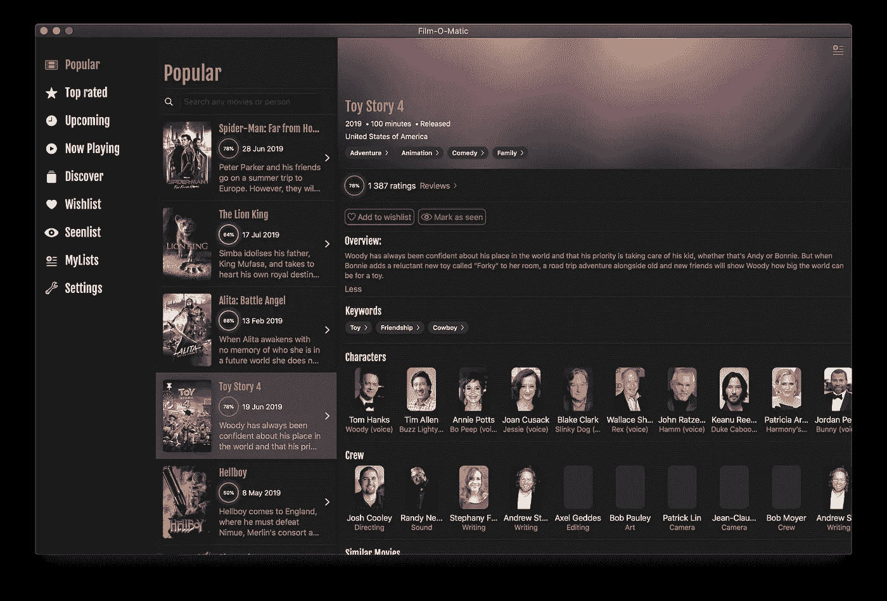
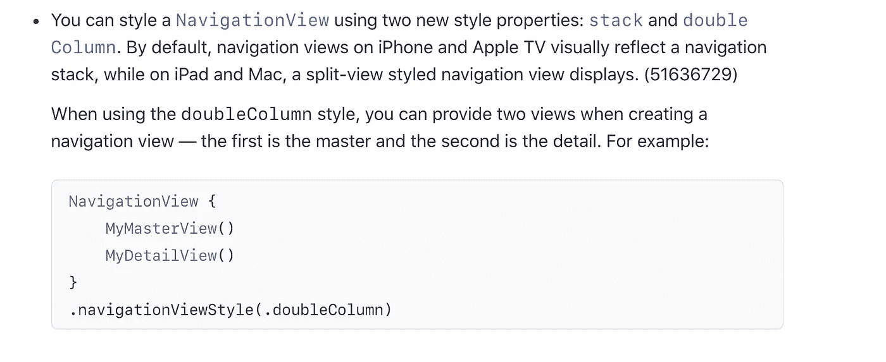
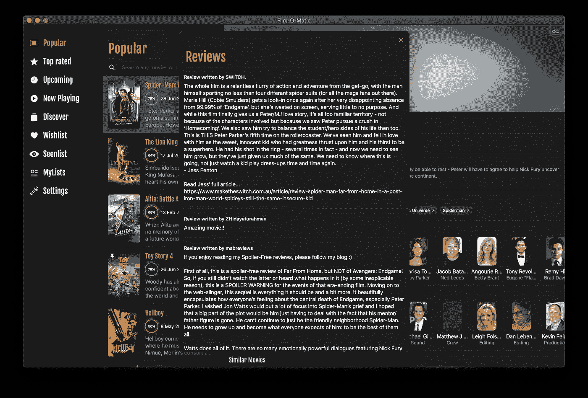

# SwiftUI 中 macOS 上的侧边栏和导航视图

> 原文：<https://betterprogramming.pub/sidebar-and-navigationview-on-macos-in-swiftui-a8b4a074a651>

## 在通用 iOS/iPadOS/macOS 目标中

在 macOS 上运行时 MovieSwiftUI 上的主窗口。

随着 SwiftUI 最终在 Xcode 11 beta 4 的 macCatalyst 项目中编译，我可以在我的共享 [MovieSwiftUI](https://github.com/Dimillian/MovieSwiftUI) 代码库中分享一个我如何在 iOS/iPadOS 和 macOS 上做不同 home 视图的例子。

从 Xcode 11 beta 3 开始，苹果在 [NavigationView](https://developer.apple.com/documentation/swiftui/navigationview) 中增加了`[*.navigationViewStyle(style:)*](https://developer.apple.com/documentation/swiftui/navigationview/3339591-navigationviewstyle)` 。在 iOS 上，它默认设置为`stacked`，这是一个单列`NavigationView`，所有推送的视图相互堆叠。或者，可以设置为`doubleColumn`。通过这个选项，它仍然可以堆叠在 iOS 上，但在 iPadOS 和 macOS 上使用`Master/Detail`双栏显示屏。除此之外，如果你愿意，你可以在边上添加你自己的`outlineView` / `sidebar`。

来自苹果 iOS 13 beta 4 发行说明。

*注意:如果你正在做一个 macOS 特定的目标，你将有机会使用许多 API，这些 API 可以使你的应用程序在 macOS 上更加得心应手。就像* `*.sidebar*` *样式上的* `*List*` *(其中把好看的轮廓视图模糊化的样式)，下的* `*HSplitView*` *，还有自动工具条样式为* `*NavigationView*` *。但是本文的目的是演示在 iOS、iPadOS 和 macOS 应用程序中使用单一目标可以实现什么。*

我们先来看看`HomeView`:

这是我的应用程序中仅有的使用`#if targetEnvironment`的地方之一，但是这是我所需要的，根据我是在 iOS/iPadOS 还是 macOS 上提供一个非常不同的 UI。

正如你在 macOS 实现中所看到的，主视图基本上是一个定制的`SplitView`，用一个`HStack`和一个`ScrollView`实现，侧边栏有一个固定的框架宽度。然后，其主体中的第二个视图是实际的内容视图，将根据侧边栏中选择的项目来显示。

让我们来看看`OutlineMenu`是如何做到的:

这只是一个`enum`，它为每个案例(菜单项)定义了一个标题、一个图像和当项目被选中时使用的`contentView`。注意大部分都嵌套在一个`NavigationView`里。

默认情况下,`NavigationView`在 macOS 上运行你的应用时会使用两栏样式。因此，它将根视图显示为一列，然后在为详细视图保留的第二个更大的列中显示使用`NavigationLink`从这个根视图呈现的任何视图。如果你来自 iOS，你不需要修改你的`NavigationLink`中的任何代码。

在上述电影列表中使用的代码中，它只是一个普通的`NavigationLink`。

你还可以使用一些其他的技巧。例如，如果您使用`.sheet()` 呈现方法呈现一个嵌套在`NavigationView`中的视图，不要忘记将您的`NavigationView`样式设置为`.stack`，以实现下面截图中的结果:

这是你在屏幕上看到的模态代码:

如果不将其设置为`.stack`，默认情况下，它将在工作表中显示为双栏。这可能是有用的，但不是在这种情况下。

该应用程序还缺少一些东西，无法真正在 macOS 上显示。我还不能为 outline/sidebar 视图获得模糊的样式，因为 SwiftUI 本身没有公开 API 来做这件事。我的窗口也有一个我想删除的标题栏，但是由于我使用了一个`UIWindow`和一个`UIHostingController`，我不知道如何才能做到。

我希望您喜欢这篇短文，它将允许您在单个目标上构建强大的跨平台应用程序。如果你有点冒险精神，我鼓励你建立一个专门的 macOS 目标。即使我相信未来是统治他们所有人的一个目标，并希望苹果会朝着那个方向发展。

感谢阅读！