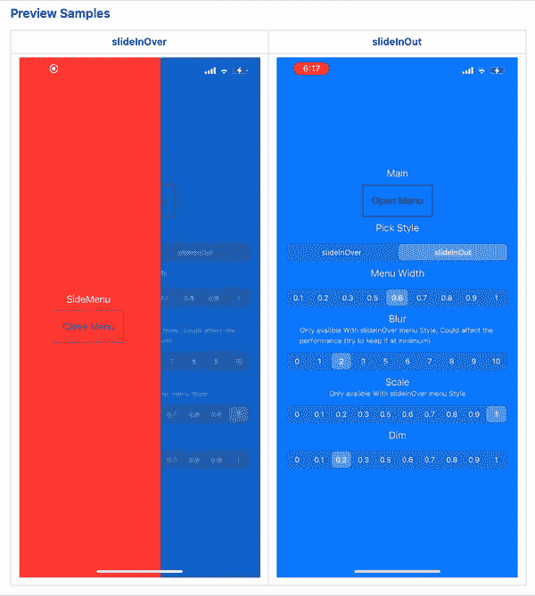

# 使用 SwiftUI 构建侧菜单

> 原文：<https://betterprogramming.pub/sidemenu-using-swiftui-939a01c86ecd>

## 用一个豆荚来帮你



几个月前，我深入研究了 SwiftUI。我喜欢它。但是它带来了一些问题，这些问题是任何新的库都会有的(它变化很快，还没有很多用户，等等)。).所以今天我提出了一个解决方案，它将帮助你完成你的应用程序中一个非常微小但重要的部分:当你决定用 SwiftUI 构建你的应用程序时。

当我试图使用 SwiftUI 构建一个完整的应用程序时。我在为我的应用程序创建边菜单时遇到了一些问题。使用 UIKit 的时候，我用的是 [jonkykong](https://github.com/jonkykong/SideMenu/commits?author=jonkykong) 做的 SideMenu pod。但当我开始用 SwiftUI 构建应用程序时，我需要用 SwiftUI 编写的东西，而且非常容易使用。我寻找的东西必须有:

*   手势已启用
*   高度可定制性

所以我花了一些时间来构建一个好的解决方案，今天我想和大家分享一下。所以我创建了一个名为 SUISideMenu 的 pod，使用起来非常简单。所以我们开始吧。

在通过 CocoaPods 或 Swift 包安装 side menu 之后，您需要做的第一件事是创建一个`UIStateModel`环境变量，因为它是保存和允许与侧菜单交互的关键组件。所以你需要在最顶层的视图中添加，不管它是`SceneDelegate` 文件还是另一个顶层视图文件。

# 添加`'UIStateModel()’`

```
.environmentObject(UIStateModel())
```

下一步是添加`SideMenu`视图，它接受两个参数:`sideMenu`，它接受将作为侧菜单呈现的视图，以及
`MainView`，它接受主视图——当侧菜单不存在时将呈现的视图。

# 2.添加 SUISideMenu

```
var body: some View {
        SideMenu(sideMenu: { //HERE:- Put The View you want to use as SideMenu }, mainView: { //HERE:- Put The View you want to use as Main View

        }).environmentObject(UIStateModel()) //Very Important.
          // can also be here if it isn't in the top most view
    }
```

以下是相同的步骤，但有一个示例:

```
var body: some View {
        SideMenu(sideMenu: { //HERE:- Put The View you want to use as SideMenu
            //Example:
            Text("SideMenu")
                .frame(maxWidth: .infinity, maxHeight: .infinity)
                .background(Color.red) }, mainView: { //HERE:- Put The View you want to use as Main View
            //Example:
            Text("mainView")
                .frame(maxWidth: .infinity, maxHeight: .infinity)
                .background(Color.blue) }).environmentObject(UIStateModel()) //Very Important 
          // can also be here if it isn't in the top most view
}
```

# 3.用户化

```
SideMenu(menuWidth: 0.6, // <= 1
                     menuStyle: .slideInOver,
                     blur: 2,
                     scale: 1, 
                     dimValue: 0.2, 
                     sideMenu: { //HERE:- Put The View you want to use as SideMenu

            }, mainView: { //HERE:- Put The View you want to use as SideMenu

            }).environmentObject(UIStateModel()) //Very Important
               // can also be here if it isn't in the top most view
```

您可以自定义`menuStyle` ( `slideInOver`、`slideInOut`)、侧菜单出现时的`blur`、侧菜单出现时的背景视图的`scale`以及背景视图的`dimValue`。

瞧啊。希望这篇文章和 pod 对您有所帮助。

感谢阅读。

请在这里找到我的 pod 和示例项目:

[](https://github.com/ezzmoaz/SUISideMenu) [## ezzmoaz/suidemenu

### suidemenu 是一个简单的边菜单解决方案，适合那些想要简单优雅的解决方案的人。这是用/为…写的

github.com](https://github.com/ezzmoaz/SUISideMenu)