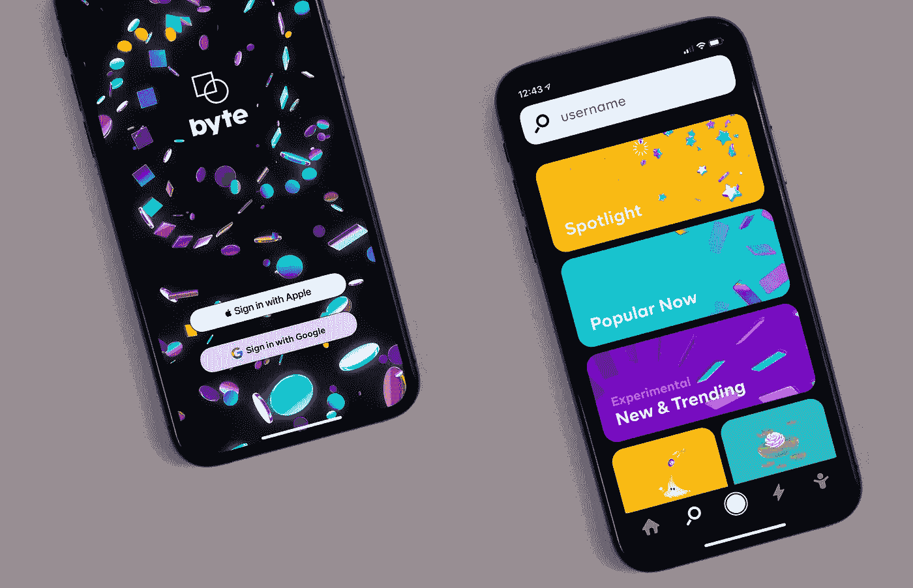
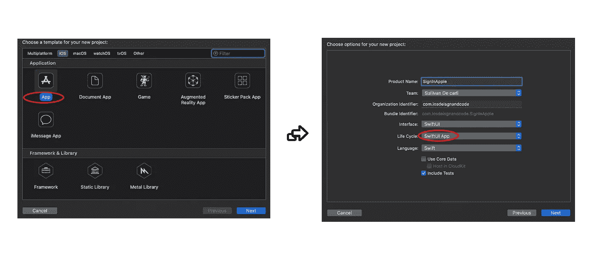
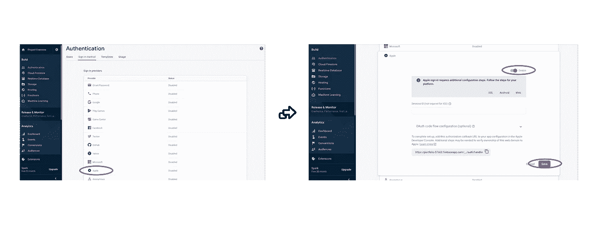
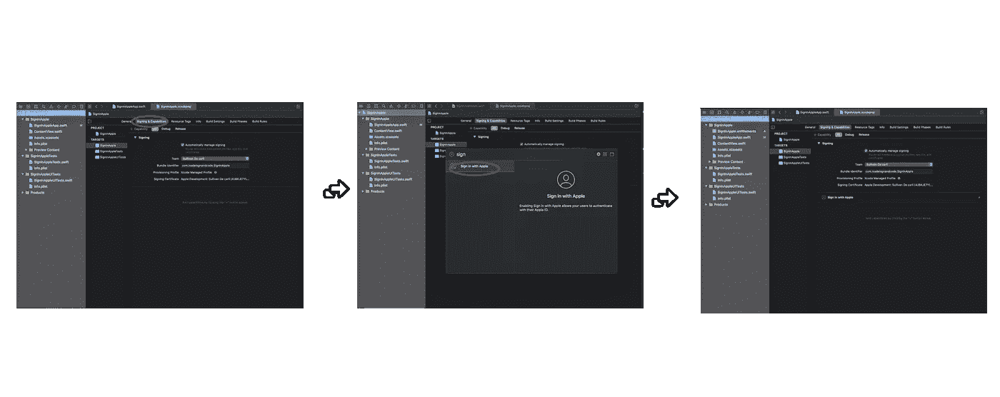
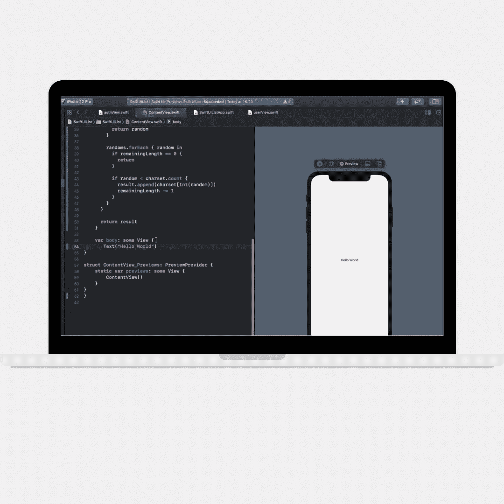
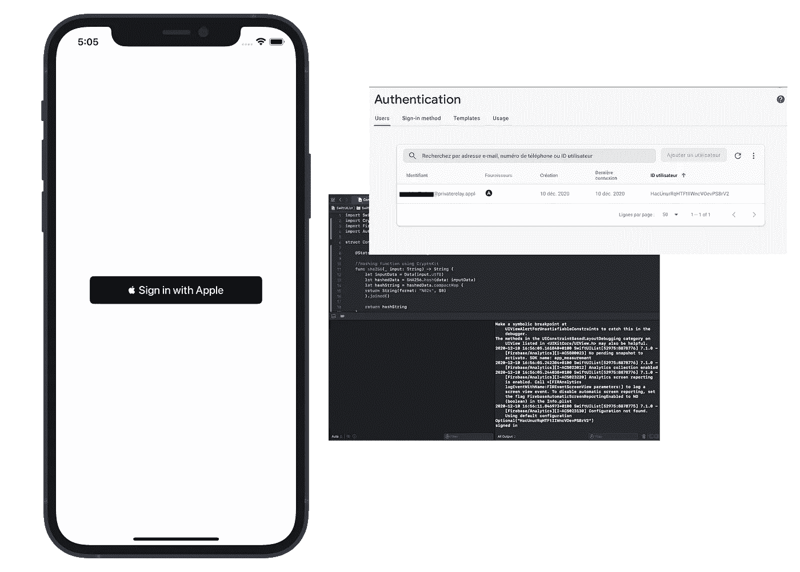

# 使用 Firebase Auth SDK 和 SwiftUI 登录 Apple

> 原文：<https://betterprogramming.pub/sign-in-with-apple-firebase-auth-swiftui2-0-5e007f1e5a53>

## 让我们检查一下

查尔斯·德鲁维奥在 [Unsplash](https://unsplash.com/s/photos/mobile-app?utm_source=unsplash&utm_medium=referral&utm_content=creditCopyText) 拍摄的照片。

*难度:初级|轻松|* ***普通*** *|挑战*

*环境:*[*Xcode 12*](https://developer.apple.com/xcode/)*，iOS 14，*[*Firebase 7 . 1 . 0*](https://firebase.google.com/support/release-notes/ios)*，以及* [*SwiftUI*](https://developer.apple.com/xcode/swiftui/)

*先决条件:阅读*[*Firebase Auth SDK for iOS 文档*](https://firebase.google.com/docs/auth/ios/apple) *。*

# 开始一个新项目

打开 Xcode >开始一个新项目>选择 App 模板>选择 SwiftUI 界面，调用你的项目*sign apple。*

# 建立火力基地

我将快速浏览一下 Firebase 集成。如果您还没有集成 Firebase SDK，请先阅读我的文章:

 [## 将 Firebase 与 iOS 项目集成| Xcode 12

### 了解如何将 Firebase SDK 与现有的 iOS 项目集成。

medium.com](https://medium.com/ios-design-code/integrate-firebase-with-an-ios-project-xcode-12-28512f202bb0) 

在 Xcode 12 中，的 SwiftUI 生命周期*没有`Scene Delegate`。*为了集成 Firebase SDK，您需要进入`SignInAppleApp.Swift`文件，导入 Firebase，并像这样启动 Firebase:

SignInAppleApp。迅速发生的

从那里，你应该能够运行你的应用程序。在调试控制台中，您将看到一些来自 Firebase 的报告。

# 设置 Firebase 身份验证

前往 Firebase 控制台>鉴定>登录方法>启用 Apple 登录>注册:

来自 Firebase 的截图

# 使用 Apple 设置登录

导航到主目标>签名和功能> "+功能" >使用 Apple 登录:

Xcode 截图

# 我们来编码吧！

*注:代码灵感来源于* [*通过 Firebase 在 iOS 上使用 Apple*](https://firebase.google.com/docs/auth/ios/apple)*进行认证。*

转到您的`ContentView.Swift`文件(项目附带的文件),在顶部导入以下框架:

将以下代码粘贴到文件的`struct`开始图之后，变量`body`之前:

将以下代码复制粘贴到您刚刚实现的代码上:

现在，添加带有拖放功能的原生 SwiftUI Apple 登录按钮:

好吧！现在我们有了按钮和随机数生成器，我们准备好给按钮一个动作并注册我们的用户。

将下面的代码粘贴到`onRequest` 方法内部:

并将下面的代码粘贴到`onCompletion` 方法中:

另外，不要忘记在右括号后面给苹果按钮加一个框架。否则，按钮将占据整个屏幕:

# 运行您的应用

*注意:通常情况下，模拟器在完成与 Apple 的登录后不工作。我建议在真实设备上运行您的应用程序。*

如果一切运行顺利，您应该能够看到调试控制台中的标识符与 Firebase Console > Authentication 中的标识符相匹配。

# 结论

> **感谢阅读！如果你有任何问题，请给我留言。我总是很乐意在**[**hello@sullivandecarli.com**](mailto:hello@sullivandecarli.com)**聊天合作。考虑订阅，通过我的推荐链接** 无限制访问我的文章和所有媒体

**完整代码如下:**