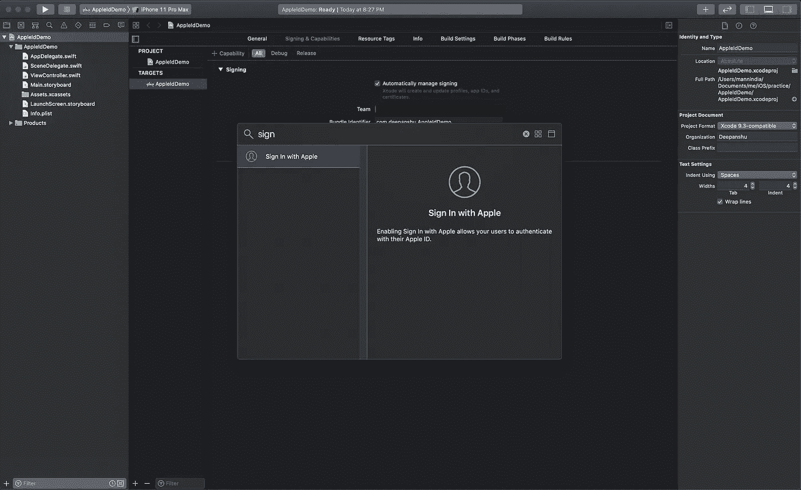
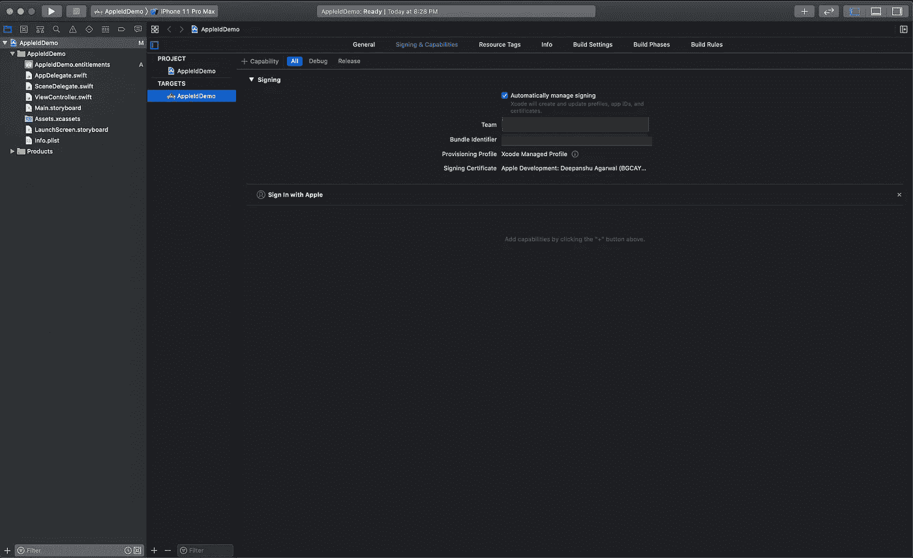
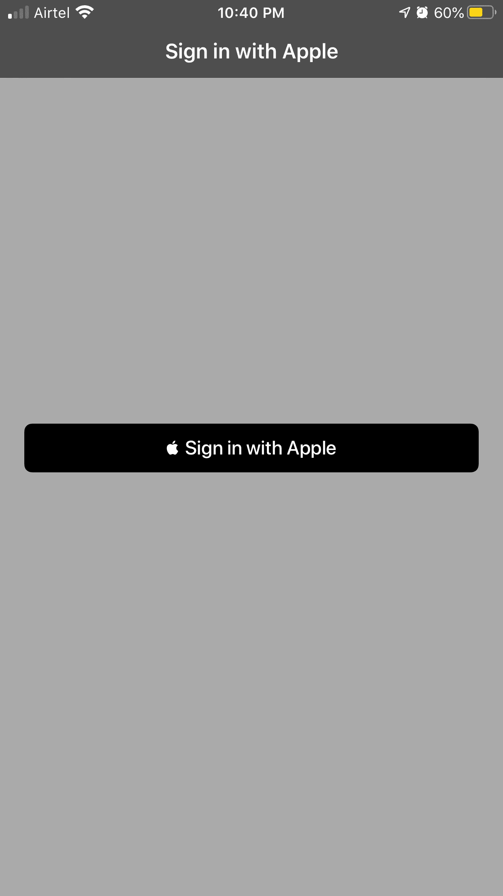
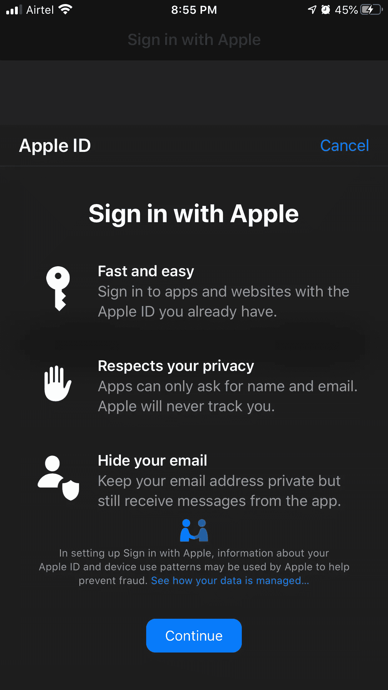
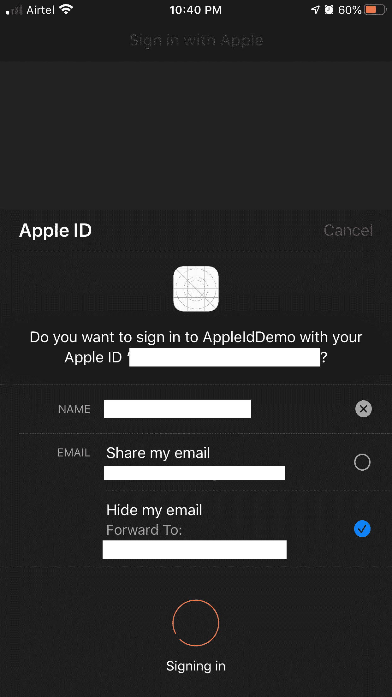

# 如何在你的应用中内置登录苹果

> 原文：<https://betterprogramming.pub/sign-in-with-apple-tutorial-ios-13-feature-38986345e85c>

## 允许用户登录而不共享他们的个人信息


在 [Unsplash](https://unsplash.com/s/photos/signin?utm_source=unsplash&utm_medium=referral&utm_content=creditCopyText) 上由 [Adeolu Eletu](https://unsplash.com/@adeolueletu?utm_source=unsplash&utm_medium=referral&utm_content=creditCopyText) 拍摄的照片

随着 iOS13 的发布，苹果推出了一个新功能:用苹果登录。

该功能允许应用程序的用户在不共享个人信息的情况下创建一个帐户。用户只需要使用他们在手机上使用的 Apple ID 进行认证，应用程序所需的详细信息可以从 Apple 帐户中检索，如姓名、电子邮件等。

“登录苹果”是应用程序和网站通常提供的现有“登录谷歌和脸书”选项的替代选项。苹果的登录选项保护你的隐私，甚至让你屏蔽你的电子邮件地址。


使用苹果按钮登录

# 登录 Apple 的优势

## P对抗

登录 Apple 可为用户提供充分的隐私保护。它允许用户只分享他们的姓名和电子邮件地址。

此外，共享备用电子邮件地址为用户提供了使用电子邮件创建帐户的独特功能，同时也保护了他们的电子邮件。苹果不会追踪用户在应用程序中的活动。

## W到处都是兽人

在所有平台上都可以登录 Apple——iOS、macOS、tvOS 和 watchOS。

苹果还提供了一个 JavaScript 库，允许你将苹果的登录功能集成到你的网站中。您可以轻松地将此功能添加到运行在 Android 等其他平台上的应用程序中。

## B内置安全

Apple 在“使用 Apple 登录”功能中提供了内置的安全性。它会自动受到双因素身份验证的保护。在苹果设备上，用户持续登录，可以随时使用 FaceID 或 TouchID 重新认证。

## 答 **反欺诈**

苹果提供了独特的信息以及其他细节，可以判断访问该应用程序的用户是否是真实用户。它使用设备上的机器学习和其他信息来判断并提供结果。

# 将使用 Apple 登录添加到您的应用程序

让我们开始在我们的项目中使用苹果登录。你可以按照下面提供的步骤在你的项目中使用登录苹果或者你可以下载 [GitHub 项目](https://github.com/deepanshuda/signinwithappleid)。

首先新建一个项目>选择*单视图 App* >给项目和组织起个名字>选择 *Swift* 作为语言 *Storyboard* 作为用户界面。

然后，为项目选择一个位置。一旦项目被创建并在窗口中打开，您就可以看到创建的文件。

现在，选择*项目导航器*下的项目>选择*目标*下的项目>选择*签名和功能*选项卡。可以参考下面附上的截图。

现在，要使用 Apple 登录，您需要成为 Apple 开发者计划的一员。所以，如果你还没有订阅苹果开发者计划，你可以简单地访问[苹果开发者网站](https://developer.apple.com/)并创建一个开发者账户。



完成后，您需要在下面显示的窗口中选择*团队*下的账户。

之后，有一个按钮来添加功能，点击它。您将看到一个弹出窗口。键入:*用 app* 登录，双击出现的选项。使用 Apple 登录功能将被添加到您的项目中。

就这么简单。



# 与 Apple 集成登录

在添加了苹果的登录功能后，现在是编码的时候了。

转到`LoginViewController`并导入认证框架。它为集成提供了必要的库。

```
**import** AuthenticationServices
```

用苹果按钮初始化登录:

```
**let** button = ASAuthorizationAppleIDButton()
```

接下来，在按钮上添加一个目标，以便它可以用于调用登录功能。

```
button.addTarget(**self**, action: **#selector**(handleAppleIDAuthorization), for: .touchUpInside)
```

您可以直接在视图或任何其他容器视图中添加此按钮。在我的项目里，我已经把它添加到了`UIStackView`里面。

```
loginStackView.addArrangedSubview(button)
```

# 证明

到目前为止，您将在您的项目中看到一个错误，因为您还没有在向使用 Apple 按钮登录添加目标时提到的类中创建方法。补充一下吧。

在添加按钮的函数结束后创建方法`handleAppleIDAuthorization()` 。

请记住，这个函数应该在开头添加关键字`@objc`，因为它是一个与 Objective-C-library 相关的选择器方法。添加下面的代码来创建授权请求。

```
**let** request = ASAuthorizationAppleIDProvider().createRequest()**let** controller = ASAuthorizationController(authorizationRequests: [request])controller.delegate = **self**controller.presentationContextProvider = **self**controller.performRequests()
```

让我们一个一个地分解它。

1.  首先，初始化 Apple ID 请求。这就是在系统中创建帐户所需的全部内容。
2.  初始化控制器以显示用户授权视图。
3.  接下来，指派代表来提供授权的结果。
4.  最后，触发请求。

除此之外，可选地，如果您需要用户名或电子邮件，您可以在初始化请求后添加下面一行—第 1 行。

```
request.requestedScopes = [.fullName, .email]
```

# 确认

最后一部分是获得响应并验证用户。您需要将该类扩展到身份验证委托以获得回调。

第一个是`ASAuthorizationControllerPresentationContextProviding` *。*当你用这个扩展类时，你必须覆盖这个函数:

```
**func** presentationAnchor(for controller: ASAuthorizationController) -> ASPresentationAnchor
```

它返回一个视图，您希望在其中显示身份验证窗口。您需要返回当前控制器视图窗口:

```
**return** view.window!
```

现在来了`ASAuthorizationControllerDelegate` *。*它有两个必需的方法:

```
func authorizationController(controller: ASAuthorizationController, didCompleteWithAuthorization authorization: ASAuthorization)
```

当授权成功时，调用此方法。您得到了一个`ASAuthorization` 的实例，它拥有用户的凭证。你需要首先检查凭证是否是 Apple ID 凭证。如果确认，您可以检索所需的详细信息。

```
func authorizationController(controller: ASAuthorizationController, didCompleteWithError error: Error)
```

如果身份验证被取消或身份验证过程中出现错误，将调用此函数。您可以随意处理错误响应。

Apple 鉴定响应提供以下信息:

## **1。用户 ID**

唯一且仅属于特定用户的用户标识符。

```
**let** userId = credential.user
```

## 2.**验证数据**

身份令牌和授权码。身份令牌是一种短期令牌，可用于获取刷新的令牌。

```
**let** identityToken = credential.identityToken**let** code = credential.authorizationCode
```

## 3.**账户信息**

如果您请求了姓名和电子邮件地址，那么可以从 credentials 对象中检索这些详细信息。

```
**let** fullname = credential.fullName**let** email = credential.email
```

## 4.**真实用户指示器**

这表明用户是否是真实的。你可以用它来简化你的应用程序流程。

现在，你们都完成了。运行您的应用程序。你会看到*用苹果*按钮登录。

当你点击它，你会看到一个窗口，你可以使用 FaceID 或 TouchID 认证，然后，你会得到一个成功的回调。



使用苹果应用程序截图登录

收到回复后，您可以使用详细信息，并根据您的应用程序流程在您的服务器/数据库中创建一个帐户。苹果为用户提供了一种简单的方式来创建他们的账户，而不是脸书或谷歌。

该项目的代码可在 [GitHub](https://github.com/deepanshuda/signinwithappleid) 上获得。您可以从那里下载并提出改进建议。我会继续更新更多的内容。